01 Unprotected admin functionality
==================================

This lab has an unprotected admin panel.

Solve the lab by deleting the user carlos.

References:

-   https://portswigger.net/web-security/access-control

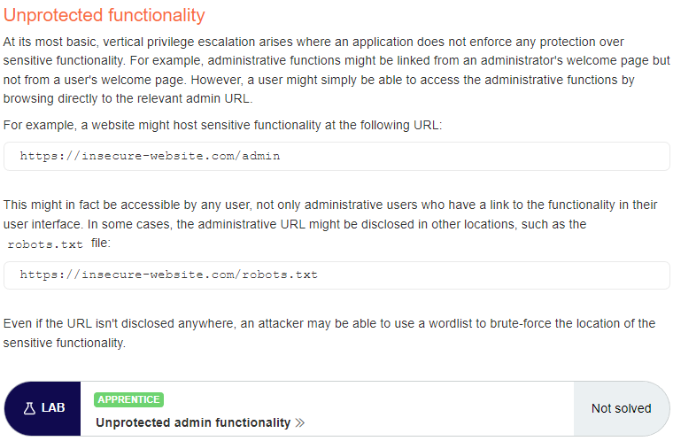

The admin panel path is in the robots.txt file:

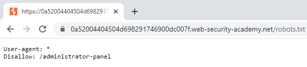

You can delete the user from here:

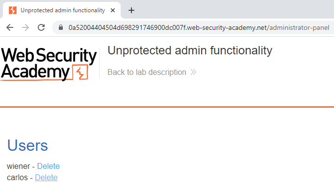

02 Unprotected admin functionality with unpredictable URL
=========================================================

This lab has an unprotected admin panel. It's located at an unpredictable
location, but the location is disclosed somewhere in the application.

Solve the lab by accessing the admin panel, and using it to delete the user
carlos.

References:

-   https://portswigger.net/web-security/access-control

By clicking Control+u we can read the source code and find the admin panel:

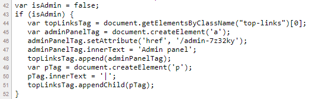

And from the admin panel delete the user:

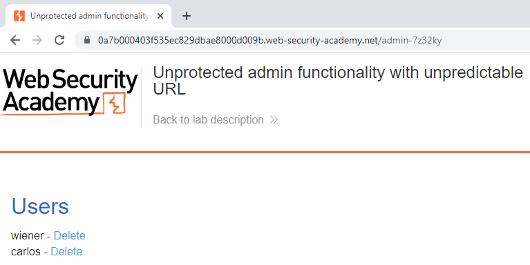

03 User role controlled by request parameter
============================================

This lab has an admin panel at /admin, which identifies administrators using a
forgeable cookie.

Solve the lab by accessing the admin panel and using it to delete the user
carlos.

You can log in to your own account using the following credentials: wiener:peter

References:

-   https://portswigger.net/web-security/access-control

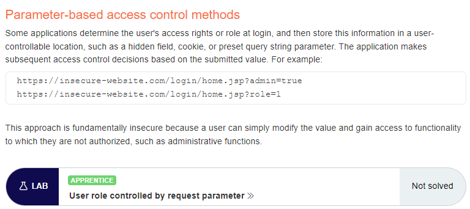

After logging in we see a redirection where the value of the cookie “Admin” is
set to “false”:

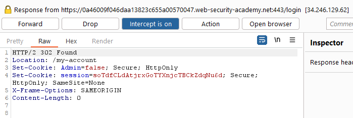

Changing it to “true”, we can see and visit the admin panel to delete the user:

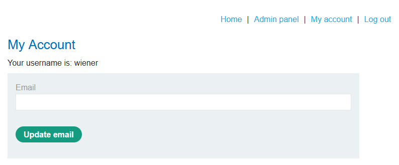

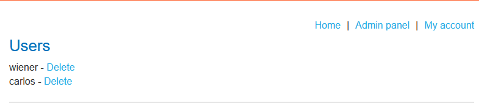

04 User role can be modified in user profile
============================================

This lab has an admin panel at /admin. It's only accessible to logged-in users
with a roleid of 2.

Solve the lab by accessing the admin panel and using it to delete the user
carlos.

You can log in to your own account using the following credentials: wiener:peter

References:

-   https://portswigger.net/web-security/access-control

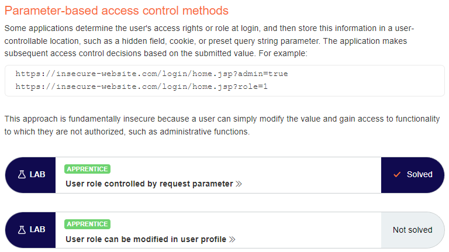

Login process is a POST request:

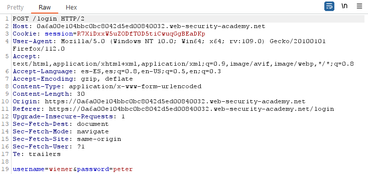

It responds with a 302 redirect:

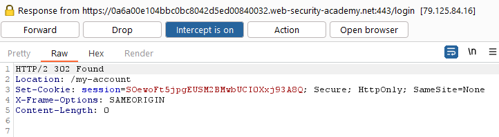

There is a function to update the email address with a POST request:

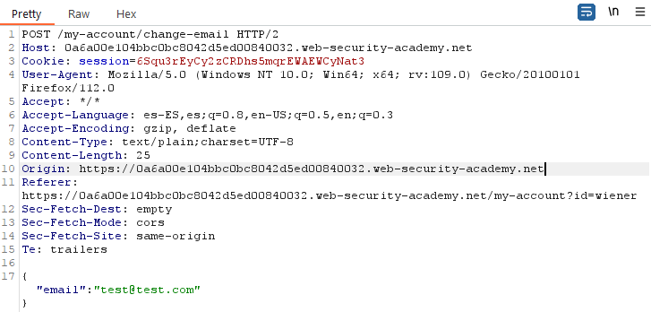

It responds with the personal information:

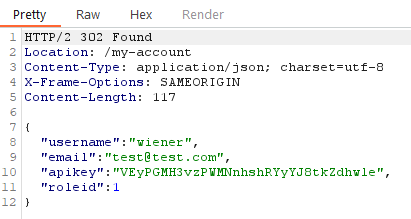

We can add the roleid parameter to the POST request to change the role of the
user:

~~~~~~~~~~~~~~~~~~~~~~~~~~~~~~~~~~~~~~~~~~~~~~~~~~~~~~~~~~~~~~~~~~~~~~~~~~~~~~~~
POST /my-account/change-email HTTP/2
...

{"email":"test@test.com", "roleid":2}
~~~~~~~~~~~~~~~~~~~~~~~~~~~~~~~~~~~~~~~~~~~~~~~~~~~~~~~~~~~~~~~~~~~~~~~~~~~~~~~~

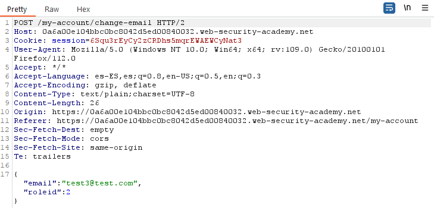

It is updated:

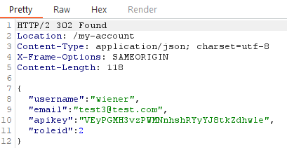

Then we can delete the user:

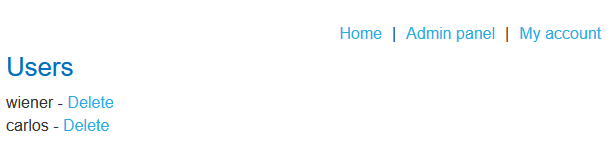

05 User ID controlled by request parameter
==========================================

This lab has a horizontal privilege escalation vulnerability on the user account
page.

To solve the lab, obtain the API key for the user carlos and submit it as the
solution.

You can log in to your own account using the following credentials: wiener:peter

References:

-   https://portswigger.net/web-security/access-control

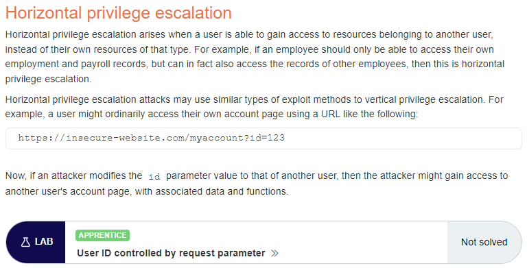

Clicking the “Home” button generates this GET request:

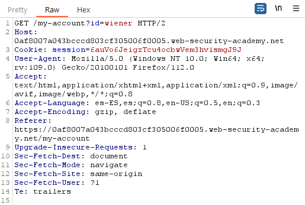

Changing the id to carlos we can get the API key:

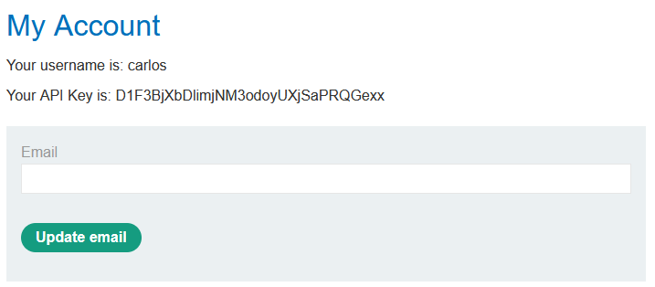

06 User ID controlled by request parameter, with unpredictable user%20IDs
=========================================================================

This lab has a horizontal privilege escalation vulnerability on the user account
page, but identifies users with GUIDs.

To solve the lab, find the GUID for carlos, then submit his API key as the
solution.

You can log in to your own account using the following credentials: wiener:peter

References:

-   https://portswigger.net/web-security/access-control

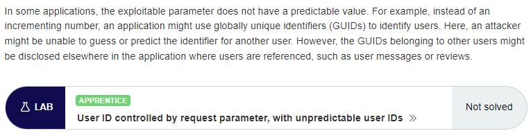

Clicking the “Home” button generates this GET request:

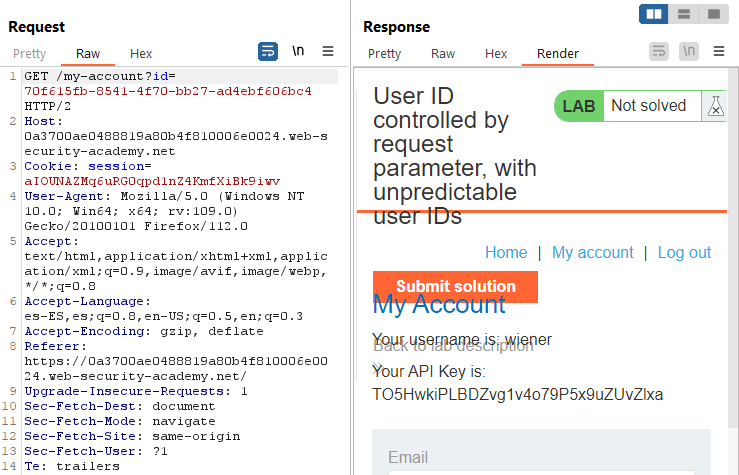

We can get the administrator's GUID from the blog posts:

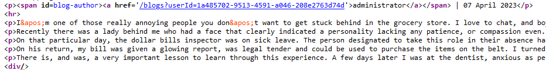

And create a new request:

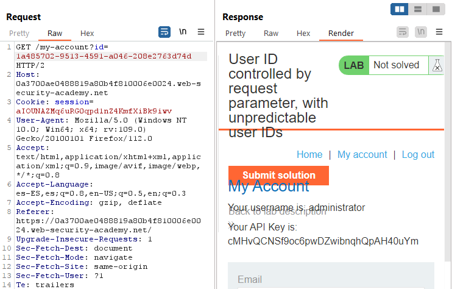

07 User ID controlled by request parameter with data leakage in redirect
========================================================================

This lab contains an access control vulnerability where sensitive information is
leaked in the body of a redirect response.

To solve the lab, obtain the API key for the user carlos and submit it as the
solution.

You can log in to your own account using the following credentials: wiener:peter

References:

-   https://portswigger.net/web-security/access-control

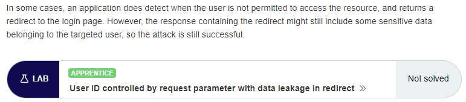

Clicking the “Home” button generates this GET request:

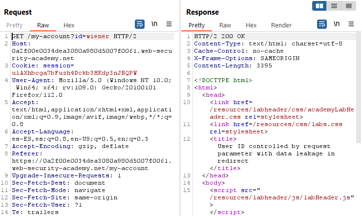

Changing the id to “carlos” there is a redirection:

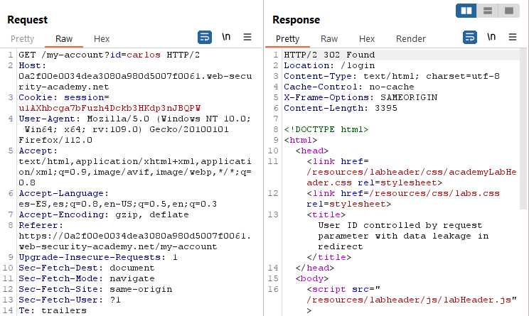

In this redirect response we can find the API key:

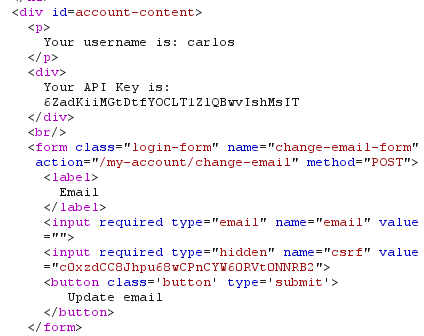

08 User ID controlled by request parameter with password disclosure
===================================================================

This lab has user account page that contains the current user's existing
password, prefilled in a masked input.

To solve the lab, retrieve the administrator's password, then use it to delete
carlos.

You can log in to your own account using the following credentials: wiener:peter

References:

-   https://portswigger.net/web-security/access-control

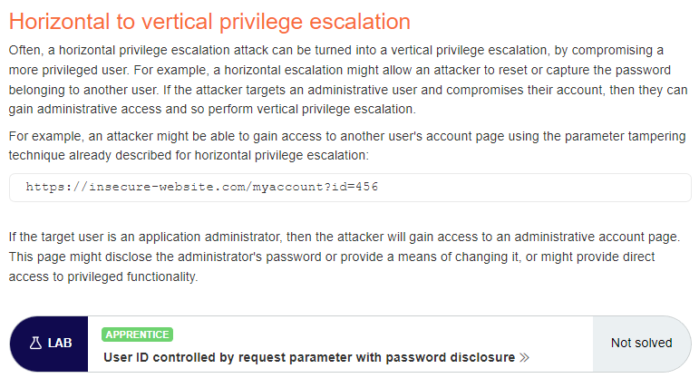

Clicking the “Home” button generates this GET request:

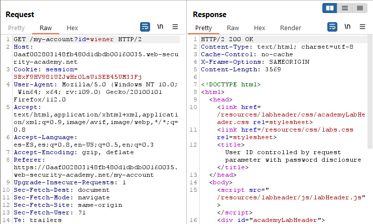

We can change the id to “administrator”:

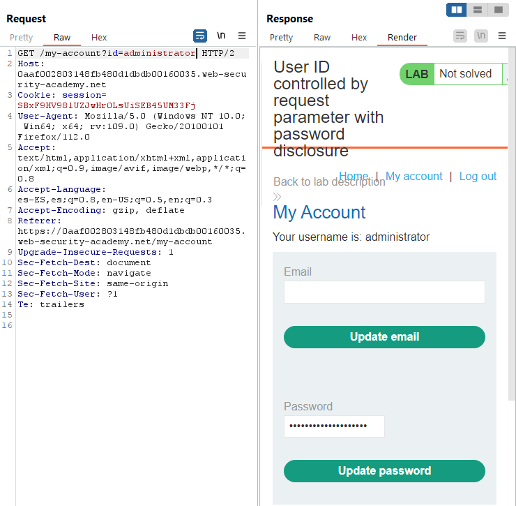

Then I changed the type to “text”:

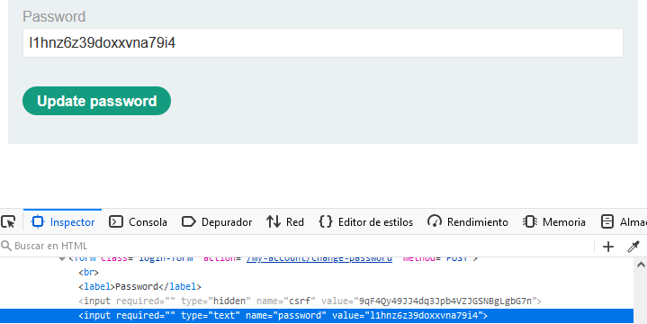

And delete the user:

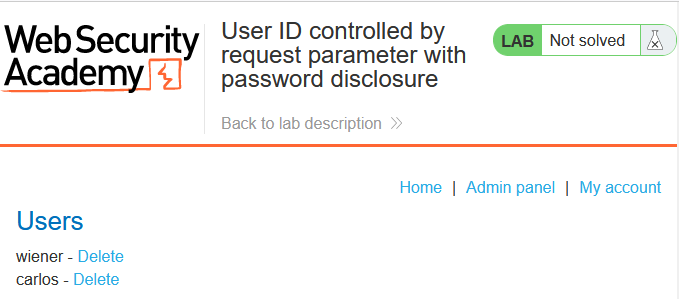

09 Insecure direct object references
====================================

This lab stores user chat logs directly on the server's file system, and
retrieves them using static URLs.

Solve the lab by finding the password for the user carlos, and logging into
their account.

References:

-   https://portswigger.net/web-security/access-control

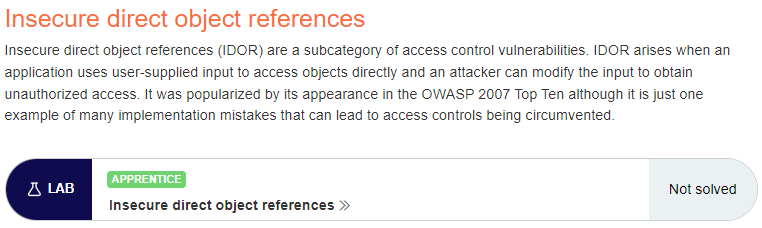

There is a live chat:

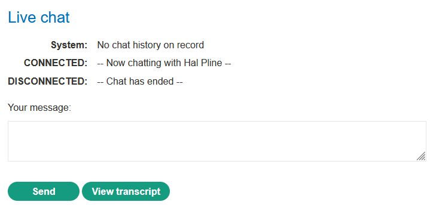

It is possible to download the transcript:

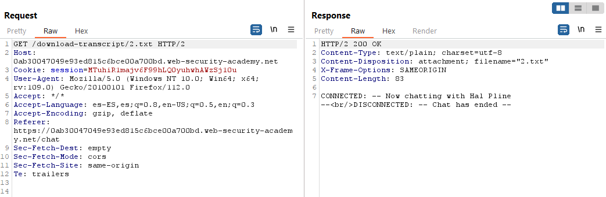

Changing to 1.txt we find the password:

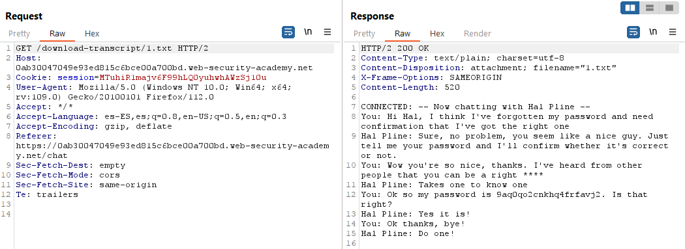

10 URL-based access control can be circumvented
===============================================

This website has an unauthenticated admin panel at /admin, but a front-end
system has been configured to block external access to that path. However, the
back-end application is built on a framework that supports the X-Original-URL
header.

To solve the lab, access the admin panel and delete the user carlos.

References:

-   https://portswigger.net/web-security/access-control

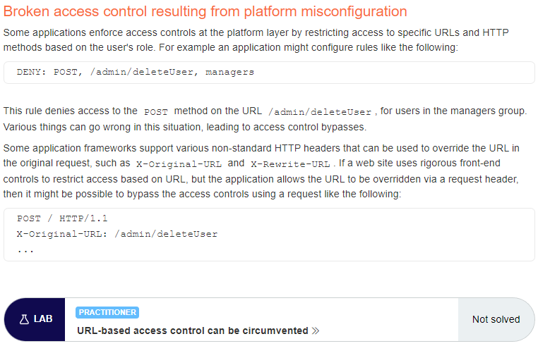

Accessing directly /admin returns a 403 error code:

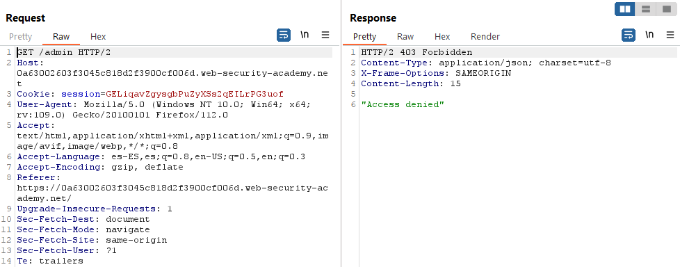

It is possible to access /admin with:

~~~~~~~~~~~~~~~~~~~~~~~~~~~~~~~~~~~~~~~~~~~~~~~~~~~~~~~~~~~~~~~~~~~~~~~~~~~~~~~~
GET / HTTP/2
...
X-Original-Url: /admin/
~~~~~~~~~~~~~~~~~~~~~~~~~~~~~~~~~~~~~~~~~~~~~~~~~~~~~~~~~~~~~~~~~~~~~~~~~~~~~~~~

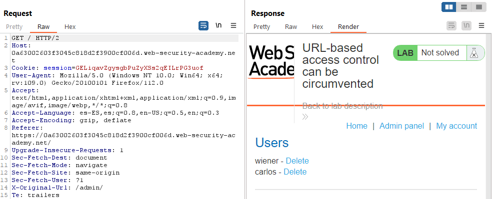

And the we can delete the user with this payload. The parameter “username" must
be in the URL:

~~~~~~~~~~~~~~~~~~~~~~~~~~~~~~~~~~~~~~~~~~~~~~~~~~~~~~~~~~~~~~~~~~~~~~~~~~~~~~~~
GET /?username=carlos HTTP/2
X-Original-Url: /admin/delete
~~~~~~~~~~~~~~~~~~~~~~~~~~~~~~~~~~~~~~~~~~~~~~~~~~~~~~~~~~~~~~~~~~~~~~~~~~~~~~~~

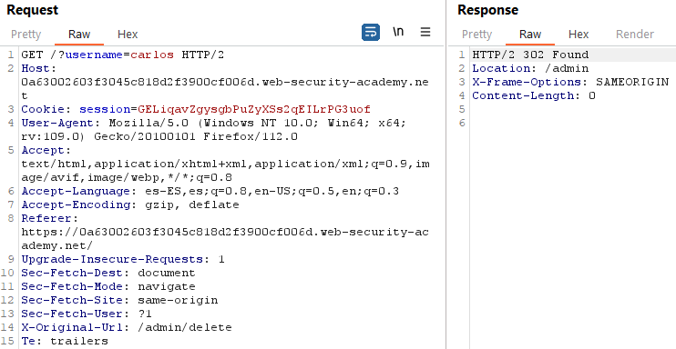

11. Method-based access control can be circumvented
===================================================

This lab implements access controls based partly on the HTTP method of requests.
You can familiarize yourself with the admin panel by logging in using the
credentials administrator:admin.

To solve the lab, log in using the credentials wiener:peter and exploit the
flawed access controls to promote yourself to become an administrator.

References:

-   https://portswigger.net/web-security/access-control

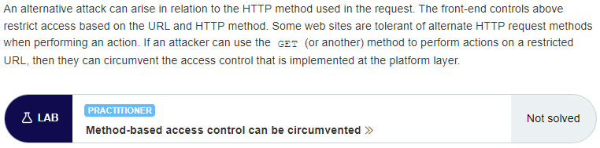

Admin panel has functionality to upgrade users:

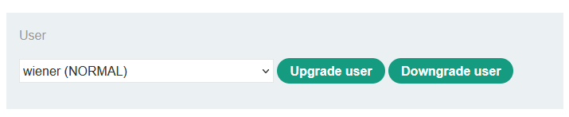

This is a POST request:

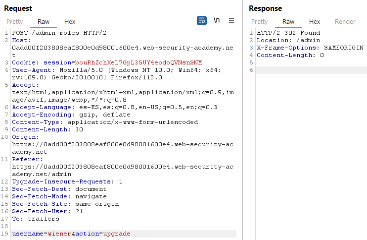

But it also works if it is a GET request:

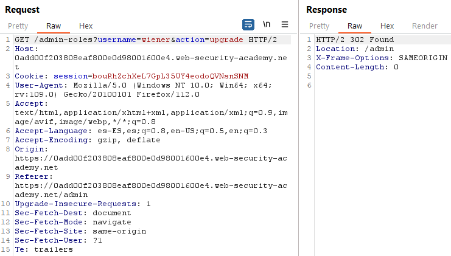

If we execute this as wiener we can upgrade ourselves to administrators:

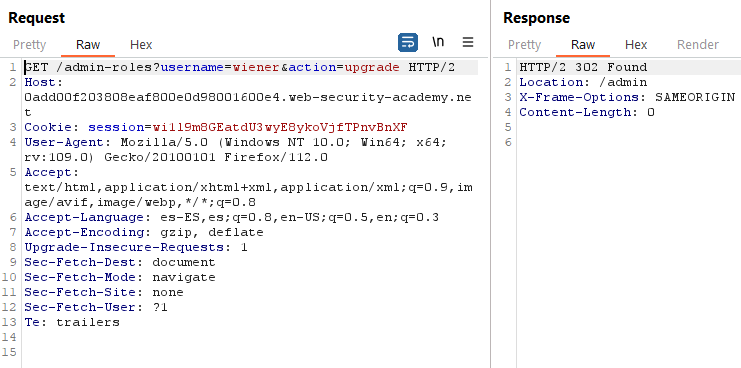

12 Multi-step process with no access control on one step
========================================================

This lab has an admin panel with a flawed multi-step process for changing a
user's role. You can familiarize yourself with the admin panel by logging in
using the credentials administrator:admin.

To solve the lab, log in using the credentials wiener:peter and exploit the
flawed access controls to promote yourself to become an administrator.

Reference: https://portswigger.net/web-security/access-control

Generated link:
https://0ac700520305fa43816f2532000c0090.web-security-academy.net/

We try to send the POST request to upgrade the user:

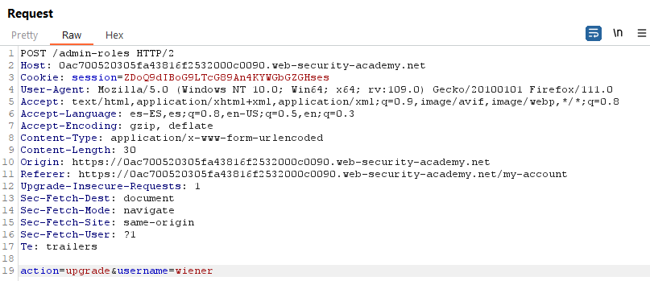

We get a 401 unauthorized error:

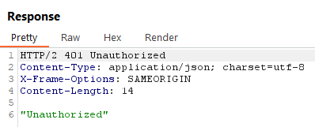

We try with the confirmed parameter:

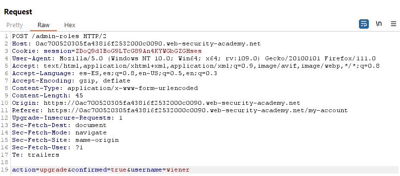

We get a redirection and then an 401 unauthorized error:

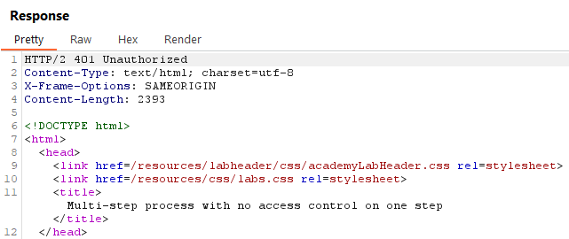

But the user was indeed promoted to administrator and the admin panel is
accessible for wiener now:

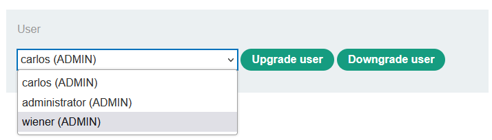

13 Referer-based access control
===============================

This lab controls access to certain admin functionality based on the Referer
header. You can familiarize yourself with the admin panel by logging in using
the credentials administrator:admin.

To solve the lab, log in using the credentials wiener:peter and exploit the
flawed access controls to promote yourself to become an administrator.

References:

-   https://portswigger.net/web-security/access-control

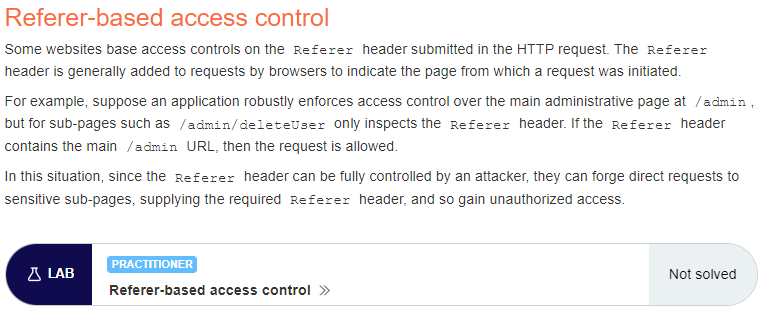

The process to upgrade the user is generated from the admin panel with a GET
request:

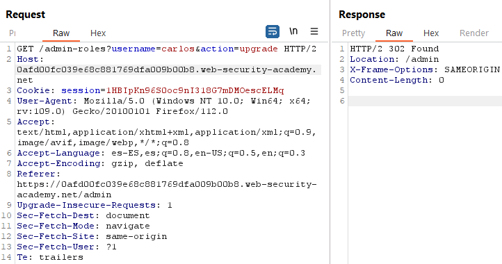

But with “wiener” we get an unauthorized error:

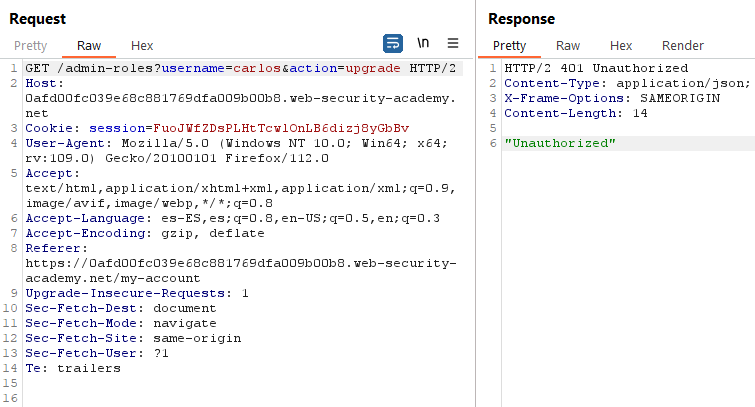

It works chaning the “Referer” header to /admin:

~~~~~~~~~~~~~~~~~~~~~~~~~~~~~~~~~~~~~~~~~~~~~~~~~~~~~~~~~~~~~~~~~~~~~~~~~~~~~~~~
GET /admin-roles?username=wiener&action=upgrade HTTP/2
...
Referer: https://0afd00fc039e68c881769dfa009b00b8.web-security-academy.net/admin
...
~~~~~~~~~~~~~~~~~~~~~~~~~~~~~~~~~~~~~~~~~~~~~~~~~~~~~~~~~~~~~~~~~~~~~~~~~~~~~~~~

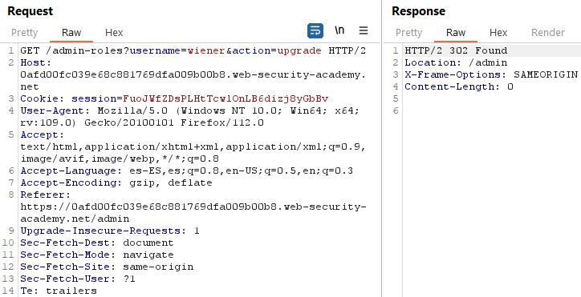

# 15 - Multi-step process with no access control on one step

This lab has an admin panel with a flawed multi-step process for changing a user's role. You can familiarize yourself with the admin panel by logging in using the credentials administrator:admin.

To solve the lab, log in using the credentials wiener:peter and exploit the flawed access controls to promote yourself to become an administrator.

---------------------------------------------

Reference: https://portswigger.net/web-security/access-control

---------------------------------------------

Generated link: https://0ac700520305fa43816f2532000c0090.web-security-academy.net/

We try to send the POST request to upgrade the user:

We get a 401 unauthorized error:

We try with the confirmed parameter:

We get a redirection and then an 401 unauthorized error:

But the user was indeed promoted to administrator and the admin panel is accessible for wiener now:

